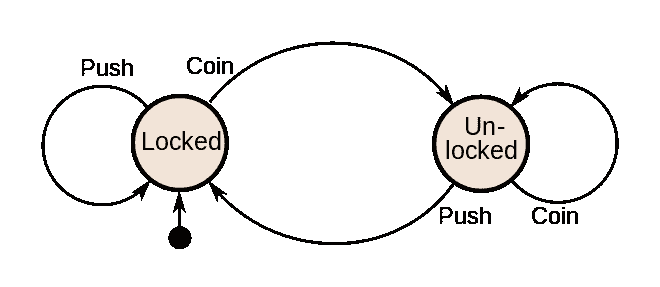
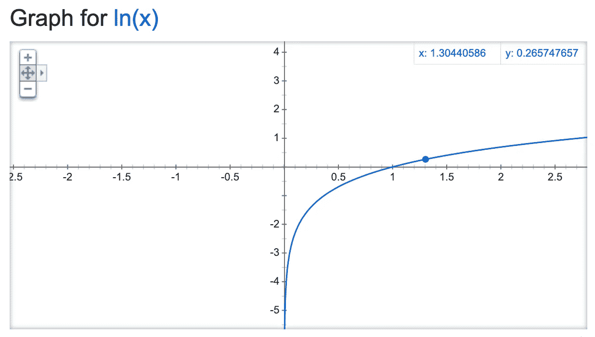

# 我从务实的程序员身上发现的 3 个观点

> 原文：<https://betterprogramming.pub/3-perspectives-i-uncovered-from-the-pragmatic-programmer-3c0b3003c86f>

## 以及如何从中获益


Jacob Mejicanos 在 [Unsplash](https://unsplash.com/?utm_source=unsplash&utm_medium=referral&utm_content=creditCopyText) 上拍摄的照片

每个人都在谈论务实的程序员 T4。我的老板建议我们阅读它。博客上说这是软件工程师的必读书籍之一。所以我决定去看看。

这本书明智地处理了软件、知识和不确定性。但更重要的是我从阅读这本书中发现的观点，我今天想与你分享。

然而，这些观点是我*没有马上领会到的。需要时间酝酿(大概四个月前看完书？)，而我是在接触了新的语言、框架、项目之后才意识到这些的。所以，我们开始吧！*

# 1.作为状态机的系统

*话题 29:杂耍现实世界*



旋转门状态机的状态图。来源:[维基百科](https://en.wikipedia.org/wiki/Finite-state_machine#/media/File:Turnstile_state_machine_colored.svg)。

我曾经认为这个系统是一个巨大的如果和其他的流程图。

但是把一个系统的行为描述成一个状态机？我从未听说过那件事。

想象一个可以有不同状态的签证申请——草稿、待定、拒绝和批准。只有*动作*或*事件*可以改变这些状态。签证申请就是状态机的一个例子。再比如前端数据管理，像 [Redux](https://redux.js.org/introduction/getting-started) 。

## 我什么时候意识到这一点的？

我很难理解类似于签证申请的商业要求(它至少有十个州)。因此，我尝试应用状态机，并通过状态图来可视化它，我想，“哇，我从来没有想到你可以这样看应用程序。”

区块链也是一个国家机器！看一看宇宙建筑[这里](https://docs.cosmos.network/master/intro/sdk-app-architecture.html)。

## 这有什么用？

这在设计包含多种状态的应用程序时非常有用。人们可以通过*状态图*来可视化状态机。许多信息可以浓缩在图表中，比如各州之间的关系。

像任何设计文档一样，状态图有助于沟通设计需求，也有助于识别潜在的漏洞或状态间缺少的*转换*。

## **这本书说了什么？**

> 开发人员没有充分利用状态机，我们鼓励您寻找机会应用它们。
> 
> 务实的程序员，主题 29

## 如何开始？

根据我的工作经验和阅读博客，状态图并不常用(正如作者提到的)。

您可以从查看状态图 UML 的例子开始。然后，看看你现有的项目，看看你是否能把这个系统想象成一个状态机。

# 2.作为一系列数据转换的代码

*主题 30:转换编程*

我过去认为代码只是简单地一次性改变数据*——在这里改变属性，在那里改变第一个索引处的项目，然后删除最后一个字符等等。所有这些都在单个*转换下。**

```
*Program 1:
**dataX -> dataY***
```

*但是把代码想象成一个程序，它把数据转换成数据，再转换成数据，再转换成数据，再转换成数据，再转换成数据(明白我的意思了吧)…？拓展了我的世界。*

```
*Program 2:
**dataX -> dataP -> dataQ -> dataR -> dataY***
```

*感觉就像你不断地传递数据给某人，让他们在你停止的地方继续工作。*

## *我什么时候意识到这一点的？*

*它不是直接的。在阅读这本书的同时，我还学习了 Kotlin、JavaScript、Scala(通过 Apache Spark)和 Elixir 等语言。(注意，我花了一个多月的时间来看这本书。)*

*我的意思是，我甚至不欣赏长生不老药，直到我读了这本书几个月后拿起它。(我稍后会谈到这一点。)*

*然后，回到这本书上做书评，我意识到我现在写函数的方式遵循了这一系列的转换模式。而且回头看看我半年前写的代码；它们都很长。*

## ***这有什么用？***

*处理更复杂的逻辑变得更容易管理。怎么会？分而治之。*

*我们突然拥有了在多个步骤中分解复杂逻辑的灵活性。我们不需要约束自己一步写完所有的东西。*

```
*word
|> all_subsets_longer_than_three_characters()
|> as_unique_signatures()
|> find_in_dictionary()
|> group_by_length()*
```

*(^This 的一系列转变是用长生不老药写成的。这个例子摘自那本书。当时读这本书时，我无法欣赏这一点。)*

*这样做的好处很多:可读性和更高的可测试性。这是你所能得到的最接近文字的代码——务实的程序员。*

## *但是这是语言特有的吗？*

*我认为是的，在很大程度上，与作者的观点相反。这种观点归功于编程语言的流水线特性，特别是函数式编程习惯用法，如函数组合或集合流水线。*

*   *Bash 和 Elixir 使用管道操作符来链接函数。*
*   *像 Kotlin、JavaScript、Rust、Ruby 和 Clojure 这样的语言都有集合管道的习惯用法。*
*   *在 Python 等其他语言中，您依赖于将单个转换的结果赋给一个中间变量，然后将其传递给另一个转换。在这里，很难把你的代码想象成一系列的转换，因为多重赋值，连同那个笨拙命名的中间变量，打破了你的思维链。更具破坏性的是在这些转换之间有大量的控制流语句。*

## *这本书鼓励了什么？*

*技巧 50——不要囤积状态，把它传递出去*

## ***如何开始？***

*从你写的长函数开始——你能简单描述一下有多少步骤吗？将代码分成这些步骤，然后将每个步骤整合为一个功能。*

# *3.函数有一个受限的域*

**主题 23:合同设计**

**

*y = ln(x)的图形。来源:谷歌。*

*我过去认为函数仅仅是一个输入输出盒。*

```
***def** f(x: **float**) -> **float**:
    **return** math.log(x)*
```

*但是我意识到我们创建的函数*通常*适用于比我们想象的更小的一组有效输入。*

```
***def** g(x: **float**) -> **float**:
    **assert** x > 0
    **return** math.log(x)*
```

*主题 23 介绍了[契约式设计](https://en.wikipedia.org/wiki/Design_by_contract)，规定定义*前置条件*、*后置条件*和*不变量*。*

*这个设计让我想起了指定数学函数的有效性——为了让 *f(x)* 起作用， *x* 必须定义明确。比如自然对数函数 *y=ln(x)* 只对实数*x*0 有效。否则，它是未定义的。*

*在迈耶的契约式设计中，*x*0(域)代表函数 *f* 的前提条件。这种设计可以应用于函数及其参数。*

*在上面的例子中，`g`有两个前提条件:`x`必须是浮点类型，`x`必须大于 0。*

## *我什么时候意识到这一点的？*

*我想我没花太多时间就意识到了。我相信它，但是把它付诸实践需要一些时间。*

## *这有什么用？*

1.  *它使您的函数对输入集更加“有效”。*
2.  *它有助于测试，因为您知道测试您的功能的可能输入范围。*
3.  *它在早期警告不需要的数据，而不是影响程序的其他部分。这可以通过断言语句或通过引发错误来实现。*

## *如何开始？*

*我认为静态类型本身就是一个先决条件。所以，如果你已经在用静态类型语言写作，那么你已经在船上了(抱歉，Pythonistas 和 Rubyists，我们需要更加努力！).*

*在函数的顶部，使用*断言*语句限制输入参数的范围。 [Kotlin](https://kotlinlang.org/api/latest/jvm/stdlib/kotlin/require.html) 和 [Solidity](https://docs.soliditylang.org/en/v0.4.24/control-structures.html#error-handling-assert-require-revert-and-exceptions) 有*要求*语句(我觉得印象深刻)。*

*嘿，现在就这样！谢谢你让我与你分享这些观点。*

*《实用程序员》确实是一本有趣的读物，如果你还没有读过，我鼓励你读一读，看看你能获得什么新的视角。*

*今年，我会再拿起一两本书(我讨厌阅读)，希望能找到新的视角。如果我有，我会和你分享！*

**感谢齐威、* [*钟大伟*](https://medium.com/u/f392dd76f846?source=post_page-----3c0b3003c86f--------------------------------) *，感谢你们的投入和建议。**

*我发表关于人工智能、机器学习、编程语言和生产力的文章。*

**如果你喜欢阅读更多关于编程语言的内容，你可以通过我的推荐链接* [*订阅*](https://remykarem.medium.com/subscribe) *来接收我发布的更新或者* [*注册*](https://remykarem.medium.com/membership) *！请注意，您的会员费的一部分将作为介绍费分摊给我。**