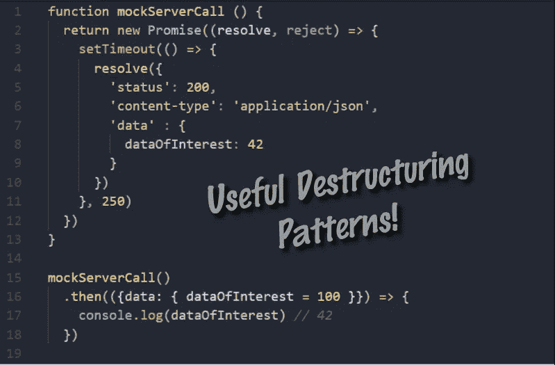

# JavaScript 中对象析构的 3 个实际应用

> 原文：<https://betterprogramming.pub/3-practical-uses-of-object-destructuring-in-javascript-a2c34ce3367b>

## 使用这些析构模式编写更干净的代码



到目前为止，您可能已经非常熟悉 JavaScript 中的析构了！它在 2015 年的 [ES6 规范](https://www.ecma-international.org/ecma-262/6.0/#sec-destructuring-assignment)中出现，但是如果你需要温习它， [Mozilla 有一篇关于它如何工作的很棒的深入文章](https://hacks.mozilla.org/2015/05/es6-in-depth-destructuring/)。

然而，知道析构如何工作并不等同于知道如何使用它。这里有三种析构模式，你可以用它们来使你的代码更干净、更健壮、更易读！

# 1.命名函数参数

命名参数是处理函数参数的另一种方法，而不是通过位置。您只需通过名称指定参数，而不是按照函数签名的顺序对参数进行排序。例如，在 Python 中:

如您所见，参数的顺序并不重要——您只需通过名称来指定它们。与位置参数相比，命名参数的优势在于:

1.  调用该函数时，可以省略一个或多个参数
2.  传入参数时，顺序并不重要。
3.  当调用可能存在于别处的函数时，代码更加可读

虽然 JavaScript 中不存在真正的命名参数，但我们可以使用析构模式来实现这三个相同的好处。下面是与上面相同的代码，但使用的是 JavaScript:

这种模式符合我们对命名参数的所有目标。我们可以省略参数`c`，顺序并不重要，我们通过引用它们的名称来分配我们的参数。这一切都是通过对象析构实现的。

# 2.清晰地解析服务器响应

我们通常只关心数据块，甚至是服务器响应的数据块中的一个特定值。如果是这样的话，你可以使用析构只获取那个值，而忽略服务器通常发送回来的许多其他东西。这里有一个例子:

这种模式允许您在解析参数时从对象中提取值。你还可以免费设置默认值！这就引出了第三种模式…

# 3.在分配期间设置默认值

在给变量或常量赋值时，一个常见的情况是，如果作用域中当前不存在其他值，就使用默认值。

在进行析构之前，您可以像这样做来获得想要的行为:

```
// old way of setting up default values
var nightMode = userSettings.nightMode || false
```

但是这需要为每项任务编写一行单独的代码。通过析构，你可以一次处理所有的赋值和它们的默认值:

这种析构模式可以应用于[在 React 组件中设置状态！](https://medium.freecodecamp.org/the-basics-of-destructuring-props-in-react-a196696f5477)

我希望您能够将这些模式应用到您的代码中！查看下面的链接，了解更多关于析构的知识。

## 了解更多！

[](https://hacks.mozilla.org/2015/05/es6-in-depth-destructuring/) [## ES6 深度:解构- Mozilla 黑客-网络开发者博客

### ES6 In Depth 是一个系列，介绍 JavaScript 编程语言在第 6 版中增加的新特性…

hacks.mozilla.org](https://hacks.mozilla.org/2015/05/es6-in-depth-destructuring/) [](https://medium.freecodecamp.org/the-basics-of-destructuring-props-in-react-a196696f5477) [## 学习 React 中析构道具的基础知识

### 当我第一次了解 ES6 时，我很犹豫要不要开始使用它。我听说了很多关于……

medium.freecodecamp.org](https://medium.freecodecamp.org/the-basics-of-destructuring-props-in-react-a196696f5477)