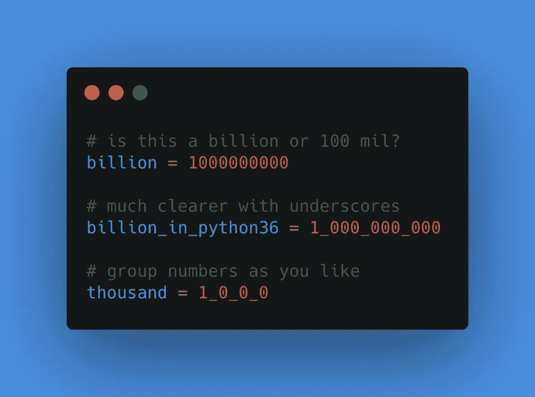
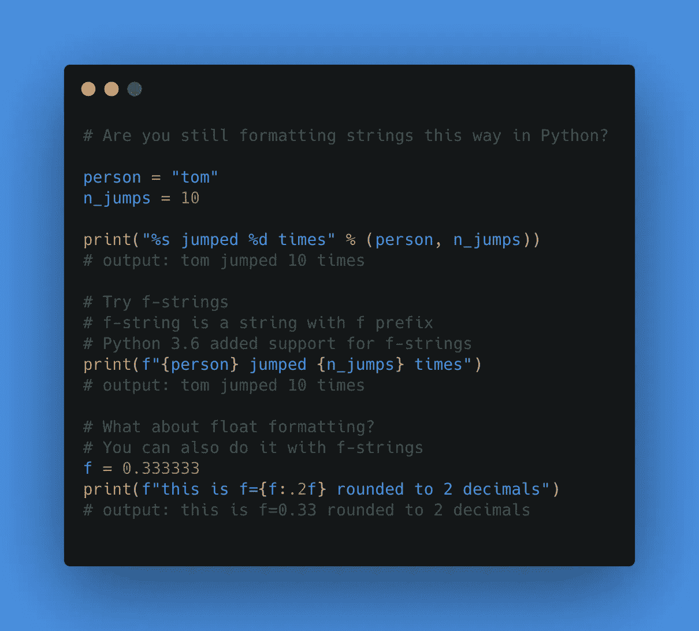

# 3 个 Python 技巧可以改善你的代码

> 原文：<https://betterprogramming.pub/3-python-tricks-that-will-improve-your-code-525ca693632e>

## Python 正在发展——不要自满


照片由[迈克尔·泽兹奇](https://unsplash.com/@lazycreekimages?utm_source=medium&utm_medium=referral)在 [Unsplash](https://unsplash.com?utm_source=medium&utm_medium=referral) 上拍摄

我用 Python 编程已经超过 10 年了。曾经有一段时间，我认为自己无所不知，这是我变得自满的明显迹象。

然后我决定做一些关于 Python 改进的研究。那些 3.6，3.7，3.8 Python 版本不是白来的吧？

在浏览发行说明后，我发现了这些巧妙的技巧，我想和你分享一下。

通过阅读这篇文章，你将学会:

*   如何更清晰地格式化大整数
*   使用文件路径的更好方法
*   字符串格式化的正确方式

这里有几个你可能会感兴趣的链接:

```
- [Complete your Python analyses 10x faster with Mito](https://trymito.io/) [Product]- [Free skill tests for Data Scientists & ML Engineers](https://aigents.co/skills) [Test]- [All New Self-Driving Car Engineer Nanodegree](https://imp.i115008.net/c/2402645/1116216/11298)[Course]
```

*你愿意多看一些这样的文章吗？如果是这样，你可以点击上面的任何链接来支持我。其中一些是附属链接，但你不需要购买任何东西。*

# 1.格式化大整数



在数字文本中使用下划线。图像由 Roman Orac 提供

从 Python 3.6(以及更高版本)开始，您可以使用下划线来使数字更容易阅读。详见 [PEP 515](https://www.python.org/dev/peps/pep-0515/) 。

让我们看一个例子:

```
a = 1000000000
# Is variable a billion or 100 millions?# Let's use underscores to make it easier to read
a = 1_000_000_000# You can group numbers as you like
b = 1_0_9_0
```

它也适用于十六进制地址和分组位。

```
# grouping hexadecimal addresses by words
addr = 0xCAFE_F00D# grouping bits into nibbles in a binary literal
flags = 0b_0011_1111_0100_1110
```

# 2.Pathlib


爱丽丝·多诺万·劳斯在 [Unsplash](https://unsplash.com?utm_source=medium&utm_medium=referral) 上拍摄的照片

使用路径可能很有挑战性，尤其是当您的代码需要在多个操作系统上运行时。

幸运的是，Python 标准库有`[pathllib](https://docs.python.org/3/library/pathlib.html)`。

让我们看一个例子:

```
from pathlib import Pathpath = Path("some_folder")
print(path)
# output: some_folder# We can add more subfolders in a readable way
path = path / "sub_folder" / "sub_sub_folder"
print(path)
# output: some_folder/sub_folder/sub_sub_folder# make path absolute
print(path.resolve())
# output: /Users/r.orac/some_folder/sub_folter/sub_sub_folder
```

尽管使用/ sign 作为分隔符来连接路径，但 pathlib 使其与操作系统无关，这意味着它也可以在 Windows 操作系统上工作。

# 3.简化字符串格式



Python 中的 f 字符串格式。图像由 Roman Orac 提供

我习惯于在 Python 中使用老式的字符串格式:

```
person = 'Roman'
exercise = 0print("%d-times %s exercised during corona epidemic" % (exercise, person))# output
# 0-times Roman exercised during corona epidemic
```

直到最近，我才知道 Python 中有更好(更现代)的字符串格式化方式。

在 Python 3.6 中， [PEP 498](https://www.python.org/dev/peps/pep-0498/) 引入了文字字符串插值，简化了字符串格式。

我们可以将上面的例子改写为:

```
person = 'roman'
exercise = 0print(f"{exercise}-times {person} exercised during corona epidemic")# output
# 0-times Roman exercised during corona epidemic
```

以 f 为前缀的字符串称为 fstring。

fstrings 甚至支持数学运算:

```
print(f"{exercise+1}-times {person} exercised during corona epidemic")# Output
# '1-times roman exercised during corona epidemic'
```

但是我在电晕流行期间没有锻炼，所以在 fstring 中加上+1 只是一个谎言😂

格式化浮点值怎么样？

```
f = 0.333333
print(f"this is f={f:.2f} rounded to 2 decimals")# Output
this is f=0.33 rounded to 2 decimals
```

# 结论

这些 Python 技巧将使你的代码更加简洁，并使编码更加有趣。

许多 Python 开发者不知道这些技巧——你不再是他们中的一员了。

# 在你走之前

在 [Twitter](https://twitter.com/romanorac) 上关注我，我经常在那里发布关于数据科学和机器学习的微博。