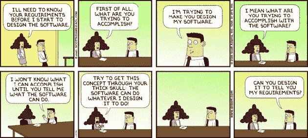

# 帮助你准备数据工程面试的三个问题

> 原文：<https://betterprogramming.pub/3-questions-you-should-be-able-to-answer-in-a-data-engineering-interview-8dc845785be6>

来自 [Unsplash](https://unsplash.com/@glenncarstenspeters) 的照片[格伦·卡特森斯-彼得](https://unsplash.com/@glenncarstenspeters)

[数据科学只是我们新数据世界中现代数据驱动的](https://towardsdatascience.com/the-sexiest-job-of-the-21st-century-dissected-why-you-need-a-data-scientist-on-your-team-10fa812e440e)领域之一。另一个比数据科学家更普遍的工作是数据工程师。现在，成为一名数据工程师并不像成为一名数据科学家那样天花乱坠。然而，像谷歌、脸书、亚马逊和网飞这样的公司都需要优秀的数据工程师！

数据工程需要知识的结合，从数据仓库到编程，以确保数据系统设计良好并尽可能自动化。

问题是:**一个数据工程的职位，你是如何准备面试的？**

许多问题需要你理解数据仓库、脚本、ETL 开发，如果公司使用不同形式的数据存储系统，如 [CouchDB](https://en.wikipedia.org/wiki/Apache_CouchDB) ，可能还需要一些非 SQL。

如果你正在准备数据工程面试，这里有一些问题可能会对你有所帮助。我们关注的是概念问题。然而，你也应该学习一些技术技能，比如 SQL、Python 等等。

# 加入我们的时事通讯

在继续滚动之前，为什么不加入我们团队的时事通讯，了解数据科学、数据工程和技术的最新动态！[在此了解更多信息](https://seattledataguy.substack.com/)。

# 作为一名数据工程师，你将如何开发新的分析产品？

作为一名数据工程师，[你控制着最终产品的可能性](https://medium.com/@treycausey/rise-of-the-data-product-manager-2fb9961b21d1)。如果没有正确的数据和正确粒度的数据，数据科学家就无法构建算法或指标。

这意味着数据工程师需要了解整个产品。一个数据工程师不能仅仅根据需求来构建系统。他们需要问为什么要构建某些表和对象。

如果[利益相关者](https://www.projectmanager.com/blog/what-is-a-stakeholder)已经对他们想要的东西有了一个大致的轮廓，那会很有帮助。如果他们没有一个大纲，我们将希望与他们一起工作，开发一个关于将存在什么样的度量和算法的总体想法。这推动了所有重大决策，包括应该提取什么数据、应该存储多长时间、是否应该归档等等。

一旦有了大致的轮廓，下一步就是深入了解每个指标的原因。这是因为当你以不同的[数据粒度](https://www.quora.com/What-is-granularity-in-data-warehouse)构建不同的表时，某些问题可能会出现。[唯一键](https://www.javatpoint.com/unique-key-in-sql)应该在列 A 和 B 上，还是在列 A、B 和 c 上。嗯，这要看情况，为什么这很重要？那一行意味着什么？是客户层面，门店层面，或者可能是品牌层面？

一旦你的团队完成了与你的利益相关者一起制定大纲的过程，并且理解了其中的原因，下一步就是考虑尽可能多的[操作场景](https://www.ansys.com/products/embedded-software/model-based-systems-engineering/representation-of-systems-operational-scenarios)。

您需要重新加载数据吗？你的 ETL 允许吗？是否高效？当 X 发生时会发生什么？你如何处理 Y 案例？

你不能花一整天的时间来做这件事，但是试着考虑所有可能发生的问题会帮助你开发一个更健壮的系统。它还有助于创建一个真正满足需求的系统。

从那里，它是关于开发设计、创建测试用例、测试表、存储过程和脚本，然后推向生产。如何发生通常会因团队而异。

# 运营数据库和数据仓库有什么区别？

如果你在大学里上过数据库课程，那么你可能已经了解了如何建立一个标准的规范化数据库。这种类型的数据库针对涉及插入、更新和删除 SQL 语句的事务进行了优化。这些是标准的操作数据库。他们需要专注于快速完成交易，而不会被计算和数据操作所拖累。因此，他们的设计对于分析来说有点麻烦。通常，您将不得不联接几个表来获得单个数据点。

数据仓库不太关心每秒处理数百万的快速事务。相反，数据仓库通常是为了支持数据分析产品和分析而构建的。这意味着性能不是面向事务的，而是面向[聚合](https://www2.microstrategy.com/producthelp/10.4/ProjectDesignGuide/WebHelp/Lang_1033/Content/ProjectDesign/When_to_use_aggregate_tables.htm)、计算和选择语句的。与可操作的数据库相比，数据仓库将具有稍微不规范的[结构。在大多数数据仓库中，大多数表都具有两种不同的属性:历史事务表和包含分类样式数据的表。我们称之为事实表和维度表。](http://www.vertabelo.com/blog/technical-articles/denormalization-when-why-and-how)

事实表本质上位于中心，不像在规范化数据库中，您可能必须跨多个表连接才能获得一个数据点。一个标准的数据仓库通常关注事实表，所有的维度表联合起来为事实表提供分类信息。将事实表连接到事实表通常也是不好的做法，但是如果数据创建正确，有时也会发生这种情况。下面是一个数据仓库结构的例子:

数据仓库中并不只有这些表。有聚合表、快照、分区等等。目标通常是可以快速自动更新的报告或仪表板。

数据仓库还有很多其他的细微差别，比如[缓慢变化的维度](http://datawarehouse4u.info/SCD-Slowly-Changing-Dimensions.html)。然而，这完全是另一回事。

# 请告诉我们您遇到 ETL 性能问题的一次经历，以及您是如何解决的？

作为一名数据工程师，您会遇到性能问题。要么您在数据较小且无法扩展时开发了 ETL，要么您在维护无法扩展的旧架构。ETL 的特点是多组件、多表插入、合并和更新。这使得很难准确判断出 [ETL](https://docs.microsoft.com/en-us/azure/architecture/data-guide/relational-data/etl) 问题发生在哪里。第一步是[识别问题](https://www.sqlshack.com/dba-guide-sql-server-performance-troubleshooting-part-1-problems-performance-metrics/)，所以你需要找出瓶颈在哪里。

希望设置您的 ETL 的人在某个地方有一个 ETL 日志表来跟踪组件完成的时间。这使得发现瓶颈变得很容易，最大的时间很糟糕。如果没有，就不容易发现问题。根据问题的紧急程度，我们建议设置一个 ETL 日志表，然后重新运行以识别问题。如果需要立即进行修复，那么您可能只能一部分一部分地通过 ETL 来尝试跟踪长期运行的组件。这也取决于 ETL 运行需要多长时间。根据组件所依赖的内容，有多种方法可以实现这一点。

问题可能千差万别，可能包括表锁、缓慢的事务、循环阻塞等等。一旦你发现了问题，你就需要找出解决的办法。这取决于问题，但解决方案可能需要添加一个索引、删除一个索引、对表进行分区，并将数据分成更小的部分(有时甚至是更大的部分——这似乎违反直觉，但这取决于表扫描和索引)。根据您使用的存储系统，最好查看活动监视器，看看在 [I/O](https://en.wikipedia.org/wiki/Input/output) 级别发生了什么。这会让你对这个问题有更好的了解。

当您查看活动监视器时，您可以看到是否有任何数据正在被处理。是否有太多的数据正在处理，没有，或表锁？这些问题中的任何一个都可能阻碍 ETL，需要加以解决。

如果你用谷歌搜索一些性能问题，你会发现一些人把很多问题归咎于架构。我们不反对他们。然而，这并不意味着你应该认输。如果你不能触及实际结构，总有各种各样的方法来管理绩效。甚至在索引之外，还有一些并行处理方法可以用来加速 ETL。您还可以添加临时支撑台来减轻负载。

# 第四个问题:你对 Python、PowerShell、Bash 和/或 Java 有经验吗？

这个问题更多地是为了说明，作为一名数据工程师，拥有一门脚本语言是非常重要的。通常，我们工作过的大多数商店不会仅仅依赖像 SSIS 这样的 ETL 工具。相反，他们通常会使用自定义脚本和库来加载数据。这可能看起来有点过了，但通常更容易。如果你需要所有奇特的功能，比如发送电子邮件和一些其他的附加功能，使用像 SSIS 这样的工具是很棒的。甚至这些都可以用脚本来代替书写。

所以我们建议你也具备一些脚本能力。它允许您轻松地自动化数据流和分析任务。

这些只是帮助你准备数据工程面试的一些一般性问题。除了这些问题，您还应该了解[渐变维度](http://datawarehouse4u.info/SCD-Slowly-Changing-Dimensions.html)的概念、python 或 PowerShell 的自动化、一些基本的 Linux 命令以及设计概念。如果你有一个数据工程师的面试，那么我们祝你好运！