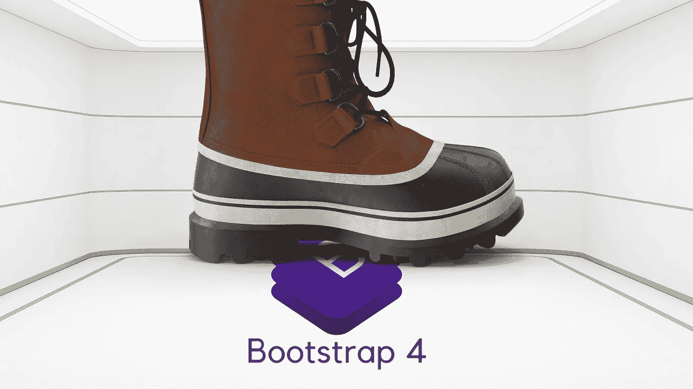
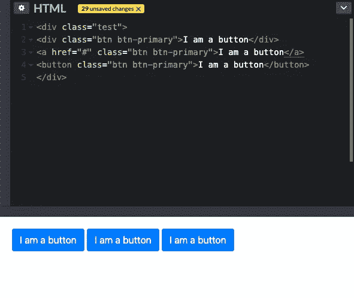

# 2021 年放弃 Bootstrap 的 3 个理由

> 原文：<https://betterprogramming.pub/3-reasons-to-abandon-bootstrap-in-2021-aa71bbc1af14>

## 已经 10 年了，让我们继续前进



图片由作者通过 Canva.com

差不多就在 10 年前，Bootstrap 发布了。此后不久，它就被定期列入开发人员的简历中的技术技能列表中。当时我是一名全栈开发人员，我的大多数项目都遵循类似的要求:低预算和高目标。

Bootstrap 似乎正好迎合了这些需求。它让几乎没有前端知识的开发人员很快就能组装出好看的网站。稍加努力，他们甚至在手机上工作。它成功了，它卖了——至少在客户和大多数网站用户看来是这样。

十年过去了，现在依然如此。

根据 Wappalyser 的说法，有将近 350 万个网站仍然依赖于 Bootstrap。该网站报道说，甚至像 paypal.com、etsy.com 和 gitlab.com 这样的大人物也在使用它。

没什么不好，很多情况下。但就像 Wix 或 Squarespace 等快速网站构建者的新兴趋势一样，Bootstrap 旨在帮助快速创建网站，几乎不需要任何前端知识。重点从来不是创建可访问的内容或可维护的代码。因此，很容易陷入创建臃肿、不可访问的网站的陷阱，如果开发人员不得不改变布局，他们就会逃之夭夭。

# 1.网格系统

bootstrap 最流行也是最容易识别的特性可能是网格系统。使用起来相对简单:查看一个设计，将它分成列，并将列类分配给 div。对于移动友好的布局，您可以添加额外的断点类。你甚至可以在手机上交换栏目。

为了实现这一切，bootstrap 为不同的屏幕尺寸使用了不同的断点。虽然这些断点可以调整，但默认断点是基于像素的值。

基于像素的断点的问题是它们在可访问性方面不太好。断点单位应该真正基于你的字体大小，字体大小应该是一个相对的单位，如 EM 或 r EM。

有视觉障碍的用户通常会更改默认的浏览器字体大小。相对断点将确保设计在浏览器字体设置改变时仍然有效。这意味着布局将根据不同用户的设置在不同的点断开。

另外，引导网格给页面增加了很多开销和不必要的标记。随着 IE 慢慢失去支持，CSS grid 是一个轻量级得多的选择。如果你需要支持传统的浏览器，有大量的轻量级 flexbox mixins 在使用。

# 2.可怕的！重要的

bootstrap 5.0 下的任何东西都使用 float 类来对齐内容。它们非常简单，在任何项目上使用右浮动或左浮动，使其与屏幕的任何一边对齐。

任何不得不在大学里创建一个作品集/简历网站而不会使用任何工具的开发人员都会记得试图让一张图片很好地出现在页面上的努力。正确地浮动元素本身就是一种技能。

因此，Bootstrap 决定让事情变得简单一点。如果你把一个“浮动类”放到一个元素上，你几乎总能保证它会出现在你想要它出现的地方。因为引擎盖下就是这个样子:

```
@mixin float-left {float: left !important;}@mixin float-right {float: right !important;}@mixin float-none {float: none !important;}
```

总的来说，引导程序 4 中出现了 146 次`!important`。

在 CSS [中使用`!important`语句被认为是不好的做法](https://uxengineer.com/css-specificity-avoid-important-css/)，使得以后维护或调整代码库变得困难。

幸运的是，在 Bootstrap 5 中，使用次数减少到了 19 次，上面的 float 类被 flex 系统所取代。

然而，我怀疑这百万个网站中有多少是在 Bootstrap 5 上运行的。例如，Etsy.com 仍在使用 Bootstrap 2.0。

对于建立在浮动/拉动系统上的网站来说，升级可能风险太大，而且似乎没有必要。

# 3.让按钮成为按钮

使用 Bootstrap 创建布局的美妙之处在于，只要使用一个类，一切都会看起来像它应该看起来的那样。如果你想让它看起来像一个按钮，你可以让它看起来像一个按钮。



作者通过 codepen.io 截图

以上所有这些元素看起来一样，行为也一样，直到你尝试用键盘访问它们。键盘用户将使用 TAB 键在可聚焦的元素之间切换——在本例中，div 永远不会获得焦点。按钮和`ahref`元素都是可聚焦的，但是通过键盘交互时[略有不同。](http://web-accessibility.carnegiemuseums.org/content/buttons/)

# 最后的想法

当然，如今的 Bootstrap 远不止上述例子。它还托管了一系列 JavaScript 组件，用于烤面包或手风琴等常用元素。如果用正确的 HTML 和 Aria 标签实现了它们，大多数甚至是可访问的。

答案就在这里:任何框架都只能和实现它的开发人员一样好。当然，使用 Bootstrap 创建快速、响应迅速且易于访问的网站是可能的。

但这是我所看到的情况:一旦你开始把它拆开，试图弄清楚如何只在需要的地方使用它，使它易于访问和维护，你可能已经在构建自己的“框架”的中途了。

前端不一定是一个神奇的神秘盒子。可及性不一定是痛苦的。预算紧张不应该成为网站可用性的定义。

有时，在给项目添加任何框架之前，后退一步分析需求会有所帮助。在许多情况下，创建自己的一套样式或组件可能会更快更有效。

## 更多来自艾里斯·温特

[](/how-to-nail-any-technical-interview-question-f540fc252c06) [## 如何搞定任何技术面试问题

### 最好的部分是你不必准备很多

better 编程. pub](/how-to-nail-any-technical-interview-question-f540fc252c06)