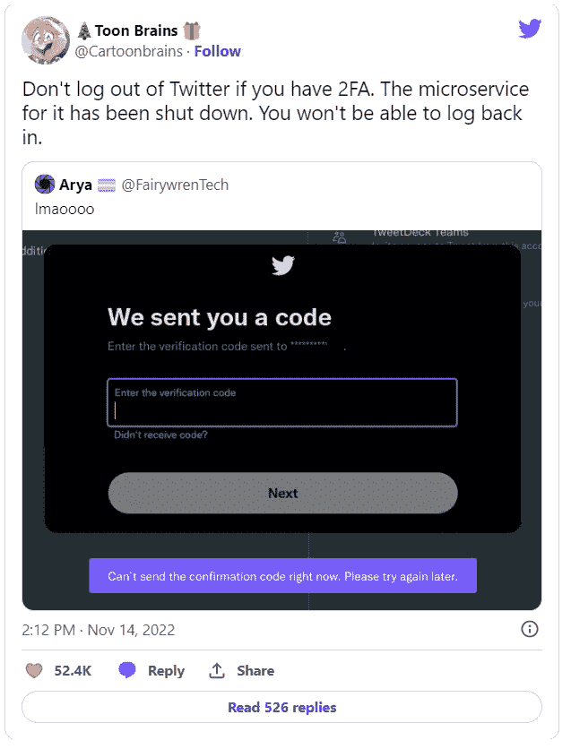

# 您可能希望使用 Monolith 而非微服务的 3 个原因

> 原文：<https://betterprogramming.pub/3-reasons-why-you-might-want-to-use-monolith-instead-of-microservice-fc9a3b515988>

## 大多数时候，Monolith 已经足够好了。除非你是谷歌

Denys Nevozhai 在 [Unsplash](https://unsplash.com?utm_source=medium&utm_medium=referral) 上拍摄的照片

当您听到单片架构时，您的思维会立即转向传统架构。

许多公司将微服务封为现代软件开发架构之王。所有这些都是因为它被大玩家 FAANG 广泛采用。

然而，许多大型科技公司，如网飞、优步和亚马逊，都是从整体架构开始的，这是他们转向微服务架构的原因。

许多工程师认为，整体架构可以改进，因为它不太可靠，也不太模块化，所以从长远来看，很难维护和扩展您的系统。

这与他们转向微服务架构的原因不同，尽管导致这些大公司采用微服务架构的技术问题有一定的道理。

首先，我们需要了解组织为什么首先迁移到微服务，并了解微服务如何解决两类问题:技术和人员问题。

整体架构的一个技术问题是一个组件加重了整个架构的负担，导致用户体验不佳(UX)。

比如图像处理就需要大量的 CPU。如果这个 CPU 负载变得太高，它可能会耗尽应用程序的其余处理资源。这可能会影响系统延迟。而且，如果情况变得足够糟糕，可能会影响系统可用性。

另一方面，人的问题与团队组织和软件开发过程密切相关。在应用程序的任何给定部分工作的人越多，开发和部署就变得越慢。

例如，假设您有 30 名工程师竞争“持续部署”(CD)相同的服务。在这种情况下，你将会有很多人排队，这意味着许多本来可以运送产品的工程师正坐在那里等待他们的部署。

如果你的系统/团队/组织没有这些问题，那么你应该使用单片架构，而不是微服务。这里有三个原因。

# 整块也可以是可靠的

工程师经常错误地认为微服务架构有助于容错。

这只是部分情况。

微服务架构有助于解决与基础设施相关的故障，如内存泄漏或 CPU 峰值，这些故障更容易追踪到特定的组件，而不是大型整体。

Monolith 可以像微服务架构一样容错和可靠。通过适当的配置，您可以在云环境中轻松扩展多项服务。

在 monolith 中，您需要考虑的问题是运行时错误，而对于微服务，您需要处理网络错误，这可能更复杂。

在一个关于迁移回单片架构的 Shopify 案例研究中，他们说迁移到单片架构后的大多数失败通常发生在他们的代码不知道在哪里可以找到对象定义，这导致了运行时错误。

工程团队可以通过在本地和 CI 中无故障地运行他们的测试，并在本地和字符串上运行尽可能多的功能，来确保没有遗漏任何东西。

拥有一个新的不同系统意味着增加一个额外的故障点。

您可以直接调用不同的组件，而不是通过 web app 服务。您不必担心 API 版本管理、向后兼容性或滞后调用。

经验丰富的工程师通常会质疑一个架构何时需要添加新的微服务，因为添加新的微服务通常会导致更多的延迟和故障。

# 整体架构更易于维护

微服务的最大缺点之一是需要维护基础架构。微服务带来了更多的运营开销和代码重用问题。

您的工程团队将使用需要具有通用功能的服务的共享库。然后，您意识到更改一个字段需要一周的工作，因为这需要更改这个数百名其他工程师使用的共享库。

这也是 Segment 换回单片架构的原因之一。

> 团队创建了共享库，为所有员工提供相似的行为。然而，这产生了一个新的瓶颈，对共享代码的更改可能需要开发人员一周的努力，主要是由于测试的限制。创建共享库的版本使代码更改更快，但却逆转了共享代码本应提供的优势。”

然后，是所有服务的可观察性方面。

您需要为十种不同的服务及其 CPU、内存配置文件和负载提供一些分布式监控工具。这比仅仅监控单个服务更具操作性。

然后，您将需要继续编写关于您的服务的文档，以使其可被发现。由于团队成员可能来来去去，如果您不有效地记录您的服务，其他人可能很难使用它。

在一个地方维护整个代码库并将应用程序部署到一个地方有很多好处。

*   您只需要维护一个存储库，并能够在一个文件夹中轻松搜索和查找所有功能。
*   你不必在你的计算机上本地运行五个不同的服务来测试一个单一的特性。
*   新工程师的入职速度更快，因为一切都在一个地方。
*   负载测试将比负载测试三个不同的服务容易得多。
*   您可以在应用程序中处理一致性问题。

# 随着云技术的采用，整体架构可以扩展

大多数技术不必“独立扩展”

一个整体可能是直截了当的纵向缩放很长一段时间。例如，常规的 web 应用程序可以通过在一个专用实例上剥离数据库，纵向扩展，然后通过作业和队列横向扩展其余的实例来实现。

由于微服务的繁殖速度比整块快，所以你可以更快地应对高峰。然而，微服务尖峰往往比整体服务更残酷。

假设您有 10 个 API 端点，其中两个在某个时候获得了 5 倍的流量峰值。如果每个端点都位于单独的服务中，您必须将两个服务的容量扩展 5 倍。这可能不是一个微不足道的变化，尤其是如果您需要快速完成的话。

反之亦然，如果所有端点都位于一个整体中，对整体负载的影响会更低，也更容易被吸收。

除非某项功能受到 CPU、IO 或内存的限制，否则可伸缩性并不能保证可维护性。

大多数时候，您的服务器都在等待事情发生。向应用程序添加“更多的 HTTP 路由处理程序”不会突然耗尽它的所有资源。

# 什么时候应该使用微服务？

如果你的主要目的是将新产品推向市场并快速迭代，那么 Monoliths 是首选。

通常，你在一个整体架构中工作几年来优化开发速度，因为了解产品的工作比使用一个时髦的堆栈更重要。

你总是可以从传统的大块头中取出微服务，用任何最有意义的语言重新编写。但只有当你找到适合市场的产品和合适的客户群时，你才能收回你花在这上面的时间。

[据马丁·福勒](https://martinfowler.com/bliki/MonolithFirst.html)、*说:“我听说过的几乎所有从零开始构建微服务系统的案例，都以严重的问题告终……你不应该用微服务开始一个新项目，即使你确定你的应用足够大，值得这么做。”*

工程师在一个实例中部署整体架构的所有组件。服务调用在同一个流程中，没有 RPC。与每个组件相关的数据表通常部署在同一个数据库中。

在微服务架构中，每个组件都成为由专门团队维护的独立服务。服务之间的界限是明确定义的。用户界面与多个服务对话。当业务大幅增长到较大规模时，它适合于扩展业务，以使其值得进行复杂的工作。

微服务架构仍然是黄金标准——几乎每个科技公司都采用微服务架构。但是现在，公司开始重新思考微服务的利弊。微服务的一些最有争议的定义是数据库的独占使用和在单个客户端请求内进行 1000 次以上的 RPC。

以下是您的业务可能不需要微服务架构的三个原因:

1.  单片架构也可以有可靠性。通过正确的设计，您必须解决运行时而不是微服务网络错误。
2.  整体架构比微服务架构更易维护。
3.  有了更多的技术和更复杂的硬件，垂直扩展比 2000 年代初更便宜。

以下是一些关于从微服务转向整体架构的公司的案例研究:

## 想要更多关于软件工程的可行建议吗？

订阅免费的时事通讯，每周获得关于 Scala、函数式编程和分布式系统的可行建议和话题:[https://pathtosenior.substack.com/](https://pathtosenior.substack.com/)

*原载于 2022 年 12 月 18 日*[*【https://pathtosenior.substack.com】*](https://pathtosenior.substack.com/p/3-reasons-why-you-might-want-to-use?sd=pf)*。*