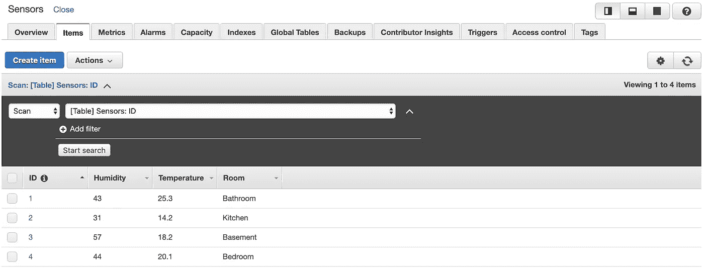
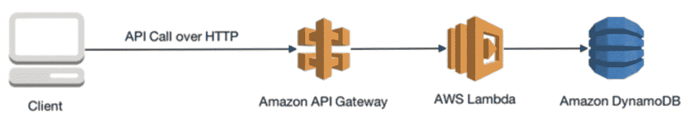

# 您应该考虑无服务器的 3 个原因

> 原文：<https://betterprogramming.pub/3-reasons-why-you-should-consider-going-serverless-c2b8f25e966d>

## 谁需要服务器呢？


[女牛仔](https://unsplash.com/@cowomen?utm_source=unsplash&utm_medium=referral&utm_content=creditCopyText)在 [Unsplash](https://unsplash.com/s/photos/women-working?utm_source=unsplash&utm_medium=referral&utm_content=creditCopyText) 上的照片

最近我在准备 AWS 认证开发者助理考试。

那段时间，我在练习 AWS 上的许多可用服务。该考试主要关注使用无服务器服务的能力以及如何最大限度地利用它。原因是，作为一名开发人员，您不需要担心如何维护基础架构—这都是无服务器的。这意味着基础设施在云中，由亚马逊网络服务(AWS)提供。

让我们来看看开发者如何从中受益。

# 1.希腊字母的第 11 个

“兰姆达斯很酷！”—这不仅是您从工程师那里听到的，也是从数据分析师和数据科学家那里听到的。那么 Lambda 是什么，为什么它很棒？

AWS Lambda 是由 Amazon Web Services 提供的事件驱动的无服务器计算平台。

[AWS Lambda](https://aws.amazon.com/lambda/) 是一个对某个特定事件作为输入做出反应的函数。该功能可以对许多事件做出反应，例如向数据库添加新条目，向 S3 桶上传图片，向 Alexa 提交语音命令，以及许多其他事情。

它的美妙之处在于，它是一个处理事件的简单函数。此外，可以将多个功能链接起来，组织一个特定的用户流。

比如每次有新用户注册，就会运行一个 lambda 函数，为他们生成一个唯一的头像，上传到 S3 桶；然后，一旦图像上传，另一个功能被触发，向用户发送电子邮件。这是一个简单的流程，但是可以进一步扩展。

Lambda 函数可以在 Python、Ruby、C#、Java、Go 或 Node.js 中实现，在下面的例子中，你可以看到一个用 Python 编写的简单函数，它打印出一个接收到的事件并返回一个字符串`Success`。这个函数可以在我们分配的任何可用事件上调用。

```
def lambda_handler(event, context):
    print(event)
    return "Success"
```

最好的部分是，作为开发人员，我们不需要考虑如果负载增加会发生什么——AWS 会处理这个问题，并在引擎盖下进行所有必要的扩展操作。与此同时，工程师们一直专注于构建新功能和扩展现有功能。

# 2.DynamoDB

[DynamoDB](https://aws.amazon.com/dynamodb/) 是来自 AWS 的 NoSQL 数据库服务。它作为键值存储工作，提供高性能，并完全由 AWS 管理。它还有许多其他功能，如内存缓存和备份。

但主要的好处是它可以自动扩展，无需为增加的负载或更新进行维护。在负载增加的情况下，数据库保持高可用性，确保您的应用程序不会受到影响。除此之外，作为开发人员，创建一个数据库并对其进行设置也很容易。



DynamoDB 接口

需要记住的重要一点是:DynamoDB 可能不适合需要复杂查询和连接操作的应用程序。在这些情况下，最好使用关系数据库(RDS)。但是，这并不意味着没有无服务器选项。AWS 有一个解决方案，名字叫[亚马逊极光无服务器](https://aws.amazon.com/rds/aurora/serverless/)。

# 3.API 网关

每个网站的幕后都有一个应用程序，它通过 API 与 UI 进行通信——这是通向世界的大门。

开发一个 API 需要时间和精力。谢天谢地，有一个解决方案: [API 网关](https://aws.amazon.com/api-gateway/)。这是另一个托管服务。它与 lambda 函数结合使用效果非常好。

作为开发人员，我们需要定义 API 接口，将每个端点连接到适当的 lambda 函数，并定义响应。开箱即用，我们获得了可伸缩性、API 版本控制、认证、监控和足够的调整灵活性。在构建新的应用程序时，这些特性可以节省我们大量的时间。



API 网关使用的简单流程([来源](https://cicd.serverlessworkshops.io/)

除了 Lambda 函数和 DynamoDB，我们还能够为传统的用户需求提供各种各样的解决方案，比如向服务器发送数据、检索数据或删除数据。

# 结论

所有这些都意味着工程师现在可以使用无服务器技术构建一些应用程序。无需担心服务器停机或无法处理突然增加的负载。

由于我们不拥有这些服务器，这让我们有更多的时间来提供新的东西，并可能节省基础架构维护资源。我们只为我们使用的东西付费。

当然，我不想说 serverless 是银弹，所有问题都可以用它来解决。有些情况下，无服务器方法并不合适，公司需要拥有自己的基础架构。我的观点是，下次您必须选择架构时，您也可以考虑无服务器。

除了 AWS，谷歌云平台、微软 Azure 和 IBM Cloud 也提供无服务器计算平台。不要把自己局限于一家供应商，选择更适合你的需求和预算的供应商。编码快乐！