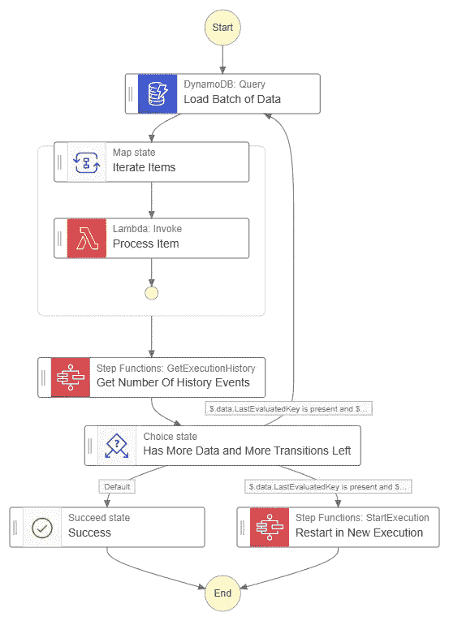

# AWS 阶跃函数的 3 个陷阱以及如何避免它们

> 原文：<https://betterprogramming.pub/3-reasons-you-should-stay-away-from-aws-step-functions-43bdd97b75a>

## Step Functions 是 AWS 提供的一项令人难以置信的工作流服务。但是如果你不小心的话，你可能会不知所措，发现自己在努力做日常维护。

Breana Panaguiton 在 [Unsplash](https://unsplash.com/s/photos/warning?utm_source=unsplash&utm_medium=referral&utm_content=creditCopyText) 上拍摄的照片

上周，我接到一个电话，请求帮助解决生产中的一个严重问题。

这个 bug 处理数据的规模超出了开发团队的预期。他们使用[Step Functions](https://AWS . Amazon . com/Step-Functions/)来编排一个工作流，该工作流接受一组对象，对它们进行处理，并将转换后的对象放入 DynamoDB。

从表面上看，这听起来像是一个非常标准的工作流程——字面意思就是 Step 函数的设计目的。但是经过更仔细的检查，我们意识到我们遇到了 256KB 的[最大请求大小限制](https://docs . AWS . Amazon . com/step-functions/latest/DG/limits-overview . html # service-limits-task-executions)，因为数组太大了。

调试这个问题花费了比预期长得多的时间，因为我们必须不断地触发一个工作流并等待它完成。由于要处理的项目太多，每次运行需要 15 分钟以上。

我和开发团队一起工作了一段时间，找出了替代方案，我们最终找到了一个解决方案，将数组分解成更小的批，并通过 Lambda 函数运行多个状态机执行。

但是我真的不喜欢那个解决方案。限制是有原因的。我觉得我们解决这个问题的方式很卑鄙。所以很自然地，我上了推特，看看你们都在做什么。

我收到了几个可靠的答案，这让我思考“阶跃函数*不*擅长什么？”

老实说，这是一个很短的列表。但是陷阱确实适用于一系列用例。所以让我们深入讨论一下什么时候使用 Lambda 函数比使用阶跃函数更好。

在我们开始之前，我想添加一个免责声明——如果你足够努力，你几乎总能找到一个变通办法。使用阶跃函数，下面问题的解决方法实际上是可行的解决方案。

然而，可行性将根据您对服务的满意程度而有所不同。一些高级模式可以绕过陷阱，但是在某些情况下可能太难维护。

下面的每个场景都标有*初级*、*中级*和*高级*技能等级。在本文中，这些技能水平被定义为:

*   **初学者** —你刚刚开始使用阶跃函数。你有过没有服务器的经历，但是你想知道这一切是怎么回事。
*   **中级** —您了解状态机是如何构建的，并且熟悉生产就绪的最佳实践。你知道如何有效地使用类似于*映射*和*的并行*状态，并且能够保持对状态机执行状态大小和形状的控制。
*   **高级** —您精通事件驱动架构，知道如何以及何时使用快速和标准工作流。您知道并使用高级功能，如等待任务令牌和执行子工作流。您总是尽可能使用直接的 SDK 集成。

考虑到这一点，我们来讨论一些具有阶跃函数的非平凡场景，以及基于您的舒适度应该做些什么。

# 你的有效载荷很大

## **问题**

阶跃函数的最大请求大小限制为 256KB。这意味着您加载到状态机中并通过转换传递的所有数据必须始终小于 256KB。如果在此过程中加载了过多的数据，将会出现异常，执行将会中止。

## **初学者**

这是一个通常会悄悄出现在你面前的问题，是一个很难解决的问题。一切都很好，直到它不行。管理执行大小限制的最简单的方法是将状态调整为*只包含*绝对必要的内容。

使用[数据流模拟器](https://aws.amazon.com/blogs/compute/modeling-workflow-input-output-path-processing-with-data-flow-simulator/)来帮助重塑您的数据，以包含尽可能少的内容。这涉及到大量使用状态的`ResultSelector`、`ResultPath`和`OutputPath`属性。

这种方法的问题是，如果你不能缩小数据集，它*不能解决问题。如果你对阶跃函数不太满意，那么 Lambda 函数可能是一个更合适的解决方案。*

## **中级**

AWS 的官方建议是[将数据保存在 S3](https://docs.aws.amazon.com/step-functions/latest/dg/avoid-exec-failures.html) 并在状态间传递对象 arn。这意味着当您的有效负载可能超过 256KB 限制时，您必须首先将其保存到 S3。当执行状态机时，传递对象键和桶，这样所有 Lambda 函数都可以加载数据。

这种方法的一个主要缺点是它使得使用[直接 SDK 集成](https://docs.aws.amazon.com/step-functions/latest/dg/supported-services-awssdk.html)更加困难。这些集成直接使用执行状态之外的数据，因此您将无法将必要的信息传递给 API 调用，因为这些信息存储在 S3 中。

这是一个有趣问题的简单解决方案，但是您实际上消除了阶跃函数的一个主要优点。更不用说性能会受到影响，因为无论何时需要访问有效载荷，都要从 S3 加载对象。

## **进阶**

对于超过执行状态限制的有效负载，您必须通过 Lambda 函数触发您的工作流。考虑到这一点，您可能能够将您的数据和工作流分成多个部分。如果您有一组需要在数据子集上执行的活动，您可以创建一个只执行这些任务的状态机。

然后，您可以创建另一个状态机，对数据的不同子集执行任务，依此类推。这将创建小的、“域驱动的”状态机，具有狭窄的焦点。

您的执行 Lambda 函数将负责将数据解析成适当的片段，并使用适当的数据执行每个状态机。在运行所有的状态机之后，如果有必要的话，它会把数据拼凑起来，并返回结果。

这种方法带来了使用直接 SDK 集成的能力，但它确实增加了您的解决方案的复杂性。通过管理更多的状态机，您可能很难在将来维护解决方案。

使用这种方法时要小心，不要让 Lambda 函数等待所有状态机的执行完成。那会累积一大笔账单。相反，你可以尝试使用[分散/聚集模式](https://async-messaging.workshop.aws/scatter-gather.html)在完成时触发响应。

*注意——这可能是最快/最高效的解决方案，但在实践中，中间方法是更安全的选择。*

# 你并行处理大量数据

## **问题**

阶跃函数的最大历史事件数为 25，000。这意味着，如果您的数据集包含数千个条目，您可能会超出状态转换的限制。对于如此大的数据集，您也可能会遇到数据大小限制。

需要并发处理的大型数据集听起来非常适合使用阶跃函数。但是，如果您通过一个 *Map* 状态进行并行处理，最大并发限制是 40。这意味着您将以 40 个为一批来处理数据。所以你的并行处理可能没有你想象的那么快。

## **初学者**

如果您的工作流是异步运行的，那么最好接受 40 个并发的 *Map* 执行，并等待它完成。在接近 25，000 个事件历史限制之前，这种方法没有任何问题。

当您的状态机开始出现这种情况时，您可能需要开始做一些数学计算，并计算出您的最大项目数是多少。一旦确定了最大项目数，就可以并行批处理运行工作流。类似于我为解决前面提到的生产 bug 所做的。

为了处理大数组带来的大数据量，您需要采用与上面列出的相同的方法，其中有效负载被保存到一个 S3 对象中，并通过状态机开头的 Lambda 函数进行加载、解析和拆分。

## **中级**

中级方法的解决方案类似于初学者，但是它包含更多的自动化。如果您正在处理的数组位于像 DynamoDB 这样的数据库中，那么您可以从状态机中加载要处理的数据子集。

*从数据库加载并跟踪状态计数的状态机图*

状态机使用限制属性加载数据[的子集。然后，它遍历返回的处于`Map`状态的项目。](https://docs.aws.amazon.com/amazondynamodb/latest/APIReference/API_Query.html#DDB-Query-request-Limit)

一旦项目处理完毕，它将加载执行历史，并查看最后一个项目的`Id`属性，以获取已发生事件的数量。如果还剩下足够的事件而没有太接近 25，000 的限制，则从头开始。如果接近极限，状态机将启动自己的另一个实例，重新开始计数，并从停止的地方继续处理。

这个过程会让你走得很远。但就执行速度而言，可能会更快。这种方法在 40 个一批的连续批次中有效。因此，您的大型数据集可能需要大量时间来处理。

## **高级**

[Step Functions 的高级经理 Justin Callison](https://twitter.com/justincallison) 向我们介绍了一种实现超高速并行处理的高级方法，即[将状态机构建为协调器和运行器](https://aws.amazon.com/blogs/compute/accelerating-workloads-using-parallelism-in-aws-step-functions/)。

orchestrator 将您的数据集解析为多个批处理，并将单个批处理传递给运行器。跑腿的拿走一批货，加工产品。如果一个批处理中有 40 个以上的项目，它会将数据拆分成 40 个以上的批处理，并递归调用自身以扇出并并行处理更多的项目。状态机将继续分裂和扇出，直到每批中的项目少于 40 个。

这篇文章非常详细，甚至在 GitHub 中提供了一个[工作示例。](https://github.com/aws-samples/aws-stepfunctions-examples/tree/main/sam/app-decompose-for-parallelism)

这种方法完全解决了并行问题，但却是目前最先进的方法。在走这条路之前，请确保您已经熟悉了阶跃函数。与任何递归一样，一个小错误可能会让你陷入无限循环，并导致一笔巨额账单。

# 你跨越了服务界限

## **问题**

在构建工作流时，有时需要在多个[微服务](https://aws.amazon.com/microservices/)中操作数据。微服务是 AWS 资源的逻辑分离，这些资源可能在同一帐户中，也可能不在同一帐户中。每个微服务应该是独立的，只使用自己的资源，而不是其他服务的资源。

直接使用来自其他微服务的资源会产生*紧耦合*，这是无服务器和微服务设计中的反模式。如果您将多个微服务部署到同一个 AWS 帐户中，Step Functions 可以轻松跨越这些服务界限。当您构建您的状态机时，您需要保持警惕。

## **初学者**

*注意——我要建议的是反模式，我不建议在生产中使用！*

当开始使用阶跃函数时，完全可以使用 Lambda 函数、SQS 队列、SNS 主题等，而不考虑它们属于哪个微服务。 [workflow studio](https://docs.aws.amazon.com/step-functions/latest/dg/workflow-studio.html) 让您只需从下拉列表中选择一个 Lambda 函数。您可以使用的功能没有限制，因为微服务是一种逻辑结构。

如果你使用[基础设施作为代码(IaC)](https://docs.aws.amazon.com/whitepapers/latest/introduction-devops-aws/infrastructure-as-code.html) 这是一个导出资源的 arn 并将其导入另一个服务的模板的问题。稍微难一点，但还是比较容易的。

没有什么可以阻止你使用微服务，它可以完成工作。因此，虽然不推荐，但这通常是解决跨服务边界的最简单的方法。

## **中级**

虽然直接调用资源可能是一种[反模式](https://en.wikipedia.org/wiki/Anti-pattern)，但调用跨服务 API 却不是。如果您有内部 API 背后的资源，调用它是绝对可以接受的。调用 API 提供了*松耦合*，这在无服务器和微服务环境中更容易被接受。

由于 Step 函数目前不支持本地调用外部 API，因此您有两种选择来将这种方法合并到您的工作流中。

Lambda 函数可以根据您的需要简单或复杂。如果您想在将响应返回到状态机之前对其进行转换，请执行此操作。如果你想直接通过，这也是一个选择。这种方法的目标是使用类似于 [axios](https://www.npmjs.com/package/axios) 或[请求](https://pypi.org/project/requests/)的东西来调用 API。

HTTP 集成实质上是从微服务中的 API 网关创建一个代理来调用外部端点。当走这条路线时，您可以调用 *API 网关调用* SDK 集成来直接进行调用。这提供了比 Lambda 函数更高性能的解决方案。

## **高级**

如果您需要进行的跨服务调用是一个长时间运行或多步骤的过程，那么您不需要上面列出的同步解决方案。相反，您需要暂停执行并等待响应才能继续。 [Sheen Brisals](https://twitter.com/sheenbrisals) 向我们展示了如何[使用 EventBridge 做到这一点](https://medium.com/lego-engineering/how-to-build-better-orchestrations-with-aws-step-functions-task-tokens-and-amazon-eventbridge-19a68eeda461)。

EventBridge 集成将触发一个事件，暂停状态机的执行，等待另一个服务处理一个事件，然后在另一个服务触发事件时恢复工作流。这被称为[回调模式](https://docs.aws.amazon.com/step-functions/latest/dg/callback-task-sample-sqs.html)。

回调模式是在微服务之间提供松散耦合的另一种方式。它确实增加了解决方案的复杂性，但是提供了最大的灵活性和最高的可靠性。只要确保您配置了[状态机 heartbeat](https://docs.aws.amazon.com/step-functions/latest/dg/sfn-stuck-execution.html) 以便在另一个微服务出错时中止执行。

# 结论

在一些情况下，Step 函数可能不是创建工作流时使用的最佳 AWS 服务。如何处理大型有效负载、高容量阵列或跨服务边界取决于您的舒适程度。

如果你追求超出舒适水平的选择，请记住，正确的解决方案不是可行的，而是可行的*和你能够有效保持*的方案。这意味着如果有一个缺陷，你必须知道如何解决一个问题并深入跟踪。

> *有时候跟着 Lambda 走会更好。*

基于你的工程团队的技能，选择更简单的方法并不是一件坏事。我们都在不断努力提高技能。通过新的云特性、新的架构模式或全新的服务来提高我们的舒适度是在云中工作的一部分。我们喜欢它。

在许多用例中，阶跃函数是 Lambda 函数的一个令人惊奇的替代品。它们在异步工作流中提供了[高度的可追溯性](/build-better-serverless-apis-by-going-storage-first-597784f8f399)，并且在某些情况下[比 Lambda 函数](/lambda-vs-step-functions-the-battle-of-cost-and-performance-5f008045e2ab)运行起来更便宜。甚至有办法消除臭名昭著的无服务器可以从直接将 API Gateway 集成到一个 express 状态机开始。

阶跃函数被证明是无服务器世界的瑞士军刀。它使消费者能够快速方便地做许多事情。它并不总是对初学者最友好的。

如果您还没有尝试过 Step 函数，我强烈建议您尝试一下。优点远大于缺点，并且它们提供了对服务器端操作的高度可见性。您可以[访问我的 GitHub 页面](https://github.com/allenheltondev)查看各种示例。

编码快乐！