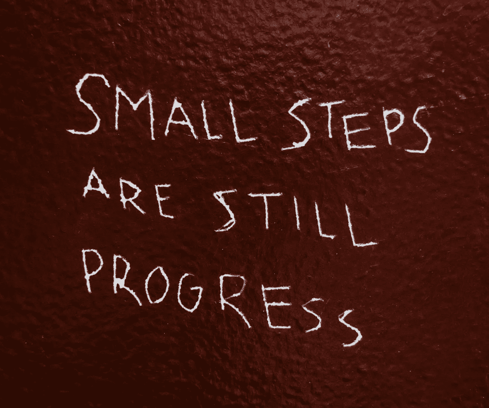
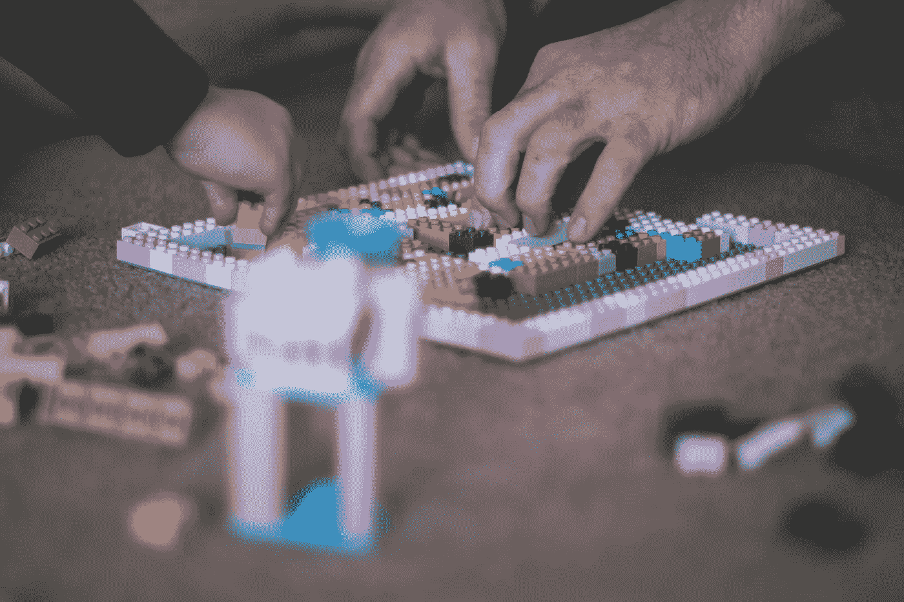

# 立即成为更好的程序员的 3 个简单规则

> 原文：<https://betterprogramming.pub/3-simple-rules-to-immediately-become-a-better-programmer-268096e84e66>

## 成为一名伟大的程序员需要很多时间，但是现在有一些事情你可以改进

在 [Unsplash](https://unsplash.com/s/photos/small-steps?utm_source=unsplash&utm_medium=referral&utm_content=creditCopyText) 上由 [Hayley Catherine](https://unsplash.com/@hcatherinephoto?utm_source=unsplash&utm_medium=referral&utm_content=creditCopyText) 拍摄的照片。

构建强大的编程技能组合需要多年的反复试验。幸运的是，总有一些事情你可以马上去做，以便同时成为一名更好的程序员和团队中更好的成员。我们开始吧！

# 尝试破解你的代码

你负责测试你的代码。一直都是。如果你的公司有一个很棒的 QA 团队也没关系。你要对你的代码负责。

在公司工作的每个人的目标——无论是软件开发人员还是测试人员——都应该是尽快交付高质量的软件。构建伟大的产品需要整个团队的合作。

如果你不测试你的代码，测试人员几乎肯定会发现一个 bug。所以他们给你开了一张票。您修复了该功能，然后将其发送回去。但是还有另外一个问题，还有另外一张票给你。

这种 bug 循环可能会永无止境，耗尽双方的时间和耐心。如果你仔细地测试你的代码，你可以使每个人免受痛苦。你应该一直这样做。

你可能认为这是一个微不足道的变化，不能打破什么。尽管如此，测试它。编程是复杂的，你可能会错过一些东西。

你可能认为你是一个不会犯错的超级明星程序员。你错了。我们都会犯错。只需花几分钟时间进行测试，节省大家的时间。

不管你怎么想，测试你的代码。如果你发现了一个 bug，编写一个单元测试来避免将来出现这个 bug。

所以吞下你的骄傲，试着破解你写的代码。测试你能想象到的所有不同场景。寻找边缘案例。你知道你的代码应该做什么，做什么，所以你是测试它的最佳人选。

在将代码推向 QA 之前，花一些时间测试代码。会节省大家的时间。谁知道呢，也许通过成为一个好同事，你会交到一些新朋友。

# 进行小的提交和拉取请求

对版本控制库的提交代表了代码的历史。每一个都应该有一个有意义的信息来解释你为什么要提交。声称您应该能够像阅读一本书一样阅读提交历史有点牵强，但是对于试图了解发生了什么的人来说，它应该是可读的。

要做出好的承诺，你必须让他们小。它允许您将每次提交集中在一个微小的变化上——无论是一个特性、错误修复还是重构。如果您的提交太大，您不能在一个短的提交消息中描述它，所以代码历史变得难以阅读。

小提交还有其他优势。它们更容易测试，如果测试失败，它们有助于调试，因为导致错误的代码更少。小提交还加快了返回到早期提交的速度，因为这意味着您在返回时丢失的代码更少。

当你提出拉取请求时，你应该遵循同样的规则。让它们变小，可以让审查代码的人做得更彻底，更有把握。一个几千行长，更改几十个文件的拉取请求是不会仔细检查的。当拉取请求没有被检查时，你最终会得到更差的软件。更何况，如果有人不会审核你的代码，你就得不到任何反馈，会阻碍你的成长。

丹·伯顿在 [Unsplash](https://unsplash.com/s/photos/lego-blocks?utm_source=unsplash&utm_medium=referral&utm_content=creditCopyText) 上拍摄的照片。

# 快速构建，然后重构

编程是一个复杂的过程。要成为一名高效的软件开发人员，你需要有条理地处理问题。在编写任何代码之前，您应该考虑任务的一些关键方面。

你想完成什么？你确定你完全理解了需求吗？花几分钟思考需求可以节省你很多时间。您还应该确保这个问题在项目中还没有解决(或者可能在您正在处理的另一个项目中)。许多特性是相似的，所以也许你已经有了可以使用的经过验证的代码。最后，你必须想出一些方法来解决这个问题。

思考至关重要，但很容易陷入过度思考的陷阱。因此，当你对可能的解决方案有了一些想法时，选择最有希望的一个并开始编码。不要试图让你的代码无懈可击，或者处理每一个边缘情况。只需完成代码的关键部分。细节不重要。同样的道理也适用于有用的编程规则，比如不要重复自己(DRY)。只要你在写代码的第一稿，重复你需要的任何东西都是可以的。现在我们应该有一些或多或少有用的东西。太好了！

第一版代码不可能是最后一版。即使你尽力了，你也必须假设你的解决方案是有缺陷的。也许它很慢，很难阅读，或者依赖太多的外部库。不管是什么，你都要重构。

删除重复的部分，寻找更好的抽象，并在必要时添加注释。创建一些单元测试，以便能够放心地进行重构，确保基本功能仍然有效。考虑您的代码是否会破坏应用程序其他部分的某些内容。更改变量名，使其对其他人可读。

尽一切努力创建尽可能好的代码。这是所有人能向你要求的。