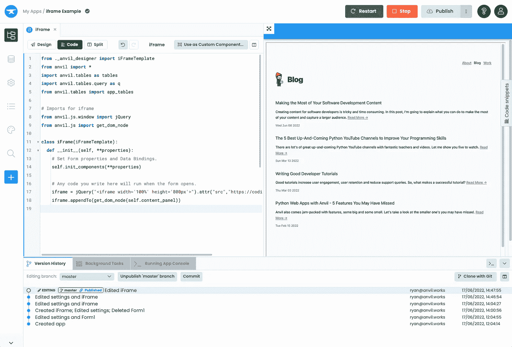
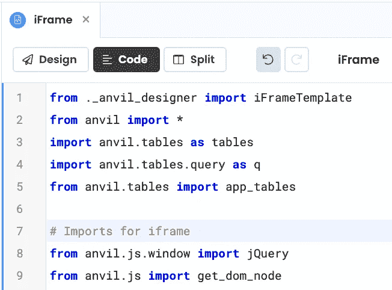
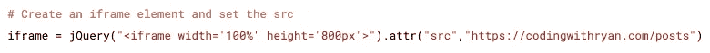
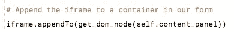
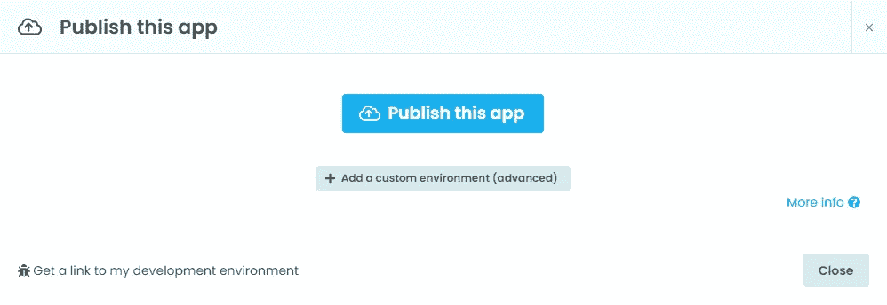
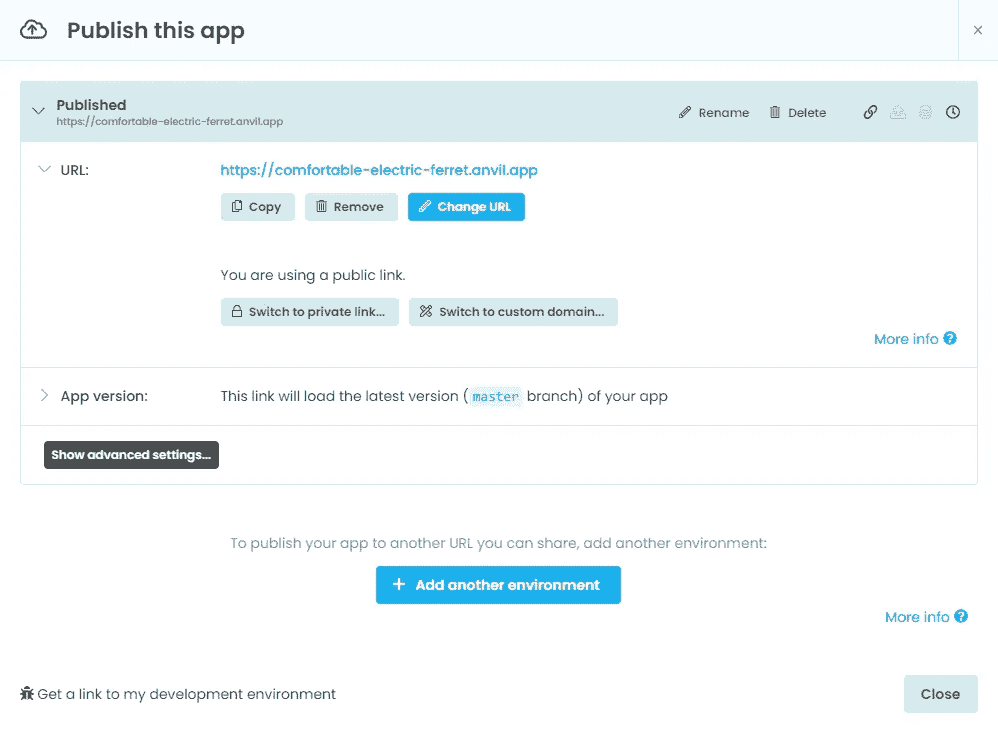

# 在 Anvil 应用程序中嵌入网页的 3 个简单步骤

> 原文：<https://betterprogramming.pub/3-simple-steps-to-embed-a-webpage-in-an-anvil-app-626cd4ecb77a>

## 如何在 Anvil 中创建 iframe 组件


由 [Andrew Lkhtk](https://unsplash.com/@lkhtk?utm_source=medium&utm_medium=referral) 在 [Unsplash](https://unsplash.com?utm_source=medium&utm_medium=referral) 上拍摄的照片

[*Anvil*](https://anvil.works/) *是一个只使用 Python 构建 web 应用的平台。*

在本指南中，我将向您展示如何通过三个简单的步骤在 Anvil 应用程序中嵌入网页。您可以使用它来嵌入博客、图表或像 PowerBI 这样的嵌入式分析。



Anvil 应用程序中嵌入的网页

我们将使用一个 iframe 来做这件事，这是一种将一个网页嵌入另一个网页的方法。Anvil 让我们使用 [anvil.js](https://anvil.works/docs/client/javascript/accessing-javascript) 用 Python 代码调用 JavaScript 函数。我们将使用 anvil.js 创建一个 iframe 标记，并使用 jQuery 将其添加到我们的页面中。

如果你想复制一个完成的例子，这里有一个链接:

[](https://anvil.works/build#clone:BSCEDQFEQTOLPZXA=MOEWITBLNADXXOHYXNU434KT) [## 注册

### 注册免费的无效电子邮件地址或密码。请再试一次。如果您还没有使用 Anvil，您将会遇到…

铁砧工厂](https://anvil.works/build#clone:BSCEDQFEQTOLPZXA=MOEWITBLNADXXOHYXNU434KT) 

让我们开始吧。

# 1.导入 jQuery 和 get_dom_node

让我们从在 Anvil 应用程序的[表单](https://anvil.works/docs/client/ui)顶部导入 jQuery 和 get_dom_node 开始。



在表单顶部导入

# 2.创建 Iframe 元素

接下来，让我们创建一个 iframe 元素。我们可以使用 [jQuery 的](https://api.jquery.com/attr/#attr-attributeName-value) `[attr()](https://api.jquery.com/attr/#attr-attributeName-value)`函数将`src`属性设置为我们想要嵌入到 iframe 中的网站。



添加 iframe 并设置 src 属性

# 3.将 Iframe 添加到容器中

最后，我们需要将 iframe 添加到一个[容器组件](https://anvil.works/docs/client/components/containers)。

我们可以使用 [jQuery 的](https://api.jquery.com/appendto/) `[appendTo()](https://api.jquery.com/appendto/)`函数将`iframe`对象添加到表单中的容器中——在本例中，我将`iframe`添加到了`content_panel.`

我们将使用`[anvil.js.get_dom_node()](https://anvil.works/docs/client/javascript/accessing-javascript#accessing-a-dom-node)`来访问容器组件的 [DOM 节点](https://developer.mozilla.org/en-US/docs/Glossary/DOM)。



向 Anvil 容器组件添加 iframe

就是这样！我们现在需要做的就是[发布我们的应用](https://anvil.works/beta-docs/deployment-new-ide/quickstart#publish-your-app)来看看它的运行。

# 4.(可选)发布应用程序

找到编辑器右上角的“发布”按钮:


单击它时，您会看到以下对话框:



单击发布此应用程序，您将看到您的应用程序已部署在一个新的公共 URL 上。这是一张图片:



# 结论

我们已经学会了如何:

*   导入 jQuery 并获取 dom 节点
*   创建 iframe 元素
*   将 iframe 添加到容器中

如果你想复制一个完成的例子，这里有一个链接:

[](https://anvil.works/build#clone:BSCEDQFEQTOLPZXA=MOEWITBLNADXXOHYXNU434KT) [## 注册

### 注册免费的无效电子邮件地址或密码。请再试一次。如果您还没有使用 Anvil，您将会遇到…

铁砧工厂](https://anvil.works/build#clone:BSCEDQFEQTOLPZXA=MOEWITBLNADXXOHYXNU434KT) 

感谢阅读！

```
**Don't forget!**[Follow me for more](https://codingwithryan.medium.com/) software development content!
```