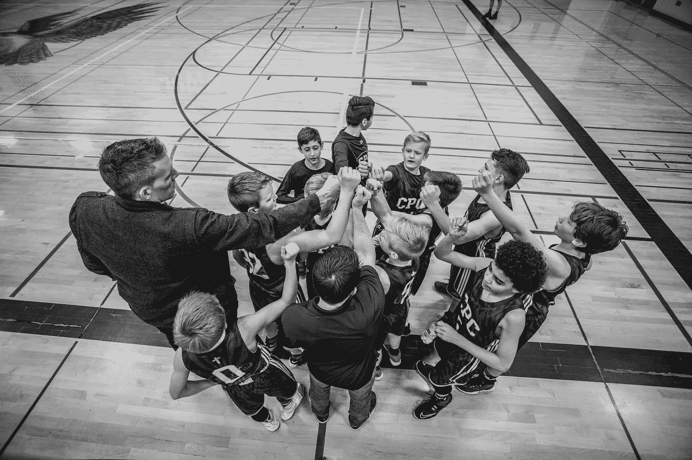

# 3 个简单的提示，会让你的领导立刻看上你

> 原文：<https://betterprogramming.pub/3-simple-tips-that-will-make-your-leader-immediately-set-eyes-on-you-79bba3087ca6>

## 你希望你的团队领导对你的良好表现感到惊讶吗？首先提升你的团队的表现

[@ chaselillottclark](https://unsplash.com/@chaseelliottclark)/【unsplash.com】T2

你知道每个队长最想要什么吗？一个团队中的每个成员都互相合作，这是一个好的团队。

你知道是什么让一个团队成为一个好团队吗？这一切都始于每个队友的技能，它帮助其他人，并最终帮助团队变得更好。

在这篇文章中，我们将通过 3 件简单的事情来提升你的团队的表现，让它变得更好，让你成为一个有价值的队友。正如我们所知，团队领导喜欢优秀的团队，他们能够认识到是谁造成了这种情况。

# 成为房间里最笨的人

【unsplash.com】@ Jesse do 81/

我知道你没有预见到这一点，没有人喜欢成为房间里最笨的人，这不是你想要的感觉，但让我告诉你一件事，这个角色对每个团队的成功都非常重要。你知道为什么吗？因为最笨的人会问一些没人愿意问的问题，因为害怕听起来会很笨。

我们都遇到过这种情况，你正在开会讨论 XYZ 的新功能，但你很难将所有信息整合在一起。你有问题，以下是你的想法。

“我不能只问这个，这是世界上最基本的事情。我已经在这里工作一年半了，他们会认为我一无所知。最好等一等，看看是否还有人问同样的问题”。

但是没人知道。会议结束时，你有同样的问题，如果不是比以前更多的话，现在这是你未来的问题。

那不管用，是吗？

你想成为那个问这些问题的人。想想看，你的问题在你看来可能很愚蠢，但它可能是房间里每个人都有的问题，没有人敢问。这个简单的问题可能会引出更复杂的问题，在讨论中打开一个全新的分支，甚至根据答案改变会议的整个要点。

> 最笨的人问没人想问的问题

当你问你的问题时，会发生两件大事。首先，你和房间里的每个人都更好地理解了这个主题，因为你肯定不是唯一一个有同样疑问的人，这对你和团队来说已经是一个很大的好处。最重要的是，你的领导注意到你很活跃，试图从会议中获得最大收益，你对主题感兴趣，你想了解更多，学习更多。领导者喜欢看到忠诚的团队成员。

所以下次你有问题的时候，不要犹豫，直接问。对你来说，这可能听起来很愚蠢，但很可能你的问题是一个很好的问题。

# 你想变得更好吗？展示它

[@ charlesdeluvio](https://unsplash.com/@charlesdeluvio)/【unsplash.com 

每个人都想成功——不管这对你的特殊情况意味着什么——要做到这一点，你需要提高自己，在你做的事情上做得比你自己更好。

你是怎么做到的？嗯，第一步是认识到你的弱点是什么，老实说，如果你想独立完成，这需要一些一流的技能。看到一个人擅长什么或多或少是容易的，但看到你自己的错误，你的缺点，那些你必须努力的小事，那是一项艰巨的任务。

这是我的第二个简单的建议，寻求反馈。这可能是来自你的同事的反馈，或者，在这种情况下，我们想要的是来自你的团队领导的反馈。

领导者喜欢看到他们的团队成员寻求反馈并在此基础上改进。没有什么比知道自己帮助别人实现了更好的自我更令人满足的了。

你的公司可能已经设定了年度绩效修正，你可以与你的领导进行一对一的会谈，回顾今年的目标进展如何，你在公司工作的感觉如何，可能还会回顾一下薪水。你知道，平常的事情。现在，每年举行一次这样的会议并不意味着你不能在任何特定的时间直接要求反馈。真正的诀窍是在那些设定的评估点之外，向你的领导寻求直接反馈。这是让你展示你想要变得更好的意愿，去实现更好的自己。你说“嘿，我不会等一年才知道我的表现，下周我们开个 30 分钟的会，我想听听你要告诉我什么。我想现在就开始工作”。这就是主动性。

> 如果你变得更好，团队也会变得更好

我知道你现在可能在想什么，没有人喜欢收到反馈。很容易对它有一个不太好的看法，因为没有人想听关于它的弱点和有事情要改进的事实的说教。不过不要惊慌，领导通常会准备好从尊重和建设性的角度给你反馈，与你分享他们对哪些方面可以改进的意见，甚至给你如何改进的想法。毕竟，如果你变得更好，团队也会变得更好。

# 不要藏在心里，分享吧

[@ Jesse do 81](https://unsplash.com/@jessedo81)/【unsplash.com 

这是 3 点中最重要的一点，也可能是在团队中工作的人最重要的技能之一。它是一种沟通一个人脑子里在想什么的能力。这听起来很简单，但同时，它比人们想象的要困难得多。有效沟通的技巧本身就是一个巨大的话题，以至于有成千上万的书都是关于它的。不过不要担心，最小的行动也能产生巨大的影响，我们马上就会看到。

拥有良好的沟通技巧可以提升团队的表现，这也是领导者被其吸引的原因。他们知道这一点的重要性，并意识到团队中有人有了闪光点。

良好的沟通是每个成功团队的关键组成部分。优秀团队中的人一起工作，他们步调一致，就像一支精英足球队一样。如果你有幸观看了你最喜欢的球队的现场比赛，你可能会注意到他们在比赛中互相交谈，他们说了很多。他们不断地宣布正在发生的事情，下一步是什么，他们每个人在给定的比赛中对队友的期望是什么，他们这样做的原因很简单，他们不认为任何事情是理所当然的。在一天结束时，一个人可能是团队中唯一一个在特定时刻知道特定情况的人。

公司中的团队与足球队并没有太大的不同，但是让我们暂时把体育放在一边。

> 发生了什么，下一步是什么，你对你的队友有什么期望

再读一遍最后一段，试着将我提到的每一种情况适应你自己的职业生活。我是一名软件工程师，因此，在我的特殊情况下，“正在发生的事情”将是让我的领导知道我在代码中发现了一个新的错误，我需要在我分配的问题上多花 2 个小时。“下一步是什么”可能是宣布在完成我现在正在做的任务后，我正计划接受某项任务。“我对我的队友的期望”可以是让我的队友知道我期望在午餐前准备好代码评审，因为我们几天后有一个发布，我需要时间来处理任何评论。

你看，这没什么疯狂的，这些都是简单的行动，每个行动不会超过 10 分钟，但为团队增加了大量的价值。当你每天都这样做时，你就产生了团队的协同作用，主要负责人自然会出现，你现在是团队中更活跃的成员之一。

当然，重要的是要明白良好的沟通不是绝对的沟通。如果你在表明你的观点之前不停地谈论 15 分钟，或者提及你计划做或已经做的每一个微小的细节，那么，这是消极的而不是积极的。所以记住这一点。

重要的是你不应该假设其他人知道你所知道的，因为这对其他人来说可能是新的信息，有价值的信息。不要把它留给自己，分享它。

> 不要假设别人知道你所知道的

# 外卖食品

你可能已经看到了这里的模式，这个列表中的每一点都涉及到与他人交谈，要求事情，听取他人的意见和观点。归根结底，团队合作就是这些事情。所以，走出去，把这些付诸实践，你会变得更好，你的团队会变得更好，你的团队领导也会注意到这一点。

你同意这些建议吗？你觉得他们怎么样？留言评论！我在读你。