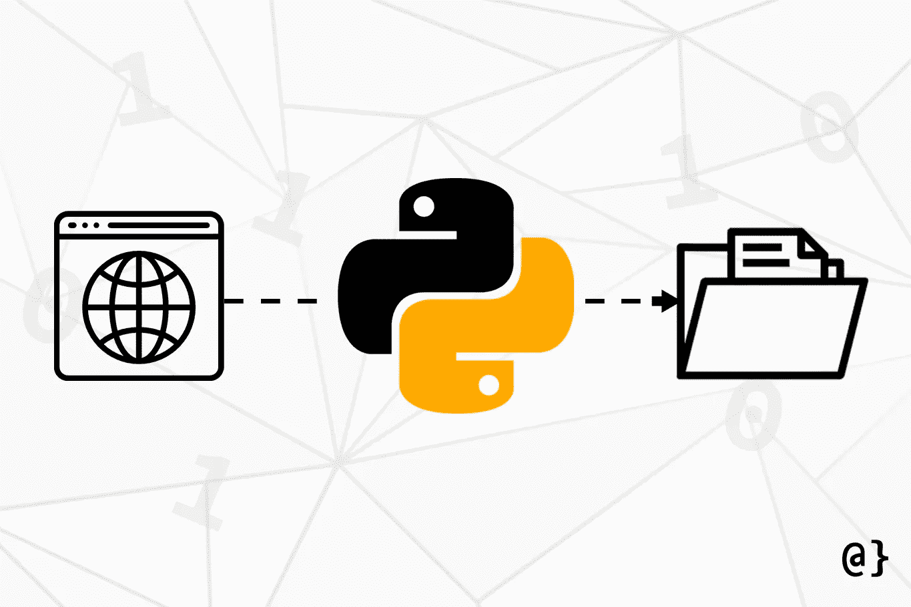

# 用 Python 下载文件的 3 种简单方法

> 原文：<https://betterprogramming.pub/3-simple-ways-to-download-files-with-python-569cb91acae6>

## 使用 Python 从互联网上下载文件非常简单，而且只需使用标准的库函数就可以实现

照片来自[过度编码](https://www.overcoded.net)。

其他库，最著名的是 Python Requests 库，可以为那些更关心高级操作的人提供更清晰的 API。本文概述了使用 Python 下载文件的三种方法，并对每种方法进行了简短的讨论。

# 1.urllib.request.urlretrieve

Python 的 [urllib 库](https://docs.python.org/dev/library/urllib.html)提供了一系列用于处理常见 URL 相关任务的函数。这包括解析、请求和下载文件。让我们考虑一个从 [www.google.com:](http://www.google.com:) 下载`robots.txt`文件的基本例子

*注意:urllib 的* `urlretrieve`*被认为是 Python 2 的“遗产”，在 Python 文档* *的* [*中，“可能在将来的某个时候会被弃用。”在我看来,“可能”被弃用和“将”被弃用有很大的区别。换句话说，在可预见的未来，这可能是一种安全的方法。*](https://docs.python.org/3/library/urllib.request.html#legacy-interface)

# 2.requests.get +手动保存

Python 请求模块是一个超级 *-* 友好库，号称“人类的 HTTP”Requests 提供了非常简化的 API，即使是与 HTTP 相关的高吞吐量需求也符合它的座右铭。然而，它没有下载文件的一行程序。相反，必须手动保存流式文件数据，如下所示:

这种方法有一些重要的方面需要记住——最明显的是数据传输的二进制格式。当 web 浏览器加载页面(或文件)时，它使用来自主机的指定编码对其进行编码。

常见的编码包括 UTF-8 和拉丁-1。这是一个针对网页浏览器的指令，这些浏览器接收到*和*显示的数据不能立即下载文件。

*注意:下载的文件可能需要编码才能正常显示。这超出了本教程的范围。*

# 3.wget.download

[wget Python 库](https://pypi.org/project/wget/)提供了一个类似于`urllib`的方法，并且由于其名称与 Linux `wget`命令相同而吸引了很多关注。该模块最后一次更新是在 2015 年。

*注意:* `*wget.download*` *功能使用* `*urllib*` *、* `*tempfile*` *和* `*shutil*` *的组合来检索下载的数据，保存到一个临时文件，然后将该文件移动(并重命名)到指定位置。*

# 最后的想法

用 Python 下载文件超级简单，*可以用标准的`urllib`函数*完成。我发现 Requests 库为常见的 HTTP 相关任务提供了最简单、最通用的 API。一个值得注意的例外是 `[urllib](https://docs.python.org/dev/library/urllib.parse.html?highlight=urlparse#urllib.parse.urlparse)`的 [URL 解析特性。不过，这些都是严格与 HTTP 相关的，所以我不会从 T8 扣分！](https://docs.python.org/dev/library/urllib.parse.html?highlight=urlparse#urllib.parse.urlparse)

*文章* [*如何用 Python*](https://www.overcoded.net/downloading-files-with-python-533513/) *下载文件最初发表在* [*过度编码*](https://www.overcoded.net) *上，经许可在此重新发布。对原始文章的更新可能不会反映在此帖子中。*