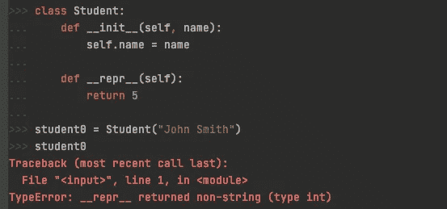

# Python 中对象字符串格式化的 3 种特殊方法

> 原文：<https://betterprogramming.pub/3-special-methods-for-object-string-formatting-in-python-c020150d624c>

## 以用户友好的方式格式化 Python 定制对象


科林·阿姆斯特朗在 [Unsplash](https://unsplash.com?utm_source=medium&utm_medium=referral) 上拍摄的照片

在 Python 中，下划线在属性名中使用时具有特殊的含义。一种特殊的形式是使用两对双下划线，一个在属性名之前，另一个在属性名之后，这被称为特殊方法或魔术方法。

例如，我们大多数人知道的第一个特殊方法可能是初始化方法`__init__`，它用于创建 Python 对象。以下代码向您展示了一个示例:

```
class Student:
    def __init__(self, name):
        self.name = name
```

创建该类的实例对象时，只需在交互式控制台中键入对象变量，即可检查该对象:

```
>>> student0 = Student("John Smith")
>>> student0
<__main__.Student at 0x11883aa60>
```

然而，这个对象的信息并不十分有趣，它仅仅显示了它的类和它的内存地址。为了更有趣，我们应该考虑自定义类的字符串格式化方法。具体来说，我们将在本文中讨论三种特殊的方法。

# __repr__ 方法

`__repr__`方法与对象的表示有关。如上所示，Python 对象在交互式控制台中打印出它的表示字符串。以下代码揭示了这一特性:

重写 repr()方法

需要注意的一点是，我们应该为`__repr__`特殊方法返回一个字符串。如果返回一个非字符串，会遇到一个`TypeError`，如下图所示。



非字符串的 TypeError

然而，突出的问题是我们应该为对象返回什么字符串？根据经验，我们应该返回一个字符串，用户可以使用它来重新构造对象(例如，创建一个与被检查对象具有相同值的对象)。

覆盖 __repr__

使用更新后的代码，我们可以在交互式控制台中检查对象，如下所示。如您所见，表示字符串是一个有效的 Python 表达式，使用它我们可以创建一个`Student`对象:

```
>>> student0 = Student("John Smith")
>>> student0
Student('John Smith')
```

同样，我们可以使用内置的`repr()`方法来检索表示字符串。与此相关，人们可能希望通过将字符串表示发送到内置的`eval()`函数来重新构造另一个对象:

```
>>> student1 = eval(repr(student0))
>>> student1
Student('John Smith')
```

顺便提一下，我们使用 f-string 来内插对象的属性，并使用`!r`来指定我们想要字符串的原始表示，因为默认情况下 f-string 将调用`__str__`方法来检索内插变量的值。在这种情况下，省略`!r`将使字符串本身代替引号内的字符串。考虑下面的代码作为一个简单的例子——显然，后一个字符串不能用来创建一个`Student`对象:

```
>>> name = "John Smith"
>>> print(f"Student({name!r})")
Student('John Smith')
>>> print(f"Student({name})")
Student(John Smith)
```

另一件要注意的事情是，有时提供一个允许对象重建的有意义的字符串是不实际的。在这种情况下，我们通常使用`<>`来封装实例的类和一些摘要信息。下面的代码向您展示了内置类的示例。

一些内置类的表示

# __str__ 方法

另一个与对象格式化相关的有趣的特殊方法是`__str__`方法。下面的代码向您展示了如何在自定义类中重写它。

覆盖 __str__

对于修改后的类，让我们看看它何时被调用。

```
>>> print(student0)
__str__ is called
>>> str(student0)
'__str__ is called'
>>> f"{student0}"
'__str__ is called'
```

如上所示，至少有三种情况会导致调用`__str__`特殊方法。具体来说，`print()`函数、`str()`函数(这是意料之中的，因为它只是一个语法糖)和 f 字符串插值变量都将调用对象的底层`__str__`方法。

虽然我们知道使用`__str__`方法的情况，但问题是实现该方法的最佳实践是什么。

__str__ 的正确实施

*   对于如何定义从`__str__`方法返回的字符串，没有通用的方法。
*   原则是我们应该返回一些关于实例对象的描述。在大多数情况下，我们只提供实例对象的属性。

除了这几点，需要注意的是，如果你的类没有定义`__str__`方法，Python 会寻找`__repr__`是否实现。如果是的话，任何调用`__str__`的东西都会转而调用`__repr__`。

# __format__ 方法

与对象字符串格式化相关的另一个重要的特殊方法是`__format__`方法。下面的代码显示了自定义类中此方法的签名:

覆盖 __format__

正如我们之前所做的那样，让我们首先看看调用该方法的常见情况:

```
>>> student0 = Student("John Smith")
>>> f"{student0}"
'__format__ is called'
>>> format(student0)
'__format__ is called'
>>> print(student0)
<__main__.Student object at 0x114a92c10>
>>> str(student0)
'<__main__.Student object at 0x114a92c10>'
```

f 字符串和内置的`format()`方法都可以调用`__format__`方法。让我们以 f 弦为例向你展示`__format__`是如何运作的。

您可能会注意到，与`__repr__`和`__str__`方法不同，`__format__`方法有一个名为`format_spec`的附加参数。此参数定义如何将对象格式化为字符串。让我们看看下面代码片段中的一些自定义规范:

自定义格式

*   我们定义了两个自定义规范。当规格为`i`，代表首字母时，我们返回学生的首字母。
*   另一个规范是`C`，代表大写，我们返回学生名字的大写形式。
*   除了这两个规范，我们还为适用的字符串格式指定了默认的内置格式。
*   回想一下，当我们使用 f-string 时，我们在冒号后指定格式要求。在我们的例子中，当我们指定规范为`i`和`C`时，我们确实得到了想要的格式。

# 结论

在本文中，我们回顾了 Python 中三种基本的特殊格式化方法。这里有一个快速回顾。

*   `__repr__`方法显示一个字符串表示，只要有可能，它就是一个有效的 Python 表达式，可以用来创建一个类似的对象。当不适用时，考虑使用“`<>`”来提供课程信息和其他有意义的功能。
*   `__str__`方法是提供对象的描述信息。
*   `__format__`方法是提供基本格式规范之外的自定义格式规范。如果您希望您的对象对于不同的用例有不同的字符串表示，这可能会很有帮助。