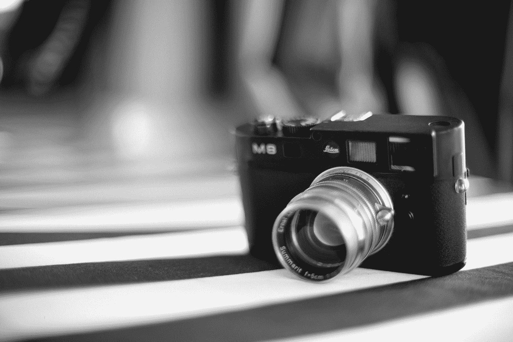
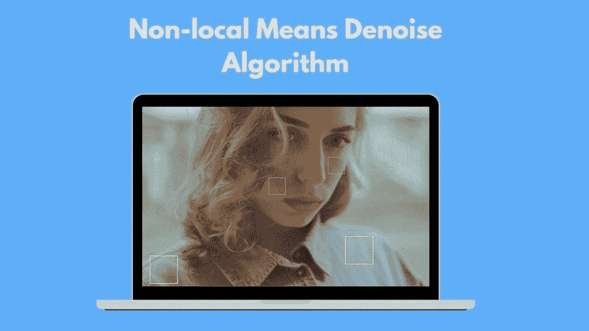
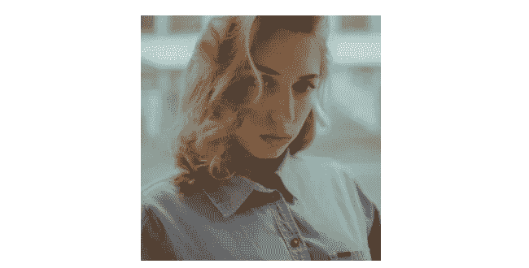
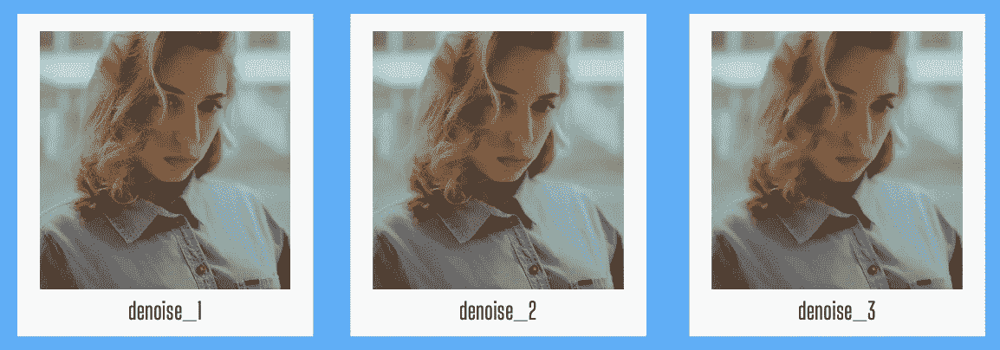
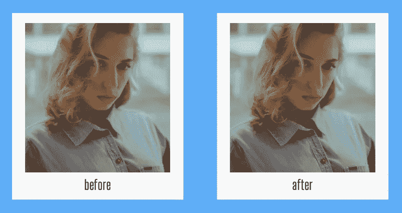

# 使用 Python 中的 OpenCV 降噪增强图像的 3 个步骤

> 原文：<https://betterprogramming.pub/3-steps-to-enhance-images-using-opencv-noise-reduction-in-python-f53d2abf2f6f>

## 利用降噪来消除像素化图像



由 [Unsplash](https://unsplash.com?utm_source=medium&utm_medium=referral) 上的 [CHUTTERSNAP](https://unsplash.com/@chuttersnap?utm_source=medium&utm_medium=referral) 拍摄。

在本文中，我将向您展示如何通过三个简单的步骤实现降噪。我们将使用机器学习训练的降噪模型。这是我发现的最好的降噪模型之一。

一个程序能判断一幅图像是否有噪声吗？这可能是另一个项目的想法，因为我们的降噪模型不够智能，无法计算噪音。我们必须自己决定价值观。在这种情况下，最好的方法通常是尝试不同的值，找到最佳结果。经过一些实践后，您将获得更多的经验，并且更容易找到最佳参数值。

让我给你简单介绍一下这个项目，然后我们就开始。

# 介绍

在这个项目中，我们将使用三个 Python 包: [OpenCV](https://opencv.org/) 、 [Matplotlib](https://matplotlib.org/) 和 [NumPy](https://numpy.org/) 。OpenCV 是一个非常著名的计算机视觉工具包。作为 OpenCV 库的先决条件，我们需要安装 NumPy。读取图像时，我们将像素转换为数组。NumPy 将在幕后完成这项工作。在处理多维数组时，NumPy 是完美的。

# 降噪模型

接下来是这个项目有见地的部分。首先，我要分享我们将使用哪种算法进行降噪。然后，我将分享它有多少个参数，以及每个参数的含义。



来自 [Pexels](https://www.pexels.com/photo/crop-thoughtful-woman-with-short-hair-standing-on-street-5420550/?utm_content=attributionCopyText&utm_medium=referral&utm_source=pexels) 的 [MBARDO](https://www.pexels.com/@mbardo?utm_content=attributionCopyText&utm_medium=referral&utm_source=pexels) 的照片(作者设计)。

图中的黄色区域看起来很像。另外，绿色的小区域看起来很相似。非局部均值去噪算法选择一个像素，在其周围取一个小窗口，扫描图像寻找相似的窗口，对所有窗口进行平均，计算结果以替换该像素。这种算法被描述为非局部的，因为它搜索整个图像来寻找相互的联系，而不是仅仅在单个区域周围寻找。是不是很酷？

这个算法包含两个流行的函数:`fastNlMeansDenoising`和`fastNlMeansDenoisingColored`。第一个用于灰度图像，第二个用于彩色照片。在我们的例子中，我们将使用一个彩色图像。

该功能的参数有`src`、`dst`、`h`、`hcolor`、`templateWindowSize`和`searchWindowSize`。

*   `src`:我们要做降噪处理的输入图像。
*   `dst`:我们要导出结果的目的地。
*   `h`:亮度分量(较大的`h`值会去除更多的噪声，但也会降低图像质量)。
*   `hcolor`:彩色分量(`10`是彩色图像文档的推荐值)。
*   `templateWindowSize`:函数将要平滑的区域的像素大小。它应该是一个奇数。
*   `searchWindowSize`:该函数将查找并用作参考的区域的像素大小。它线性地影响性能:更大的`searchWindowSize`意味着更长的去噪时间。此外，它应该是一个奇数(`21`是官方文档推荐的值，因为它适合大多数有噪声的图像情况)。

# 步骤 1:安装软件包

我们必须安装两个库，这样我们的程序才能工作:numpy 和 opencv-python。我们可以使用 PIP 库管理器在一行中安装它们:

```
pip install numpy opencv-python
```

让我们继续创建一个新的 Jupyter 笔记本(但是可以随意使用您想要的代码编写环境)。这是我的第一个笔记本块，我们正在导入刚刚构建的库:

```
import cv2 
import numpy as np
```

太好了！现在我们可以进入下一步，导入并读取图像。

# 步骤 2:导入图像

在这一步中，我们将找到一张想要用于降噪的图片。为了更清楚地看到变化，它可以是一张嘈杂的图片。也可以随意使用普通的图像——仍然会有平滑的效果。

下面是我打算使用的图片:



照片由 [Pexels](https://www.pexels.com/photo/crop-thoughtful-woman-with-short-hair-standing-on-street-5420550/?utm_content=attributionCopyText&utm_medium=referral&utm_source=pexels) 的[姆巴多](https://www.pexels.com/@mbardo?utm_content=attributionCopyText&utm_medium=referral&utm_source=pexels)拍摄。

这是读取图像的一行。我们使用 OpenCV 的`imread`方法:

```
img = cv2.imread("test_image.png")
```

现在，让我们进入第三步，也是最后一步，在这里我们将看到我们的降噪效果。

# 步骤 3:图像去噪

目前看起来很棒！这是这个项目有趣的部分。我们将看到降噪后的图像。我们将使用三个不同的值运行该函数，看看每个值如何影响最终结果。请随意检查第一步，以了解每个参数代表什么。

```
denoise_1 = cv2.fastNlMeansDenoisingColored(img,None,3,3,7,21) 
denoise_2 = cv2.fastNlMeansDenoisingColored(img,None,5,5,7,21) 
denoise_3 = cv2.fastNlMeansDenoisingColored(img,None,15,15,7,21)
```

去噪后的图像被分配给不同的变量。让我们保存结果。我们将使用 OpenCV 的`imwrite`方法。如您所见，我们传递了变量和想要保存的文件名。

```
cv2.imwrite('image_1.png', denoise_1) 
cv2.imwrite('image_2.png', denoise_2) 
cv2.imwrite('image_3.png', denoise_3)
```

# 比较结果

我们可以按顺序看到它们。该值越大，图像变得越平滑。



这是一张前后对比的图片，可以看到这些变化。我选择了`denoise_1`作为我的最终结果。



恭喜你！我们开发了一个程序，通过不同的级别降低图像的噪声。还有许多其他的图像缩小算法。你可以试一试，选出你最喜欢的。根据我的经验，它们不如我们在本文中使用的非局部均值去噪算法强大。一些降噪算法也被称为模糊算法。这可能有助于您搜索不同的型号。

从事像这样的动手编程项目是提高编码技能的最好方式。我希望你喜欢这篇文章，并且今天学到了一些新东西。感谢您的阅读！