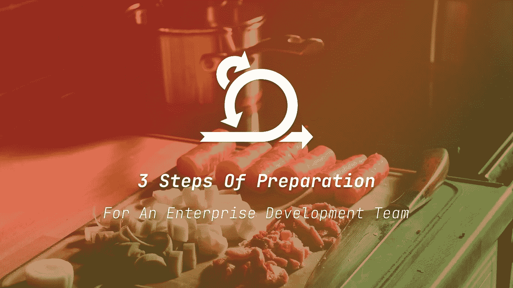

# 帮助你为企业开发团队做好准备的 3 个步骤

> 原文：<https://betterprogramming.pub/3-steps-to-help-you-prepare-for-an-enterprise-development-team-981742f265cd>

## 从准备到提炼再到评估

照片由 [Unsplash](https://unsplash.com/?utm_source=unsplash&utm_medium=referral&utm_content=creditCopyText) 上的[哈里·格劳特](https://unsplash.com/@photographybyharry?utm_source=unsplash&utm_medium=referral&utm_content=creditCopyText)拍摄

在企业组织的开发团队准备好开始他们的工作之前，整个过程已经准备好了。在开发人员编写代码之前，这个过程是必不可少的。

自 2014 年以来，我一直在荷兰的大型企业组织(荷兰合作银行、ANWB、北约、卫生、财富和体育部)工作，我看到了这些组织如何为他们的开发团队准备工作。

**注意**:这并不能保证这在你的组织中行得通！即使你在用 Scrum 或看板方法做敏捷，你也必须投入工作，并在需要时采用变更。

我从中学到了很多，所以我很乐意与你分享这个工作流程。

# 序

这个工作流程是我在所有我工作的组织中使用的基线。从小到大，没关系。有一个支持“业务”和“开发”团队的工作流是很重要的。

*   当我说 ***业务*** 时，我指的是知道业务如何运作、他们的客户如何与他们的产品互动以及负责这些产品的人。大多数组织称这些人为产品经理或产品所有者(如果他们采用了 Scrum)。
*   当我说**开发团队时，**我指的是开发团队中的人。这些人是开发人员、测试人员、scrum masters、团队领导、设计师等等。

# 1.准备

[Jexo](https://unsplash.com/@jexo?utm_source=medium&utm_medium=referral) 在 [Unsplash](https://unsplash.com?utm_source=medium&utm_medium=referral) 上拍摄的照片

几乎地球上的每个人都知道，出色的准备会让你成功的机会比不做准备的时候更大。

在小组织工作比在大组织工作容易(我不是说容易)。所以如果你在一个小组织，想要成长，就从准备开始吧。永远记住，这不仅对你来说是清楚的，对其他人来说也是清楚的。

## 业务准备

业务人员必须在开发团队做一些事情之前做好准备。

如果你的组织与 [Github](https://github.com/) 、 [Azure Devops](http://dev.azure.com/) 或[吉拉](https://www.atlassian.com/software/jira)一起工作，确保这项工作在“待办事项”中完成或者，如果产品经理喜欢在 Word 或 Excel 中处理他们的愿景和功能，就让他们这样做吧。

确保准备工作不会干扰开发团队的工作。

## 应该准备什么

如果你不了解一个组织，很难定义一个产品经理或所有者应该准备什么。但我会试着解释最一般的东西。

特征应描述以下内容:

1.  **目标。如果你为用户定义了目标，那将是最好的。为什么这对用户很重要？用户应该完成什么目标？(开发团队喜欢了解一个特性背后的一些推理。)**
2.  **场景。在愿景上写下不同的场景是很重要的，用户应该遵循这些场景来实现目标。这也有助于为团队制定指导方针，这样他们就可以期望某个特定的特性能够工作。**
3.  **设备。**如今，可以与应用程序交互的不同类型的设备非常多。因此，如果您考虑开发团队应该如何处理这些不同的屏幕尺寸，将会有所帮助。
4.  **不快乐的路。**不要忘记考虑处理错误，因为系统可能会崩溃，用户可能会点击你意想不到的按钮。这部分非常难，但是如果你错过了这部分，开发团队可以帮助你。
5.  **表格。当您的应用程序有表单时，您必须考虑对这些表单的要求。一个用户可以发送一个包含各种字符的无休止的字符串吗，或者它有一个最大值吗？对于一个开发团队来说，这些细节超级重要。**

这并不是说企业应该知道每一个细节。但是所有已知的事实都必须写下来。只要信息不是写下来，而是在人的脑子里，人们就会猜测。

当人们在猜测的时候，作为产品经理，你要确定你的期望没有实现。

# 2.精炼

[杰森·古德曼](https://unsplash.com/@jasongoodman_youxventures?utm_source=medium&utm_medium=referral)在 [Unsplash](https://unsplash.com?utm_source=medium&utm_medium=referral) 上的照片

*这种细化的主要优先事项是业务和开发在同一页面上，并创建一个完整的信息包，因此没有人需要搜索所有类型的文档。*

当业务做好了所有的准备，就到了开发团队第一次看到准备的阶段。

以我的经验来看，对于一个产品或服务的成功来说，开发人员计划时间通读所有文档化的信息是至关重要的。当然，他们会对具体细节提出疑问。是的，这是好事！

负责的业务人员必须在开发团队的积压工作上创建多个用户故事。主要是如果业务人员在 Word 或 Excel 文档中想出了它的特性/想法。

将特性分解成更小的部分将有助于开发人员充分理解为什么他们需要构建这些特性是如此重要。如果部分太大，开发人员就不能完全掌握思路，做出合理的估计。

最好与负责的产品经理或产品所有者计划一次“细化”会议，与开发团队讨论这些细节。同处一室或在线讨论将确保开发团队向来源提问。

当细节不精确时，开发团队应该澄清 backlog 中的信息。有时，如果他们添加细节、截图或外部文档，会有所帮助。

既然开发团队和业务部门对特性的计划达成了一致，他们应该能够给出一个估计。

# 3.估计

照片由[i̇rfan·西姆萨尔](https://unsplash.com/@irfansimsar?utm_source=medium&utm_medium=referral)在 [Unsplash](https://unsplash.com?utm_source=medium&utm_medium=referral) 上拍摄

评估是软件开发中最难的事情之一(我确信做评估对这个星球上的每个人来说都很难🌍。)

进行评估需要开发人员充分理解他们需要开发的特性。他们必须将用户故事分解成更小的部分，这将有助于他们做出更好的评估。

如果用户故事太大:

*   开发人员倾向于有大量的问题，而不是几个
*   团队的估计会有巨大的差距
*   开发者将会看到大问题

如果估计与现实相差太远，像产品经理和产品所有者这样的人会不高兴。

同样重要的是要知道，开发团队可能要花很多时间来学习如何一起工作。但是在这种完美合作的状态下，团队中的估计会更好。

请不要指望你的团队会对这些需要完美评估的经理做出这样的评价。要得到准确的估计需要很多年。这只有在技术和领域保持不变的情况下才有可能。

如果开发人员在技术、领域或项目之间切换，评估您的工作是困难的。

因此，对于所有希望他们的团队进行评估的经理来说，你需要创造最佳的环境，并为团队准备所有的工作。确保他们不必深挖他们的信息，因为这将花费很多时间。在一个地方准备和打包他们需要的所有信息。这将有助于准备和评估。

[**通过电子邮件获取我的文章点击这里**](https://blog.byrayray.dev/subscribe) **|** [**购买 5 美元的中等会员资格**](https://blog.byrayray.dev/membership)

# 结论

我希望这个过程能帮助你塑造你的团队作为一个开发人员或管理者所需要的工作流程。

我强烈推荐使用敏捷框架，它可以帮助你和你的团队很好地合作，交付有价值的软件项目。我是 Scrum 和看板的忠实粉丝。

如果您对此工作流程有任何疑问，请告诉我。任何建议都非常欢迎！

软件开发项目的成功是在准备阶段。如果所有的信息都在一个地方，这将防止团队在搜索上浪费宝贵的时间，这将有助于团队做出更好的决策。

像 [Scrum](https://www.scrum.org/resources/what-is-scrum) 或[看板](https://www.atlassian.com/agile/kanban)这样的敏捷框架可以帮助组织开发团队的过程。这两种方法我都喜欢！