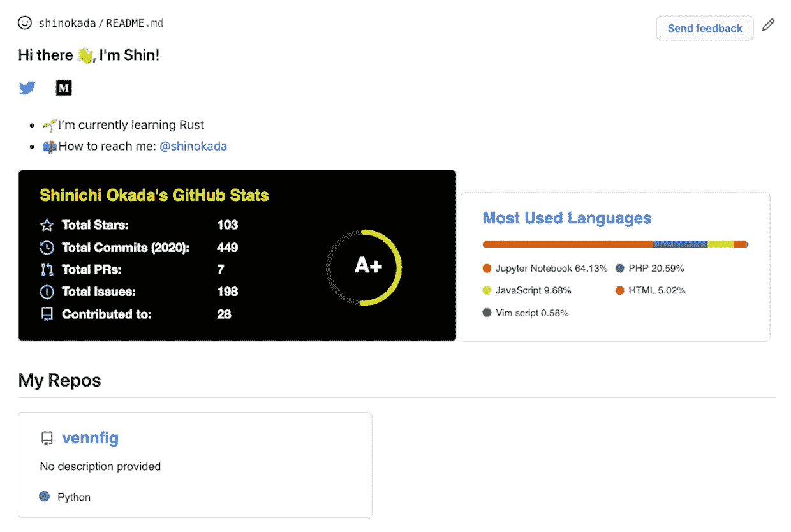
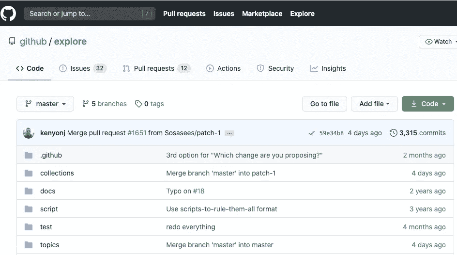
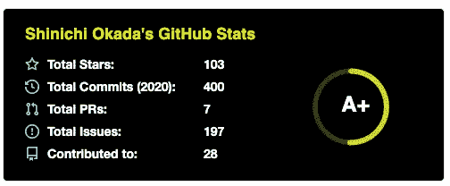
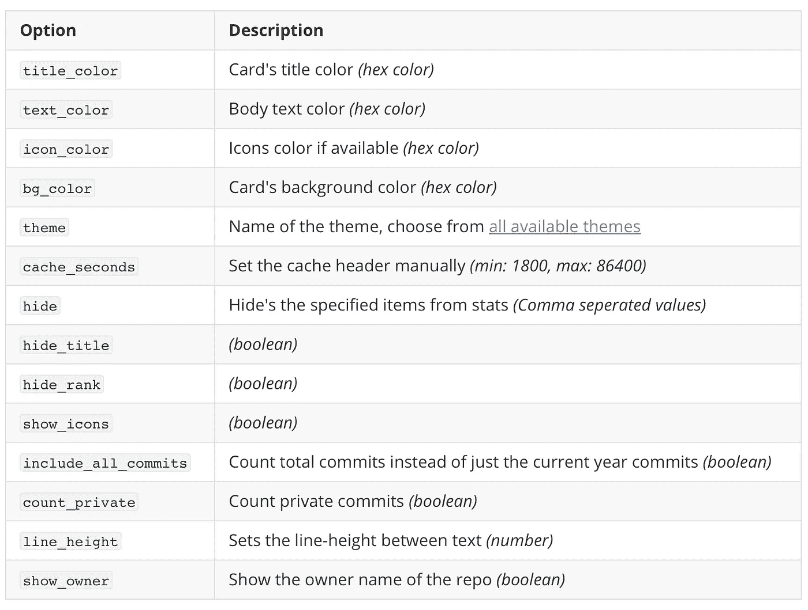
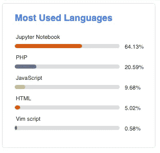
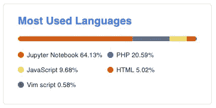
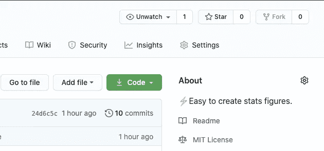
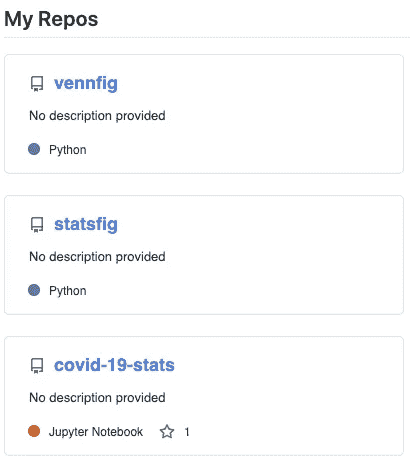

# 改善 GitHub 概览页面的 3 个步骤

> 原文：<https://betterprogramming.pub/3-steps-to-improve-your-github-overview-page-950c64d4d465>

## 添加动态生成 GitHub 统计



我的 Github 概览页面。(图片由作者提供)

[更新:2022–03–13 自述文件生成器]

在本文中，您将了解如何通过添加您自己的内容和动态生成的 GitHub 统计信息来改进您的 GitHub 概览页面。

让我们开始吧。

1.  创建新的存储库。存储库名称需要与您的 GitHub 帐户名相同。
    例如[https://github.com/shinokada/shinokada](https://github.com/shinokada/shinokada)
2.  在这个 repo 中创建一个`README.md`文件。
    这个文件的内容会在你的 GitHub 概览页面上。

您可以使用 [markdown](https://guides.github.com/features/mastering-markdown/) 添加标题、图像、链接、表格、[表情符号](https://getemoji.com/)和列表。

你可以从 [GitHub explore repo](https://github.com/github/explore/tree/master/topics) 中找到很多编程语言图标。所有图标都在主题文件夹下。



这个[存储库](https://github.com/github/explore)存放了 GitHub 主题和集合的所有社区管理的内容。(图片由作者提供)

3.添加 GitHub 统计卡。

[Github Readme Stats](https://github.com/anuraghazra/github-readme-stats) 动态生成关于你的库的 GitHub stats。

有三种状态卡。

*   统计卡
*   顶级语言卡
*   额外 Pin

# 统计卡



统计卡示例。(图片由作者提供)

统计卡显示总星级，提交，公关，问题和贡献。

例如，您可以复制并粘贴以下代码。

```
// README.md
)
```

你需要把`?username=yourusername`改成你的 GitHub 用户名，比如`?username=shinokada`。

您可以在`&theme=`中设置其中一个[主题](https://github.com/anuraghazra/github-readme-stats/blob/master/themes/README.md)。

你可以通过`&count_private=true`来统计你的私人行为。

您可以使用此表中的任何选项。



选项详细信息。(图片由作者提供)

# 顶级语言卡

这张卡片显示了你的回复的语言统计。

```
// README.md
)
```



顶级语言统计示例。(图片由作者提供)

可以用`&layout=compact`来改变卡牌设计。

```
)
```



顶级语言统计紧凑布局。(图片由作者提供)

您可以使用`hide`选项隐藏语言。

```
)
```

# 额外 Pin

您可以使用额外的大头针来显示您的存储库。

您在“关于”中的描述将显示在卡片上。



更新你的 Github。

```
[](https://github.com/yourusername/repo-name)](https://github-readme-stats.vercel.app/api/pin/?username=yourusename&repo=repo-name)](https://github.com/yourusername/repo-name))
```

使用 [show_owner](https://github.com/anuraghazra/github-readme-stats#customization) 变量包含回购所有者的用户名。

```
[](https://github.com/yourusername/repo-name))&show_owner=true[)](https://github.com/yourusername/repo-name)](https://github-readme-stats.vercel.app/api/pin/?username=yourusename&repo=repo-name)](https://github.com/yourusername/repo-name))
```



额外引脚示例。(图片由作者提供)

这里是[我的 README.md 文件](https://raw.githubusercontent.com/shinokada/shinokada/master/README.md)。

我希望你能把上面的代码用在你的 GitHub 概览页面上。很容易应用它来获得 GitHub 统计数据的概览。

# 自述文件生成器

我找到了[的自述生成器](https://nxt-readme.vercel.app/editor)。这是一个拖放工具，用于创建您的自述文件和 GitHub 配置文件。我有所有的功能，包括徽章，统计卡，顶级语言卡，和各种技能卡。

**通过** [**成为**](https://blog.codewithshin.com/membership) **会员，获得媒体上所有故事的访问权限。**


[https://blog.codewithshin.com/subscribe](https://blog.codewithshin.com/subscribe)

# 参考

以下资源用于编写这篇文章:

*   [https://github.com/anuraghazra/github-readme-stats](https://github.com/anuraghazra/github-readme-stats)