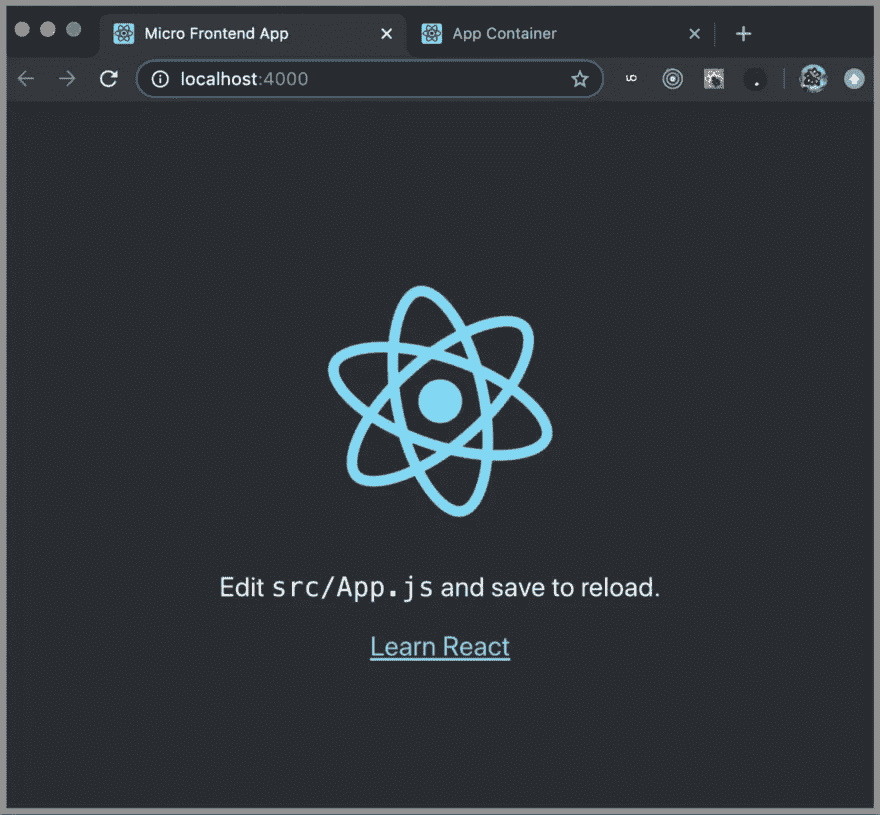
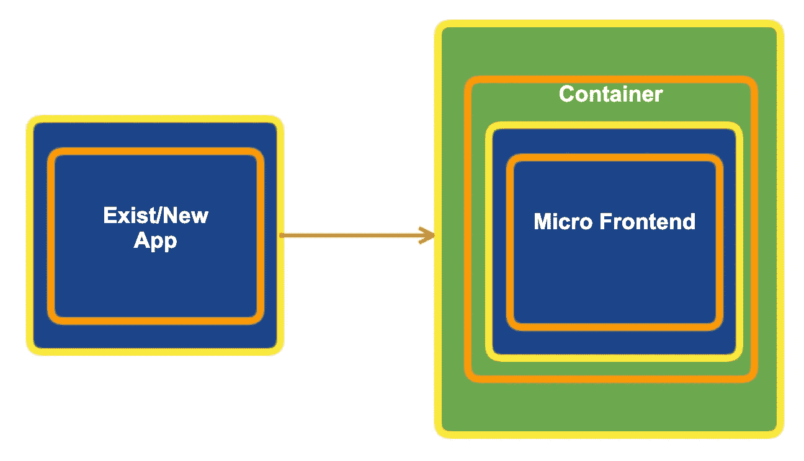
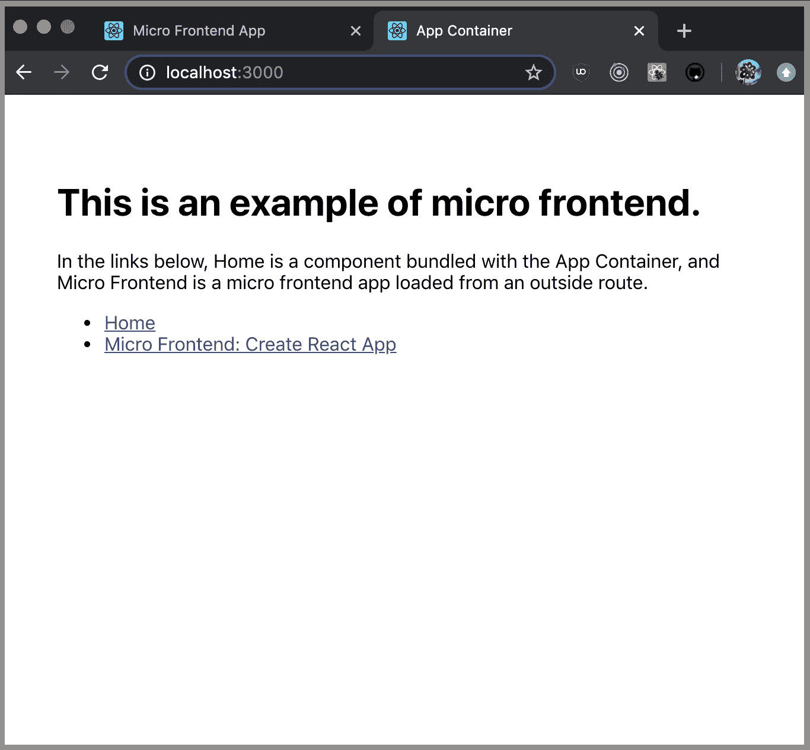
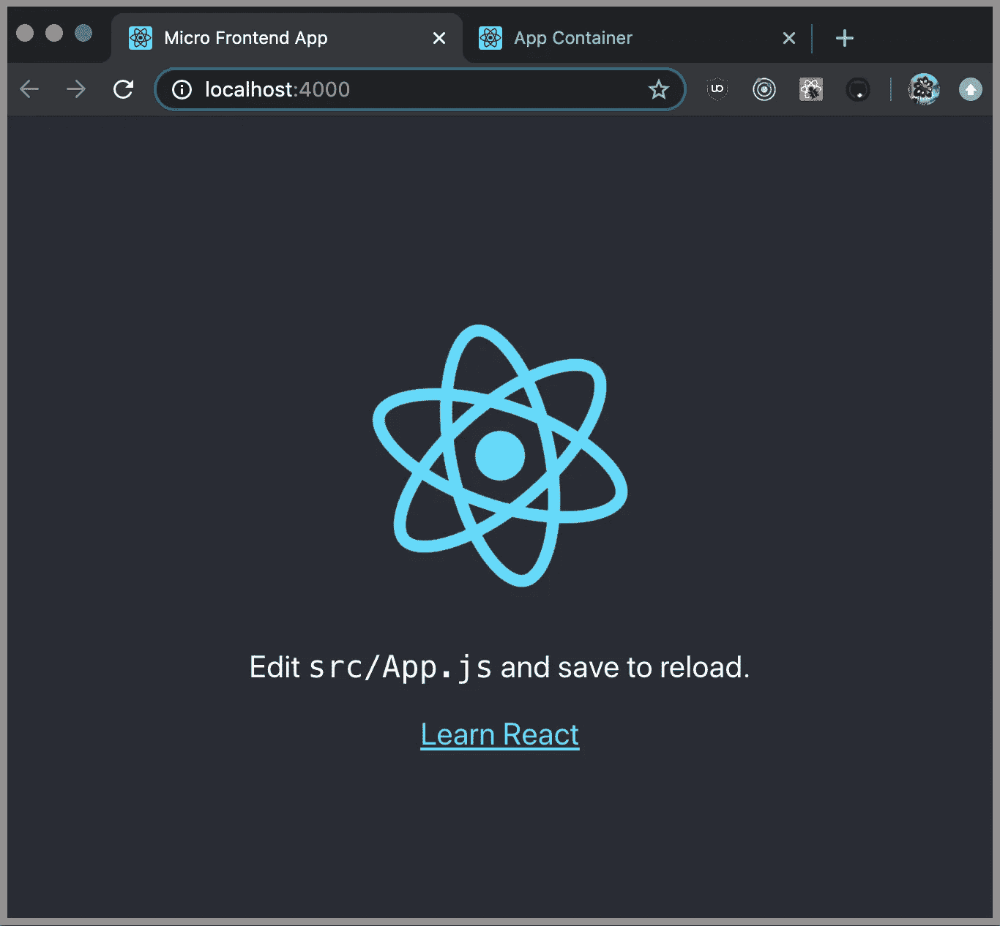
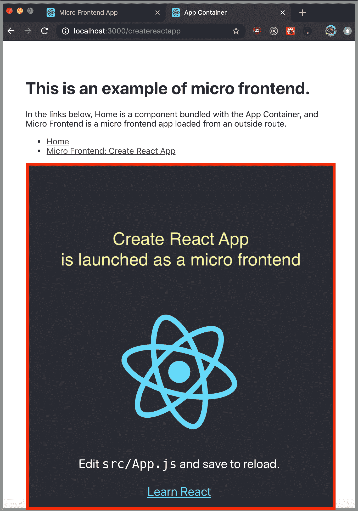

# 将随机 React 应用程序转变为微前端容器的 3 个步骤

> 原文：<https://betterprogramming.pub/3-steps-to-turn-a-random-react-application-into-a-micro-frontend-container-a80e33b6a066>

## 开始使用微前端，这是一种运行多个应用程序的新方法，就像运行一个应用程序一样



在发布了“[将随机 React 应用程序转变为微前端的 5 个步骤](https://medium.com/@jenniferfubook/jennifer-fus-web-development-publications-1a887e4454af)之后，有人问我，“你的步骤简单易懂，易于遵循。但是我们如何将 [Cam Jackson](https://camjackson.net/) 的[演示](https://github.com/micro-frontends-demo)应用到我们的项目中呢？"

这个问题问得好。这引出了本系列的第二篇文章:“将随机 React 应用程序转变为微前端容器的 3 个步骤。”

什么是微前端方法？*微前端*这个术语在 2016 年 11 月 [ThoughtWorks 的技术雷达](https://www.thoughtworks.com/radar/techniques/micro-frontends)中首次出现。它将微服务的概念扩展到前端开发。由于这是一个新词，它被拼写为*微前端、微前端、微前端、*和*微前端。*

下图显示了它的工作原理。前端开发必须分离为一些现有的产品代码和一些新开发的应用程序。在捆绑阶段或运行时，这些应用程序被加载到微前端容器中。容器运行它，就好像微前端是它自己的组件，并向用户提供无缝的工作流。



# 应用程序容器

我们选择的随机 React 应用程序是 [Create React App](https://github.com/facebook/create-react-app) 。我们将其命名为`App Container`，并修改了代码，使其具有以下路线:

*   `http://localhost:3000`:默认路由有两种选择——`Home`和`Micro Frontend`
*   `http://localhost:3000/home`:`Home`路线显示了一个普通组件，它是`App Container`的一部分
*   `http://localhost:3000/createreactapp`:`Micro Frontend`路线显示微前端应用



# 微前端应用

微前端 app 也是由 Create React App 衍生而来。我们将其命名为`Micro Frontend App`，并遵循我们的五个步骤，使其成为一个微前端应用程序。它运行在`http://localhost:4000`上。



# 1.将文件“MicroFrontend.js”复制到“src”目录中

卡姆·杰克逊的核心作品是`[MicroFrontend.js](https://github.com/micro-frontends-demo/container/blob/master/src/MicroFrontend.js)`。

它从正在运行的应用程序中获取一个清单文件[并通过一个脚本标签启动该应用程序。](https://github.com/facebook/create-react-app/issues/6436)

我们将 Cam Jackson 的`MicroFrontend.js`复制到我们的`src`目录中，并在第 19 行做了小小的修改。

# 2.配置您的`.env`文件，为每个微前端应用程序设置一个主机

在`.env`文件中，我们需要为每个微前端应用程序设置一个主机。对于我们的微前端 app，Create React App，我们将端口设置为`4000`。它必须与运行 Create React App 的真实端口相匹配。

```
REACT_APP_CREATEREACTAPP_HOST=http://localhost:4000
```

# 3.对于每个微前端应用程序，创建一个微前端组件，并使用路由来调用它

下面是微前端容器的修改后的`src` / `App.js`。

第 7-13 行生成一个微前端组件`CreateReactApp`。

app 容器如何启动这个微前端应用？容器通过路由的组件启动它(见第 64 行)。

什么是[路线的组成部分](https://knowbody.github.io/react-router-docs/api/RouteComponents.html)？它是一个组件，当该路径与 URL 匹配时就会呈现出来。路由器会在渲染时给这类组件注入道具，包括`history`、`location`、`params`、`route`、`routeParams`。

为什么我们调用微前端作为路由的组件？这是因为微前端需要一个路由组件可用的道具，比如`history`。

有了这个，我们创建了一个可以启动微前端的 app 容器。在下面的截图中，Create React App 作为微前端启动，用红框标出。



# 代码库

这个例子有两个代码库:

*   **app 容器:**三步转换后的应用容器位于[这里](https://github.com/JenniferFuBook/app-container)。

```
git clone https://github.com/JenniferFuBook/app-container.git
npm i
npm start
```

*   **微前端 app:** 五步转换的微前端应用位于[这里](https://github.com/JenniferFuBook/micro-frontend)。

```
git clone https://github.com/JenniferFuBook/micro-frontend.git
npm i
npm start
```

## 发射命令

我们到每个存储库去`npm start`应用容器和微前端应用。应用程序容器只有在所有微前端应用程序启动并运行后才能正常工作。

有一种更好的方法来以特定的顺序启动多个应用程序。利用`[concurrently](http://micro front-end)`命令在一个命令中启动整个应用程序。假设这两个库在您的`home`目录中。在 Bash 配置文件中设置以下别名:

```
alias runBoth='cd ~/app-container; concurrently "npm start --prefix ~/micro-frontend" "npm start"'
```

`runBoth`将同时启动 app 容器和微前端 app。这样，我们可以运行多个应用程序，但感觉就像只有一个应用程序。

这不是很好吗？

# 结论

我们用一个应用程序容器和一个微前端应用程序构建了一个示例。为微前端世界的进一步探索提供了基础。

这项工作的一部分是由乔纳森马贡献。

感谢阅读。我希望这有所帮助。

这是一个关于微前端的系列。以下是其他文章的列表:

*   "[将随机 React 应用转变为微前端的 5 个步骤](https://medium.com/better-programming/5-steps-to-turn-a-random-react-application-into-a-micro-frontend-946718c147e7)"
*   "[打造自己的微前端生态系统](https://medium.com/better-programming/build-your-own-micro-frontend-ecosystem-a05128c74f99)"
*   "[您不必失去对微前端的优化](https://medium.com/better-programming/you-dont-have-to-lose-optimization-for-micro-frontends-60a63d5f94fe)"
*   "[微前端方法的 10 个决策点](https://medium.com/better-programming/10-decision-points-for-micro-frontends-approach-4ebb4b59f40)"
*   "[创建多版本 React 应用程序的 6 个步骤](https://medium.com/better-programming/6-steps-to-create-a-multi-version-react-application-1c3e5b5df7e9)"
*   "[使用 Webpack 5 模块联盟的微前端](https://medium.com/better-programming/micro-frontends-using-webpack-5-module-federation-3b97ffb22a0d)"