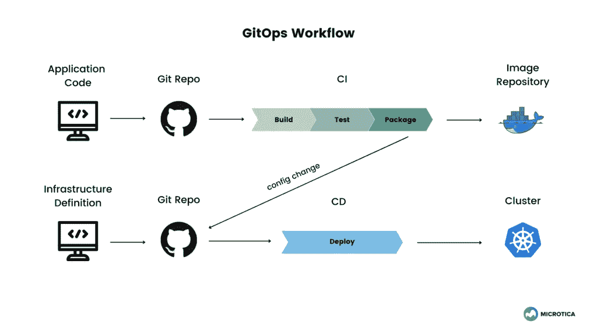

# 成功实施 GitOps 需要知道的 3 个步骤

> 原文：<https://betterprogramming.pub/3-steps-you-need-to-know-for-a-successful-gitops-implementation-5b4a4b9f744d>

## #3 —独立的构建和部署流程(CI 和 CD)

克里斯汀·休姆在 [Unsplash](https://unsplash.com?utm_source=medium&utm_medium=referral) 上拍摄的照片

GitOps 是一个能够在开发和操作流程之间实现流线化的模型。它通过一个包含配置文件和应用程序代码的协作中心 Git 将它们结合在一起。

[GitOps](https://microtica.com/blog/gitops-devops-for-infrastructure-automation/?utm_source=medium&utm_medium=referral_link&utm_campaign=gitops&utm_content=gitops_model) 服务于开发基于容器化和微服务的云原生解决方案的组织。它增强了开发人员的体验，使他们无需了解底层基础设施就能贡献特性。同时通过代码审查和批准来控制操作。

GitOps 提高了系统的稳定性和可靠性，提供了更高的安全保障。但是在您的公司中实现 GitOps 模型带来的最突出的优势可能是整个工作流程的标准化和一致性。

在本文中，我们将介绍开发一个成功的 GitOps 模型需要考虑的问题:

# 一切都是代码

首先将基础设施声明为代码。CloudFormation、Terraform、Palumi、Crossplane 是一些可能的声明性语言，您可以使用它们来定义您希望基础设施看起来如何的配置。

声明性代码提高了可读性和可维护性。此外，作为应用程序代码生命周期一部分的实践现在也可以复制到基础设施代码中。

在 GitOps 中，使用 Git 存储库进行 IaC 开发是常见的做法。这样，您可以探索版本控制、协作和审计等好处。

有了 Docker 和 Kubernetes 这样的技术，开发环境的设置变得更加易于管理。您将系统依赖项定义为代码。在 Docker 文件中，您定义您的环境、版本、配置和依赖项，Docker 在运行时强制执行这些定义。

GitOps 不仅限于作为代码的基础设施。任何可以定义为代码的东西也可以使用 GitOps 模型。这包括安全性、策略、合规性以及基础架构之外的所有运营。

# 审查过程

在处理应用程序代码时，通常会有多个需要同时实现的特性。因此，利用版本控制系统是当今软件开发的必备条件，因为不同的团队在同一个代码库上合作，并且需要有合并所有这些变更的机制。

如果您已经通过处理功能分支和拉请求利用了 [Git flow system](https://danielkummer.github.io/git-flow-cheatsheet/) ，那么您就不需要为您的 GitOps 工作流投资太多新的流程。此外，由于您的基础设施(和其他操作)被定义为代码，您将能够实现相同的代码审查实践。

一个合适的 Git 流程包括从主分支分叉或者创建一个新的特性分支。当有人对代码进行更改时，他们会发出一个 pull 请求，该请求应该由没有处理过该代码的其他团队成员进行审查。他们审查代码，验证代码，然后批准代码。一旦被批准，代码就可以被合并到主分支中，并交付给测试或生产。

这样，您可以跟踪谁做了哪些更改，并确保环境拥有正确的代码版本。

基础设施也是如此。在一个基础设施模型中，通常，主分支代表一个环境，比如开发、测试、阶段、生产，以及在该环境中运行的状态。通过拉式请求，开发人员可以与运营部门协作进行同行审查，安全和合规性专家也可以参与这一阶段，以正确验证环境的状态。

作者图片

# 独立的构建和部署流程(CI 和 CD)

在 DevOps 实践中，CI/CD 流程被视为一个实体，通常在一个管道中交付。但是随着组件化应用程序的兴起，开发和操作之间的管道变得更加复杂。

CI(持续集成)过程负责将应用程序代码构建并打包到容器映像中。

CD(持续部署)过程是实施 GitOps 的关键部分。这个过程执行自动化，使最终状态符合系统的期望状态，这在存储库代码中有描述。这是在成功合并主分支中的代码后完成的。

最终， [GitOps 将 CI 和 CD 视为两个独立的流程](https://www.weave.works/blog/separating-ci-from-cd-with-gitops-and-other-insights-from-kubecon-eu)。CI 是一个开发过程，CD 是一个操作过程。GitOps 工作流模型将两者结合在一起。

通常用于分隔这些流程的 GitOps 方法是引入另一个 Git 存储库作为中介。这个 repo 包含关于环境的信息，并且随着每个提交，部署过程被触发。这样，CI 流程永远不会触及底层基础设施，比如 Kubernetes 集群。

将构建管道从部署管道中分离出来是对错误配置的有力保护，有助于实现更高的安全性和合规性。

# 结论

GitOps 作为一个运营模型使用了许多团队都知道的 DevOps 实践，例如 IaC、版本控制、代码审查和 CI/CD 管道。

使用 GitOps，您可以自动化基础设施供应流程，并将 Git 用作基础设施的单一来源。这就是为什么要创建一个成功的 GitOps 模型，您需要一个环境的声明性定义。

如果您的团队中也有一个拉请求工作流，那将是最好的。为了能够在基础结构代码上协作并创建操作变更，您应该打开一个 pull 请求。然后，高级 DevOps 工程师和安全专家审查 pull 请求，以验证更改，如果一切正常，就合并到主分支中。

最后，对于完整的 GitOps 实施，您需要 CI/CD 自动化来调配和配置底层环境以及部署定义的代码。

GitOps 有助于改善开发人员和运营团队之间的协作，提高他们的生产力，并增加部署频率。有了这些改进，团队可以更快更安全地发布，以保持他们在市场中的地位。

*最初发表于*【https://microtica.com】