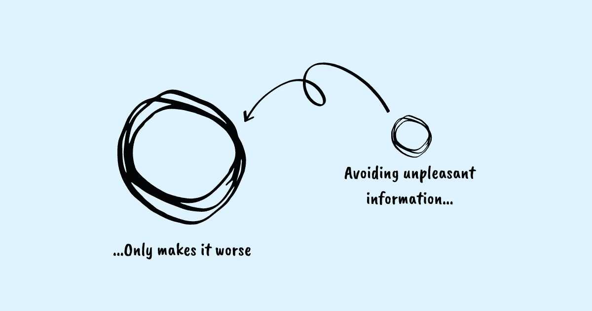

# 克服鸵鸟效应并在工作中做出更好决策的 3 个策略

> 原文：<https://betterprogramming.pub/3-strategies-to-overcome-the-ostrich-effect-and-make-better-decisions-at-work-435d0d16ce56>

## 你在回避不愉快的信息吗？

鸣谢:作者

鸵鸟感觉到危险时会把头埋进沙子里，认为只要它们避开危险足够长的时间，危险就会过去。我们人类没有什么不同。当处理不愉快的信息，或以我们不想被挑战的方式挑战我们的信息时，我们假装这些信息不存在。我们像鸵鸟一样把头埋在沙子里。

难道我们不都是因为害怕谈话或担心结果而避免工作中的冲突吗？当你知道老板可能会说你坏话时，忽略他。推迟安排与客户的通话，因为客户对你延长交货时间表很生气。在寻找可以证明你的决定的信息时，忽略那些显示你的宠物项目在工作的数据是一场灾难。当你知道自己落后了，并对错过即将到来的截止日期感到焦虑时，拒绝衡量自己的工作进度。

有些人甚至避免负面信息来保护他们的自尊。他们不希望不愉快的信息破坏他们为自己创造的形象。

不愉快的信息给大脑制造了一个悖论。这是我们的理性思维和感性思维之间的冲突，前者知道某件事很重要，而后者试图避免，因为我们预期做这件事会很痛苦。我们理性认识到重要的东西和情感上痛苦的东西之间的冲突使我们把目光从可能有用的信息上移开。

卡内基梅隆大学的行为经济学家乔治·洛温斯坦创造了“鸵鸟效应”一词来描述这一现象。这是一种认知偏差，使人们避免负面信息，包括任何可以帮助他们了解自己在实现[目标](https://www.techtello.com/goal-setting/)方面进展如何的反馈，尤其是当信息被认为是令人不快、不受欢迎或引起强烈的负面情绪反应时。

不管你选择如何回应不良信息——完全避开它，不给予它应有的关注而忽略它，通过拒绝某些观点而得出有偏见的解释，或者试图从你的记忆中抹去它以试图忘记它——它们都源于你避免不舒服的需要。

心理学家和经济学家丹尼尔·卡内曼因其在判断和决策心理学以及行为经济学方面的研究而闻名，并因此获得了 2002 年诺贝尔经济学奖。他在《思考，快与慢》一书中写道

> “我们在生活中面临的许多选择是混合的:有损失的风险和获得的机会，我们必须决定是接受还是拒绝这场赌博……对大多数人来说，对损失 100 美元的恐惧比对获得 150 美元的希望更强烈。”

他的研究得出了这样的结论:损失大于收益，人们厌恶损失。

正是这种对损失的厌恶使我们容易产生鸵鸟效应，从而避免任何不愉快的信息。

# 鸵鸟效应对你有什么影响？

拖延一些重要的事情需要付出巨大的代价。你可能低估了为避免及时处理而必须付出的代价。你也可能低估了现在处理它的好处。

你将面临更严重的后果。当一个简单的问题被忽视足够长的时间时，它会变成一个复杂得多的情况，这使得它变得更加糟糕，并且以后很难处理。增加的压力和焦虑会影响你的健康、心理健康和整体生活质量。

这是一个恶性循环，先是不舒服，接着是回避，接着是更多的不舒服。

在关键情况下，如果不观察你的行为和思维，鸵鸟效应可能会影响你的思维，让你对不良信息做出不利的反应。

我们都是妨碍有效决策的认知偏见的牺牲品。改变的唯一方法就是想要改变。

回避不舒服的信息不会让你变笨；它只是证明你是人类。作为一个人，你有能力改变。这意味着你可以采取措施拥抱不适，尤其是当风险很高的时候。

> “在生活和商业中，盲点最少的人就赢了。消除盲点意味着我们看到现实，与现实互动，并更接近理解现实。我们想得更好。更好地思考就是找到简单的过程，帮助我们从多个维度和角度解决问题，让我们更好地选择适合我们的解决方案。为正确的问题找到正确的解决方案的技能是智慧的一种形式。”— *谢恩·帕里什，“伟大的心智模型:一般思维概念”*

# 1.小步前进

作为人类，我们已经有了巨大的进化。但是我们的大脑仍然不能区分感知的威胁和真实的威胁。

想到做一些有潜在坏结果的事情会引发恐惧反应。我们的身体保持高度警惕，试图对抗这一决定，作为一种自然保护机制，让我们远离危险。对危险的感知越高，对抗危险的情绪反应就越强烈。

进化塑造了我们保护自己免受环境威胁的能力，这种反应几乎是无意识的自动反应。我们感觉到身体内部的压力越来越大——呼吸加快、心跳加快、手心出汗、脖子和下巴收紧。我们在这里的安全没有受到威胁，尽管感觉确实如此。这是我们大脑中的杏仁核引发的战斗或逃跑反应的结果——或者正如丹尼尔·戈尔曼在《情商:为什么它比智商更重要》中所说，感知到的威胁导致“杏仁核劫持”

这种“战或逃”的反应对我们在其他情况下的生存至关重要，当真的有危险时——逃离燃烧的建筑物，或者当高速公路上一辆疾驰的汽车驶入我们的车道。然而，当在如此关键的时刻被唤起时，它会抑制我们做出正确决定的能力。

如果你关闭了大脑抵制和害怕不良信息的警报系统会怎样？迈出一小步就能做到。我们的大脑并不认为一小步是一种威胁。

当寻找潜在的令人不快的信息时，试着朝它迈一小步。例如，如果您需要审阅一份设计提案，但担心其他人可能不喜欢它，请这样做:

第一个小步骤:离线发送一个提议草案给评审小组，请求他们的反馈。

第二个小步骤:回顾他们的评论并采纳他们的反馈。

第三个小步骤:如果你需要澄清或有具体问题，安排与几个关键成员的 1-1 会议。

第四个小步骤:将更新后的草稿再次发送给整个评审团队。

第五个小步骤:安排一个[会议](https://www.techtello.com/too-many-meetings-at-work/)来审核最终提案。通过整合早期反馈，你将更少担心收到负面反馈，可以专注于做最后的修改，让你的设计被接受。

通过朝着工作目标迈出一小步，你可以克服鸵鸟效应，取得有意义的进步。

# 2.提出有力的问题

伟大的问题能够解开关键信息，帮助你做出更好的决定。

> “如果你担心你可能会问自己的问题没有答案，请记住，创新型问题解决者的一个特征是，他们愿意在不知道答案可能是什么的情况下提出问题。能够处理复杂和困难问题的一部分是接受不知道没有错。善于质疑的人对不确定性感到舒服。”— *沃伦·伯杰，一个更漂亮的问题*

我们一天要做成千上万个大大小小的决定。现实地说，优化所有这些[决策](https://www.techtello.com/avoid-making-bad-decisions/)是不可行的。但是，如果我们能够学会优化至少几个关键问题，这将会增加很多价值。

通过问这些问题，你可以将你的思维从回避信息转移到积极地寻求信息:

*   我有做这个决定所需的所有信息吗？
*   我需要收集哪些额外信息来帮助我做出更好的决策？
*   我是否有可能因为害怕某些数据与我的信念和期望相矛盾而回避这些数据？我怎样才能确保自己在[中不偏不倚，选择性地选择与我的信念相符的数据](https://www.techtello.com/confirmation-bias/)，拒绝任何与之相悖的东西？
*   什么会导致我回避某些信息？
*   如果我在没有充分信息的情况下采取行动，我会面临什么风险？
*   延迟可能对决策有用的信息的代价是什么？

# 3.拥抱不适

许多人避免不适，做出安全的选择，以避免因选择不舒适的道路而带来的痛苦。

然而，他们没有意识到他们的成长已经超出了他们的舒适区一步。不舒服的时刻表明你正在拓展你的技能，你正在做一些有价值的工作。如果你没有奋斗，你就没有真正的学习和成长。

学会接受不适成为克服你的偏见和寻找信息的重要一步，这些信息一开始可能会令人不快，但最终有可能为你省去很多痛苦。

让自己接受这个想法的一些伟大策略:

*   设定要求你走出舒适区的目标，并监控这些目标的常规进展。设置自动提醒或在日历上安排这样的活动。
*   让你身边的人让你对你倾向于回避的事情负责。
*   写下你因回避信息而面临的问题，并不时地参考它们，作为及时处理这种情况的重要性的有用提醒。

通过锻炼肌肉，让不舒服的时刻带给你快乐而不是痛苦，你可以摆脱那些限制你和周围人成长的行为。

回避信息或积极寻找信息并不总是一个简单的决定。当你有疑问时，记住最后一点:当额外的信息只会导致分析瘫痪，并不能真正帮助你做出正确的决定时，回避这些信息是一个完全合理的策略。然而，仅仅因为它让你不舒服而回避它，必然会导致以后做出一些可怕的决定。

# 摘要

*   鸵鸟感觉到危险时会把头埋进沙子里。这种被称为鸵鸟效应的认知偏差也影响着人类。
*   我们倾向于避免不愉快、不受欢迎或引起强烈负面情绪反应的信息。
*   回避信息、拖延决策或推迟不愉快的情况会导致更糟糕的后果。
*   为了克服这种偏见，一个很好的策略是采取小步骤，关闭你大脑抵制和害怕不愉快信息的警报系统。
*   另一个策略是问一些问题，这些问题可以打开你的思维，让你寻找可以帮助你做出更好决定的信息，即使一开始会感到不舒服。
*   最后，锻炼肌肉去拥抱不适将会对你的目标取得进展以及根据这些目标塑造你的未来大有帮助。一旦你习惯了消极的一面，你就不会主动回避它。

在 Twitter 上关注我，了解更多故事。

*这个故事最初发表于*[*【https://www.techtello.com】*](https://www.techtello.com/ostrich-effect/)*。*