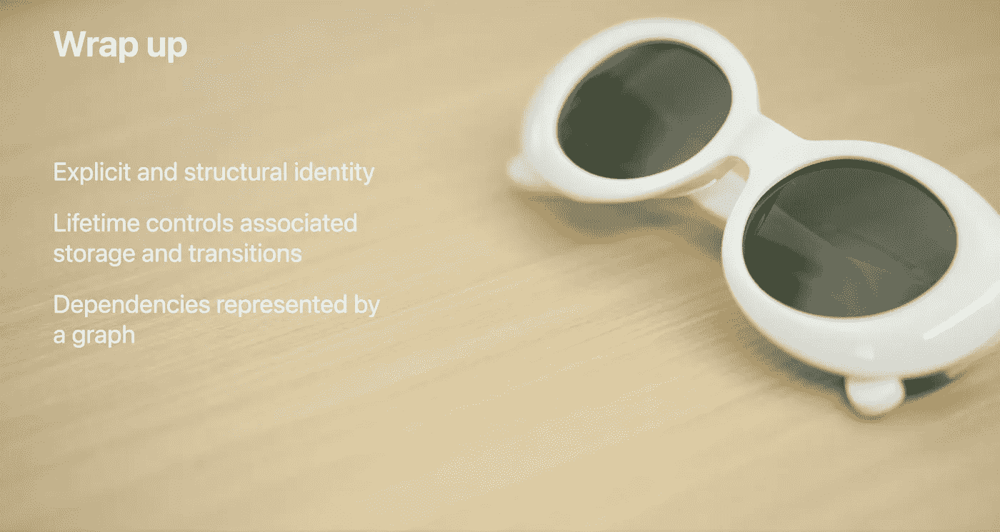

# 从 WWDC 21 的揭秘 SwiftUI 对话中获得的 3 点启示

> 原文：<https://betterprogramming.pub/3-takeaways-from-wwdc-21s-demystifying-swiftui-talk-967bb9ab1f17>

## 避免错误和提高性能的提示和技巧

来自 [WWDC 第 21 届会议的截屏](https://developer.apple.com/videos/play/wwdc2021/10022/)

去年夏天，我[写了一篇文章](https://marklucking.medium.com/the-best-apple-wwdc-talk-ever-16d613815f86)，讲述了我认为是近年来最好的 WWDC 会谈之一。一个演讲，虽然没有说太多，但我觉得它说明了编码和软件工程之间的区别——因为我相信你知道——它们不是一回事。

现在，我认为这个展示[揭开 SwiftUI 3.0](https://developer.apple.com/videos/play/wwdc2021/10022/) 的神秘面纱属于同一个阵营。不像许多 WWDC 演讲，告诉你什么是新的，并给你使用新功能的提示，这个演示集中在野兽的“内脏”，野兽是，在这种情况下，SwiftUI。

用演示者的话说，“SwiftUI 是一个声明式 UI 框架，你描述你想要什么，它决定如何去做。这种解决方案通常很有效，但并不总是如此”。

理解 SwiftUI 在查看您的代码时看到了什么，这是编码和软件工程之间的区别。这就是让 SwiftUI 按照你想要的方式做事和只是完成它们之间的区别。

# 身份、生存期和依赖关系

身份是 SwiftUI 在您的 UI 中将元素识别为相同或不同的方式。生存期是 SwiftUI 如何随着时间的推移跟踪视图和数据，依赖于 SwiftUI 如何理解您的界面何时需要更新以及为什么需要更新。

> 下面显示的代码示例与讲座中的不同——非常欢迎您查看这两个示例来理解所涉及的主题。

现在，身份在大计划中是至关重要的，因为 SwiftUI 使用它来计算如何从一种状态到另一种状态的动画。你需要问自己的问题是:“你所看到的景色是相同的还是不同的？”。这个问题的答案决定了 SwiftUI 需要如何在视图之间进行转换。

如果两个视图包含相同的元素，则它们共享相同的身份，即使它们的排列方式不同——然而，如果它们包含不同的元素，那么它们显然是不同的视图。

就像动画语句一样，视图和数据有两种类型的标识，显式的和结构化的。“结构性”这个词在这里是隐式的另一种说法——你分配的显式身份，系统分配的隐式或结构性身份。

演讲[11:28]的第一个要点是:

> **尽量减少应用程序中的身份数量。**

这样做，SwiftUI 可以更有效地转换所述视图**。讲座中有一个代码示例，下面是我的版本，让您了解讨论的要点。**

然后，演讲描述了如何找出他们称之为结构视图身份的克星的东西:标签[15:40]。

这让我们想到了本次演讲的第二个要点:

> 如果可以通过编码绕过 AnyView 指令，就不要使用它。

更好的是，他们解释了如何做到这一点，用一个非常好的十行代码示例将视图更改为包装在`@ViewBuilder`指令中的函数。这里有一个代码示例来说明我所说的内容:

然后，我们转到讨论视图标识的生存期及其相关状态。本次讨论的关键要点[23:06]是:

> 状态信息的生命周期与视图有着内在的联系。

所以当一个视图被创建时，`@State`和`@StateObjects`也被创建。当视图随后消失时，所述对象将随之毁灭。

这里有一个 iOS 15 的例子来说明这一点。运行这段代码，它不会倒计数，因为每次循环时`@State`都会被销毁；去掉`@State`这个词就可以了。

然后我们跳回身份，下一个要点[25:06]强调所谓稳定身份的重要性。

除非标识所引用的数据改变，否则标识不应改变。它对事物的大计划如此重要，以至于 SwiftUI 有一个协议来描述它，即`Identifiable`。这一点至关重要，因为它会影响应用的性能&正确性。选择一个稳定的身份有助于 SwiftUI 管理您的视图的生命周期，并确实正确地管理过渡/动画。

SwiftUI 鼓励您在这个问题上正确编码，将正确的编码风格融入语法中，尽管当然仍有可能出错。

本质上，如果您决定分配显式标识，请确保在这样做时，当它们链接到的数据或视图发生更改时，它们不会重新生成或重新分配，除非数据本身发生了更改。

然后我们看一下依赖性，在[28.56]分钟有一个简单的定义，在[32.15]分钟有一个完整的列表。演示者再次告诉我们，标识符的稳定性对视图的生命周期至关重要，有时还会影响应用程序的性能或正确性。他从[33:00]开始给出了一个很棒的代码示例。

本节的关键要点是:

> 为你的视图选择一个唯一稳定的身份很重要。

像以前一样，讲座最后更多地讨论了结构标识以及在 SwiftUI 代码中非常小心分支的必要性。

不同的分支意味着不同的身份，你应该在你的代码中尽可能的避免分支。

这让我们回到第一个代码示例。这就是这篇文章的结尾。感谢阅读。