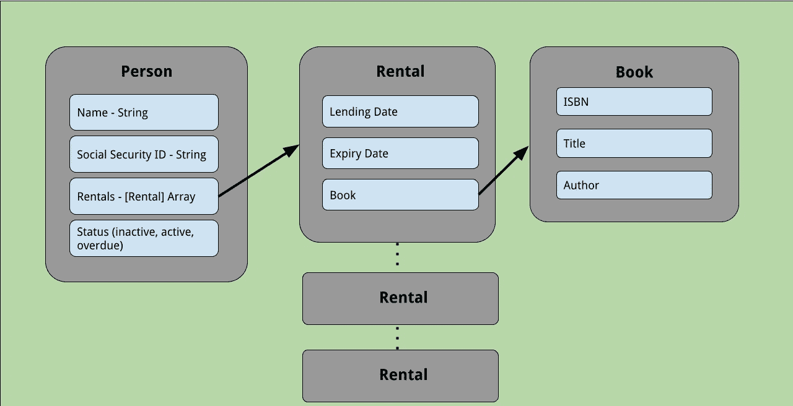

# 无需花费额外时间就能成为强大的程序员的 3 个技巧

> 原文：<https://betterprogramming.pub/3-techniques-to-become-a-powerful-coder-without-spending-extra-time-306ecc404202>

## 利用你大脑 CPU 的空闲时间

由[内容小精灵](https://unsplash.com/@contentpixie?utm_source=medium&utm_medium=referral)在 [Unsplash](https://unsplash.com?utm_source=medium&utm_medium=referral) 上拍照。

成为一个强大的程序员需要时间。然而，没有人愿意付钱给一个在工作中学习并且交付很少的程序员。

此外，如果事先没有成为一名强大的程序员，你将不会得到一份有价值的工作，这是众所周知的工作与经验的第 22 条军规。

每个人一天有 24 小时。在不影响神经、眼睛和脊椎的情况下，分配更多编程时间的唯一方法是将其融入到您的日常习惯中。

想想你在电脑前和电脑后的编程。这是最大限度减少你在电脑前时间的最好方法。

不过，要明智地避免打断你的社交生活。

# 这是什么逻辑？

大脑以两种模式工作:信息捕捉模式和被动分析模式。

当你积极练习的时候，它会捕捉到很多信息。然而，在这个过程中，分析是非常肤浅的。只有在你捕捉到同样的信息后的空闲时间里，你才能获得真正的洞察力。

这就是为什么许多科学发明发生在空闲时间或梦境中。阿基米德的浴缸实验和牛顿的苹果落地就是最著名的例子。

没有突破性的发现是一夜之间发生的。每个问题之后都有批判性思维。

你在每一个问题上花费的空闲时间越多，你用最少的努力解决它(以及其他同类问题和依赖它的问题)的机会就越大。如果您选择将这个数乘以问题的数量，您的解决方案数据库将呈指数增长。但即使你没有，你的机会也比你的同龄人高得多。

我之前写过[持续一周的 16 小时开发人员训练](https://levelup.gitconnected.com/the-16-hour-developer-workout-6a9e10afa8c2)。

以下是你必须每天思考的三个问题，让你在不增加额外时间的情况下成为一名更好的程序员。

# 1.迭代模式

`for`循环和`while`循环是每个程序员遇到最多的事情。

你必须每天想它们，带着你选择的问题，同时做一些不需要你大脑容量的事情。

最好是在做粗活的时候进行(比如收集已经玩过的游戏中的乐高/拼字游戏/国际象棋棋子，把东西放进垃圾桶，拖箱子搬家)。

这是因为这些任务的重复性会让你更加努力地思考你试图解决的问题。

不要停留在项目的简单迭代上。根据需要排列:排序项目，重复，模式-可能性是无穷无尽的。

诀窍是从最简单的开始，然后在上面堆积其他挑战。

## 利益

这个问题最神奇的地方在于，当你执行那些无聊、重复的任务时，你会用已知的解决方案发明新的问题。这些问题将引导你找到你已经知道的解决方案的更优化的版本。

这是解决白板/代码面试中最大的一组编码问题的起点。如果你是一个普通的 LeetCode 或 HackerRank 程序员，你可以利用你的空闲时间来提高你的实践。

当把相似的问题或依赖于其他熟悉问题的问题组合在一起时，大脑工作得最好。利用这一点。

# 2.生产者-消费者问题

你可以在通勤的时候思考这个问题。这个例子适用于火车/公共汽车旅行，所以如果你的旅行方式不同，请调整。如果你正在开车，不要尝试这个。

最重要的是，没有什么能阻止你想象这个问题。快走或跑步也可以。

设想一个程序更新 A、B 和 c 站的乘客人数。

*   在每个站上更新数字，并在递减和递增操作后显示。
*   或者，也显示一些相关的其他数据(即停车时列车车厢内的温度)。制作一个随机数据源。你不需要恒温器来让它发生。
*   说到温度，显示从 a 站到 b 站这段时间的平均温度(每次更新间隔 10 秒)怎么样？

在 b 站之后，必须显示从 A 到 B 的平均值。之后，应该丢弃所有过去的温度值，并且必须从站 B 到站 C 取一个新的平均值，等等。

## 利益

生产者-消费者问题迫使您考虑同步、线程管理和数据更新。白板上的每一次技术面试都不约而同地包含了这方面的一些变化。

不仅如此，它还是您必须经常遇到的软件开发中的实际问题。提前做好准备。

# 3.状态管理

状态突变是最简单的编码方式，但随着时间的推移却是最难维护的。

当您的代码开始在十个或更多的类中传播时，变异问题开始给您带来噩梦。

许多突变问题的根本原因是状态固有的不良定义。

你如何定义国家？你是经常这样做还是只在做真正的工作时才尝试？在实践环节中，你在制作物品时应用了坚实的原则吗？或者你只是在你的系统中放入一个类的大杂烩，满足当前的客户需求，而不考虑将来谁来照顾它们？

高级 LeetCode 和 HackerRank 程序员很少尝试解决甚至实践状态管理问题。优秀的程序员做出错误的选择是不能通过解雇他们来解决的。

糟糕的国家管理是一个严重的问题，每年都要耗费数十亿美元。

你在非工作时间是如何练习状态定义的？

登录和注销的用户界面是最常见的例子。

*   如果用户已注销，显示非个性化用户界面。
*   如果用户已登录，请使用有效的会话令牌来获取和显示个性化数据。

请继续思考如何在您的软件中管理上述内容——无论是 web 前端、应用程序还是依赖凭据的独立于 UI 的系统。

考虑状态管理的另一种方式是想象您在现实生活组织中的日常工作流。这是因为它们与您如何管理软件中的状态最密切相关。

想象一下你所在的图书馆系统:

鸣谢:作者绘画

一个人(图书馆成员)对象拥有多个租赁对象。

租赁对象是指单个图书对象、借出(租赁)日期和到期日期。

当出借人首先向图书馆注册时，他们的状态必须是不活动的。它必须更改为:

*   当他们没有书租的时候是不活跃的。
*   当图书被租借并且没有一本书超过到期日(当前日期≤到期日)时激活。
*   当任何图书超过到期日期(当前日期>到期日期)时，即为过期。

## 思考的问题(你也可以和你的同伴讨论)

*   你将如何编写代码来准备一个逾期租房者的名单？
*   如何用响应式 UI 优化这段代码(回到本文的前两节)？
*   你将如何以及在哪里放置改变`Person.status`的代码？
*   您多久运行一次这段代码？(第 2 条)
*   你能试着将同样的对象模型应用于所得税系统吗？你还需要什么字段？必须删除哪些内容？

## 利益

除了状态管理，它是任何软件架构的构建块，这个问题(和其他类似的问题)给你丰富的材料来描述你在技术面试中的设计经验。

我们刚刚试图解决的问题属于设计思维的大范畴。

设计思维的好处有很多。事先已经看到了类似的模式，您可以立即准备一个高度解耦和可测试的架构。节约成本和减轻压力的优势简直是额外的奖励。

通过面试？你想得太狭隘了，不是吗？

# 结论

作为一个程序员，你最大的财富就是你在每一个问题之后所花费的时间。

真正的挑战是寻找要解决的问题的正确种类和数量。

通过在日常工作中的空闲时间预先考虑它们，您可以最大限度地提高世界上利用率最低的 CPU 的性能。你的大脑。

如果你有其他类似的问题或有用的问题类别，请随意发表评论。