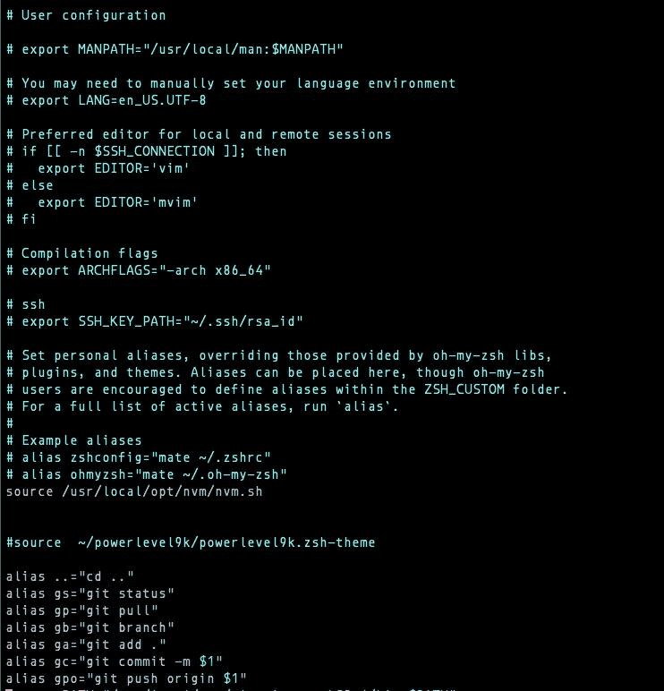
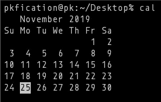

# 3 个终端命令来提高您的生产力

> 原文：<https://betterprogramming.pub/3-terminal-commands-to-increase-your-productivity-9dbab9f1a015>

## 别名、pbcopy、反向搜索和一些奖励


[胡安·戈麦斯](https://unsplash.com/@nosoylasonia?utm_source=medium&utm_medium=referral)在 [Unsplash](https://unsplash.com?utm_source=medium&utm_medium=referral) 上拍照

这里有一些重要的捷径，可以帮助我在一天的工作中更有效率:

*   为命令创建别名。
*   使用 pbcopy。
*   在终端中使用反向搜索。
*   额外的技巧和提示。

# 命令的别名

别名可以是我们手中最强大的工具之一，它为我们提供了书写自己捷径的力量。让我们用一个例子来看看我的意思。

```
alias dev="cd ~/Project/development"
```

每当我输入`dev`并按回车键，它就会运行这个命令。这在导航到不同的文件夹时变得非常有用。我们可以运行别名中的几乎所有命令。以下是我最常用的一些命令:

```
alias ..="cd .."
alias gs="git status"
alias gp="git pull"
alias gb="git branch"
alias ga="git add ."
```

所以，使用这些别名，我在一天中节省了大量的时间，来建立一个我键入的目录，而不是 cd…我认为其余的是不言自明的。我们也可以使用$1、$2 等参数。为了获得更多的可扩展性，如下例所示:

```
alias gc="git commit -m $1"
```

现在，我只需输入`gc “Commit message”`，它就会用提供的消息提交我的更改。你所要做的就是找到你最常用的命令，并尝试使用别名使它们更短，以使你自己更有效率。

现在我们知道了别名的功能，让我们看看如何设置它们。有两种方法可以实现这一点，第一种是临时的，可以通过运行命令来设置:

```
alias dev="cd ~/Project/development"
```

这将一直工作到会话关闭。另一种方法是永久设置这些别名。为此，我们需要在我们的 shell 中设置它，我使用 [Zsh](https://ohmyz.sh/) ，所以我将更新我的`~/.zshrc`文件。

如果您正在使用 [Bash](https://www.gnu.org/software/bash/) ，请使用`~/.bashrc`文件。将命令添加到文件中，您的文件应该如下所示:



。zshrc 文件

对该文件进行更改后，您需要运行命令:

```
source ~/.zshrc
```

然后，您的所有别名都可供您使用。

# pbcopy

这个命令在 Mac 上可用，如果你想在 Linux 发行版上使用它，你可以遵循这个[指南](https://www.ostechnix.com/how-to-use-pbcopy-and-pbpaste-commands-on-linux/)。

`pbcopy`是复制类固醇。您可以使用此命令将文件内容复制到剪贴板。我给你举个例子。假设您必须将您的 SSH 身份复制到剪贴板，您可以使用以下命令:

```
pbcopy < ~/.ssh/id_rsa.pub
```

您可以将其他密码保存在不同的文件中，并在登录时使用。

假设你正在使用和访问一个远程服务器，你必须提供密码，而不是打开文件，你可以直接`pbcopy`它到你的剪贴板，没有所有打开和关闭文件的麻烦，你将有密码。

当它与其他命令如`grep`一起使用时，它变得更加有用。它会将 grepped 结果复制到剪贴板。让我们看一个例子:

```
grep "<keyword>" | pbcopy
```

我在调试日志文件时使用这个命令，我提供一个要搜索的关键字，比如时间戳，所有的行都被复制到我的剪贴板上。

我可以将它粘贴到一个文件中，以查看所需的日志，而不是整个文件。如果您使用`tee`命令作为到`grep`的管道，它会将结果写到一个文件中，这会更加有用。

它具有以下语法:

```
grep "<keyword>" | tee myfile.txt
```

# 使用反向搜索

反向搜索是 Unix 系统中最酷的东西之一。

假设你忘记了完整的命令，你只记得一些部分，你能做的是你可以去反向搜索，键入你记得的单词。我们来看一个例子。

我不得不重新启动我的运行在 staging 环境中的服务器，我只记得 staging 关键字，忘记了其余的命令。所以，我输入`ctrl + r`进入反向搜索模式，然后输入:

```
(reverse-i-search)`**stag**': cd /home/ubuntu/server; pm2 stop app.js && export NODE_ENV="staging" && pm2 start app.js && pm2 logs
```

它会记住以前输入的命令，并找到您正在寻找的正确匹配。

# 奖励技巧和提示

## 小卡

它在终端上打印当前月份。它有许多不同的选项，可以使用`man cal`进行检查。



当前月份视图

## 使用 vim 加密文件

你可以使用 [vim](https://www.vim.org/) 加密一个文件，只需输入`:X`。它会要求您设置一个类似如下的密码:


加密文件

当您再次访问该文件时，它会要求您输入密码。


如果您想了解更多关于 vim 的信息，这里有一篇很棒的文章:

[](https://medium.com/better-programming/understanding-the-efficiency-of-vim-d6a5ab8feb2d) [## 了解 vim 的效率

### 为什么每个人都在谈论 vim？学习 vim 的基础知识，最终开始使用它

medium.com](https://medium.com/better-programming/understanding-the-efficiency-of-vim-d6a5ab8feb2d) 

如果您想了解更多有关终端快捷方式的信息，这里有一个很棒的链接:

[](https://medium.com/@swarnajyoti/top-5-tips-to-increase-productivity-in-terminal-31ee66611465) [## 提高码头生产率的五大技巧

### 如何使用快捷方式来提高你的生产力

medium.com](https://medium.com/@swarnajyoti/top-5-tips-to-increase-productivity-in-terminal-31ee66611465) 

# 结论

我们可以使用这些命令来使我们的一天更有成效，并保持对事物的掌控。