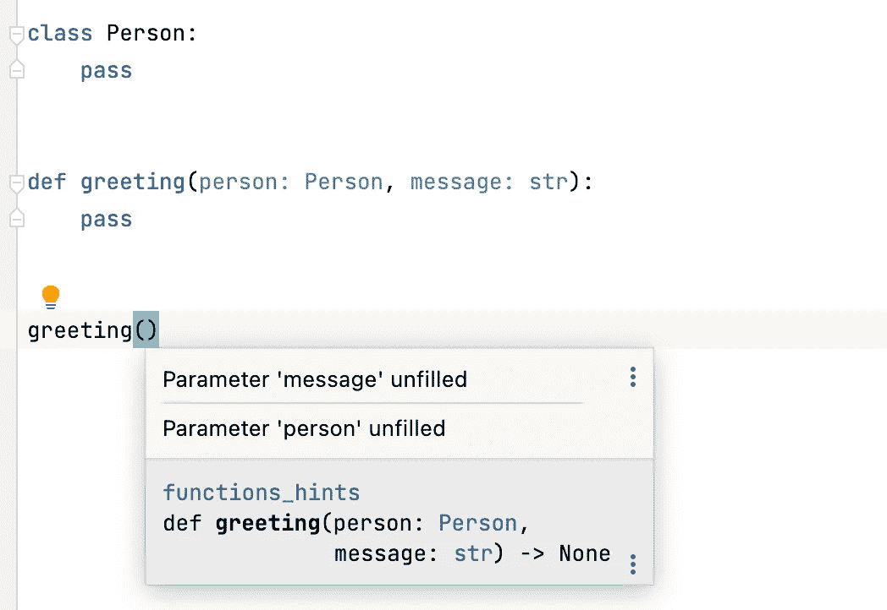

# 定义函数时要考虑的 3 件事

> 原文：<https://betterprogramming.pub/3-things-to-consider-when-you-define-functions-6a964dbe388f>

## 提升您的 Python 技能


照片由 [Asyrafunk RKTW](https://unsplash.com/es/@asyrafunk?utm_source=medium&utm_medium=referral) 在 [Unsplash](https://unsplash.com?utm_source=medium&utm_medium=referral) 上拍摄

任何应用的核心都是数据。如果你正在建立一个社交网站，用户和他们的友谊就是数据。如果你在开发一个游戏，图形和用户操作就是数据。如果你正在建立一个网上商店，产品和客户信息就是数据。这些只是我们日常生活中的几个例子。

如果这些数据是以原始形式呈现的，那么它们就没有多大意义。您必须定义特定的操作来处理数据，然后才能显示这些数据。这些特定的操作通常采用函数的形式，即接受输入、应用操作并生成输出的代码块。我认为函数是任何编程项目的潜在驱动力。

在本文中，我想总结三件事，作为一名 Python 程序员，在编写函数时可以考虑。

请注意，在定义函数时，我不会包括一些常见的最佳实践，比如合理的名称、专用目的(不是混合关注点)和正确的文档字符串。反而我的角度更多的是从技术角度出发。

事不宜迟，让我们开始吧。

# 使用默认参数

一个函数不需要任何输入是最理想的。当用户调用这个函数时，他们不需要担心设置任何参数。然而，在大多数情况下，函数确实需要特定的输入才能执行预期的操作。

当一个函数接受多个参数时，一种使函数调用更容易的技术是设置默认参数。这个特性在标准 Python 库中被广泛使用。比如下面是内置`sorted`函数的调用签名。

```
sorted(*iterable*, */*, ***, *key=None*, *reverse=False*)
```

在这个函数中，`key`和`reverse`参数有各自的默认值——`key`参数指定如何进行排序(`None`表示使用默认的字典顺序或数字顺序),`reverse`参数指定顺序是否是降序。大多数情况下，当我们调用这个函数时，不需要担心设置`key`和`reverse`。但是，当我们想要定义一个自定义排序操作时，可以设置`key`参数，如下所示:

```
>>> objects = [-1, -5, 3]
>>> sorted(objects, key=abs)
[-1, 3, -5]
```

我们可以考虑在定义自己的函数时设置默认参数。原则是，如果任何参数在大多数函数调用中没有变化，您应该用默认值设置这些参数。请注意，这些参数被放在没有默认值的其他参数之后，正如您在`sorted`函数中看到的那样。

# 使用类型提示

当我们使用一个新函数时，我们很可能不确定该函数所采用的参数的确切形式。考虑以下可以定义的功能头:

```
def greeting(person, message):
    pass
```

当你遇到这个函数时，如果你不看它的实现细节，你就不知道应该发送什么样的参数。你可以这样调用这个函数:

```
greeting("John Smith", "Hi")
```

也有可能有一个类`Person`，你应该用一个`Person`类的实例来调用这个函数，如下所示:

```
class Person:
    def __init__(self, first_name, last_name):
        self.first_name = first_name
        self.last_name = last_name person = Person("John Smith")
greeting(person, "Hi")
```

正如你所看到的，有时一个功能会让用户感到困惑。消除这种模糊性的一种方法是对函数应用类型提示。例如，如果这个函数接受一个字符串作为`person`参数，您可以这样做:

```
def greeting(person: str, message: str):
    pass
```

如果这个函数取了一个`Person`的实例，你也可以这样做:

```
class Person:
    passdef greeting(person: Person, message: str):
    pass
```

通过在函数定义中设置类型提示，用户可以享受到的一个好处是当他们在 IDE 中调用您的函数时得到有意义的提示，比如 PyCharm。下面提供了一个屏幕截图:



PyCharm 中有意义的提示(作者截图)

PyCharm 或 VSC 的任何代码分析插件使用类型提示来分析你的代码以提供提示。

另一件要知道的事情是，如果你的函数返回值，你可以提供返回值的类型提示，如下所示:

```
def greeting(person: Person, message: str) -> str:
    return f"{message}, {person.first_name}!"
```

返回的类型提示的格式是`-> type`，跟在函数头的括号后面。

# 使用*args 和**kwargs

我们的函数通常包含一定数量的参数。然而，有时您可能不知道用户会发送什么样的参数。以内置的`print`函数为例，它可以接受任意数量的对象。

```
message0 = "Hello"
message1 = "World"
ending_symbol = "!"

print(message0, message1, ending_symbol)# output: Hello World !
```

为什么我们可以用`print`函数来实现呢？让我们来看看呼叫签名:

```
print(**objects*, *sep=' '*, *end='\n'*, *file=sys.stdout*, *flush=False*)
```

我们之所以可以打印任意数量的对象，都在于`*objects`参数。请注意，参数名带有星号前缀，这意味着我们可以向函数发送可变数量的位置变量。如您所见，它提高了`print`功能的灵活性。我们可以在自己的函数中使用这个特性。

```
def stringify(*objects) -> list[str]:
    print(type(objects), objects)
    return [str(object) for object in objects]
```

在 stringify 函数中，我们允许用户发送数量可变的参数，并将每个参数转换为一个`str`对象。需要注意的一点是，当用户用多个位置参数调用这个函数时，这些参数形成了一个`tuple`对象。

在我们的例子中，`objects`是一个`tuple`对象，因此我们可以在一个`for`循环中使用它，并且我们可以通过使用几个参数调用这个函数来验证它:

```
>>> stringify(1, (2, 4), False, {2, 3, 5, 7})
<class 'tuple'> (1, (2, 4), False, {2, 3, 5, 7})
['1', '(2, 4)', 'False', '{2, 3, 5, 7}']
```

以类似的方式，我们可以定义可变数量的关键字参数。这种技术通常缩写为`**kwargs`——在参数名前使用两个星号。当你在函数中看到这一点时，这意味着它可以接受任意数量的关键字参数。

考虑下面的例子。我们想为一个学生的课程生成一张成绩单，我们可能会想到如下函数:

```
def create_report(name, **grades):
    print(f"Grade Report for {name}")    
    for course, grade in grades.items():
        print(f"{course}: {grade}")
```

因为学生可能会选择不同的课程，使用`**grades`提供了这样的灵活性。您可能也注意到了，`grades`参数是一个`dict`对象，您可以使用 items 来访问它的键值对，并在`for`循环中使用它们。一些来电显示如下:

```
>>> create_report("John", math=95, chemistry=100, physics=98)
# output the following lines:
Grade Report for John
math: 95
chemistry: 100
physics: 98>>> create_report("Zoe", biology=93, geography=97)
# output the following lines:
Grade Report for Zoe
biology: 93
geography: 97
```

当您调用这个函数时，您将参数作为关键字参数列出，Python 将这些参数打包成一个`dict`对象，在函数体中使用。

虽然`*args`和`**kwargs`为您的函数定义提供了灵活性，但是您必须证明您的用法，比如这里讨论的使用场景。也就是说，不要滥用这个特性，因为命名的、明确的参数是最直接的。

# 讨论

在本文中，我们回顾了在定义自定义函数时可以考虑的三种技术。当你在适当的场景中使用它们时，你会使你的函数更容易使用。

感谢阅读这篇文章。