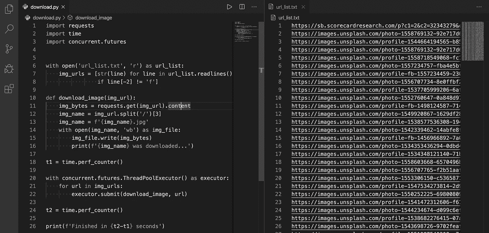

# 提高 Python 字符串格式的 3 个技巧

> 原文：<https://betterprogramming.pub/3-tips-for-advancing-python-string-formatting-bc4cc8720f2e>

## 开始使用 f-string 来对齐代码，使字符串可读、清晰、明确

照片由[泰勒维克](https://unsplash.com/@tvick?utm_source=unsplash&utm_medium=referral&utm_content=creditCopyText)在 [Unsplash](https://unsplash.com/s/photos/table-chairs-outdoors?utm_source=unsplash&utm_medium=referral&utm_content=creditCopyText) 拍摄

字符串格式化意味着在字符串中嵌入表达式。在大多数面向初学者的 Python 教程中，第一个任务从“Hello World”项目开始，这使得`string`成为最熟悉的变量类型。

然而，一旦您开始在一个较长的字符串中添加参数，您的代码将会变得不那么简洁和易读。例如:

显然，字符串串联看起来很糟糕而且冗长，因此 [Python 软件基金会](https://www.python.org/psf/)发明了一个名为`.format()`的函数来缩短语法:

它更直观但仍然不容易阅读，所以为什么不采用新的方式呢？到本文结束时，你将学会三种保持代码简洁的方法:

1.  格式化的字符串文字。
2.  输出对齐。
3.  最大线路长度。

# 什么是格式化字符串？

格式化字符串文字(f-string)具有简单的语法和较短的表达式，取代了像% formatting 或`str.format()`这样的“老派”方法。

更好的是，它比这些旧方法执行得更快，线索在 [PEP 498](https://www.python.org/dev/peps/pep-0498/) 中提供:

> F 字符串提供了一种使用最小语法将表达式嵌入字符串文字的方法。应该注意，f 字符串实际上是在运行时计算的表达式，而不是常量值。

简而言之，f-string 比其他方法使用更少的字节码指令。如果您对 f 字符串的高级解释感兴趣，请查看 [Python 文档](https://www.python.org/dev/peps/pep-0498/)。

展示 f 弦的工作原理。让我们重复使用上面的例子:

字符串的开头有一个`f`,包含表达式的花括号被替换为表达式的值。这种技术也可以与字典/类/列表配合使用。

此外，f-string 支持各种格式规范以消除过多的工作，同时语法保持简洁。

# 如何实现输出对齐

你花了多少时间来计算数字的位数，以区分准确的数值？

在现实世界中，我们会不自觉地受到文本格式的影响，并期望获得舒适的阅读体验。在 Python 的输出显示中，我们有强大的工具来完成这项工作:

1.  逗号“`,`”分隔千人一组。

2.有限的数字显示冗长的数字。

3.用空格填充来对齐段落。

这些例子是常用的规范，其他选项可以在 [Python 的官方文档](https://docs.python.org/3.4/library/string.html)中找到，包括显示正负符号，改变位置系统，显示百分号。

因为符号太多，记不住，使用[备忘单](https://myshell.co.uk/blog/2018/11/python-f-string-formatting-cheatsheet/)总是正确的选择。

假设关于 f 弦的那一段对你来说还不够，试试这一段！
(我一直是真 Python 的忠实粉丝！)

 [## Python 3 的 f-Strings:改进的字符串格式化语法(指南)- Real Python

### 从 Python 3.6 开始，f 字符串是格式化字符串的一种很好的新方法。它们不仅可读性更强，更简洁，而且…

realpython.com](https://realpython.com/python-f-strings/) 

# 为什么最大线长度很重要？

不要在一行中粘贴太多代码，给读者造成压力。根据 Python 代码的[样式指南，推荐的最大行长度是 79 个字符。](https://www.python.org/dev/peps/pep-0008/#class-names)

当使用代码审查工具时，编辑器窗口宽度的限制很有效。每当您想要将代码从一个文件复制到另一个文件或者使用 Git 来比较两个代码版本时，受控的窗口长度使得并排打开几个文件成为可能。

使用 Python 从 Unsplash 下载 images agiler。

# 结论

简化的能力意味着消除不必要的东西，让必要的东西说话。字符串格式化不会对你的算法造成任何影响，但是在阅读你的代码时让别人感到舒服是很温和的。

要获得更多让代码变得漂亮整洁的技巧:

 [## 如何让你的 Python 代码更优雅

### 我对 Python 禅宗的理解和更多让代码变得漂亮整洁的技巧

medium.com](https://medium.com/better-programming/how-to-make-python-programming-more-elegant-and-decent-4b5962695aa9) 

感谢阅读！我希望你喜欢它。