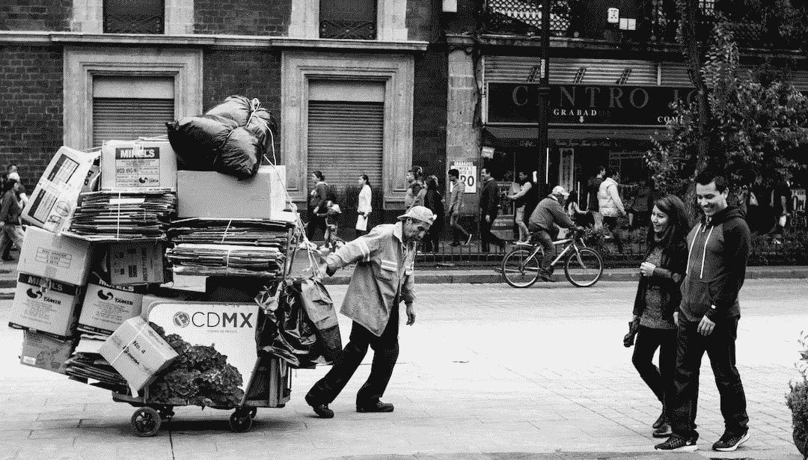

# 软件工程师避免将工作压力带回家的 3 个建议

> 原文：<https://betterprogramming.pub/3-tips-for-software-engineers-to-avoid-bringing-work-stress-home-6181bf976ce6>

## # 2——有一个工作结束的例行程序

蒂亚戈·特莱什在 [Unsplash](https://unsplash.com/) 上的照片

你正在写代码，现在是 5 点钟。你不想在思考中结束你的一天，所以你继续工作。3 个小时过去了，你在晚上 8 点结束工作。

当你下班回家时，你不能停止思考你实现的算法是否正确。

*“用户不登录怎么办？”*你以为。*“啊呀！用户不签到的时候我没占！”*

你回家后要做更多的工作来解释那个边缘案例。一旦你完成了代码的修复和测试，你看看时钟，现在是晚上 11 点。

软件工程是一项脑力劳动。即使你的工作时钟在下午 5 点结束，你的大脑也不会。

这不同于其他职业，如药剂师和医生，他们在指定的工作时间为病人服务。当你完成了工作，你就完成了——你不必在休息时间考虑工作。

即使你的公司说你作为一名软件工程师每周工作 40 小时，实际上，你每周工作 70 小时。

你的身体不能休息，因为你的思想不能休息。

我已经尝试了各种方法来防止把工作中的问题带回家，这里有三个我遵循并发现最有用的方法。

## 如何强迫自己的大脑在某个时间停止思考？

我们的思维是一种超能力。我们希望的一切都可以成为自我实现的预言。你需要学会如何欺骗你的大脑，让它认为停下来第二天继续是可以的。

我过去认为我必须在结束工作周之前完成所有的事情。

没有完成一个你打算当天完成的 bug 感觉就像在电视上看一场扣人心弦的比赛。你的大脑想知道接下来会发生什么，因为你允许你的大脑思考。

你越早意识到你工作时间越长，这会影响你的身心健康。

根据心理学家 Bluma Zeigarnik 的研究，未完成的任务会一直留在人们的脑海中，直到它们完成——这意味着一旦你开始做某事，你就会有更大的动力去完成它，所以你的大脑将不再纠结于此。

# 1.海明威桥方法

你需要欺骗你的心态，让它认为你的任务是永无止境的。

一旦你在时钟上到达某个时间，你想要一个硬停，然后把未完成的任务委托给第二天。你必须创造出那个[海明威桥](https://medium.com/@mstine/day-6-how-you-can-use-hemingways-bridge-to-ship-today-s-momentum-to-tomorrow-a1af14e300ef)来告诉你未来的自己回到那个流动地带。

第一次这样做可能会不舒服。但是，不舒服一旦养成习惯，强迫自己在某个时间停止思考，就会变得舒服。

每当我不能在指定的时间内完成一项任务时，我经常为自己创建“我离开的地方”和“我下一步想做什么”的笔记。这帮我创造了一座海明威桥，用昨天的心流状态驱动明天的动力。当我第二天开始工作时，我会知道我从哪里停下来的。我可以更快更容易地进入心流状态，因为我把所有的笔记都留在了我接下来想做的事情上。这也有助于我把所有的担忧和想法都记在一张纸条上，而不是把它带回我的私人空间。

试试这个方法，你的大脑会为此感谢你的。

# 2.有结束工作的习惯

故意在一天中标记一个时间，告诉你的大脑你正在把工作放在后面。

有时你的大脑需要一个信号来为你在家的时间做准备。如果这个信号能帮你减压就更好了。例如，你可以选择一条风景更好的回家路线，听音乐或播客来放松，给自己时间为家庭生活切换齿轮。你可以在一天工作结束时在公园里散步 30 分钟，以表示你已经完成了工作。

我会每天下午 5 点左右锻炼，以表示我已经完成了工作。然后，当我完成练习后，我将开始我的个人晚间活动。

当我们不在家工作时，*通勤*表明“*你已经完成了工作。*“您通常会从笔记本电脑上注销，并将工作用的笔记本电脑留在办公室。然而，现在许多软件工程师混合工作或在家远程工作，我们的工作和个人时间经常融合在一起。我们可能需要某些活动或迹象来表明我们已经完成了工作。

# 3.在特定的时间或地点定义你的工作

创造一个指定的工作空间。制定一个规则，只有在特殊情况下才在家工作，把工作电脑、文件夹和笔记本放在办公桌上。

你的大脑将你周围和环境的信息储存在认知空间中。因此，你必须让你的大脑在特定的时间或地点“工作”和“休息”。

传统的朝九晚五让我们把家和“休息”联系在一起然而，远程工作摧毁了我们对家和“休息”的联想我们的工作日程变得更加非线性。

> “例如，一名远程工作人员可能在当地时间早上 6:00 开始一天的工作，一直工作到早上 9:00。为了和家人在一起，这个人直到当地时间下午 3 点才会再次查看他们的工作邮件，并继续工作到当地时间晚上 8 点。根据工作/生活环境的不同，明天可能会是一个完全不同的时间表。”— [Gitlab](https://about.gitlab.com/company/culture/all-remote/non-linear-workday/) 。

疫情期间，我在家工作时做的第一件事就是把我的办公桌从卧室搬到另一个空间，即“工作”室。

当我去“工作”室时，我的心态会立即自动切换到工作状态。当我去卧室的时候，我的大脑会自动记录休息时间和睡觉时间。

这样做将在你离开物理空间时在精神上帮助你停止工作，给你尽可能高效工作的动力，而不是在任务上徘徊。

# 结束语

软件工程师从不朝九晚五地工作，因为如果我们在 5 点前解决了问题，我们的大脑就会像仓鼠一样不停地运转。这是我用来拯救我的精神健康的三种方法，或许也能帮助你拯救你的精神健康:

*   使用海明威桥方法，强迫你的大脑在指定的时间后停止思考问题。
*   创建一个结束一天的仪式，向你的大脑发出你要下班的信号。
*   定义工作的具体地点或时间。

试试这三个建议，你会发现把工作带回家的习惯正在消失。

你用什么方法避免把工作带回家？

*原载于*【https://pathtosenior.substack.com】