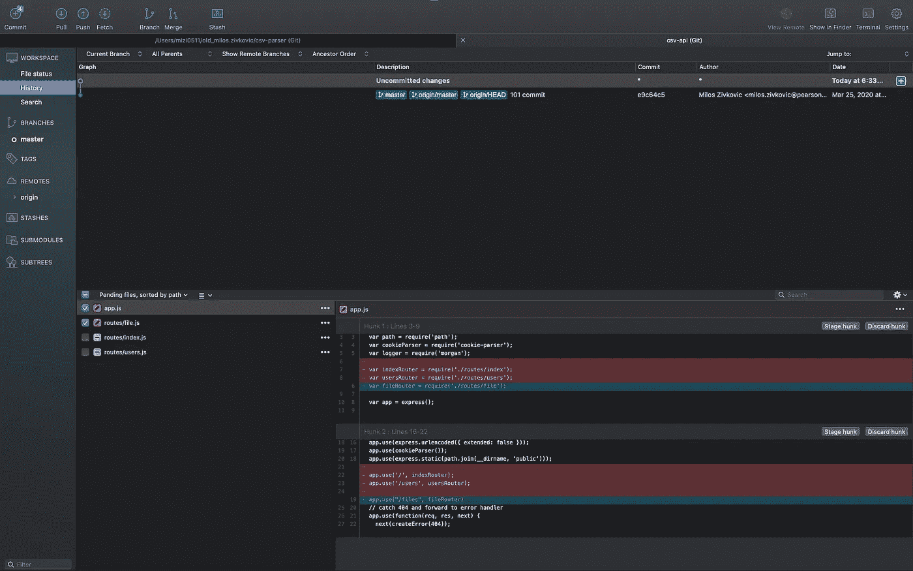
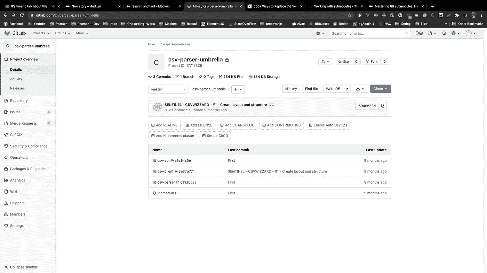
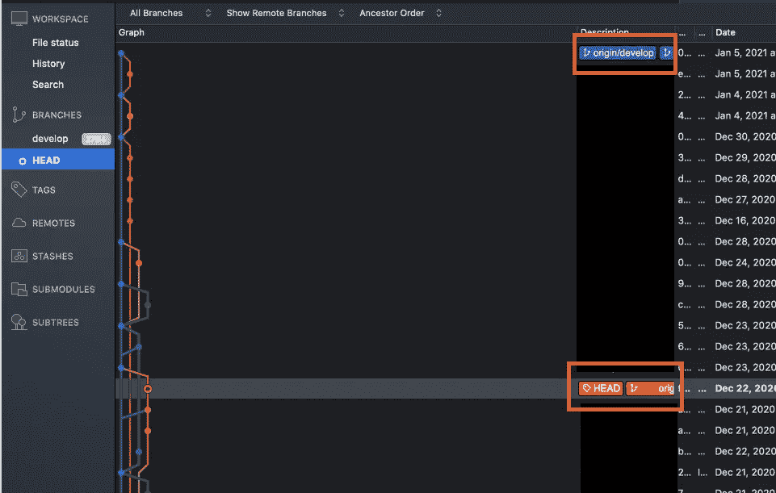
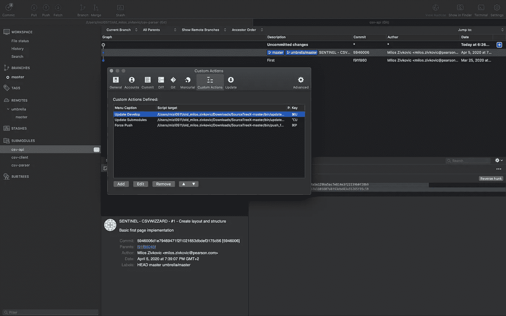
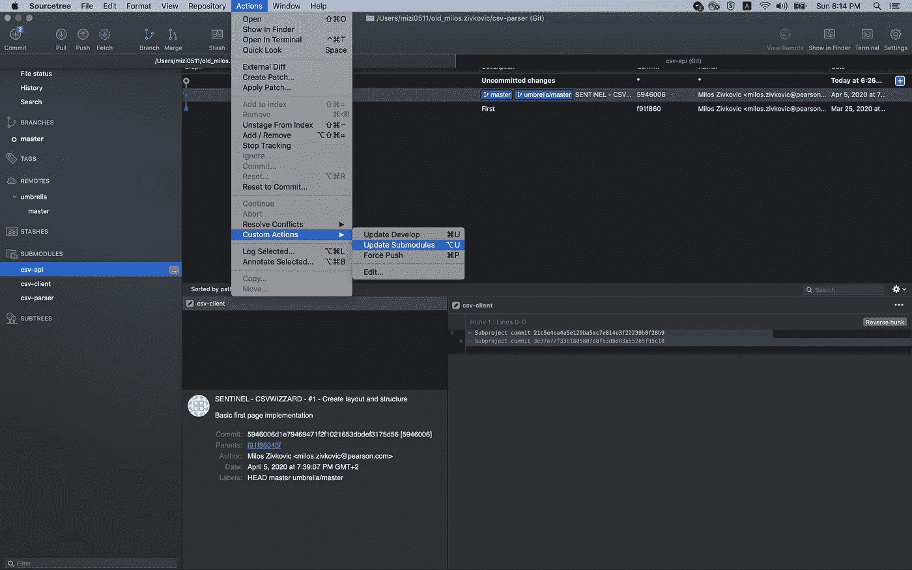

# 提高 Git 子模块知识的 3 个技巧

> 原文：<https://betterprogramming.pub/3-tips-to-improve-your-git-submodule-knowledge-171b10481a5a>

## 如何顺畅地使用 Git 子模块


照片由 [Unsplash](https://unsplash.com?utm_source=medium&utm_medium=referral) 上的 [Yancy Min](https://unsplash.com/@yancymin?utm_source=medium&utm_medium=referral) 拍摄。

用 Git 处理大型代码库会导致`git fetch`命令出现问题。你不需要整个代码库来改变一些样式。

假设您正在构建一个面向服务的应用程序。推动对单一回购协议的改变将会造成混乱。如果没有适当的提交消息，您将会看到一大堆不相关的提交。

提交单独的 Git 子模块可能会有所帮助。“子模块”将 repo 分成更小的代码库。分离关注点将导致更好的代码组织。例如，每个服务一个子模块将是一个好的开始。

在本文中，我将尝试拓宽您在 Git 子模块方面的知识。这篇文章包含了每天拯救我生命的三个技巧。通读，直到结束一个甜蜜的奖励提示。

让我们开始吧。

# 1.使用 SourceTree 管理 Git 子模块

下图显示了一个可能的 Git 子模块设置。我们已经将客户端应用程序、服务器和解析器服务分成了 Git 子模块。

[SourceTree](https://www.sourcetreeapp.com/) 提供了良好的 Git 子模块支持。该图显示了 Git 子模块的根。在`STASHES`菜单下面，你可以展开`SUBMODULES`菜单。

有三个点的图标的 Git 子模块有一些未分级的变化。在这种情况下，`csv-api`子模块有一些变化。


在 SourceTree 中打开的 Git 子模块的根

双击将在新的选项卡中打开子模块。你可以在下图中看到:



源代码树中打开了一个子模块



根子模块的 GitLab 视图

使用 SourceTree，我从未遇到过 Git 子模块的任何问题。你总能看到你的子模块发生了什么。

# 2.注意分离的头部指针

有一点要记住:当使用 Git 子模块时，你总是有一个分离的 T4。这是因为您正在处理提交，而不是分支。注意`HEAD`在子模块中指向哪里，因为这可以决定项目的成败。

```
$ git status     
HEAD detached at 3557a0e
     nothing to commit, working directory clean
```

当您在 SourceTree 应用程序中打开子模块时，您会看到这个视图。子模块总是处于分离的`HEAD`模式，并且`HEAD`可以指向旧的代码版本。



HEAD 在旧版本上，而 develop 分支在进步。

在子模块中添加代码更改总是会触发两个 PR:一个 PR 在实际的子模块上，另一个 PR 在根子模块中放置子模块引用。子模块引用必须指向特征分支上的最新提交散列。

你可以在这篇文章中了解更多关于[的信息。](https://www.git-tower.com/learn/git/ebook/en/command-line/advanced-topics/submodules/#working-in-a-submodule)

# 3.进行适当的代码基础分割

我提到的一个例子是进行基于服务的拆分。如果服务是逻辑密集型的，这可能是有用的。否则，如果不需要，就不要过度工程。

在大型团队中工作时，拆分代码非常方便。通过这种方式，您不必获取整个代码库，而只获取其中的一部分。

尽管您应该有独立的关注点，但这并不意味着您需要子模块。适当的包管理比子模块做得更好。

本文更详细地解释了子模块:

[](https://medium.com/@porteneuve/mastering-git-submodules-34c65e940407) [## 掌握 Git 子模块

### 揪头发。无助的愤怒。一群混蛋。它们还有很多不尽人意的地方，但有时却是这项工作的合适工具…

medium.com](https://medium.com/@porteneuve/mastering-git-submodules-34c65e940407) 

# 额外收获:在 SourceTree 中使用自定义操作

自定义操作改善了 SourceTree 环境。他们可以执行不同的 Git 活动。我用它们来修改、强制推送和更新。

添加新动作时，可以设置带有自定义热键的自定义动作。我用得最多的是更新子模块。你可以检查这个[回购](https://github.com/yzhong52/SourceTreeX)，获取更多满足你需求的行动。

```
# update_submodules.sh#!/bin/bashgit submodule update
```



编辑自定义操作



更新子模块操作

# 继续阅读相关文章

[](https://levelup.gitconnected.com/5-common-git-mistakes-every-developer-makes-988cb563aee1) [## 每个开发人员经常犯的 5 个 Git 错误

### 以及如何立即解决 Sourcetree 中的常见问题

levelup.gitconnected.com](https://levelup.gitconnected.com/5-common-git-mistakes-every-developer-makes-988cb563aee1) [](/how-to-resolve-git-conflicts-faster-and-more-easily-in-your-favorite-ide-9d2984283a79) [## 如何在您喜欢的 IDE 中更快更容易地解决 Git 冲突

### 解决 VS 代码、IntelliJ、Nano 和 Sourcetree 中的 git 冲突

better 编程. pub](/how-to-resolve-git-conflicts-faster-and-more-easily-in-your-favorite-ide-9d2984283a79) [](/avoid-a-dirty-git-repo-4e9518d7914c) [## 避免肮脏的 Git 回购

### 如何清理你的 Git 回购

better 编程. pub](/avoid-a-dirty-git-repo-4e9518d7914c)