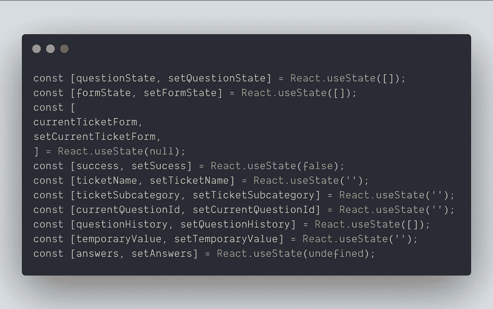
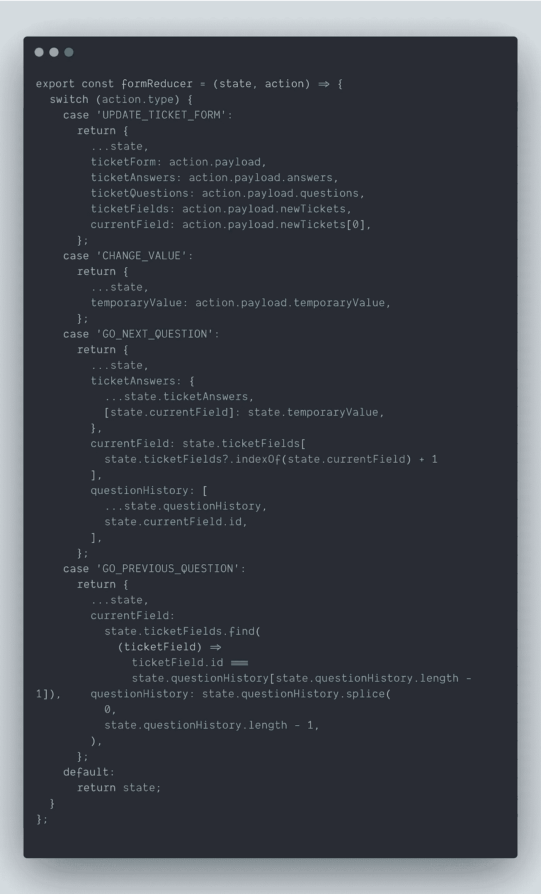
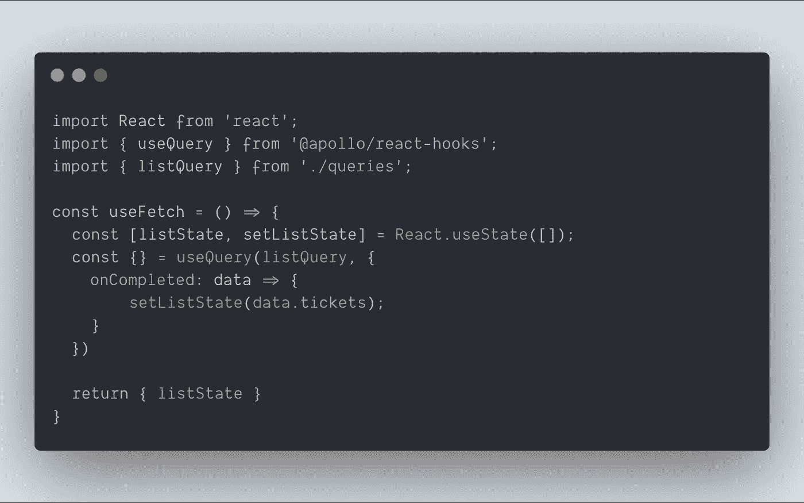
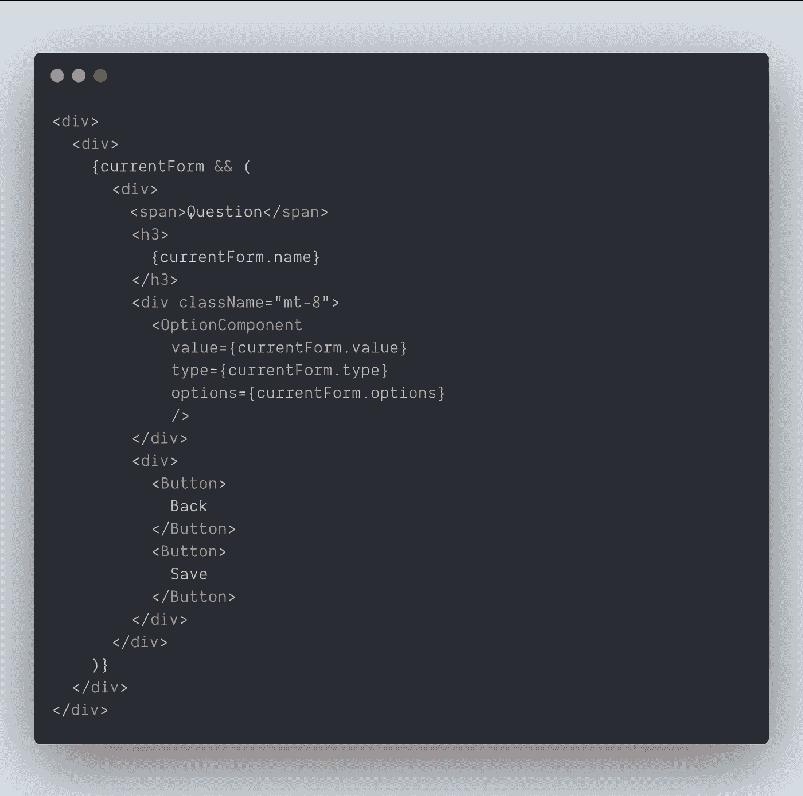
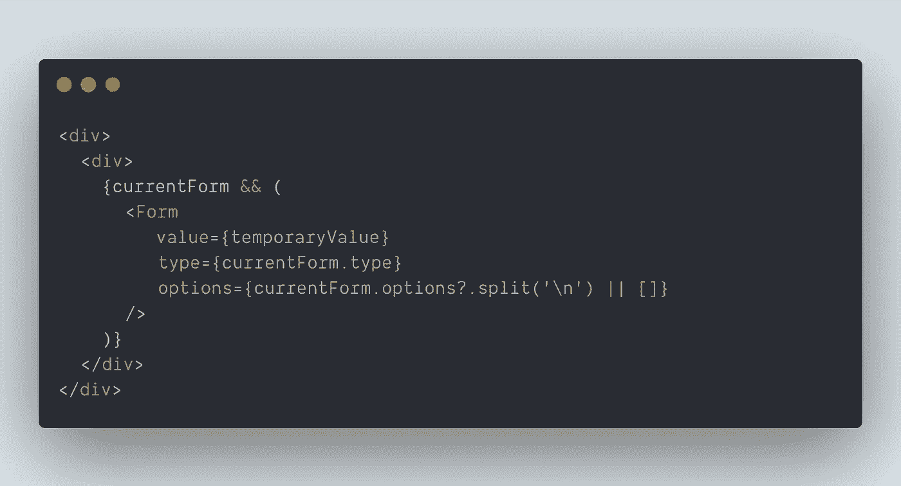

# 编写更好的 React 组件的 3 个技巧

> 原文：<https://betterprogramming.pub/3-tips-to-write-better-react-components-3a57a62139d9>

## 更小、功能更多的组件

照片由[普里西拉·杜·普里兹](https://unsplash.com/@priscilladupreez?utm_source=unsplash&utm_medium=referral&utm_content=creditCopyText)在 [Unsplash](https://unsplash.com/s/photos/read-black-and-white?utm_source=unsplash&utm_medium=referral&utm_content=creditCopyText) 上拍摄

我在这个 sprint 中的任务之一是以一种非常复杂的形式实现一个新特性，带有动态问题和在它们之间跳转的逻辑。我估计这项任务需要五个小时。我需要做的唯一更改是在发送时添加一个额外的验证。

在我看到我需要更新的组件之前，我一直是这么想的。这个组件有 300 多行代码，有一个巨大的 JSX 标记，大约有 150 行，逻辑…这个组件中有许多`setState`和有许多依赖关系的`useEffect`。

我很惊讶，也很惭愧，因为我写了这段代码，但它变成了一个我完全不理解的庞然大物。你知道，就像那些你盯着屏幕 15 分钟的时候，想着:“这个功能到底是干什么用的？”

# useReducer 而不是 useState

我提到这个组件有多个`useState`，这很难理解，因为我必须查找所有的`setState`才能知道组件的哪个部分更新了某个状态。

相当糟糕的代码

是的，我知道，看起来很糟。如果您最终得到这样的代码，您必须考虑进行重构。这些状态中有许多是相关的，所以我可以创建一个 reducer 来处理这个表单的可能场景。

使用减速器的更好方法

这也增加了你对这些减压器作用效果的了解。

当你在行动中分离你的逻辑时，你意识到什么行动影响状态的某些领域。这使您可以更好地控制状态，实现新功能也更容易。

# 分离逻辑

在这个表单中，我需要从 GraphQL 上的一个 API 获取一些数据。我用了[阿波罗](https://www.apollographql.com/)和`@apollo/react-hooks`。

当我得到数据时，我需要更新一个状态。我可以创建一个自定义挂钩，只返回我需要的状态，而不是在同一个组件中获取数据。

如果我需要使用变异或添加额外的查询，我也可以在这个钩子中编写这个逻辑。

我建议您遵循关注点分离原则来获取数据。您可以为与数据相关的逻辑创建一个单独的文件，并只返回将在组件中呈现的状态。

这也适用于你的 UI，在需要的时候创建一个表示组件会帮助你更好地理解你的应用程序是如何工作的。

# 把它分成小块

我写的 monster 组件的 UI 有 100 多行代码。

在`div`之后还有`div`，我花了两分钟多才弄明白我到底在做什么。在这个`div`宇宙中，有条件渲染，我不得不向下滚动一段时间才能知道它在哪里结束。

看上面的代码。那个`currentForm`布尔正在包装一大块 JSX 标记。如果我们把这个 UI 移到另一个组件中，可读性会更好。

更好的是，我可以把这个大组件分成更小的组件，这样下一个看到这个代码的人就会知道所有东西的确切位置。

# 结论

没有完美的代码编写方式，不同的团队遵循不同的模式，但是如果你和我看到代码时的感觉一样，它可能也需要重构。

请记住:

*   如果您使用多个`useState`，请尝试将其更改为`useReducer`。你会更好地控制和更广泛地了解你的状态在每一个行动中发生了什么。
*   可以重用的独立逻辑。您可以为数据提取创建一个自定义挂钩，或者创建可以在应用程序的其他部分使用的 util 函数。
*   将你的组件分割成小块。将 JSX 标记提取到不同的组件中，以提高代码的可读性。