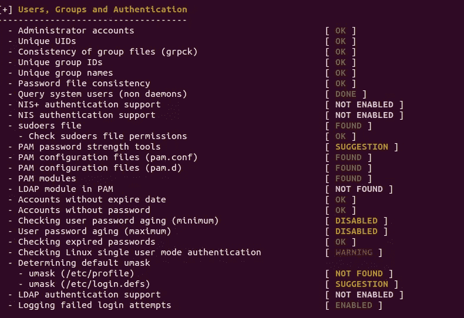
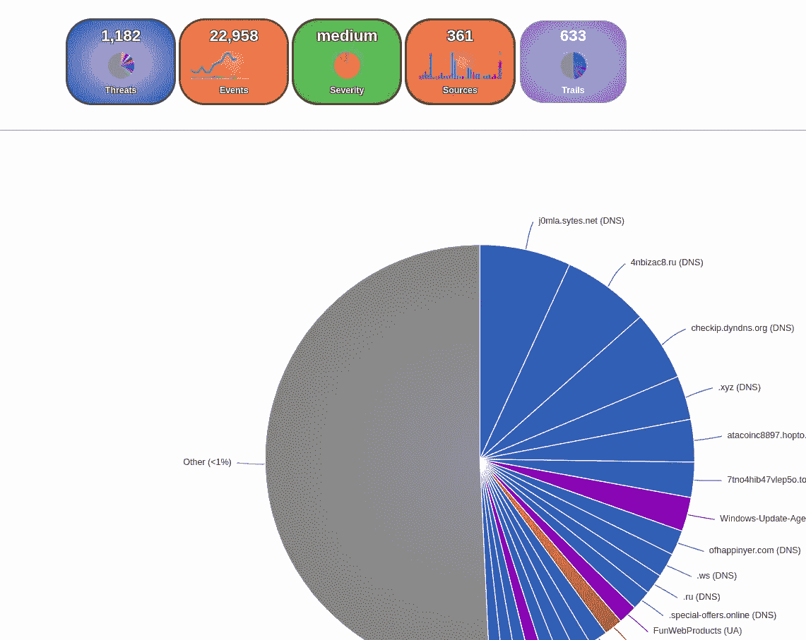
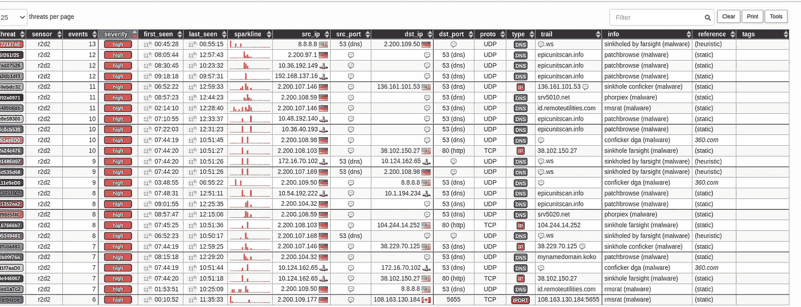
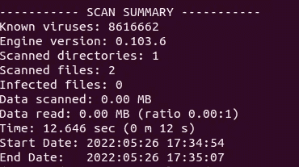

# 检测 Linux 漏洞的 3 个工具

> 原文：<https://betterprogramming.pub/3-tools-to-detect-linux-vulnerabilities-ec42122cc41b>

## 关于如何保护您的 Linux 系统免受黑客攻击的提示


照片由[夏羽·亚伊奇](https://unsplash.com/@stefyaich?utm_source=medium&utm_medium=referral)在 [Unsplash](https://unsplash.com?utm_source=medium&utm_medium=referral) 上拍摄

尽管 Linux 以其稳定的安全性而闻名，但它仍然暴露在网络攻击之下。黑客试图窃取有价值的信息或破坏系统。这就是为什么有必要采取额外的保护措施来防止可能出现的问题。

在本文中，我将介绍 3 个有用的免费工具来保护您的服务器。您将学习如何扫描您的服务器的安全弱点和恶意软件。

*这些例子已经在 Ubuntu 发行版上进行了测试。*

我们开始吧！

# 1.琳妮丝

Lynis 是一款开源的安全工具，用于基于 Unix 的操作系统检测漏洞。它主要用于审计和符合性测试。例如，文件权限、防火墙设置、安装的软件、用户帐户、内核、网络、USB 设备等等。

## 装置

要在 Ubuntu 上安装 Lynis，请执行以下命令:

```
$ sudo apt-get install lynis
```

## 演示

运行安全检查很简单:

```
$ sudo lynis audit system
```

这需要几分钟。您应该看到一个带有状态关键字的报告，如*发现*、*未发现*、*发现*、*禁用*、*建议*、*警告*等。



Lynis 的用户帐户检查

此外，该工具还创建了包含更精确的扫描信息的报告和日志文件。

*   **/var/log/lynis.log** —这个日志文件对于理解程序在后台做了什么很有价值。可以找问题推荐。例如:

```
Suggestion: Set a password on GRUB bootloader to prevent altering boot configuration (e.g. boot in single user mode without password) [test:BOOT-5122] [details:-] [solution:-]
```

*   **/var/log/Lyn is-report . dat**—这是一份来自审计流程的报告，格式更加用户友好。

提示:为了使您的系统更加安全，您可以安排一个 cron 作业来定期运行 Lynis 并向您发送报告。

# 2.马耳他铁路

Maltrail 是另一个有用的开源安全工具。它主要用于检测可疑流量。它与公开可用的恶意和/或可疑踪迹列表的数据库一起工作。例如，可疑踪迹可以是 IP 地址、域名等。

## 装置

要在 Ubuntu 上安装该工具，请运行以下命令来安装必要的库:

```
$ sudo apt-get install git python3 python3-dev python3-pip python-is-python3 libpcap-dev build-essential procps schedtool$ sudo pip3 install pcapy-ng$ git clone --depth 1 [https://github.com/stamparm/maltrail.git](https://github.com/stamparm/maltrail.git)
```

## 演示

```
$ cd maltrail$ sudo python3 sensor.py
```

要访问报告仪表板，请打开 [http://127.0.0.1:8338](http://127.0.0.1:8338/) (使用默认凭据登录 *admin:changeme* ！).



多轨仪表板



威胁信息

Maltrail 项目提供了一个真实威胁的演示[这里](https://maltraildemo.github.io/)。

# 3.ClamAV

[ClamAV](https://docs.clamav.net/) 是一款检测病毒、恶意软件、木马和类似威胁的免费工具。它是专门为邮件网关上的电子邮件扫描而设计的。

## 装置

要在 Ubuntu 上安装该工具，请运行:

```
$ sudo apt-get install clamav
```

## 演示

安装后，您可以运行 **freshclam** 服务来更新已知病毒签名列表:

```
$ sudo freshclam
```

要扫描目录，请运行以下命令:

```
$ sudo clamscan -r -i /home/user/projects/mydir
```

在这个例子中，我想扫描一个名为 **mydir** 的文件夹。参数`-r` 代表递归，`-i`告诉 ClamAV 只显示被感染的文件。

输出如下所示:



ClamAV 报告结果

# 结论

在本文中，您了解了 3 种扫描 Linux 服务器漏洞的实用工具。根据不同的用例，您可以确定您最需要哪一个。

如果您对 Linux 管理主题感兴趣，您可能会喜欢我的另一篇相关文章:

[](/how-to-manage-linux-servers-in-a-web-browser-aef717d6bb1a) [## 如何在 Web 浏览器中管理 Linux 服务器

### Cockpit 简介，一个易于使用的基于网络的管理工具

better 编程. pub](/how-to-manage-linux-servers-in-a-web-browser-aef717d6bb1a) 

我希望你能从这篇短文中学到一些新东西。感谢您的阅读，下次再见！