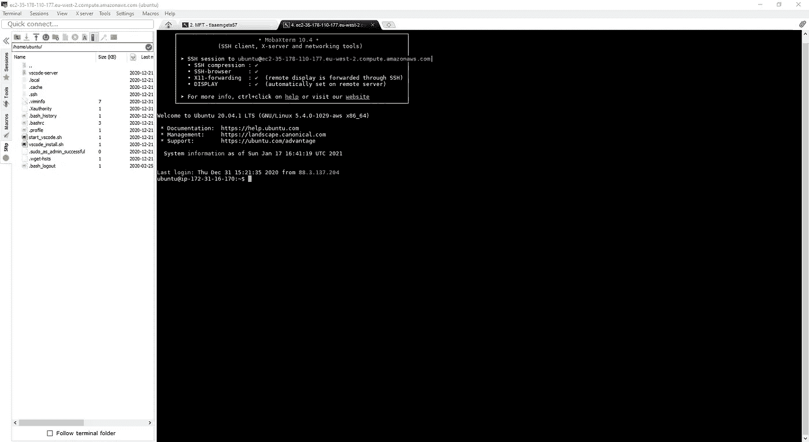
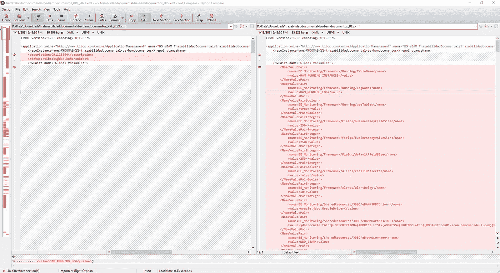
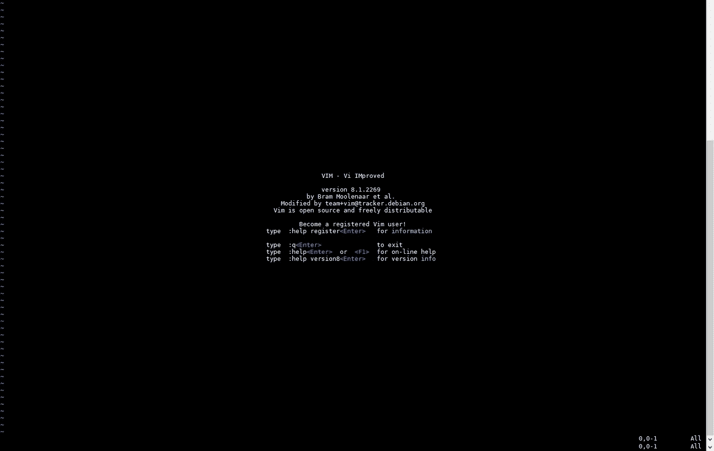

# 3 个不同寻常的工具来提高开发人员的工作效率

> 原文：<https://betterprogramming.pub/3-unusual-tools-to-boost-your-developer-productivity-8c30a5819273>

## 面向软件工程师的非 VS 代码列表

在 [Unsplash](https://unsplash.com?utm_source=medium&utm_medium=referral) 上由 [Clarisse Meyer](https://unsplash.com/@clarissemeyer?utm_source=medium&utm_medium=referral) 拍摄的照片。

这不会是一篇关于可以帮助你更快开发代码的工具的文章。如果您对此感兴趣，您可以查看我以前的文章，这些文章涉及 VS 代码扩展、linters 和其他工具，它们使您的开发工作变得更加容易。

我的工作不仅仅是软件开发，还包括解决客户的问题。虽然它们的问题可能与代码有关，但也可能是操作错误，甚至是设计问题。

我通常倾向于把自己的角色定义为独行侠。我不知道我将面临什么，我需要准备好适应，解决问题，让客户高兴。这一经历帮助我开发了一个工具链，这对完成这项工作非常重要。

让我们开始吧！

# 1.MobaXterm

 [## MobaXterm 免费 Xserver 和选项卡式 SSH 客户端

### 现在就获得远程计算的终极工具箱 MobaXterm X 服务器，SSH 客户端 MobaXterm 是您的终极工具箱…

mobaxterm.mobatek.net](https://mobaxterm.mobatek.net/) 

这是管理不同服务器的不同连接的最佳工具(Linux 服务器的 SSH 访问，Windows 服务器的 RDP，等等)。).以下是它的一些主要特性:

*   图形化的 SSH 端口转发，适用于您需要连接到无法直接访问的服务器的情况。
*   简单的身份管理保存不同服务器的密码。为了便于访问，您可以对它们进行分层组织，特别是当您需要为不同的环境甚至不同的客户访问如此多的服务器时。
*   当您连接到 SSH 服务器时，SFTP 自动连接。它让你下载和上传文件就像把文件放在那里一样容易。
*   自动 X11 转发，因此您可以从 Linux 服务器启动图形应用程序，而无需进行任何配置或使用其他 XServers，如 XMing。

MobaXterm 正在运行

# 2.无与伦比

 [## 踏板车软件:无与伦比的家

### 使用简单、强大的命令来比较文件和文件夹，重点关注您感兴趣的差异，忽略…

www.scootersoftware.com](https://www.scootersoftware.com/) 

有很多工具可以用来比较文件，我想我都用过——从 WinMerge、Meld、Araxis、KDiff 等独立应用程序到 VS Code 和 Notepad++等文本编辑器的扩展。

然而，没有一个能比得上一个，只有无与伦比。

当我在 2010 年开始从事软件工程时，我覆盖了 Beyond Compare，它是我每个项目都有的工具。我每天都用它。那么，是什么让这个工具与众不同呢？

它是进行任何比较的最佳工具，因为它不仅仅是比较文本和文件夹。它很好地做到了这一点，但同时，它还在浏览内容、JAR 文件等时比较 ZIP 文件。当我们想检查在 DEV 和 PROD 中上传的两个 JAR 文件是否是该工具的相同版本，或者想知道一个 ZIP 文件在上传时是否有正确的内容时，这是非常重要的。

无可比拟 4

# 3.Vi 编辑器

 [## 欢迎回家:维姆在线

### Vim 是一个高度可配置的文本编辑器，可以非常高效地创建和更改任何类型的文本。这是…

www.vim.org](https://www.vim.org/) 

这是最重要的一个——有史以来最好的文本编辑器——几乎每个服务器上都有。

这是一个带有大量快捷方式的命令行文本编辑器，当您在服务器内部检查日志和配置文件以查看问题所在时，它可以让您非常高效。

很长一段时间以来，我打印了一份 Vi 备忘单，以确保我可以掌握最重要的快捷方式，从而提高我在敌后(客户的服务器)作战时的生产率。

VIM — Vi 改进了终极文本编辑器。