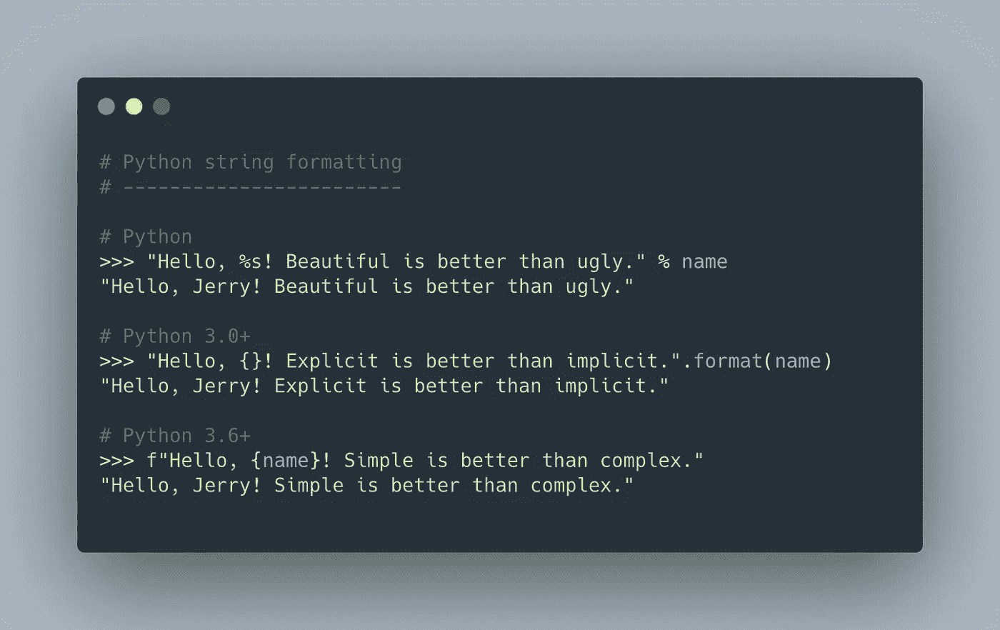

# 你可能不知道的 3 个有用的 Python f-string 技巧

> 原文：<https://betterprogramming.pub/3-useful-python-f-string-tricks-you-probably-dont-know-f908f7ed6cf5>

## 关于 Python 的格式化字符串(f-string)你需要知道的事情


凯文·Ku 在 [Unsplash](https://unsplash.com?utm_source=medium&utm_medium=referral) 上拍摄的照片

Python 开发人员使用`%`操作符在 Python 中执行字符串格式化的日子已经一去不复返了。

后来随着 Python 3.0 的引入，对运算符`%`的普遍使用逐渐被对字符串对象调用`[.format()](https://www.w3schools.com/python/ref_string_format.asp)`方法所取代。

快进到 Python 3.6 及更高版本: [f-string](https://docs.python.org/3/tutorial/inputoutput.html#formatted-string-literals) 是作为一种在字符串常量中嵌入 Python 表达式的新方法而引入的。今天，许多人已经接受了这种改变。



Python 中字符串格式的简要概述。(制造使用:[https://carbon.now.sh/](https://carbon.now.sh/))

对于不熟悉这个的人来说，在 Python 中使用 f-string 超级简单。只需在字符串前加上`f`或`F`，然后加上单引号、双引号甚至三引号，就可以创建字符串，例如`f"Hello, Python!"`。

虽然大多数人可能已经熟悉 Python 中的 f-string 格式，但今天我将展示一些在 Python 3.8+中使用 f-string 的鲜为人知的技巧。

涵盖的主题:

*   使用 f 字符串进行更好的调试
*   格式化`float`小数位、货币、`datetime`对象，并用 f 字符串填充
*   使用 f 字符串进行转换(ASCII 和`repr()`)

我们开始吧，好吗？

# 1.用于调试的 f 字符串

作为开发人员，我们经常发现自己使用`print`语句来调试我们的代码，仅仅是因为它们易于添加。

很有可能，我们会这样做:

一个很好的方法来忘记哪个值属于哪个变量。

这是打印在我们终端上的输出:

```
🐊
🐼
🐓
```

老实说，使用上面的代码进行打印没有任何问题。

然而，当盯着一个满是其他调试器日志的终端时，人们可能很容易忘记输出变量的顺序。在这样的用例中，使用`print`语句进行调试很快就会变成大海捞针。在我们的案例中:

```
🐊 
🐼 -- Sorry, which variable does this belong to again?
🐓
```

## 调试期间打印变量的更好方法

为了解决这个问题，我们可以做`print(f’{variable_name=}’)`来代替。

使用 f-string 调试打印的更清晰的方法！

尽管我们必须用 f-string 语法包装我们的变量，但一切都清晰得多。现在，我们将永远不会在调试过程中丢失打印变量的顺序。

此外，以这种方式使用 f-string 可以保留空白，当我们在调试过程中查看令人困惑的终端日志时，这是很有帮助的。

f 字符串保留空白。

# 2.字符串格式

除了使用 f-string 进行调试之外，我最喜欢的 f-string 特性是它的灵活性，它允许我们轻松地格式化我们的字符串。

与普通的旧字符串连接相比，使用 f-string 可以更加灵活地读取、写入和维护字符串的输出。

当我们处理`float`类型变量时，可以演示最简单的例子。

## 如何将浮点数格式化为 N 位小数

例如，假设我们需要打印一个有两位小数的`float`类型的变量，比如把`3.1425123`写成`3.14`。这并不是不常见的用例，对吧？

通常，人们可能会想到使用 Python 内置的`round`方法来实现这一点。或者，你在考虑使用“更老的”`str.format`方式来做这件事，比如:

将浮点数限制到两位小数的方法。

如果我们可以用 f 弦来代替呢？让我们再试一次！

在这个场景中使用 f 弦比`str.format()`要容易得多

## 把浮动变成一个漂亮的货币价值

当你处理货币时，你需要准备尽可能用户友好的字符串。例如，将我们的货币值`3142671.76`格式化为`$3,142,671.76`可能更好。

在这种情况下，使用 f-string 将我们的`float`值格式化为货币非常方便。我们可以通过使用`,:2f`轻松做到这一点。

将类型变量格式化为漂亮的货币。简单！

## 没有`strftime`的漂亮格式`datetime`

除了使用它来格式化`float`类型变量，我们甚至可以使用 f 字符串和`datetime`类型变量。

当把一个`datetime`对象格式化成一种更人性化的方式时，比如`05-July-2021`，最常见的方式是使用`datetime`对象的标准内置`strftime` 方法，比如`datetime_var.strftime(‘%d-%b-%y’)`。

或者，我们可以使用 f-string 轻松格式化我们的`datetime`变量。这里有一个例子来说明我的意思:

用 f 字符串代替`strftime.`格式化`datetime`变量

## 用前导零或空格填充您的`int`变量

根据你所做的工作，当你显示或使用一个字符串时，你可能需要在前面填充你的整数。

f-string 不需要编写自定义函数来填充整数，而是允许您毫不费力地填充整数。要用零填充，只需这样做:

用前导零填充整型变量！

要用前导空格填充整数:

用前导空格填充整型变量！

# 转换

在本文的最后一部分，我将向您展示一些使用 f-string 进行转换的简短示例。当您在 f 字符串中使用感叹号语法`!`，后跟您的变量时，它将对该变量执行额外的转换。

## 将字符串转换为 ASCII 表示形式

例如，您可以用`f’{your_variable!a}’`轻松地打印出字符串的 [ASCII](https://en.wikipedia.org/wiki/ASCII) 表示，就像这样:

显示您的表情符号的 ASCII 表示。

## 带 f 弦的`repr()`备选方案

最后，f-string 中的`!`语法的另一个好的用途是显示包含我们对象的可打印表示的字符串，就像在 Python 中使用`[repr()](https://www.programiz.com/python-programming/methods/built-in/repr)`方法一样。

这里有一个例子:

使用`!r`代替`repr()`

# 结束语

自 Python 3.6 时代以来，f-string 一直是 Python 中格式化字符串的一种令人惊叹的方式。在 Python 中使用 f-string 非常容易，自从它们被引入以来，我一直在使用它们。

f-string 的灵活性允许我们在 string 对象中包含表达式、条件甚至格式，它无疑是简单而强大的。

这里我个人最喜欢的是使用 f-string 来格式化`datetime`对象以及格式化任何货币值。

老实说，看到 Python 这些年来的发展，逐渐让我们的开发者体验越来越好，我兴奋不已。我希望你能从这篇文章中学到很多，并在工作中把这些技巧应用到你的兼职项目或代码库中。

## [最初发表于 jerrynsh.com](https://jerrynsh.com/3-useful-python-f-string-tricks-you-probably-dont-know/)

[](/tuples-vs-lists-vs-sets-in-python-3dff8a7b1f02) [## Python 中的元组、列表和集合

### 你可能一直都用错了

better 编程. pub](/tuples-vs-lists-vs-sets-in-python-3dff8a7b1f02) [](/how-to-write-clean-code-in-python-5d67746133f2) [## 如何用 Python 写干净的代码

### 使用 Python 示例编写干净代码的 3 个技巧

better 编程. pub](/how-to-write-clean-code-in-python-5d67746133f2)