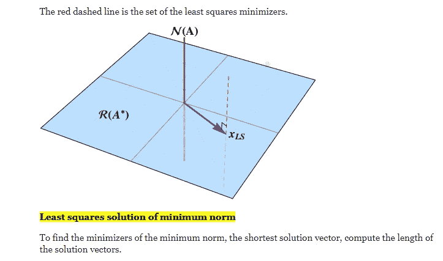

# 3 个有用的 PyTorch 张量函数

> 原文：<https://betterprogramming.pub/3-useful-pytorch-tensor-functions-to-check-out-zero-to-gans-5fa72965b840>

## 零到 GANS

照片来自 [PyTorch](http://pytorch.org) 。

在这篇文章中，我将回顾我在 [PyTorch](http://pytorch.org) 中发现的一些有用的张量函数，这是一个用于深度学习的 Python 库。要在计算机上构建大脑，首先要学会构建模块。在深度学习中，那些是张量。对于不知道的人来说，[张量](https://en.wikipedia.org/wiki/Tensor)是数字，向量，矩阵，或者任何 *n* 维数组，深度学习模型可以用张量来理解。当我在做的时候，这里有一个很好的关于这个话题的视频。

在木星的第一个任务中。ML 和 FreeCodeCamp 的深度学习 with PyTorch 课程，我学到了一个 ML 工程师或一般数据科学家可能每天都会用到的五个有趣的张量函数，包括与线性代数和统计相关的函数。在这五个当中，这三个是我最感兴趣的。

# 1.整形—torch . shape()

顾名思义，这个 PyTorch 函数重塑了一个张量的维数，所以一个 *m x n* 矩阵可以转换成一个 *n x m* 矩阵。这在数据分析和机器学习中是一个有用的特性，因为矩阵和向量需要重新成形以适应各种模型。

下面是该函数的一个使用示例:

正如我们所看到的，一个 16 x 1 的向量被整形为一个 4 x 4 的矩阵，整形函数的第一个参数是张量，第二个参数是所需的维数。注意这些张量中元素的数量( *m x n* )。

下面的例子说明了为什么在整形时记住这些很重要:

错误代码说明了一切:您不能将一个 16 元素张量重塑为一个 25 元素张量(4 x 4！= 5×5)。这一点在整形时很容易记住，所以要确保你要操作的张量与你想要的元素数量一致。

# 2. **Unique — torch.unique()**

这个函数返回一个张量的唯一值，这个张量可能是一个矩阵或者一个向量。

上面的简单例子让你知道这个函数的作用，返回张量中的所有值，因为在这种情况下它们都是唯一的。这里有一个更有趣的:

在这里，我创建了一个张量，它将`2`和`3`作为众数(最频繁出现的数字),并且在每一行中有一个唯一的值。我想用 PyTorch 玩玩数学和条件运算符，所以我写了上面的代码，看看`w`和`y`的唯一值之和是否等于解`30`。看到这种情况真的很有趣。

这个例子还展示了 unique 函数如何返回张量的重复元素一次。

打破这个函数的唯一方法是在函数执行之前删除张量，因此下面是一个简单的例子:

如前所述，unique 函数仅从零矩阵返回一个`0`，并且该函数返回一个错误，因为测试张量由于`del()`而不再被定义。在张量中找到唯一值与在数据集中找到它们一样重要:避免重复。重复会扭曲深度学习模型和先前分析的结果。

# **3。最小二乘法— torch.lstsq()**

> “最小二乘法是回归分析中的一种标准方法，通过最小化每个方程结果的残差平方和来近似求解超定系统(方程组，其中方程比未知数多)。”— [维基百科](https://en.wikipedia.org/wiki/Least_squares)

正如 wiki 所说，这是最常见的线性回归方法，一种分析自变量和因变量之间线性关系的统计方法。因此，它最适用于数字数据。幸运的是，PyTorch 有`torch.lstsq()`函数可以快速找到两个矩阵(一组特性和一组目标)之间的最小二乘解。

关于 PyTorch 中的最小二乘，需要注意的一点是，当 *m* 大于或等于 *m x n* 特征矩阵中的 *n* 时，该函数将返回最小二乘解(根据 [PyTorch](https://pytorch.org/docs/master/generated/torch.lstsq.html) 文档)。这意味着当行数大于列数时，将返回最小二乘法。

然而，如果在 *m x n* 特征矩阵中 *m* 小于 *n* ，那么`lstsq()`函数将返回最小二乘最小范数解或无限个最小二乘解中的最小二乘解，因为矩阵的行数比列数少(更多信息请参见本 [StackExchange 页面](https://math.stackexchange.com/questions/2253443/difference-between-least-squares-and-minimum-norm-solution#:~:text=Least%20squares%20solution%20of%20minimum%20norm&text=In%20fact,%20chose%20the%20vector,in%20R(A%E2%88%97).))。在这些无限的解中，最小范数解总是唯一的，这就是为什么它被寻找出来。

图片来自 [StackExchange](https://math.stackexchange.com/questions/2253443/difference-between-least-squares-and-minimum-norm-solution#:~:text=Least%20squares%20solution%20of%20minimum%20norm&text=In%20fact%2C%20chose%20the%20vector,in%20R(A%E2%88%97).) 。

如果你愿意，你可以在[笔记本](https://jovian.ml/marcelinov/01-tensor-operations-550ca)中看到，尽管它看起来与 *m > n* 最小二乘解的输出没有太大区别。

相反，我将向您展示一种相当明显的方法来打破这个函数:

总而言之，当矩阵中的行数( *m* )不匹配时，`lstsq()`函数会中断。这是因为如果行是观察值的数量，列是特征的数量，那么两个矩阵必须具有相同的观察值数量。否则，数据集不能相同。这就是我对这个错误的理解，但是还需要进一步研究这个函数。

# **结论**

PyTorch 是一个伟大的机器学习和深度学习库，用于从自然语言处理到神经网络(如 CNN、RNN 或 GANS)的任务。我鼓励大家亲自去看看，深入研究一项正在改变人们日常生活方式的技术。