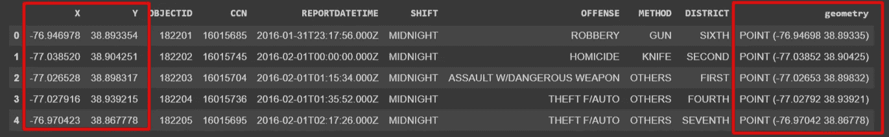
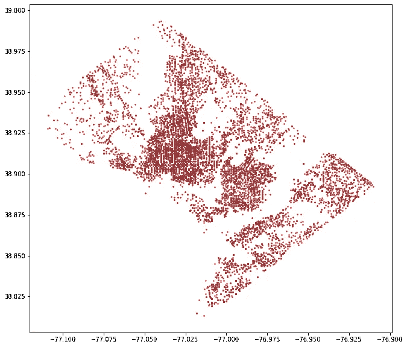
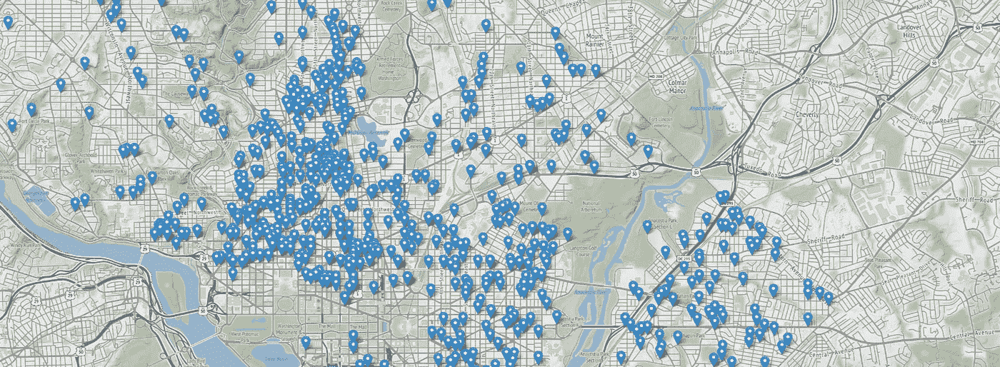
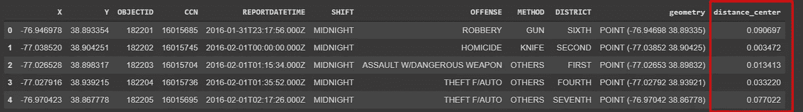
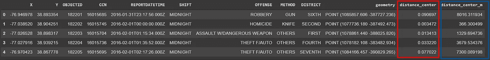
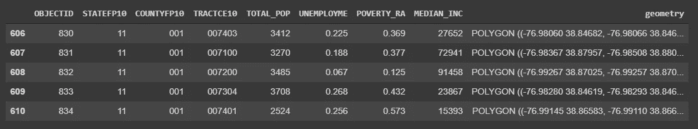
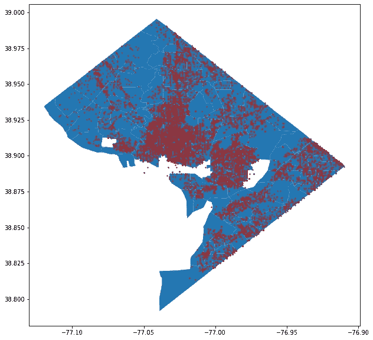
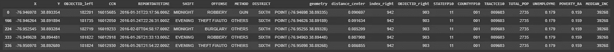

# 关于如何在 Python 中有效使用地理空间数据的 3 个有用提示

> 原文：<https://betterprogramming.pub/3-useful-tips-on-how-to-effectively-use-geospatial-data-in-python-d0e13cf1c9d8>

## 关于如何在数据科学项目中轻松集成地理空间数据的演练教程、代码和示例


[地理空间](https://www.larutadelsorigens.cat/)

在地理空间领域，“80%的数据是地理数据”这句话很常见。虽然我们无法证明这一点，但最近我们看到了地理空间数据集的广泛可用性。

处理地理数据并不容易。它需要领域知识来处理几何和地理投影。我主要处理地理空间数据。在本文中，我将向您展示用 Python 高效快速地处理地理空间数据的三种方法。

如果您有一个包含纬度和经度列的数据集，您很可能知道可以在地图上绘制它们。但就这样吗？你会不会就此收工，也许去探索其他非本地的特性？

在 Python 中，有一种更系统、更有效的方式来处理地理数据。在本教程中，我将探索如何在 Python 中高效地处理位置数据，丰富数据集，并使用 Python 中的特定空间数据工具进行探索。

# 1.将数据转换为地理数据框架

首先，开始将数据转换为地理数据框架。那么什么是地理数据框架呢？

如果你熟悉熊猫数据框架，地理数据框架是建立在它的基础上，具有强大的额外功能来处理地理数据。

地理数据框架不仅提供了数据框架功能的灵活性和丰富性，还具有处理地理数据几何的内置功能，因此得名地理数据框架。

将您的数据转换为地理数据框架会打开许多地理功能，可帮助您快速计算并对数据执行多种有用的地理操作。

将数据转换为地理数据框架所带来的一些功能包括快速绘制不同的地图以及与其他地理可视化库的集成。此外，它允许用一行代码执行几何计算(例如，缓冲区、距离、近邻分析等)。).

所以让我展示一个例子来说明如何将你的熊猫数据框架转换成地理数据框架。在本教程中，我们使用来自华盛顿开放数据平台的数据集。[开放数据 DC](https://opendata.dc.gov/) 的好处在于它允许你直接用他们的 API 访问数据，而不用下载到本地。

```
# Read in Pandas directly from url source
df = pd.read_csv(‘https://query.data.world/s/6joi7hjgjmwifhl2clpldwm36xmvmx')# Convert to Geopandas GeoDataFrame
gdf = gpd.GeoDataFrame(df, geometry=gpd.points_from_xy(df.X, df.Y), crs={"init":"epsg:4326"})
```

在上面的代码中，我们首先用 Pandas 读取数据，并使用 GeoPandas 方法 gpd.points_from_xy `.gpd.points_from_xy()`进行转换。

通过将数据框转换为地理数据框，可以获得一个额外的几何列来处理位置。以下是前五行`gdf`地理数据框数据。



使用 GeoPandas，您可以用一行代码绘制地图:

```
gdf.plot(ax=ax, markersize=2, color=”brown”)
```



华盛顿特区的犯罪地图

如果您想要一个带有底图的交互式地图，GeoPandas 可以与 Python 中的其他地理空间数据可视化工具很好地集成。

让我向您展示使用 follow 将地理数据框绘制成交互式地图是多么容易。

```
m = folium.Map( location=[38.904251, -77.038520], 
                zoom_start=12, tiles=’Stamen Terrain’ )folium.GeoJson( gdf.sample(1000), name=’geojson’).add_to(m)
m
```



在下一篇技巧文章中，让我向您展示我们用这个几何专栏解锁的一些功能的示例，这将帮助您理解坐标参考系统。

## 2.知道你的坐标

地球是圆的，但我们的地图是平的。地球到平面地图的转换过程会带来变形——大小、距离等。坐标参考系统(CRS)可帮助您定位地球表面的要素，因为它为给定数据提供了原始参考框架。

因此，了解您的 CRS 是地理数据处理中的一项重要任务。当您执行任何地理操作时，请考虑数据的 CRS 和投影。

如果您注意到我们将数据框架转换为地理数据框架时，我们还提供了`crs = {"init": “epsg":4326}`，它提供了数据 CRS 的代码。这个特殊的代码(4326)是用于世界大地测量系统(WGS 84) **，**，它被广泛用于定位地球。这种特殊的 CRS 以度为单位进行测量。

有许多 CRS 和投影，如果您不知道如何搜索和找到合适的一个，找到正确的一个有时会很棘手。我通常使用 EPSG.io 来查找正确的 CRS。您可以通过按位置搜索或检查 EPSG 代码(如果您的数据集中有)来找到测量单位。

[](https://epsg.io/) [## 全球坐标系统

### EPSG.io:全球坐标系统(EPSG/ESRI)，在地图上预览位置，获取变换，WKT，OGC GML，项目 4…

epsg.io](https://epsg.io/) 

一旦重叠，具有不同 CRS 的两个数据集可能无法很好地对齐。这是处理地理数据时最常见的错误之一。如果您的数据不在正确的位置，开始检查您的 CRS。

但是更重要的是，用不同的 CRS 执行的操作具有不同的输出。让我通过计算华盛顿特区中心和犯罪点数据集之间的距离来展示一个例子，我们已经将犯罪点数据集转换为地理数据框架。

首先，让我们使用与犯罪数据集(epsg:4326)相同的坐标参考，在华盛顿特区的中心坐标之外创建一个地理数据框架。

```
# City center coordinates
center = Point([-77.036618, 38.907155])# Create a Geodataframe the center point
center_gdf = gpd.GeoDataFrame(gpd.GeoSeries(center), crs={“init”:”epsg:4326"})# rename the column to geometry
center_gdf.rename({0:’geometry’}, axis=1, inplace=True)
```

现在，我们可以用一行代码快速计算距离，就像这样:

```
gdf[‘distance_center’] = gdf.geometry.apply(lambda g: center_gdf.distance(g))gdf.head()
```

而这里是数据集的前五行的输出，包括上面计算的`distance_center`。仔细看看这些数字(用红色突出显示)。



那些数字是什么？你能猜到吗？英尺、米、公里？

除非您知道 epsg:4326 以度为单位测量，否则结果可能看起来很奇怪——甚至可能误导您使用这些结果。

现在，很容易转换到不同的投影。假设我们想用米来计算距离。当我在 [EPSG.io](http://epsg.io) 网站上搜索“Washington”时，我找到了很多 CRS。在做了一些以米为单位的研究后，我找到了这个代码 epsg:8103。因此，让我们看看如何在 GeoPandas 中将数据投影到不同的 CRS 中。

```
# Reproject both datasets-main Geodataframe and center Geodataframegdf_proj = gdf.to_crs({‘init’: ‘EPSG:8103’})
center_gdf_proj = center_gdf.to_crs({‘init’: ‘EPSG:8103’})
```

现在让我们用这个预测数据重新计算距离。

```
gdf_proj[‘distance_center_m’] = gdf_proj.geometry.apply(lambda g: center_gdf_proj.distance(g))gdf_proj.head()
```

看看最后两列的区别。最后一列(以蓝色突出显示)以米为单位测量距离，而未投影数据(以红色突出显示)中的计算距离以度为单位测量。



了解您的 CRS 对您处理地理空间数据有很大帮助。在下一篇技巧文章中，我将探讨如何通过位置连接数据，从而用外部数据丰富数据集。

## 3.通过空间连接丰富数据

特征工程是数据预处理的一个组成部分。但是，您会看到更多的统计特征，如常用于扩充数据集的均值和中值特征。

空间连接通常是一种被忽视的数据扩充形式，它可以丰富数据集并为数据集带来更多要素。

让我给你看一个例子。我们的数据集有犯罪和其他与犯罪相关的属性。如果我们想合并另一个数据集，比如说，城市的贫困率。我刚刚搜索了 DC 开放数据门户，找到了贫困地区的数据集。

这些数据不仅适用于我们的区域，而且我们可以根据自己的目的进行筛选。让我们阅读和过滤贫困数据集。

```
poverty = gpd.read_file(“https://opendata.arcgis.com/datasets/5a357128cf2b490e9c716e03dcc03a3e_62.geojson", usecols=[“OBJECTID”,”STATEFP10", “COUNTYFP10”, “TRACTCE10”, “TOTAL_POP”, “UNEMPLOYME”, “POVERTY_RA”, “MEDIAN_INC”, “geometry”])poverty = poverty[[“OBJECTID”,”STATEFP10", “COUNTYFP10”, “TRACTCE10”, “TOTAL_POP”, “UNEMPLOYME”, “POVERTY_RA”, “MEDIAN_INC”, “geometry”]]poverty_washington = poverty[poverty[“STATEFP10”] == “11”]poverty_washington.head()
```

贫困表还有几列。尽管如此，我们还是筛选出了该地区的总人口、失业率、贫困率和中等收入列。下面是表格的前几行:



我们可以将两种地理数据框(犯罪和贫困)叠加到地图上。

```
fig, ax = plt.subplots(figsize=(12,10))
poverty_washington.plot(column=”COUNTYFP10", ax=ax)
gdf.plot(markersize=2, color=”brown”, ax=ax)
plt.show()
```



现在，我们可以执行空间连接，按位置合并两个数据集。但是我希望您记住第二个提示-在执行任何地理处理任务之前，首先检查您的 CRS。这一次，两个数据集具有相同的 CRS。

```
# Join datasets by locationspatial_join_points = gpd.sjoin(gdf, poverty_washington, op=”within”)spatial_join_points.head()
```

现在，我们通过位置连接数据，这在一行代码中很简单。现在，犯罪数据集中的每个点都具有贫困数据集中的属性。让我们看看空间连接表的前几行。



正如您所看到的，我们已经成功地根据它们的位置合并了两个数据集。我们使用的空间连接只是一种方法。我们执行了一个`within`操作来检查该点是否在多边形内。但是，您也可以使用其他操作— `intersect`和`contain`。

## 结论

我们已经介绍了在 Python 中有效处理地理空间数据的三个技巧，而这只是冰山一角。我无法在这篇文章中列出我最喜欢的所有技巧，但仅这三个技巧就能在处理地理空间数据方面给你很大帮助。

本文使用 Google Collaboratory 笔记本的代码可以在 GitHub repo 获得。

[](https://github.com/shakasom/geospatial-tips/blob/master/Three_tips_geospatial.ipynb) [## shaka som/地理空间-提示

### 此时您不能执行该操作。您已使用另一个标签页或窗口登录。您已在另一个选项卡中注销，或者…

github.com](https://github.com/shakasom/geospatial-tips/blob/master/Three_tips_geospatial.ipynb)