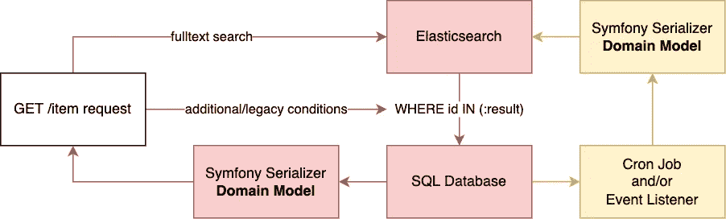
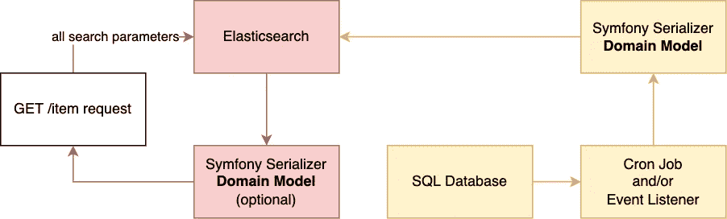
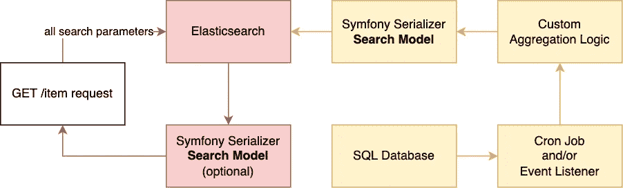

# 在带有 ApiPlatform 的 Symfony 项目中使用 ElasticSearch 的 3 种方法

> 原文：<https://betterprogramming.pub/3-ways-on-how-to-use-elasticsearch-in-a-symfony-project-with-apiplatform-689674f6059e>

## 当您的 SQL 数据库不再支持它时。


照片由[马腾纽霍尔](https://unsplash.com/@laughayette?utm_source=medium&utm_medium=referral)在 [Unsplash](https://unsplash.com?utm_source=medium&utm_medium=referral) 上拍摄

情况:您有一个工作项目，需要添加一个全文搜索。但是大多数数据库(SQL，Document)不包含好的模糊搜索，所以你需要在你的项目中引入一个专门的数据库(比如 Elasticsearch)。

但是怎么做呢？：

# 架构选择

你有多种方法来实现你的搜索数据库。

## 1.附加弹性(用于频繁变更或遗留系统)



架构概述(红色=关键组件)

在这里，您构建自己的 API 平台过滤器，在 Elasticsearch 上运行全文搜索，然后将它改编成一个`id in (:results)`查询。

这有一些优点:

*   ✅ **传统友好**:你不需要改变现有的过滤器和特权检查。
*   ✅ **计算属性:**您可以搜索计算属性，因为`elasticsearch`具有非规范化表示。
*   ✅ **一致性**:你总是从 sql 中获取真实的数据，所以你的结果中永远不会有过时的数据。

但是，这种方法有很多缺点:

*   ❌ **性能**:你总是需要运行两个数据库连接。
*   ❌ **缩放**:你需要从 elastic 获取所有 id，并将它们转发给 sql。
*   ❌ **功能**:使用高级弹性搜索功能变得很困难。
*   ❌ **陈旧搜索**:你可能不会直接注意到 Elasticsearch 中的陈旧数据

**什么时候用？**

*   如果您已经有了一个不能改变的 API
*   如果您的数据经常变化，搜索索引更新跟不上

## 2.弹性替换(针对高负载 API)



架构概述(红色=关键组件)

在这里，你直接在 Elasticsearch 里放上你需要的一切。这意味着在请求期间不再需要主数据库。

*   ✅ **性能**，因为你把所有东西都存储在 Elasticsearch 里。加入复杂的关系也不再有开销。而且 Elasticsearch 可以在多个节点上并行查询，速度非常快。
*   ✅ **计算属性:**您可以搜索计算属性，因为 elasticsearch 具有非规范化的表示。
*   ✅:图书馆支持:这是一些图书馆希望你使用的模式。

但是，这也有不好的一面:

*   ❌ **没有写端点(API 平台)**:你失去了写端点的能力。你也许可以欺骗 API 平台用 SQL 写，用 elastic 读。
*   ❌ **传统支持**:你必须(重新)为 Elasticsearch 编写过滤器和访问权限，如果你已经有了的话。
*   ❌ **陈旧数据和搜索**:如果你的更新任务不完美，你的搜索结果中就会有过时的数据。

**什么时候用？**

*   当您的数据库模型可以按照您需要的方式干净地序列化时
*   当你的搜索是一个主要功能，并且你想使用 elasticsearch 的所有技巧时

## 3.弹性加法(灵活，但难以实现)



架构概述(红色=关键组件)

你，再一次，把你的数据直接放入 Elasticsearch。

然而，您为您的 API 构建了一个单独的模型。这样，它就可以和你储存的东西完全不同。例如聚合、来自文件的值或外部 API。

*   ✅ **最大** **灵活性**:你可以构建一个与你的数据库完全不同的表示
*   ✅ **性能**，因为你把一切都存储在 Elasticsearch 里。加入复杂的关系也不再有开销。
*   ✅ **反规格化包括**:如果你的数据模型复杂或缓慢，那么你可以反规格化成 elasticsearch(而不是先用另一种表示)。
*   ✅ **可以混合模型:**如果你同时有新闻、用户帖子和你想搜索的产品，那么这个架构支持这个。

但是

*   ❌的努力:你建立了一个完全不同的搜索模型和端点。
*   ❌ **图书馆支持**:出于某种原因，几乎没有任何图书馆期待一个独立的搜索模型，所以你只能靠自己了。
*   ❌:陈旧的数据和搜索:如果你的更新任务不完美，你将不得不处理搜索结果中的过时数据。

**什么时候用？**

*   当您的数据库模型有很多关系和/或很慢时
*   如果你需要一个模型，那完全不同于你的领域模型
*   如果您想将多个不同的模型放在一个搜索索引中

# 让我们讨论一下你将会遇到的问题

## 弹性搜索版本

这是一个你必须尽早做出的决定:

*   Elasticsearch 6。*仍然是 PHP 世界中最受支持的软件[，但已经停产](https://www.elastic.co/de/support/eol)。它也是最后一个支持未加密 HTTP 的版本，这使得本地开发简单了许多。
*   弹性搜索 7。*删除了类型，因此有些不兼容(搜索端点的 url 不再包含类型)
*   弹性搜索 8。*在 php 世界基本上没有支持，如果你使用 AWS 的话还有许可问题，AWS 的[分支了 Opensearch](https://opensearch.org/) 。
*   Opensearch 是一个与版本 7 兼容的 elasticsearch fork。

Elasticsearch 7 应该在 2023 年 8 月 1 日之前获得支持，所以我会坚持下去。如果你计划使用 AWS，那么你可以切换到 Opensearch。

## API 平台支持

ApiPlatform 在技术上[支持 elasticsearch](https://api-platform.com/docs/core/elasticsearch/) 。但是所有的 [API 在源代码](https://github.com/api-platform/core/blob/v2.6.8/src/Bridge/Elasticsearch/DataProvider/CollectionDataProvider.php#L32)中都被标记为实验性的，这是有原因的。这些概念没有被充实。他们甚至不支持评分，所以你基本上不能建立一个全文搜索…

您最好构建自己的提供者和过滤器，如果您有指南的话，这实际上非常简单(我将在最后展示给您)

## 弹性纤维束

这是一个很好的包，可以用来开始您的 Elasticsearch 集成，尤其是填充您的搜索索引。

但是实际上用它搜索会让你有些头疼，因为它没有必要有自己的查询语言，这是你想要避免的。

这样一来…

# 实现示例

因为我讨论了 3 种架构，所以我只展示一些一般的细节。我用 elasticsearch 建立了多个项目，不知何故每个项目都略有不同。

## 配置索引

你可以很好地遵循 FOS 橡皮筋包的[安装说明。在要索引的属性上定义一个序列化组，然后配置橡皮筋包以使用该模型和序列化组。这在所有 3 种架构中**都是相似的**。](https://github.com/FriendsOfSymfony/FOSElasticaBundle/blob/v6.1.0/doc/setup.md)

如果您的模型在教条 orm 中，那么它会在更新时被自动索引。您可以使用以下方式触发第一次填充:

```
bin/console fos:elastica:populate
```

如果你尝试实现**架构 3。**，那么你需要创建自己的提供商。手册供应商只有很少的[文档。但是您基本上必须创建一个提供序列化对象的分页器。然后可以在`persistence.provider`下配置该提供者。在那里你可以做任何你想做的特技来创建你的搜索模型。](https://github.com/FriendsOfSymfony/FOSElasticaBundle/blob/v6.1.0/doc/cookbook/manual-provider.md)

## 为变体 2 和 3 配置 API 平台

API 平台可以[与 Elasticseach](https://api-platform.com/docs/v2.5/core/elasticsearch/) 进行本地对话……但在撰写本文时只能与版本 6 进行对话。由于还有许多其他的限制，我不推荐这种实现。

相反，你应该编写我们自己的 API 平台 DataProvider。

这个提供者实现了 **2。第三。**，因为我们可以重用 API 平台实现中的现有类。如果您首先索引了正确的表示形式，并保证了一些性能，那么您可以省略序列化程序。

## 为变体 1 配置 API 平台

这里，您需要在现有的结构模型中构建一个过滤器。有关于如何构建自定义过滤器的指南，如下所示:

[](https://symfonycasts.com/screencast/api-platform-extending/custom-filter) [## 自定义过滤器，getDescription() & properties

### 就像搜索 CheeseListing，感谢 SearchFilter 以及标题、描述和所有者字段:BooleanFilter…

symfonycasts.com](https://symfonycasts.com/screencast/api-platform-extending/custom-filter) 

然后，您的过滤器将看起来像这样:

## 实际搜索

现在，您已经具备了将模型集成到 Elasticsearch 中的一切条件。
接下来，你需要建立你的查询，但是已经有足够多的指南了，比如这个:

[](https://towardsdatascience.com/getting-started-with-elasticsearch-query-dsl-c862c9d6cf7f) [## Elasticsearch 查询 DSL 入门

### 使用 Python Elasticsearch 客户端，用特定领域语言编写 Elasticsearch 查询的实践指南

towardsdatascience.com](https://towardsdatascience.com/getting-started-with-elasticsearch-query-dsl-c862c9d6cf7f) 

我希望这能帮助你开始好的搜索之旅。