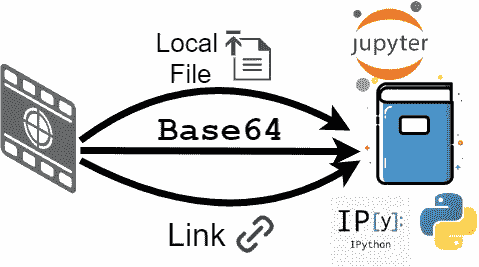
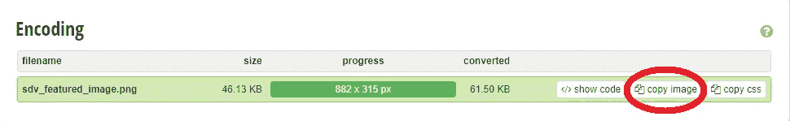

# 向 Jupyter 笔记本添加图像的 3 种方法

> 原文：<https://betterprogramming.pub/3-ways-to-add-images-to-your-jupyter-notebook-61ddfa27e565>

## 并了解一些关于 Base64 编码的知识



作者照片。

Jupyter Notebook(以前的 IPython Notebooks)是一个流行的基于网络的交互环境，最初是由 IPython 项目启动的，目前由非营利组织 [Project Jupyter](https://jupyter.org/) 维护。这是一个创建和共享包含代码、等式、文本和可视化的文档的便捷工具。Jupyter 笔记本可以轻松转换为 HTML、LaTeX、PDF、Markdown、Python 和其他开放标准格式。

在本文中，我将介绍三种向笔记本添加图像的方法。前两种方法非常标准。它们依赖外部资源来说明图像，这些资源使用图像 URL 或从本地文件加载图像。然而，这两种方法都依赖外部资源。为了在不依赖任何外部来源的情况下将笔记本中使用的所有图像包含在笔记本中，我们可以使用 Base64 编码算法来编码我们的图像，并使用这些编码数据来说明它们。因此，我们也将简要讨论 Base64 算法。

这里，我将使用 IPython 的`display`模块中的`Image`类来显示所有图像。

# 方法 1:从本地文件添加图像

您可以通过提供文件路径从本地驱动器添加图像:

```
from IPython import display 
display.Image("./filename.png")
```

这种方法有两个缺点:

1.  提供的本地或绝对路径在另一个系统上可能无法正常工作。
2.  您必须确保将笔记本中使用的所有图像都包含在内，以便与您想要分享的任何人分享。为了方便共享笔记本，您可能会将所有文件压缩到一个 zip 文件中。

# 方法 2:从 URL 添加图像

您也可以使用图像的 URL 链接将图像添加到笔记本，如下所示:

```
from IPython import display 
display.Image("https://<link-to-image>")
```

在这种情况下，图像提供商可能会在不知情的情况下删除图像或更改图像属性。所以，让我们假设你有一个旧笔记本，它有一个断开的图像链接。可能很难恢复原始图像。即使你是从你的网站上获取图片，你也应该小心不要改变图片的链接或属性！

# 方法 3:通过 Base64 编码-解码嵌入图像

前两种方法依赖外部资源。在方法 1 中，我们依赖于 URL，原始链接的任何更改都会影响笔记本中的图像。在方法 2 中，我们使用本地保存的文件的路径。文件名或路径的任何更改都可能会影响笔记本中的图像。与前面的方法不同，方法 3 使用 [Base64 编码算法](https://en.wikipedia.org/wiki/Base64)将图像作为文本嵌入。这样，我们将不再依赖任何外部资源来获得嵌入的映像。因此，我们可以将所有图像嵌入同一个笔记本文件中。

Base64 是一种二进制到文本的编码算法，将数据(包括但不限于图像)转换为纯文本。这是最流行的二进制到文本的编码方案之一(如果不是最流行的)。它广泛用于文本文档，如 HTML、JavaScript、CSS 或 XML 脚本。然而，从技术上来说，你甚至可以编码/解码音频或视频文件！

首先，你需要对你的图像进行编码。为此，你可以使用在线工具 [Base64-Image](https://www.base64-image.de/) 。上传图像后，您可以点击“复制图像”，如下所示:



在 [base64 上传的图片截图-图片](https://www.base64-image.de/)

现在你可以把编码后的图像代码粘贴到你的笔记本上了，但是首先，你要去掉开头的`data:image/png;base64,`。别忘了还要去掉`base64`后面的逗号！

现在我们有了编码的图像代码，我们可以使用 Python 标准 [base64 库](https://docs.python.org/3/library/base64.html)来解码 base64 数据，如下所示:

```
from IPython import display 
from base64 import b64decode base64_data="iVBORw0KGgo.....<deleted to save space!>.....TkSuQmCC" display.Image(b64decode(base64_data))
```

现在，您可能已经注意到，使用 Base64 将所有图像添加到您的笔记本电脑的主要优势是，您不再需要担心图像的任何外部资源，因为它们都包含在您的笔记本电脑中。需要注意的另一点是，根据图像分辨率的不同，将图像包含在笔记本中会增加笔记本的文件大小。

# 结论

在这篇文章中，我们介绍了三种给 Jupyter 笔记本添加图片的方法:

1.  通过 URL
2.  通过本地文件
3.  通过对图像数据进行 Base64 编码

我还提供了一个资源链接，您可以使用它对您的图像进行 Base64 编码。使用 Base64 编码方案的主要好处是减少(甚至删除)笔记本中的任何外部图像。

你可以在 [GitHub](https://github.com/e-alizadeh/medium/blob/master/notebooks/Add_Images_to_Jupyter_Notebook/AddImage2Notebook.ipynb) 上找到这篇文章的笔记本。

感谢阅读！

# 参考

1.  维基百科，[项目 Jupyter](https://en.wikipedia.org/wiki/Project_Jupyter)(2020 年 11 月 16 日访问)
2.  维基百科，[Base64](https://en.wikipedia.org/wiki/Base64)(2020 年 11 月 16 日访问)