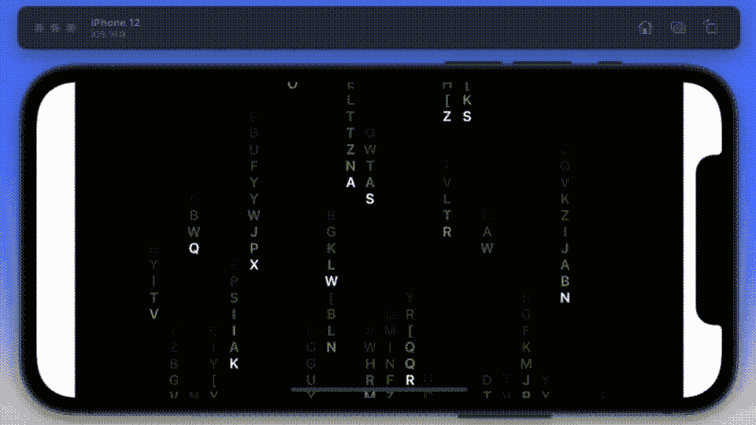
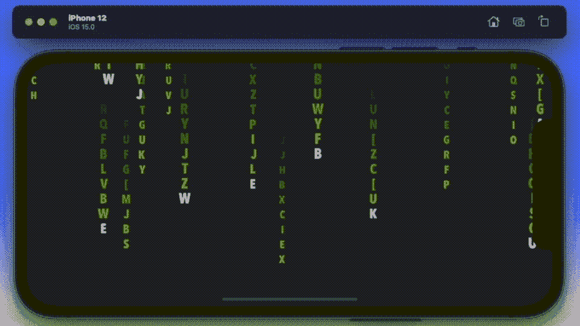
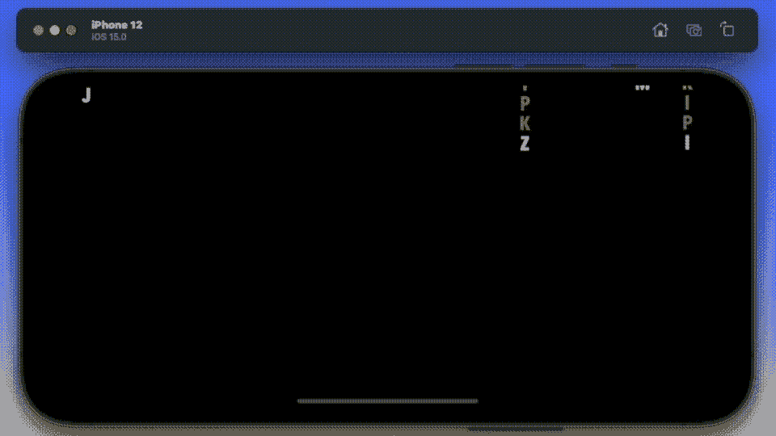

# 在 SwiftUI 中创建标志性矩阵开场演职员表场景的 3 种方式

> 原文：<https://betterprogramming.pub/3-ways-to-create-the-iconic-matrix-opening-credits-scene-in-swiftui-dcdfac072175>

## 并比较各种 SwiftUI 迭代的实现

马库斯·斯皮斯克在 [Unsplash](https://unsplash.com/s/photos/the-matrix?utm_source=unsplash&utm_medium=referral&utm_content=creditCopyText) 上的照片

1991 年，第一部《终结者》电影的续集问世——这部电影远远领先于它的时代，计算机生成的 SFX 至今仍然有效。对比一下 1986 年出的《异形 2》；就在几年前，SFX 看起来已经过时了。但是 1991 年并不是使用计算机生成的 SFX 的分水岭。

1999 年，“黑客帝国”推出了现在标志性的打斗场景，这些场景都是使用电脑控制的摄像机的特殊装置完成的，而不仅仅是电脑。这三部电影很好地说明了这样一个事实，即几乎总是有不止一个解决方案——有些比其他的更好。

正是最后一部电影的片头激发了我在本文中给自己设定的挑战。

在标题序列中看到的绿色背景上复制下落的字符的挑战。加入我的旅程，尝试使用 Swift 为 iOS 13、iOS 14 以及最终的 iOS 15 编写类似矩阵的屏幕。结果喜忧参半，你肯定会惊讶于哪一个结果最好。

# 案情摘要

我想建立一个落款屏幕。有些字母会是镜像——大多数不会。它们需要有不同的大小和不透明度。背景当然是绿色的，每一列中的第一个字母比后面的要亮。这些字母会在不同的时间落下。只有在当前列通过屏幕上的中间标记后，新列才能开始。较小的字母会比较大的字母更暗，给人以深刻的印象。

我想建立三个原型——第一个我计划在 iOS 13 下使用 SwiftUI 最纯粹的意义。其次，我将使用为 iOS 14 推出的 SpriteKit，即 SwiftUI 2.0。第三，我使用 iOS 15 中新的画布视图，也就是 Swift UI 3.0。

# iOS 13 的纯 SwiftUI

让我们从我第一次尝试开始——它看起来像这样。它是使用纯 Swift UI 编写的，所以可以在 iOS 13 上运行。

它几乎做了我在简介中指定的所有事情，尽管它不包括不同大小的字符或颠倒的字符。

动画 GIF 实时显示结果，尽管我运行它的 2014 Retina 开始发热，这种解决方案平均占用 65%的 CPU。

我首先将所有的文本绘制到屏幕上，然后使用一个循环来管理显示字符的不透明度。我敢肯定你没有注意到，但它在每一个运行的每一列显示相同的字母。

我使用 Combine 框架向每一列发送消息以开始运行，在一个循环中用完全相同的消息管理运行。你会看到 32 个进程从头到尾独立地管理着每一行字符。这里有 32 列。

总的来说，我对这个实现很满意，尽管感觉有点不稳定。我确实试着给颜色变化添加了一个`withAnimation`,但是我不能把手放在心上说它工作得更好。

# iOS 14 版 SpriteKit SwiftUI

SwiftUI 2.0 中悄悄加入的一项是 SpriteKit。下面是更多相同的内容，在 SwiftUI 中使用它。

这个解决方案实现了更多，这次包括了更小的字体。事实上，我不确定动画 GIF 是否公正——你需要复制并粘贴代码才能欣赏它。它运行起来也更酷，平均占用 60%的 CPU 这可能是因为`SpriteKit`更容易使用 GPU。

我开始创建一个单独的字符序列，这是一个递归的程序，在不透明的后面用一个较小的数字一遍又一遍地调用它自己。已经有一行运行了，我简单地使用一个重复的`SKAction`来获得多行。下面是动画 GIF 背后的代码。

# CanvasView SwiftUI 和 iOS 15

最后到 Swift 3.0。在这个版本中，Apple 引入了 Canvas 视图，这似乎是我开始使用这个应用程序时的理想选择。

这是我在允许的时间里所做的事情的副本。这个解决方案是第一个和第二个的结合。I 行文本是在屏幕外构建的，然后在屏幕上显示动画。所有的字符行都是预先设定的，它们在运行之间不会改变，大小也不会变化。

有 64 个序列，足以让屏幕保持忙碌，并让用户认为他们不断变化。屏幕上有一个滤镜，可以帮助控制颜色的变化。

我对这个实现有两种想法——它运行起来比 SpriteKit 版本酷得多[大约 30-40%的 CPU],但看起来不那么酷。下面是这个版本背后的代码。

# 最后的想法

总而言之，虽然我希望画布版是终极版，但我得出的结论是，SpriteKit 版更接近原版。最后一个版本是最难实现的，尽管这可能是因为我需要更多地练习核心图形——有趣的是，所有三个版本最终都只有大约 100 行代码；它不是故意的，它只是以那种方式结束。

我认为至少有三种其他的解决方案——你可以使用 Metal 框架作为基础来编写它，你可以使用 UIKit 作为基础来编写它，当然，如果你已经完全疯了，你也可以在 Objective C 中这样做。我希望看到有人尝试这些解决方案中的一个或多个——一个挑战，写下来——并记录在介质上——我将在本文中为未来的读者提供一个链接，链接到您的解决方案。

更好的是，在这里更新一个现有的并张贴出来！一个挑战，让它尽可能接近原始。