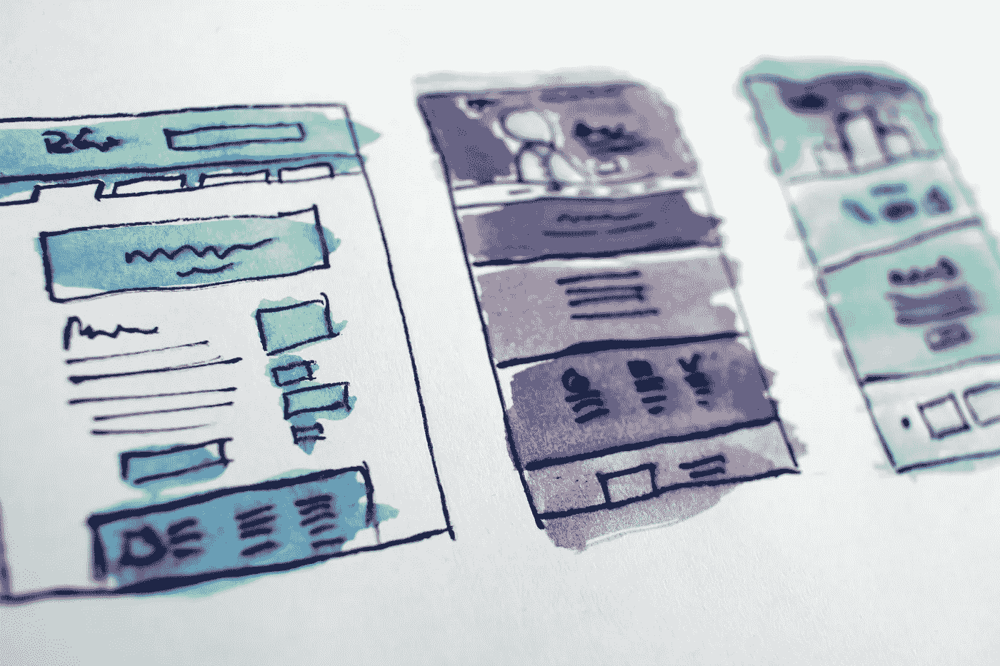
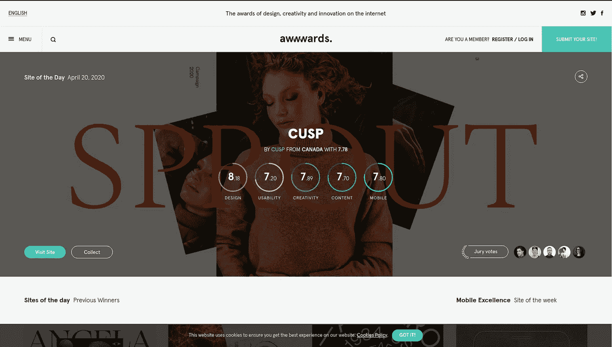
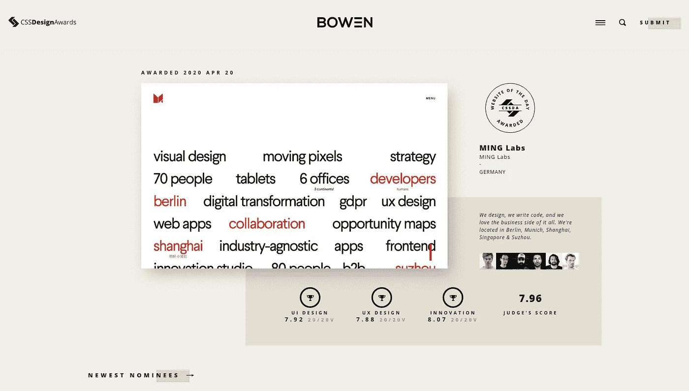

# 作为一名前端开发人员，寻找灵感的 3 种方法

> 原文：<https://betterprogramming.pub/3-ways-to-find-your-inspiration-as-a-front-end-developer-d3a65fe51d8c>

## 激发你的想象力并让你编码的资源

哈尔·盖特伍德在 [Unsplash](https://unsplash.com/s/photos/web-design?utm_source=unsplash&utm_medium=referral&utm_content=creditCopyText) 上拍摄的照片

作为一名前端开发人员——特别是那些没有清晰设计的人，比如那些由专业用户界面设计师用 XD 或 Figma 之类的工具设计的人——很容易很快就失去灵感。你会觉得自己正在做的东西的外观和感觉碰壁了——你遇到了可怕的设计师瓶颈。你很幸运，我去过那里几次，我知道怎么走。

今天，我有三个小技巧来帮助你找到灵感来创建你会引以为豪的漂亮界面。

# 1.访问展示创造性工作的网站

有几个网站展示杰出的前端工作，以帮助激发其他创意专业人士、设计师和开发人员创造更多的精彩。当访问这些平台时，你一定会得到一两个想法，你可以使用或调整以使你的更好。

## [滴水不漏](https://dribbble.com)

Dribbble 的主页

Dribbble 是找到由专业设计师构建的令人惊叹的用户界面的最佳地方之一。从仪表盘到登录页面，再到移动设计，你都能找到。

## [向前看](https://awwwards.com)

[Awwwards](https://awwwards.com) 奖励最优秀、最有创意的开发人员，他们通过令人惊叹的“braingasm”诱导网站将前端开发推向极限。

[**CSS 设计大奖**](https://www.cssdesignawards.com/)

[CSS Design Awards](https://www.cssdesignawards.com/) 是一个奖励优秀网页开发者和网页设计的平台，并展示他们以激励其他开发者。

马歇尔·泰勒的文章提供了这些平台的更全面的列表:

 [## 网页设计灵感的 19 个惊人来源

### 这 19 个网页设计灵感的来源一定会点燃你建立更好的网站所需的创意之火。

webflow.com](https://webflow.com/blog/web-design-inspiration) 

# 2.从你的竞争对手那里获得一些灵感

> 好的艺术家临摹，伟大的艺术家偷窃。

寻找灵感的最好地方之一是在你之前走的人身上——那些已经建造了和你正在制造的东西相似的东西的人。浏览他们的界面，你可以挑选一两件你可以添加的东西，甚至做得更好。虽然我不是建议你复制竞争对手的网站，但我是说你可以从中吸取一些东西，把你的网站做得更好。

# 3.找到新的视角

有时缺乏灵感可能真的只是缺乏不同的视角。

有时候，当一个人缺乏灵感时，可能你看待事物的方式不对，或者大脑已经疲惫不堪。我的建议:休息一下，做点别的。做一些你真正喜欢的事情，让你不去想工作。

获得新视角的最好方法之一是后退一步，从不同的角度看待事物。工作之外做有趣的事情会释放“感觉良好”的荷尔蒙，比如多巴胺。当你快乐和休息好了，你就可以带着更多的精力回到工作中——你获得了从不同角度看待事物的精神毅力。

另一种获得新视角的方法是寻找*另一双眼睛*。将你的设计展示给其他人——开发伙伴、设计师或对技术不感兴趣的人。通常，我发现只需要向其他人解释我所做的事情，这些人对技术一点也不感兴趣，甚至不想在那里，这就是我所需要的，来找出我所缺少的东西。

有时候，某人顺便说的话——他们能看到的东西——是你从不同的角度看待事物所需要的。

# 结论

你的用户是否使用并停留在一个网站上很大程度上取决于它的外观和感觉，这是由前端开发者决定的。因此，前端开发是一项关键而微妙的工作。

虽然很容易失去灵感，觉得一切都是垃圾，但我相信上面列出的建议会帮助你创造出令人惊叹的界面。

我错过什么了吗？没有灵感的时候你还会做些什么吗？请随时留下评论，这样我们可以帮助其他人找到他们的灵感。