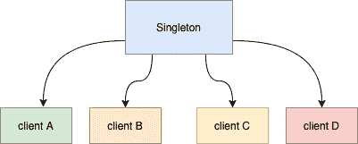
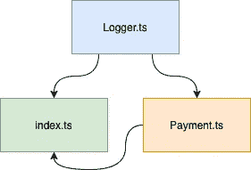
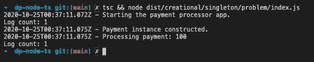
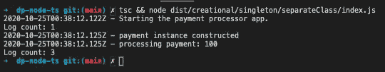
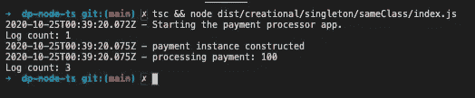
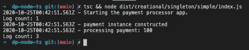

# 用 Node.js 在 TypeScript 中实现单例模式的 3 种方法

> 原文：<https://betterprogramming.pub/3-ways-to-implement-the-singleton-pattern-in-typescript-with-node-js-75129f391c9b>

## *选择最符合您需求的方式*


由 [Geert Pieters](https://unsplash.com/@shotsbywolf?utm_source=unsplash&utm_medium=referral&utm_content=creditCopyText) 在 [Unsplash](https://unsplash.com/s/photos/single-class?utm_source=unsplash&utm_medium=referral&utm_content=creditCopyText) 上拍摄。

单例模式是实现起来最简单的创造性设计模式之一。除了易于理解之外，它不需要写那么多行代码。

在我的职业生涯中，我遇到过使用不同单体实现变体的代码。我认为在一篇文章中编译这些类型的实现会很棒，这样读者可以在他们未来的项目中使用它作为参考。

# 单人审查

让我们先快速回顾一下单例模式试图解决什么问题。单例模式用于维护一个对象的单个*实例，而无需创建新的实例——即使该实例在我们应用程序的不同部分使用。*



作者的 Singleton 高层图。

这种方法适用于您不想重复的对象实例化。实现的一些例子是日志记录、缓存和数据库连接。

在本文中，我们将以日志记录为例。

# 问题—日志示例

这里有一个示例问题:我有一个用于支付处理的 Node.js 应用程序，它使用了一个`Logger`类。在本例中，我们希望保留一个 logger 实例，并确保在整个支付应用程序中共享`Logger`状态。为了简单起见，假设我们需要确保记录器需要跟踪应用程序中记录的消息总数。确保计数器在应用程序中被全局跟踪意味着我们需要一个单例类来实现这一点。



作者给出的示例应用程序的高级示意图。

让我们看一下我们将要使用的每个类。

## 记录器类:Logger.ts

一个基本的 logger 类，允许它的客户端记录带有时间戳的消息。它还允许客户端检索记录的消息总数。

## 付款类别:Payment.ts

`Payment`处理类处理付款。它记录付款实例化和付款处理:

## app 的入口:index.ts

入口点创建一个`Logger`类的实例并处理付款。它还通过`Payment`类处理付款:

如果我们运行上面的代码，我们将得到以下输出:

```
# Run the app
tsc && node dist/creational/singleton/problem/index.js
```



作者输出截图。

请注意，尽管显示了`3`条记录的消息，日志计数仍停留在`1`处。计数保持在`1`，因为在`index.ts`和`Payment.ts`中分别创建了一个新的`Logger`实例。这里的日志计数仅代表`index.ts`中记录的内容。然而，我们还想在`Payment`类中包含记录的消息数量。

下面是使用单例设计模式解决这个问题的不同方法。

# GitHub 存储库(可选)

如果您想了解下面的 TyepScript 代码示例，我使用的代码可以在下面的 GitHub 存储库中找到:

[](https://github.com/ardydedase/dp-node-ts) [## ardydedase/dp-node-ts

### 在 GitHub 上创建一个帐户，为 ardydedase/dp-node-ts 开发做贡献。

github.com](https://github.com/ardydedase/dp-node-ts) 

克隆一个本地副本或者直接在 Gitpod 中运行。

# 解决方案 1:添加一个单独的单例类

我们可以在`Logger.ts`文件中添加一个`Singleton`类。这里的解决方案是你标准的“从书本上拿来的”单例实现，在它自己的`Singleton`类中。

我们熟悉的`getInstance()`方法确保了总有一个实例。您还会意识到 TypeScript 允许我们声明私有构造函数，保证没有其他方法来实例化`Singleton`类。直接使用`Logger` 类而不使用`Singleton`类可以绕过`getInstance()`提供的 singleton。我们可以在解决方案 2 中解决这个问题。

`Logger.ts`文件现在看起来如下。注意添加到文件中的`Singleton`类:

`Singleton.getInstance()` 实例化`Logger`类并确保始终有一个实例:

下面的代码显示了`Payment`类如何使用`Singleton`类:

如果我们运行`index.ts`，我们将通过使用单例设计模式得到我们想要的结果:

```
# Run the app
tsc && node dist/creational/singleton/separateClass/index.js
```



作者输出截图。

最终的日志计数是`3`，这意味着我们的`Singleton`类正在按预期工作。

这种方法简单方便。然而，创建一个新的类并不总是最好的解决方案。有时候，我们需要处理的类越少越好(如解决方案 2 所示)。

如果已经有一个现有的类需要转换成 singleton，我经常看到这种用法。与其修改`Logger`类本身，不如创建一个单独的`Singleton`类来调用现有的类。

# 解决方案 2:修改你想作为单例使用的类

这里的方法是修改`Logger`类，这样它就可以自己实现 singleton，而不必编写另一个类。好处是没有办法绕过作为单例的类的实例化(不像解决方案#1)。

让我们修改`Logger`类，这样单体实例化就发生在类中:

以下是我们对解决方案#1 所做的一些更改:

*   我们已经将`getInstance`方法移到了`Logger`类中。
*   我们已经将`Logger`类的构造函数转换为 private，使得该类的实例化只在该类中可用。

让我们更新`Payment`类以使用 singleton `Logger`类的`getInstance`方法:

让我们更新入口点以使用 singleton `Logger`类的`getInstance`方法:

运行应用程序将输出我们预期的结果，其中最终的日志计数是`3`:

```
# Run the app
tsc && node dist/creational/singleton/sameClass/index.js
```



作者输出截图。

当您从一开始就确定您正在编写的类将是单例类时，请使用这种方法。

# 解决方案 3:最简单的方法——模块单件

对于这种方法，我们将利用节点模块像单例一样的行为。

我们将在`Logger.ts`文件中执行以下操作:

*   移除`Logger`类中的`getInstance`方法。
*   在`Logger`类中公开构造函数。
*   导出`Logger`类的一个新实例。

请注意我们是如何从以前的解决方案中找到这条捷径的。然后我们将从我们的`Logger`类和`index.ts`文件中导入这个单例类。

从`Payment`类导入`Logger`单例类:

从入口点导入`Logger`单例类:

上面的代码应该和前面的解决方案有相同的结果，证明它是单例的。运行以下命令后:

```
# Run the app
tsc && node dist/creational/singleton/simple/index.js
```

我们应该会看到以下输出:



作者输出截图。

*注意:* [*在使用 Node.js 模块时，有一些注意事项*](https://medium.com/@maheshkumawat_83392/node-js-design-patterns-singleton-pattern-series-1-1e0ab71e3edf) *需要注意，在这些模块中，并不总是保证单例性。*

# 结论

如果您有一个想要转换成 singleton 的现有类，而不修改该现有类，那么解决方案#1 通常是适用的。如果你正在编写一个新的类，并且你事先知道它将是一个单例类，那么解决方案#2 是有效的。只要你知道不保证单例的注意事项，我会推荐解决方案#3。

解决方案#1 和#2 要求我们编写更多的代码。然而，这两种解决方案都保证了单例性。