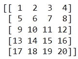
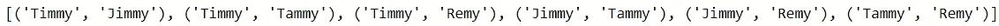
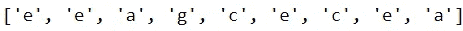
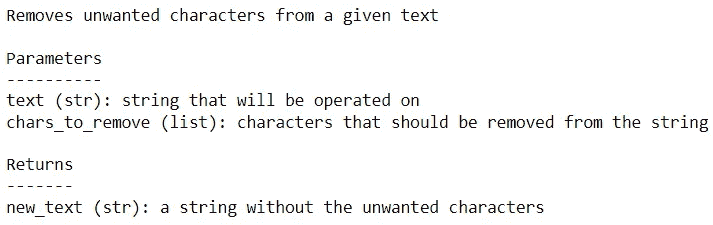

# 提高 Python 代码可读性的 3 种方法

> 原文：<https://betterprogramming.pub/3-ways-to-improve-your-python-codes-readability-bd3e5b6547ca>

## 让您的 Python 技能更上一层楼

萨法尔·萨法罗夫在 [Unsplash](https://unsplash.com?utm_source=medium&utm_medium=referral) 上拍摄的照片

编程中有一句俗话:“代码被读的次数比它被写的次数多”。

不用说，拥有可读的代码有助于一个成功的项目。

它允许你重新审视你的工作，清晰地理解所采取的步骤。它允许您的同事理解您的工作，并在此基础上构建他们自己的代码。

它还可以加快调试速度。当你的代码干净且易于解释时，bug 或错误就更容易解决。

如果你熟悉 [PEP 8 风格指南](https://www.python.org/dev/peps/pep-0008/)，你就已经知道用 Python 写代码时应该采用的正确做法。

然而，如果你认为你仅仅通过遵循指南就已经达到了可读性的顶峰，那你就错了。

在阅读了无数 Python 脚本(包括我自己的)之后，我发现许多人倾向于采用妨碍其作品可读性的做法。

不幸的是，人们没有充分利用 Python 巨大的效用，写出来的代码也不够干净。

根据我的经验，我列出了人们可以做(但不可以做)的三件事来提高代码的可读性。

# 1.利用 Python 的一行程序

Python 是一种非常高效的语言。

它能够用最少的代码执行许多任务。提高代码可读性的最好方法之一是利用 Python 的一行程序。

我经常看到人们花费三到四行代码来完成可以用一行代码完成的操作。

虽然编写额外的代码行并不是一种过分的冒犯，但它确实降低了代码的可读性。所以，最好尽可能采用一行程序。

Python 中最好的一个单句是*列表理解*。List comprehensions 允许您在一行代码中创建一个基于值集合的列表。

例如，下面的代码将 1 到 99 之间所有能被 3 和 7 整除的数字存储到一个列表中:

下面是其他几个只需要一行代码的简单操作。

您可以在一行中分配多个变量:

您可以将列表或元组解包到多个变量中:

交换值也可以在一行代码中完成:

采用一行程序可能看起来是一种微不足道的做法，但是它使您的代码看起来更加优雅和容易。

# 2.依靠 Python 的模块

当阅读其他人的作品时，我经常会遇到一大块代码，并想:“有一个函数可以做到这一点”。

虽然从头开始创建函数有其优点，但通常最好是充分利用 Python 通过其庞大的库集合提供的巨大支持。

这样做将会节省您大量的时间，同时最大限度地减少任务所需的代码行，同时降低出错的风险。此外，任何熟悉该模块的读者都会很容易理解代码在做什么。他们不需要花时间去破解你的方法。

Python 提供了大量的模块，可以让您的生活变得非常简单。为了简洁起见，我将涵盖我一直依赖的那些。

当处理数学运算时， [NumPy](https://numpy.org/) 模块提供了一个可以帮助你的函数宝库。它的效用远远超出了基本算术。

作为一个例子，下面是如何用 numpy 将一个列表转换成一个 2d 数组:

代码输出(由作者创建)

当执行需要多次迭代的任务时， [itertools](https://docs.python.org/3/library/itertools.html) 模块可以派上用场。

例如，我们可以使用`itertools`从姓名列表中找到每个唯一的姓名对:

代码输出(由作者创建)

处理字符串时， [regex](https://docs.python.org/3/library/re.html) 是首选模块。

例如，下面是如何使用 regex 查找给定字符串中 a 和 h 之间的所有字符:

代码输出(由作者创建)

自然，Python 中有无数其他模块可供您利用。

如果您发现自己编写了相同的、平凡的代码行来执行某项操作，那么可以考虑查看 Python 的一些模块，看看是否已经有了可用于该任务的函数。

# 3.解释你的职能

通常，当我读到别人用 Python 创建的函数时，我会花一些时间来处理它。

这可能是因为:

*   守则的目的没有直接说明
*   输入和输出变量类型不清楚
*   当函数被调用时，参数没有被指定

因此，尽管这些函数有适当的命名约定、间距和可读代码的其他元素，但它们可能是不清楚的，并且可能需要时间来破译。

此外，由于这些函数很难解释，它们引起的任何错误都很难处理。

让我们用一个例子来演示一个函数可以有多晦涩。

假设我希望创建一个名为“remove_char”的函数，从给定的单词中删除某些字符。我可以通过创建一个函数，然后将它应用于特定的文本来实现这一点。

简单吧？

好吧，考虑一下从读者的角度理解这个函数要花多长时间。这可能需要一些时间，因为没有提供解释或指导。

该函数的第一个问题是没有指示输入参数`text`和`chars_to_remove`是什么变量类型。此外，没有指示函数返回的变量类型。

Python 是一种动态类型语言。不像 Java 这样的语言，Python 不要求你在赋值变量时显式声明类型。

虽然这使得编码更容易，但它会导致人们养成不在函数中指定参数的变量类型的习惯。

为了清楚起见，最好在创建函数时指定输入和输出的类型。有两种方法可以实现这一点。

第一种方法是实现*类型提示。*这需要指定将被输入的变量类型以及将被函数返回的变量类型。类型提示不是强制性的，但它可以显著提高可读性。让我们将它用于“remove_char”函数。

有了这些附加信息，我们现在知道参数`text`是一个字符串，而`chars_to_remove`是一个列表。函数返回的变量是一个字符串。

指定输入和输出类型的另一种方法是使用一个 *docstring* 。docstring 本质上是用于解释 Python 中的类或函数的字符串。您熟悉的许多函数都嵌入了 docstrings。

使用 docstrings，您可以更详细地解释您的代码。你不仅可以解释你的输入和输出变量，还可以解释其他事情，比如函数中采取的步骤以及可能出现的任何错误。

下面是一种在我们的函数中使用 docstrings 的方法。

有了 docstring，我们可以了解函数做什么，它输入什么参数，以及它返回什么变量。

如果您正在寻找一个 docstring 的好例子，您可以使用`__doc__`属性查看已建立函数的 docstring。下面是在创建的`remove_char`函数上使用属性时的输出。

代码输出(由作者创建)

最后，还有一个如何调用函数的问题。该函数使用*位置参数*。这意味着当函数被调用时，实参根据它们的位置被分配给它们的形参。

这并不是一个严重的错误，因为代码仍然会正常运行。然而，从读者的角度来看，可能不清楚每个参数被赋予了什么参数。您还可能会意外地将错误的参数赋给参数。

有了*关键字参数*，所有的歧义都解决了。

关键字参数不是必需的，特别是对于只有一个参数的函数。然而，对于有两个或更多参数的函数，合并它们将提高代码的可读性。

让我们通过向函数添加一个 docstring 来修改函数`remove_char`，然后在调用它时加入关键字参数。

那就好多了！

# 结论

照片由[普拉蒂克·卡蒂亚尔](https://unsplash.com/@prateekkatyal?utm_source=medium&utm_medium=referral)在 [Unsplash](https://unsplash.com?utm_source=medium&utm_medium=referral) 拍摄

在这里，除了遵循 PEP 8 风格指南，我们还介绍了一些提高代码可读性的方法。

如果您花了一些时间使用 Python，您可能已经熟悉了本文中详细介绍的一些主题。然而，你可能仍然坚持你原来的方法，因为你已经习惯了。

如果这个描述符合你，不用担心；你并不孤单。

我过去常常忽略 Python 的许多强大特性，因为我太习惯于以某种方式编写代码。

当从可读性的角度来评价我以前的作品时，我不得不非常谦虚和客观。一开始很难，但是努力让我开始编写更容易阅读、调试和共享的 Python 代码。

我祝你在编码工作中好运！