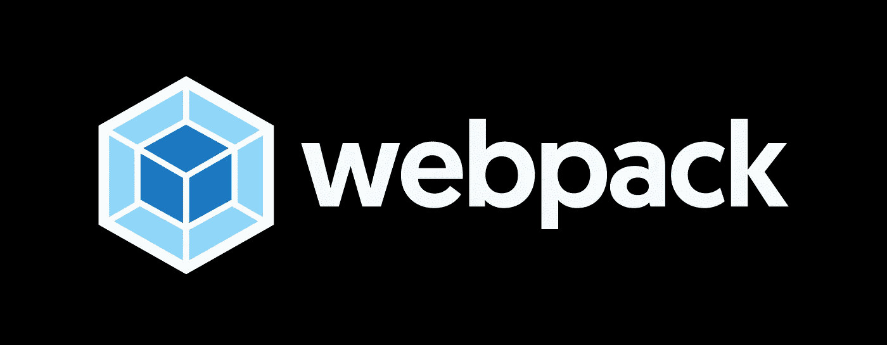
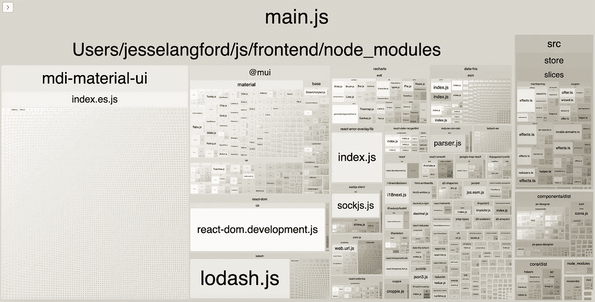

# 使用 Webpack 优化 React 捆绑包的 3 种方法

> 原文：<https://betterprogramming.pub/3-ways-to-optimize-your-react-bundle-with-webpack-5e2711effd54>

## Webpack 捆绑包分析器、代码分割等等



Webpack 资产集合

React 应用程序包含许多第三方库。Webpack 是一个很好的工具，可以将您编写的所有代码和其他人编写的代码捆绑成一个优化的包。

Webpack 的配置功能非常丰富，很容易忽略它提供的一些最有效的优化工具。

我想分享我遇到的进一步优化我的项目包的 3 个最好的技术。

*本文假设您对 Webpack 有基本的工作知识。*

# 1.Webpack 捆绑包分析器

[Webpack Bundle Analyzer](https://www.npmjs.com/package/webpack-bundle-analyzer) 是一个用于可视化您的应用程序正在使用的包的工具。它不会直接减少您的包的大小，但它可以向您显示每个包占用了多少空间。能够看到每个包占用了多少空间可以更好地告知您将优化工作放在哪里。



要设置 Bundle Analyzer，首先要导入包。

```
npm install webpack-bundle-analyzer --save-devoryarn add webpack-bundle-analyzer -D
```

然后将包导入到 webpack.config.js 中

```
const BundleAnalyzerPlugin = require("webpack-bundle-analyzer").BundleAnalyzerPlugin
```

导入包后，将其添加到插件中:

```
plugins: [
  new BundleAnalyzerPlugin()
]
```

下次运行 webpack 时，将会打开一个新的浏览器窗口，显示您的包的明细。

# 2.代码分割

*代码拆分是将代码拆分成不同的包或组件，然后按需或并行加载。*

代码分割不会减少包的总大小。它根据所提供的配置将单个输出文件分割成许多较小的文件。每个文件只有在被请求时才会被加载。

文件越小意味着页面加载速度越快。我发现这对于未经认证的页面特别有用，比如登录、注册和密码重置。

为了让代码分割工作，您需要延迟加载想要分离的组件或页面。我更喜欢按路线来划分。

每个惰性加载的路由将被拆分到它自己的文件中，并按需加载。

如果你想阅读关于代码分解的更深入的指南，你可以在这里找到一个。

# 3.压缩

*压缩是通过对文件数据进行重新编码，使用比原始文件更少的存储位数来减小文件大小的过程。*

压缩是我见过的最有效的减小文件大小的方法。在我自己的项目中，我已经能够将我的项目包的总大小减少 75%。

要启用压缩，请安装[压缩-web pack-插件](https://www.npmjs.com/package/compression-webpack-plugin)

```
yarn add compression-webpack-plugin -Dornpm install compression-webpack-plugin --save-dev
```

然后向插件列表中添加新的配置

```
const CompressionPlugin = require("compression-webpack-plugin")plugins: 
  [  
    ...other plugins, *new* CompressionPlugin({    
      test: /\.js(\?.*)?$/i,    
      filename: "[path][query]",    
      algorithm: "gzip",    
      deleteOriginalAssets: false,  
    }),
  ],
```

Webpack 的压缩插件默认使用 Gzip，但它支持其他算法。如果您使用 Brotli，那么您可以看到您的包的大小减少了更多。

如果你想阅读更深入的压缩指南，你可以在这里找到一个。

## **收尾**

我希望这个列表对那些希望从 Webpack 配置中获得更多好处的人有所帮助。

如果我错过了什么，请告诉我。