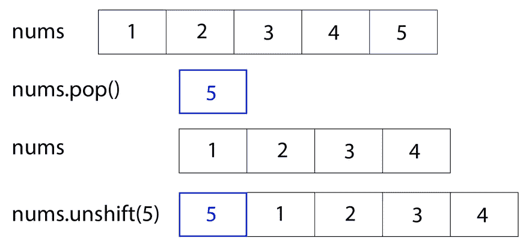
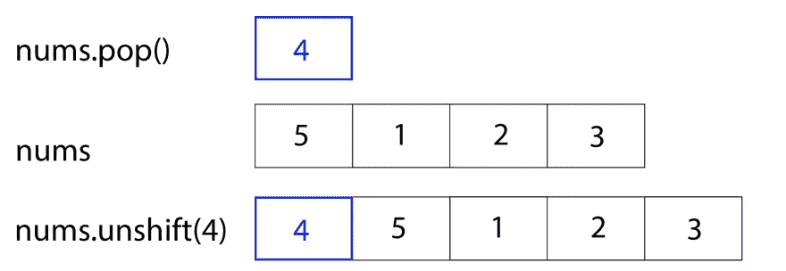
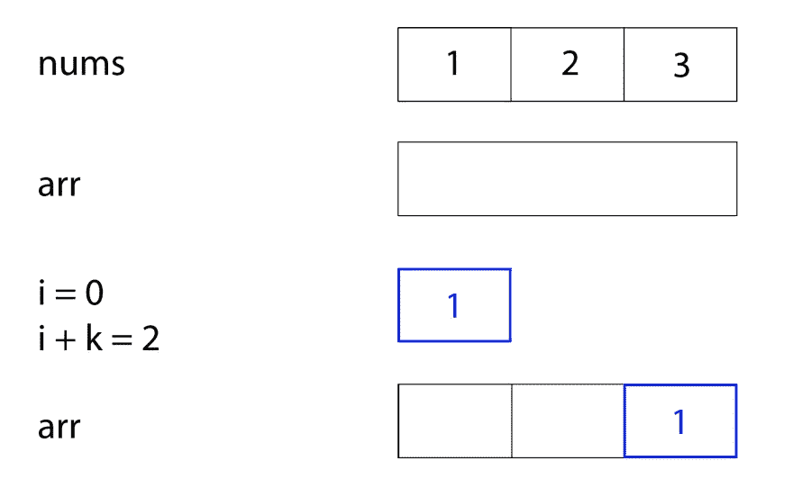
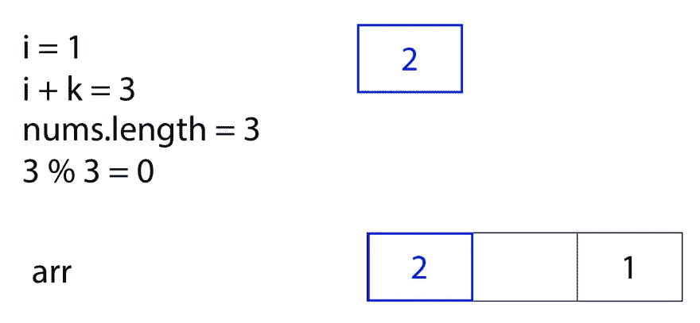
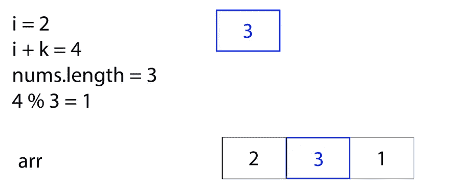
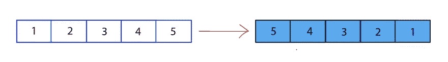
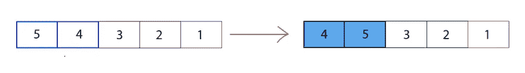
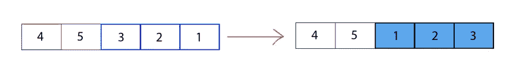

# 旋转阵列的三种方法

> 原文：<https://betterprogramming.pub/3-ways-to-rotate-an-array-2a45b39f7bec>

## 这个算法一点也不简单


照片由[美国公共电力协会](https://unsplash.com/@publicpowerorg?utm_source=unsplash&utm_medium=referral&utm_content=creditCopyText)在 [Unsplash](https://unsplash.com/s/photos/arrays?utm_source=unsplash&utm_medium=referral&utm_content=creditCopyText) 上拍摄

最常见的算法之一是[旋转数组问题](https://leetcode.com/problems/rotate-array/):

> 给定一个数组，将数组向右旋转 k 步，其中 k 为非负。尽可能想出更多的解决方案——至少有三种不同的方法来解决这个问题。你能在有 0(1)额外空间的地方做吗？

例如，如果给你一个数组`[1, 2, 3, 4, 5]`，并告诉你将它向右旋转`2`步，输出应该是`[4, 5, 1, 2, 3]`。向右旋转一次后，数组将是`[5, 1, 2, 3, 4]`，因此向右旋转两次后，数组将变成`[4, 5, 1, 2, 3]`。

在 Leetcode 上，这个问题被贴上了“容易”的标签——他们是如何确定难度等级的，我不太清楚。但是，我觉得这个问题绝不简单。有很多方法可以解决这个问题，这也是我喜欢它的部分原因，我认为每个解决方案都有自己的复杂之处。

在本文中，我将介绍三种不同的方法来处理和解决这个问题:

1.  弹出和取消移动数组中的元素。
2.  创建一个新数组，其中的元素开始移位。
3.  反转阵列的不同部分。


[法尔汉·阿扎姆](https://unsplash.com/@paan_azam13?utm_source=medium&utm_medium=referral)在 [Unsplash](https://unsplash.com?utm_source=medium&utm_medium=referral) 上拍摄的照片

# 方法 1:弹出和取消移动

使用数组时，总会出现一些方法。其中一个是`.pop()`，它“从一个数组中移除最后一个元素并返回该元素”(在这里阅读更多关于`.pop()`)。例如:

```
const arr = [1, 2, 3]
arr.pop() // would return 3
console.log(arr) // would print [1, 2]
```

在数组上使用的另一个常用方法是`.unshift()`。此方法“将一个或多个元素添加到数组的开头，并返回数组的新长度”(`阅读更多关于。unshift() [此处](https://developer.mozilla.org/en-US/docs/Web/JavaScript/Reference/Global_Objects/Array/unshift))。例如:

```
const arr = [2, 3]
arr.unshift(1) // would return 3, the new length of the array
console.log(arr) // would print [1, 2, 3]
```

向右旋转数组也可以认为是将元素从数组的后面移动到数组的前面。在这个问题中，我们希望将元素从数组的后面移到前面，这样做`k`次。在一个将运行`k`次的 for 循环中，我们可以从数组的后面弹出最后一个数字，并将该数字移至数组的前面。

例如，假设我们得到了数组`nums = [1, 2, 3, 4, 5]`和`k = 2`，那么我们应该旋转数组两次。使用 pop 和 unshift，我们将从弹出最后一个元素`5`开始，这将产生`nums = [1, 2, 3, 4]`。然后，我们去移位`5`，把它放在数组的前面，这样`nums = [5, 1, 2, 3, 4]`。



nums = [1，2，3，4，5]；nums . pop()= 5；nums = [1，2，3，4]；nums.unshift(5) = [5，1，2，3，4]

我们再重复一次这个循环，弹出`4`，制作`nums = [5, 1, 2, 3]`，然后解除`4`，给我们最后的答案`nums = [4, 5, 1, 2, 3]`。



nums . pop()= 4；nums = [5，1，2，3]；nums.unshift(4) = [4，5，1，2，3]

## **编码第一种方法**

在我们开始编写这个解决方案之前，关于这个问题还有一点需要注意。假设给定的数组是`[1, 2]`，我们被告知将其向右旋转七次。这个数组的长度不到 7 个元素，所以旋转它 7 次会是很多不必要的工作。因此，在我们做任何事情之前，无论是在这个解决方案中还是在其他方法中，我们都应该使用 modulo ( `%`)来修改`k`。

模运算符返回一个数除以另一个数后的余数。例如，`10%3`将返回`1`，因为 10/3 的余数为 1。同样，在这个问题中，我们想设置`k`等于`k % nums.length`。用同样的例子，如果`k = 7`和`nums = [1, 2]`，那么`k = k % nums.length`与`k = 7%2`或`k = 1`相同。这个解决方案的第一行是这样的:

我们希望按照`k`等于的次数执行`.pop()`和`.unshift()`，因此我们创建了一个重复`k`次的 for 循环。在 for 循环中，我们将`nums.pop()`的结果存储到一个名为`back`的变量中。然后，我们取消`back`的移位，把它放在`nums`数组的开始。

一旦 for 循环停止执行，我们就返回`nums`。

这第一种方法是在线性时间(O(n))和常数空间(O(1))中完成的。

# 方法 2:创建新的数组

在第二种方法中，我们创建了一个新的数组，其中的元素在`k`空格上移动了。这里的想法是，我们可以直接遍历`nums`数组，并将每个元素`k`移动到原来位置的右边。

如果元素应该移动到一个比`nums`数组长度更长的索引，会发生什么呢？在这种情况下，使用模操作符，计算移动到新距离`%`的结果，即`nums`数组的长度。我认为这是这种方法中特别棘手的部分，所以我将使用一个例子。

假设您从数组`nums = [1, 2, 3]`和空白数组`arr`开始。我们被告知`k = 2`，所以数组将向右移动 2 个点。我们从移动`nums`数组的第一个元素`1`开始。`1`位于索引 0 ( `i = 0`)，我们想将它移动两个位置。换句话说，我们希望它在`arr`数组中的位置由索引为`2`的`i + k`决定。



nums = [1，2，3]；arr =[]；I = 0；I+k = 2；arr = [ <empty>，<empty>，1]</empty></empty>

现在，我们在`nums`数组的索引一上，`2`。我们想将它向右移动`k`步，但是`i + k`是 3，这将比`nums`数组的长度更长。所以，要为`2`找到新的点，我们应该做`(i + k) % nums.length`，或者`3%3`，也就是 0。因此，我们应该将元素`2`移动到`arr`中的索引`0`。



I = 1；I+k = 3；nums . length = 3；3 % 3 = 0;arr = [2，<empty>，1]</empty>

最后，我们在`nums`数组的第二个索引上，即`3`。我们想把它向右移动`k`步，`i + k`是 4，比`nums`数组的长度还长。所以，为了给`3`找到新的位置，我们应该做`(i + k) % nums.length`，或者`4%3`，也就是`1`。所以，我们应该将元素`3`移动到`arr`中的索引`1`，给出这个问题的最终结果。



I = 2；I+k = 4；nums . length = 3；4% 3 = 1;arr = [2，3，1]

## **编码第二种方法**

为了开始这个解决方案，我们对`k`做了与第一种方法相同的修改。然后我们初始化一个名为`arr`的新的空数组。

现在，我们使用 for 循环遍历`nums`中的每个元素。在每个索引处，我们将该元素放在`arr`中的新位置。我们可以通过做`(i + k) % nums.length`来找到那个新的地点。所以，我们设置`arr[(i + k) % nums.length]`等于`nums[i]`。

现在，`arr`将是我们想要的旋转后的数组。然而，在这个问题中，我们应该修改`nums`数组，所以我们必须将`nums`中的每个索引设置为等于`arr`中该索引处的值。为此，我们设置了另一个 for 循环。在每个索引处，我们将设置`nums[i]`等于`arr[i]`。当 for 循环结束时，我们可以返回`nums`。

这第二种方法是在线性时间(O(n))和线性空间(O(n))中完成的。

# **方法 3:颠倒截面**

在第三种方法中，我们将反转`nums`的零件。第一次，我们反转整个数组。第二次，我们反转数组的第一个`k`元素。第三次，我们反转数组的最后一个元素，从`k`到末尾。

这种方法背后的思想最好用一个例子来看。我们从数组`[1, 2, 3, 4, 5]`开始，我们希望将它旋转两步。我们从旋转整个数组开始。



[1, 2, 3, 4, 5] -> [5, 4, 3, 2, 1]

现在，我们要旋转第一个`k`元素。由于`k`是 2，我们将在 0 和 1 旋转元素。



[5, 4, 3, 2, 1] -> [4, 5, 3, 2, 1]

最后，我们将旋转最后的元素，从索引`k`到结尾。这给了我们想要的最终数组。



[4, 5, 3, 2, 1] -> [4, 5, 1, 2, 3]

**编码第三种方法** 为了编码这个解决方案，我们将在`rotate`函数内编写一个名为`reverse`的函数，我们将调用它三次。然而，首先，我们将对`k`做与前两种方法相同的修改。

然后，我们会调用函数`reverse`(一分钟后会写)，我们会调用三次。`reverse()`将数组取入，索引开始反转，索引结束反转。因此，对`reverse()`的第一个调用将传入`nums`、`0`(作为开始索引)和`nums.length — 1`(作为结束索引)。对`reverse()`的第二次调用将传入`nums`、`0`(作为开始索引)和`k — 1`(作为结束索引)。对`reverse()`的第三次调用将传入`nums`、`k`(作为开始索引)和`nums.length — 1`(作为结束索引)。

现在，我们可以编写函数`reverse`，它的参数将是`nums`、`start`和`end`。在该函数中，我们切换起始和结束索引处的值，并将起始和结束向中心移动。只要开始小于结束，我们就一直这样做。

所以，我们写了一个 while 循环，只要 start 小于 end，它就会一直循环下去。在循环内部，我们保存了一个临时变量，该变量在起始索引处存储了`nums`数组的值。然后，我们将起始索引处的值设置为等于结束索引处的值，并将结束索引处的值设置为等于临时变量。我们通过增加开始向中间移动，通过减少结束向中间移动。最后，当 while 循环执行后，我们将`nums`返回到`rotate`函数。

一旦每个`reverse()`函数执行完毕，最后一件事就是返回`nums`:

这个解是在线性时间(O(n))和常数空间(O(1))中完成的。

如果你有任何问题或其他解决方法的想法，请在评论中告诉我！

# **资源**

*   [https://leetcode.com/problems/rotate-array/](https://leetcode.com/problems/rotate-array/)
*   [https://developer . Mozilla . org/en-US/docs/Web/JavaScript/Reference/Global _ Objects/Array/pop](https://developer.mozilla.org/en-US/docs/Web/JavaScript/Reference/Global_Objects/Array/pop)
*   [https://developer . Mozilla . org/en-US/docs/Web/JavaScript/Reference/Global _ Objects/Array/un shift](https://developer.mozilla.org/en-US/docs/Web/JavaScript/Reference/Global_Objects/Array/unshift)