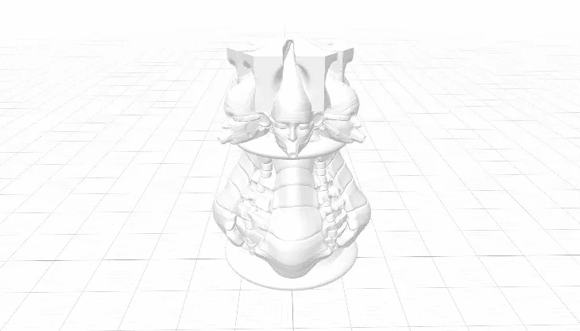
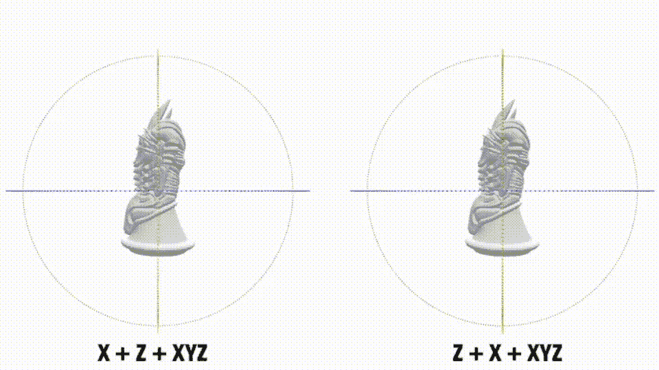
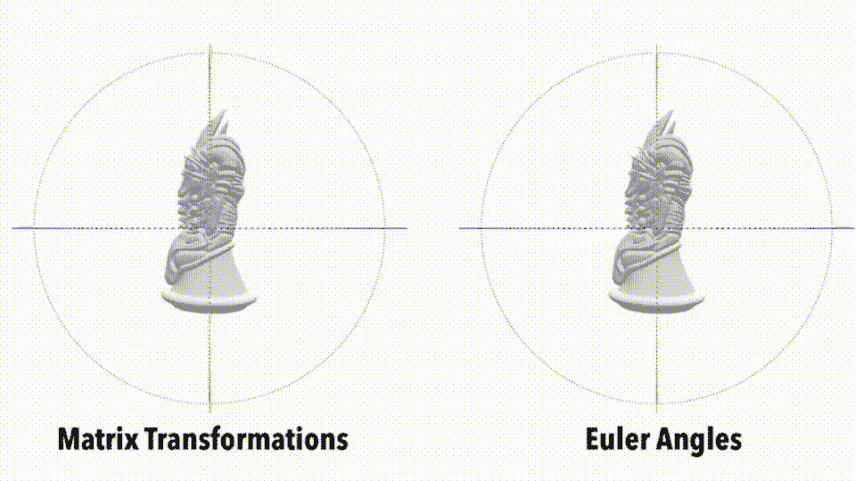
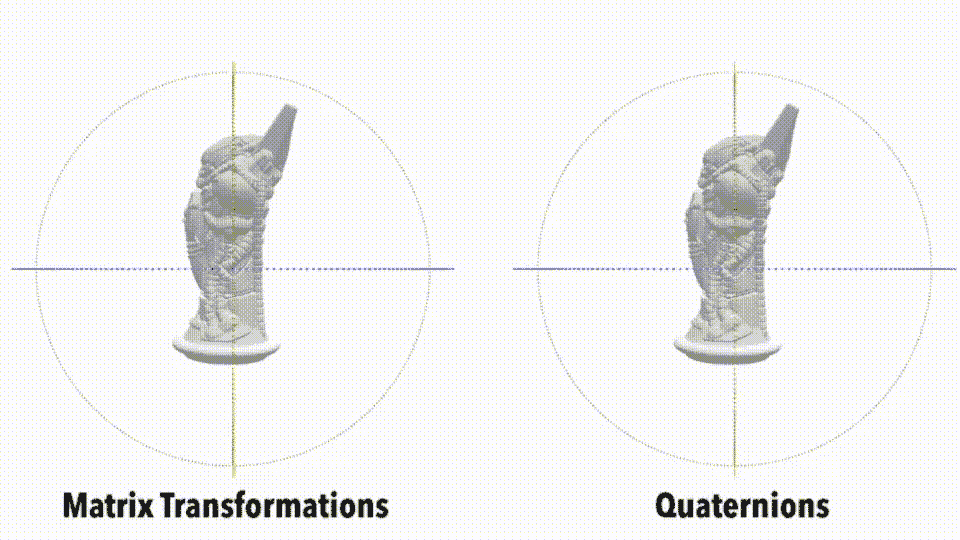

# 在 SceneKit 中旋转对象的 3 种方法

> 原文：<https://betterprogramming.pub/3-ways-to-rotate-objects-in-scenekit-86ed8c2f5490>

## 看看在 SwiftUI 的 SceneKit 中旋转对象的不同方法



文章中的一个棋子[构建一个 3D 象棋游戏](/start-building-a-3d-chess-game-using-scenekit-and-swiftui-3d072b025db2)

与编码中的许多构造一样，通常有不止一种方法来做同样的事情。有时他们之间的差异是显而易见的，一个循环的经典案例。每个循环都可以有 repeat/while、do/while 或。

当然，SceneKit 中的框架也不例外，至少有三种方法可以旋转想到的对象；这是任何 3D 框架的核心部分。

但是与我们的循环示例不同，在循环示例中，差异是显而易见的，理解在 SceneKit 代码中进行旋转的差异可能是令人困惑的。的确，用不同的方法转向同一个角度，有时会得到不同的结果。请和我一起看看这三种选择，以及它们可能会让你失败/愚弄你的地方。我想看的三个列在这里。

*   `SCNActions`
*   换位
*   四元数

# 场景

我在 SceneKit 上发表的[前几篇文章](/adding-gestures-to-your-swiftui-rubik-cube-app-12ed853ce0aa)中使用了这些。在我看来，这是在代码中制作旋转/变换动画的最简单的方法。

挑战——使用`SCNActions`,您可能遇到的第一个问题是精度下降。当你运行一个`SCNAction`，要求它停留在完成时的位置(这不是默认的)，你很快就会发现旋转 90 度可以得到 89.9998。我不认为这对许多应用程序有什么影响，当然对游戏来说也是如此，但是如果你小心的话，它可能会破坏程序。

但是等等——精度并不是唯一的问题，因为`SCNActions`本质上使用的是欧拉角。想到了至少两个进一步的问题，这两个问题都与在不止一个平面上移动物体有关。这个动画 GIF 展示了第一个—



你看到的是 X 和 Y 平面上 45 度的旋转。我对两个模型都应用了相同的旋转，但是根据我使用角度的顺序，我得到了不同的结果。这很微妙，但仔细观察，你会发现不同之处。改变顺序后我移动得越多，就越明显。

插图后面的代码是[gotcha],在包含`SCNAction.sequence`的行中。复制代码并在您的模型上运行，您将得到相同的结果。请注意，我使用订阅类型的设置将我的`GameScene`链接到我的 SwiftUI 界面。

现在将`SCNAction.sequence`改为`SCNAction.group`并重新运行相同的代码。第二次它会起作用；只有两者会以相同的角度结束。这个上下文中的`SCNAction.group`意味着并行地进行变更。

但是等等——因为你还没有脱离困境，并行运行你的旋转可能绕过序列问题，但是还有第二个更隐蔽的问题可能出现，即万向节锁。

当你的两个轴在同一个平面上时，你得到了万向锁定。当这种情况发生时，你失去了在你的三个平面之一移动的能力。

鉴于 giro-scopes 对飞机和宇宙飞船相当重要，您可以放心，也有一个解决万向锁的方法，尽管我不确定我是否会在您的代码中麻烦地实现它。您可以通过添加第四个轴来固定它，您可以在该轴上旋转。

# `SCNMatrix4MakeRotation`

我想说解决框架挑战的真正办法是使用矩阵变换，这是真的——但事实并非如此。我用一个动画 GIF 引导这一部分，它使用欧拉角和矩阵变换来做同样的动作。



我可以将红色和绿色的轴对齐，有效地将自己放入万向锁中。然而，有一个关键的区别。对于欧拉角，我不得不在三个平面上分割我的旋转，并使用类似动作的东西来组合它们——通过变换，我可以同时完成它们[此处未显示]。这样做的好处是，我怀疑你可以更有效地发现矩阵代码中的万向锁定。

我在这里展示了左边进行转换的代码。在不利方面，我认为它比欧拉角更难理解。

显示的代码只是三个平面中的一个，它们本质上都是一样的。当然，就像`SCNActions`一样，你转换的顺序会影响结果。我在这里使用的一个有用的代码特性是`SCNTransation`来制作动画。事实上非常有价值，因为不像 SwiftUI 中的动画，它给你一个完成块，直到动画结束才会触发。

# 四元数

现在，我必须承认在这个例子中——我不确定这说明了这些东西的力量，它们能做的比我今天要用的多得多。

四元数是图形动画中的黄金标准；它们速度快，占用空间少(比矩阵少)，而且没有万向锁定问题，但缺点是不容易使用。

这是移动我们的`redNode`方向的代码，就像我们移动矩阵和欧拉角一样。虽然代码看起来有点像 C，但请放心，它很快。

代码的动画 GIF 看起来很像上一个，注意，虽然看起来好像我使用四元数失去了一个自由度，但我没有。



# 结论

我认为公平地说，无论你最终在项目中使用什么方法，你都应该坚持下去。使用不同的方法来旋转物体会被认为是不良的做法。你也可以通过仔细选择万向锁发生的方向来编写代码。[这是一个很棒的视频](https://www.youtube.com/watch?v=zc8b2Jo7mno)，完整地介绍了欧拉角。

所有这些使我想到了本文的结尾。我希望你能像我写这本书一样喜欢读它，并像我一样，在这个过程中学到一两件事。

这里有一个链接，链接到我为展示[演示图](https://bitbucket.org/wizard1066/scenekits/commits/fc82eca1383744a7a65599400081c3694c6ed2c6)而构建的代码库——一个文件中有两个文件；它不是一段即插即用的代码，是按原样提供的。

```
**Want to Connect?**Join me on [LinkedIn](https://www.linkedin.com/in/mark-lucking-4631049/) to connect, collaborate or just a chat.
```

[](https://omar-shehata.medium.com/how-to-fix-gimbal-lock-in-n-dimensions-f2f7baec2b5e) [## 如何固定 N 维万向锁

### 如何将四元数推广到更高维？为什么万向节锁有时会发生…

omar-shehata.medium.com](https://omar-shehata.medium.com/how-to-fix-gimbal-lock-in-n-dimensions-f2f7baec2b5e)