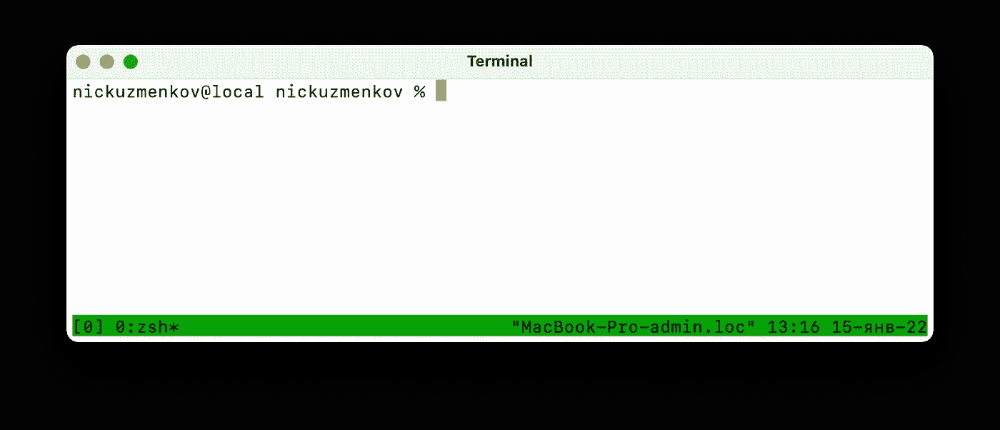
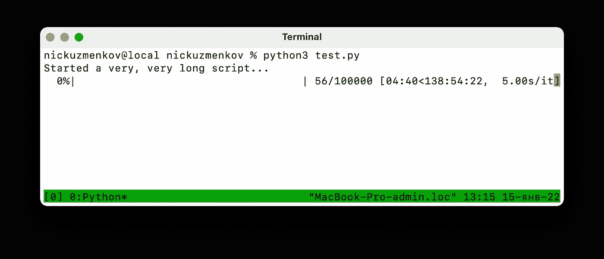
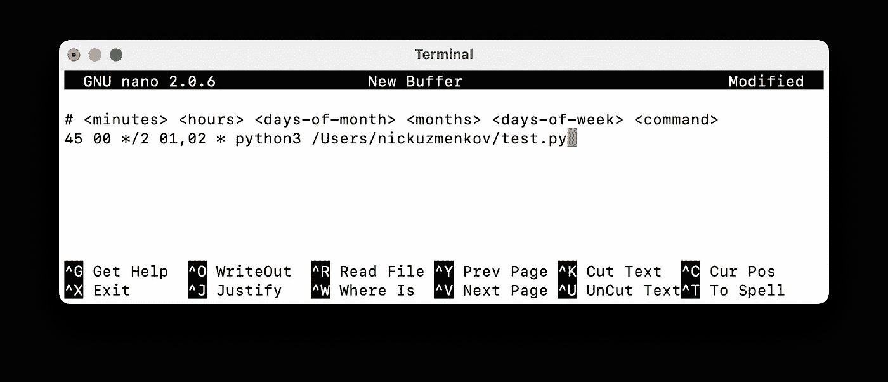
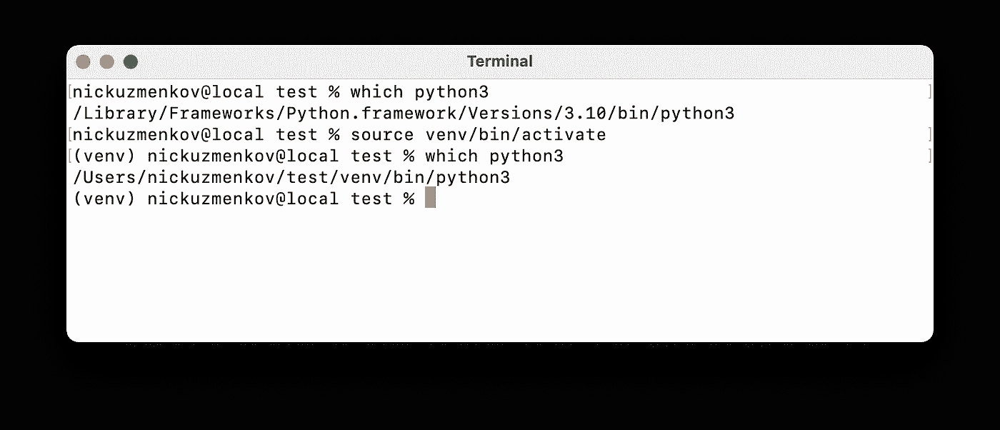
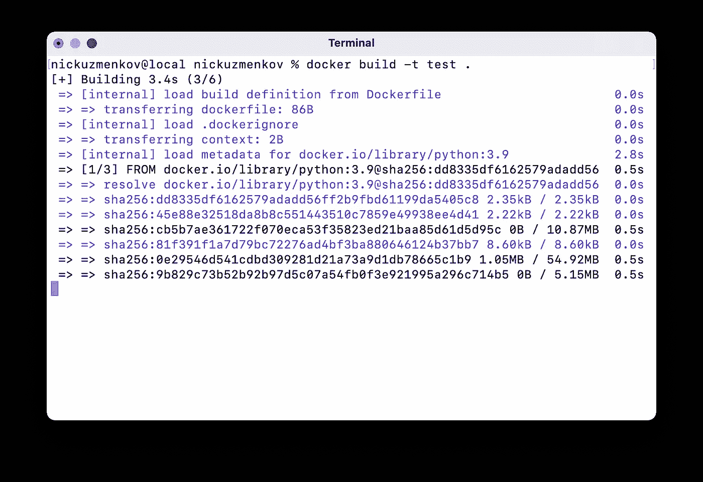
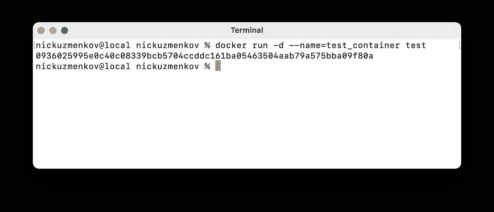

# 运行分离命令的 3 种方式

> 原文：<https://betterprogramming.pub/3-ways-to-run-a-detached-command-d9286db2cfef>

## *没必要整天开着你的终端*

照片由[格伦·卡斯滕斯-彼得斯](https://unsplash.com/@glenncarstenspeters)拍摄，来自 [Unsplash](http://unsplash.com)

当您将要运行一个需要大量时间才能完成的繁重脚本时，就会出现这种情况。或者让某个进程在每天的某个时间运行。或者托管一个 API。让您的本地机器开着，终端打开几个小时，这绝不是一种选择。

在这里，我将向您展示 3 个简单的解决方案，以及每个解决方案的常见用例、优缺点和代码片段，以便快速入门。

为了简单起见，我假设您必须在一台远程机器上运行一个 Python 脚本，该机器具有类似 Unix 的操作系统。可以是亚马逊 EC2，你公司的服务器，也可以是你的树莓 Pi。这可以进一步扩展到其他语言或命令，不一定是在遥控器上。

# 1.tmux

Tmux 是一个终端复用器，这意味着它可以将终端功能提升到一个新的水平。可以将一个 tmux 窗口分成多个布局可调的窗口，跨多个窗口运行命令，等等。您还可以使用 tmux 创建*会话*，并随时在它们之间切换，而不会中断任何现有的进程。

当您需要安全地提交一个需要几个小时才能在远程机器上完成的繁重脚本时，Tmux 是完美的。但是对于 API 托管或预定的常规脚本运行，您可能应该考虑其他选项。

## 快速入门

只需在你的终端输入`tmux`。请注意底部的一条绿线，表示您正在一个新的 tmux 会话中:

新建 tmux 会话

左下角方括号中的数字是唯一的会话标识符。在这种情况下，它是 0。现在您可以执行任何您想要的命令，tmux 与您的常规终端没有什么不同。这里我们简单地运行一个 python 脚本:

在 tmux 中运行示例命令

然后键入`Crl+B`,再键入`D`,退出会话。一旦您返回到您的常规终端，您可以列出所有会话，通过其标识符附加到会话或终止它:

管理 tmux 会话:列出、附加和删除

## 优点:

*   预装在大多数系统上
*   所有可用的终端命令

## 缺点:

*   您的代码可能会由于系统相关的更改而中断:删除文件、更改包版本或环境变量等。
*   不适合安排任务
*   重新启动时不恢复会话

如需进一步阅读，请参见[文档](https://tmuxguide.readthedocs.io/en/latest/tmux/tmux.html)。

# 2.时间单位

Cron 是一个功能强大的系统工具，旨在以指定的频率在后台执行命令。您可以使用简单的通配符语法选择命令执行的任何周期。您应用的所有更改都会立即生效，并在系统重新启动之间保持一致。

因此，Cron 是为本地或远程机器调度任意数量的轻量级后台命令的好选择。然而，这主要适用于你的副业。如果你开发一个真实世界的应用程序或者微服务，可以考虑转用 Docker 或者其他容器化系统。

## 快速入门

要计划一个新的 cron 作业，请在终端中键入`crontab -e`。将弹出一个文本编辑器。转到文件末尾，使用以下语法在底部添加一个新行:

使用 cron 调度作业

前面五个空格分隔的字段指定作业执行计划。允许的值有:

*   正确范围内的数字(例如，0–59 代表分钟，0–23 代表小时)
*   逗号分隔的数字列表
*   星号(`*`)代表每个(分钟、小时、日等)的*。)*
*   带数字(`*/n`)的星号代表每第 n 个的

*例如，上面的示例(`45 00 */2 01,02 *`)表示在每年一月和二月的每两天的 00:45 AM 运行。*

*字符串的其余部分指定了实际的命令。除了应该是绝对路径之外，它与您的终端中的相同。强烈建议对可执行文件也使用绝对路径。你可以用`which <executable>`命令得到它，例如:*

**

*获取 python3 在虚拟环境内外的绝对路径*

*准备好后，保存文件并退出。就这样，更改会立即生效。*

## *优点:*

*   *作为一个系统工具，cron 是内置的*
*   *方便的单一命令界面，用于安排任务*
*   *所有可用的终端命令*

## *缺点:*

*   *您的代码可能会由于系统相关的更改而中断:删除文件、更改包版本或环境变量等。*
*   *不适合重命令和一次性命令*
*   *当扩展到数十或数百个任务时，调试变得困难*

*如需进一步阅读，请参见[文档](https://help.ubuntu.com/community/CronHowto)。*

# *3.码头工人*

*Docker 是其中最难上手的，但也是最强大的。在分离模式下运行命令的能力只是它的附带好处。它的大部分功能来自于完整的平台抽象，也就是说，它可以在任何机器上无缝地运行您的代码，并且该机器上的任何更改都不会影响它。这使得 Docker 成为交付现实世界应用程序的广泛使用的工具。如果你还不熟悉 Docker，它绝对值得你花时间去了解。*

*Docker 用于各种各样的任务。这可能是在远程运行本地测试脚本的最佳解决方案。然而，Docker 本身无法安排常规脚本的运行。*

## *快速入门*

*在这里，我只向您展示一个简短的工作示例，而不会太深入。首先，创建一个名为`Dockerfile`(不带扩展名)的新文件:*

*Dockerfile 文件*

*Dockerfile 是一个关于如何创建*映像的代码指令(通常称为 *infrastructure-as-code* )。*映像只是您的脚本的高级抽象，包括它的所有依赖项，甚至是操作系统。这里我们定义一个安装了 python 3.10 的全新操作系统(Ubuntu 或 Debian)的虚拟机。然后我们从`requirements.txt`文件安装所有需要的包。最后，我们将脚本文件`test.py`复制到机器上，并告诉它在启动时执行它。*

*您现在可以创建一个名为`test`的新图像，如下所示:*

**

*从 Dockerfile 构建新图像*

*这可能需要几分钟时间。然后，您需要告诉 Docker 从您的映像创建一个名为*容器、*的新虚拟机，并打开它。容器与任何其他基于 Unix 的机器没有什么不同:您可以通过 ssh 连接它、执行 bash 命令、复制文件等等。*

*现在从您的`test`映像运行一个名为`test_container`的新容器:*

**

*以分离模式运行新容器*

*注意`-d`标志，它表示容器以分离模式启动。您可以通过键入`docker ps`来确保您的容器正在运行。*

## *优点:*

*   *生产就绪解决方案*
*   *可用的命令取决于您选择的图像*
*   *失败时能否自动重启容器*
*   *您的代码不会因为系统相关的更改而中断:删除文件、更改包版本或环境变量等。*

## *缺点:*

*   *未预装*
*   *需要`sudo`(如果您在远程机器上没有它，这可能是一笔交易)*
*   *很难收拾*

*如需进一步阅读，请参见[文档](https://docs.docker.com/)。*

# *结论*

*还有其他方法来运行分离的命令。我相信这些只是最常见的。这些不是“前三名”，因为每一个都更适合不同的用例。但是，一定不要因为 Docker 不好接就避开它。它非常强大，是许多技术工作(不仅仅是开发人员)和公司所需要的。*

# *参考*

1.  *[tmux 文档](https://tmuxguide.readthedocs.io/en/latest/tmux/tmux.html)*
2.  *[cron docs](https://help.ubuntu.com/community/CronHowto)*
3.  *[Docker 文档](https://docs.docker.com/)*

*像往常一样，感谢阅读，下次见。*