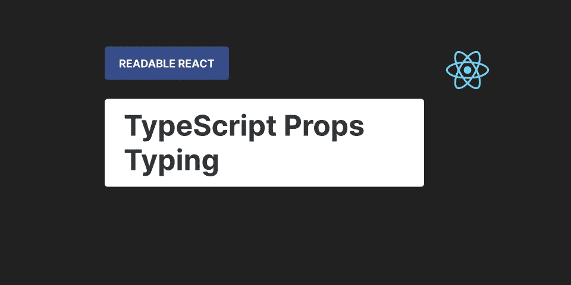

# 用 Typescript 键入可读 React 组件属性的 3 种方法

> 原文：<https://betterprogramming.pub/3-ways-to-type-readable-react-components-props-with-typescript-a2991e59065e>

## 可读反应:类型脚本属性类型

作者图片

TypeScript 是 React 最具标志性的合作伙伴之一。有些人甚至认为 TypeScript 和 React 是天造地设的一对。在 React 代码库中，TypeScript 最常见的用法之一是键入组件的属性。很有可能每个带有 TypeScript 的 React 项目都会以某种方式为至少一个组件实现 props 类型。在一个正确类型化的项目中，每个组件都定义了 props 类型并不罕见。

但是，尽管它如此常见，并且是 TypeScript React 项目的一个重要部分，您是否曾经考虑过组件的 props 类型的可读性如何？

如今，很难想象没有 TypeScript 的任何中型或更大的 React 项目。带 TypeScript 和不带 type script 的 React 项目之间的差异是显著的。如果您曾经使用过这两种类型的 React 项目，TypeScript 的影响将变得非常明显。即使是小项目，它的价值也已经可以感受到了。它不仅消除了 JavaScript 的大量歧义，还极大地影响了代码项目的可维护性、可伸缩性、安全性和组织。

但是就像保持我们的 React 代码可读是多么重要一样，这同样适用于类型脚本代码。在一个规模相当大的类型化 React 项目中，类型脚本代码的比例是很大的。代码也需要维护，因此对于确保一定程度的质量非常重要。要做到这一点，重要的是从基础开始，为接下来的打字打下良好的基础。

本文将讨论和分析实现 React 组件的 TypeScript props 类型的三种不同方式。我们不仅会查看每种方法的优点和缺点，还会讨论可读性和不同的用例。这些信息将为您提供一个坚实的基础，告诉您如何以可读的方式实现组件的属性类型。阅读完本文后，您将能够应用这些方法，确定代码可读性下降的时间，并通过在这些知识的基础上进行构建来保持更复杂的结构的可读性。

为了恰当地说明不同的方法，我们将在本文中使用一个示例问题。我们将使用这个例子，在每个部分中使用不同的方法实现缺失的属性类型。基于这些实现，我们将研究它们的优点、缺点、用例以及可读性。

在这个示例问题中，我们有一个组件，它接收一组文章，将它们呈现到单独的卡片组件中，并将它们放在屏幕上的一个单独部分。对于这个例子来说，每篇文章只有一个标识符、封面的图片 URL、标题和副标题。这体现在`Article`型上。

第二个组件`ArticleCard`接受这些属性并相应地呈现它们。在商品属性之上，该组件还接收一个大小属性。这是一个枚举值，它决定了呈现的文章卡片的大小，与原始文章对象无关。

现在的目标是使用已经提供的所有信息实现`ArticleCard`组件的道具类型。让我们来看看我们能做到的不同方法。

# 写出每种道具类型

实现组件属性类型的最常见方式是显式写出每个属性类型。这意味着每个属性的名称和类型都是在组件属性类型中单独定义的。一般来说，它看起来如下:

这样做的最大好处是所有的输入总是显式的。如前所述，每个道具的名称和类型都被明确地写了下来。所以总是很清楚哪些道具在组件的道具类型中，哪些不在。使用这种方法可以避免各种歧义，这本身就极大地提高了代码的可读性。

另一个优点是，读者拥有理解组件在单一位置输入的属性所需的一切。因为它的明确性，读者从来不需要接触任何额外的资源、类型或文件来理解适当的类型。这防止了大量的文件和行切换，这允许读者避免不必要的分心或失去焦点。这对 React 代码的可读性非常有益，尤其是当读者在几乎不存在 IDE 支持的浏览器中查看代码时。

最后，还有未来调整的话题。这可能是维护、重构、错误修复或任何其他需要接触 React 组件的道具类型的编程相关活动。因为这种方法不需要外部依赖，所有东西都在一个地方，所以能够理解现有代码并做出更改变得非常简单。无论类型是否需要更改、移除或添加，它们都可以按原样进行类型化，而不必引用外部资源。

这种方法的主要缺点是冗余。所有的道具类型总是在每个组件的道具类型中重复出现。每个道具都是用最基本的结构重新定义的，比如原始类型。这相当于不重用 JavaScript 代码中的任何变量，总是从头开始实例化它们。这引入了大量重复的代码和冗余，对可读性产生了滚雪球般的负面影响。

另一个缺点是缺乏关于类型之间关系的上下文和信息。这适用于 React 代码库中的所有类型，而不仅仅是组件的 props 类型。但这确实会直接影响他们。这是刚才讨论的 TypeScript 代码冗余的直接结果。这种关于类型之间关系的上下文和信息的缺乏可能对未来的工作有害。它不仅影响可读性，而且还会严重阻碍未来的维护、重构和错误修复。

## 赞成的意见

*   打字总是显式的。
*   读者永远不需要额外的资源，打字，或文件来理解道具类型。
*   未来的调整很简单。

## 骗局

*   所有的打字都是重复的。
*   没有关于类型之间关系的上下文或信息。
*   如果原始打字改变，所有用户都需要调整打字。

# 引用原始对象类型

实现 React 组件的属性类型的另一种方法是引用原始对象类型。这非常类似于单独写出属性类型，因为每个属性名称仍然是单独定义的。但不是对类型做同样的事情，而是尽可能地从原始对象类型中重用它们，如果它们存在的话。一般来说，这将如下所示:

使用这种方法实现组件的道具类型的主要优点是我们重用了原始对象类型的类型。这明确地在新创建的类型和原始对象之间建立了一个连接。拥有这些关于类型之间关系的信息不仅有利于未来的开发相关活动，而且有利于可读性，因为它使理解 React 代码的上下文变得更加容易。

另一个优点是，我们试图输入的组件总是可以使用他们喜欢的任何专有名称。无论是为了避免命名冲突，还是出于上下文的考虑，有时都需要重命名原来的道具名。这种方法允许你自由地这样做，而不必调整打字。

最后，当在未来与开发相关的活动中需要调整类型时，只需要在一个地方进行。在组件的 props 类型中引用这样的原始对象类型类似于在通常的代码中应用不要重复自己(DRY)的概念。这对于将来的维护、错误修复或类型重构非常方便，因为只需要在一个地方应用它们。由于引用，所有组件的属性类型将自动更新。

使用这种引用原始对象类型的方法实现组件的 props 类型的一个缺点是结果类型是隐式的。不是在组件的属性类型定义中声明结果类型，而是只向读者提供对另一个对象类型的引用。

这意味着读者要么不得不离开他们试图理解的当前代码，并告知被引用的类型。如果他们想避免这种情况，那么就需要事先了解所引用的类型。因此，要么他们必须在文件和类型定义之间切换，这阻碍了他们的阅读流程，要么他们需要知道通常无法预料的引用类型。这两种情况都不是最佳的，并且会对代码的可读性产生负面影响。

最后，还有代码量的话题。应用 DRY 的代码概念的原因之一是减少冗余代码，正如前面提到的，这有助于未来的开发活动。还有一个就是减少代码量。你的读者需要阅读的代码越少，他们感到困惑的几率就越低。问题是这种引用原始对象类型的方法不一定会减少代码量。大多数情况下，这将导致相同数量的代码，因此在这方面不利于代码的可读性。

## 赞成的意见

*   重用原始对象的类型。
*   组件可以使用他们喜欢的任何专有名称，但是类型保持不变。
*   只在一个地方需要改变类型。

## 骗局

*   使键入隐式化。
*   不一定会减少代码量。

# 重复使用原始对象作为道具类型

我们将讨论的实现 React 组件的道具类型的最后一种方法是重用原始对象作为道具类型。基本上，这意味着我们将用原始的对象类型来扩展组件的道具类型。

这可以通过几种不同的方式实现，包括 TypeScript 的内置实用工具类型。但是无论如何应用这个方法，这个概念都是一样的。一般来说，它看起来像这样:

通过重用原始对象作为道具类型来实现 React 组件的道具类型的主要优点是，它可以重用尽可能多的代码。

它不引用或复制类型，但基本上扩展了现有的类型。在这种情况下，只有原始对象的一部分是相关的，因此有必要指定相关的属性或过滤掉不相关的属性。因为尽可能多的代码被重用，这将导致尽可能少的代码。

这种方法不仅有利于指定类型之间的上下文关系，而且由于代码量较少，还增加了总体可读性。

这种方法的另一个优点是在组件之间用相同的名称表示道具。因为我们直接重用了原始的对象类型，所以属性名称永远不会改变，并且在不同的组件和类型之间保持一致。

出于可读性的目的，这使得在不同类型、组件或与该属性相关的代码之间建立联系变得容易。

最后，这种方法很好地突出了什么是不同的，什么不是。在这种方法中，我们将原始对象作为道具类型重用，但是我们并不总是需要所有的道具类型。

为了解决这个问题，要么不相关的被过滤掉，要么相关的被过滤掉。无论使用哪种方法，它都明确定义了什么是相似的，什么是不同的，或者什么是扩展的。

这种类型的显式性对于代码的可读性非常重要，尤其是当读者在几乎不存在 IDE 支持的浏览器中查看您的代码时。

通过重用原始对象作为属性类型来实现 React 组件的属性类型的主要缺点是，它严重依赖于对引用类型的熟悉程度。

因为我们是直接从不同的类型中挑选或过滤出来的，所以在没有任何类型知识的情况下理解代码是非常困难的。要求你的读者事先或隐含的知识是一个非常强烈的要求，一个很少被满足的要求。

这意味着，当读者通读您的代码并试图理解它时，他们将不得不在文件和代码之间导航。尤其是在目前几乎不存在 IDE 支持的浏览器中这样做时，必须进行这些频繁的上下文切换会给读者带来很大的不便。这可能会对代码的可读性产生严重的负面影响。

这种方法的另一个缺点是，它依赖于读者了解大多数 TypeScript 实用程序函数的来龙去脉。

在上面的示例中，使用了两个不同的 TypeScript 实用工具函数来说明这种方法的实现。实际上，有更多的实用函数可以达到同样的效果。

使用这些来实现 React 组件的 props 类型是基于一个假设，即读者熟悉这个特定的实用函数。

这是否是一个现实的假设取决于你的团队或评审者。即使这不现实，在文档中查找它的开销也不大，但这仍然是读者必须执行的上下文切换。这将增加读者阅读和理解代码的难度。

最后一个缺点更是一个需要考虑的因素，它与可以重用的打字数量有关。如果有很多东西可以重用，那就不是问题了。

但是拥有更少的可重用类型将会增加前面缺点的负面影响。实现将更加具体，需要不同的实用函数，或者变得更加冗长。这反过来将导致前面的缺点的影响增加。

因此，对这种方法可读性的影响与可重用类型的比例密切相关，这并不是很大的依赖性。

## 赞成的意见

*   尽可能多地重用代码，产生尽可能少的代码。
*   相同的道具在组件之间用相同的名称表示。
*   很好地突出了相似性、差异或扩展。

## 骗局

*   严重依赖关于引用类型的隐含知识。
*   取决于读者对大多数 TypeScript 实用工具函数的详细了解。
*   可重用的类型越少，对可读性的影响就越大。

# 最后的想法

在本文中，我们讨论了实现 React 组件的 TypeScript props 类型的三种方法。

要么显式写出每个道具类型，引用道具类型中的原始对象类型，要么直接重用原始对象作为组件的道具类型。就可读性而言，它们都有各自的优点、缺点和使用案例。

本文中的信息将为您提供一个坚实的基础，让您了解以可读的方式为 React 组件实现 TypeScript props 类型的不同方法。

您将能够应用这些方法，识别代码可读性何时下降，并通过在这些知识的基础上构建来保持更复杂的结构可读性。

如果你喜欢这篇文章，可以考虑看看 Readable React 系列的其他文章和我的 T2 推特。

 [## 与酶和 Jest 反应中正确行为测试的综合指南

### 基于三年实践经验的七点建议

better 编程. pub](/a-comprehensive-guide-to-proper-behaviour-testing-in-react-with-enzyme-and-jest-ae866188f29a)