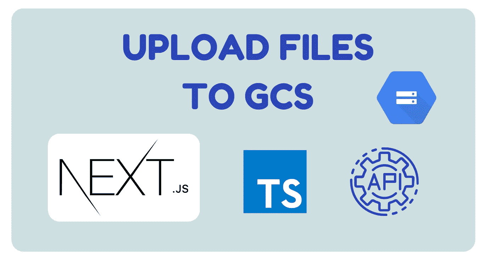
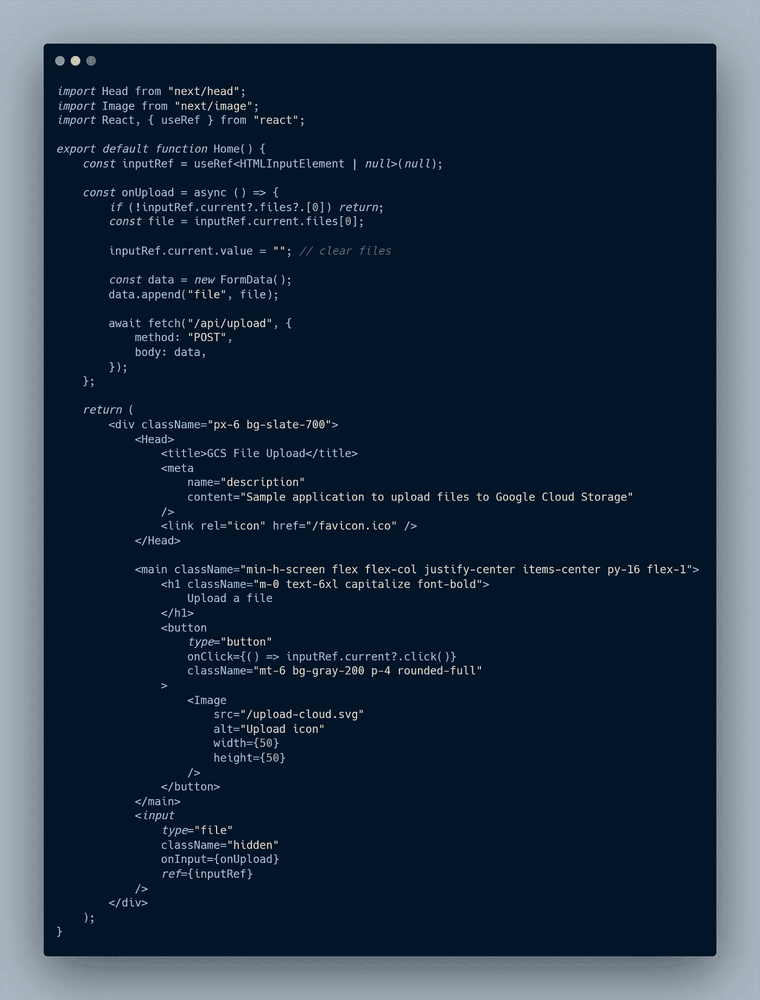

# 使用 Next.js 和 harvardable 将文件上传到 Google 云存储的 3 种方法

> 原文：<https://betterprogramming.pub/3-ways-to-upload-files-to-google-cloud-storage-with-nextjs-and-formidable-3b58707e7886>

## 这一宝贵功能的简要指南



图片来自 Canva 的作者

大家好。今天，我们将讨论在您的 Next.js 应用程序中上传文件的三种方法。每种方法都有其特定的用例，所以请阅读到最后。

首先，我创建了一个基本页面，用户可以在这里上传一个文件到一个`/api/upload`端点。


来自作者的 UI 演示图像

当用户点击按钮时，我们触发一个隐藏的文件输入。当添加新文件时，我们发送包含文件数据的 POST 请求。



来自 carbon.now.sh 作者的 UI 代码图像

注意图标来自[羽毛](https://feathericons.com/)。

首先，确保你有一个谷歌云存储空间。现在，您将需要一个服务帐户密钥文件。如果您没有，请按照此处[列出的步骤](https://cloud.google.com/iam/docs/creating-managing-service-account-keys#creating)获取一个。

# 初始化 GCS

```
npm i @google-cloud/storage
```

创建一个名为`lib`的新文件夹，并在其中创建一个名为`gcs.ts`的文件。现在导出一个函数，在 bucket 中为指定的文件名打开一个写流。

# 1.API 路线

我们使用`node-formidable`在 Next.js API 路径中处理文件上传。但是默认情况下，文件解析在无服务器的环境中不起作用。我们将不得不安装`formidable-serverless`。因此，在部署到 Vercel、Netlify 等时，处理文件上传应该是可行的。

```
npm i formidable
npm i -D @types/formidable
```

下面是“承诺”表单解析的代码。

还要注意，我们将代码从`formidable-serverless`放到我们的文件夹中。NPM 目前的版本没有使用最新版本的`formidable`。

现在，在一个 API route 文件中定义一个`handler`函数，它只接受 POST 并调用`method1`。

我们禁用 Next.js 主体解析器，让`formidable`完成它的工作(主体流)。

现在我们可以在`lib`中创建一个`upload.ts`文件来处理上传。

`formidable`将文件上传到服务器上的临时文件中，这样我们就可以调用一个好的 ol’`fs.createReadStream`。然后，我们可以跟随一个`.pipe`到一个 GCS 桶存储写流。

如果您希望在将文件发送到 GCS 之前对其进行任何预处理，那么这种方法是最合适的。例如，您可能希望从音频文件中提取元数据，如持续时间、比特率和标题。

但是如果你不想要主机上的文件，你仍然可以直接上传到 GCS。

# 2.具有直接流的 API 路线

现在，我们来定义一下`method2`。它将使用`fileWriteStreamHandler`属性直接上传文件流。

在我们的`uploadStream`函数中，我们必须创建一个新的`PassThrough`实例。一个`PassThrough`流是必要的，这样`formidable`就可以写这个流，并且我们仍然可以通过管道把它传递给 GCS。

# 3.自定义 Express 服务器

如果 API 路由的使用限制了应用程序的需求，Next.js 允许您创建一个定制的服务器。唯一的缺点就是不能再用 Vercel 了。

首先，我们将使用`express`来设置我们的后端服务器并定义上传路径。

`npm i express dotenv
npm i -D nodemon @types/express ts-node`

确保使用服务器文件配置了 TypeScript，这样我们仍然可以导入我们的文件上载方法。您可以在 Next.js [资源库](https://github.com/vercel/next.js/tree/canary/examples/custom-server)中找到一个工作示例。简而言之，我们使用一个额外的`tsconfig`文件，用`nodemon`观察文件变化，用`ts-node`执行 TypeScript。

让我们通过添加带有端点的服务器代码来结束本文。

# 包扎

今天，我们学习了三种将用户文件上传到谷歌云存储的不同方法。每一种都有自己的权衡。

仅此而已！如果你喜欢这篇文章，请继续关注。

你可以在 GitHub 的这里找到这篇文章[的所有代码。](https://github.com/WoolDoughnut310/nextjs-gcs)

*原发布于*[*https://cs 310 . hash node . dev*](https://cs310.hashnode.dev/3-ways-to-upload-files-to-google-cloud-storage-with-nextjs-and-formidable)。