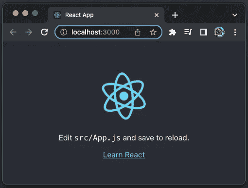
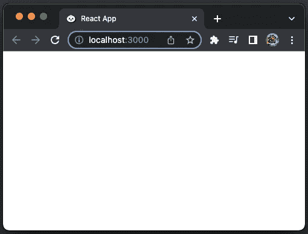

# 使用 Bun 和 Create React 应用程序的 3 种方法

> 原文：<https://betterprogramming.pub/3-ways-to-use-bun-with-create-react-app-9fa365b2b7a0>

## 使用 Create React 应用程序探索 bun . js(CRA)


图片由作者提供 logo 来自[https://bun.sh/](https://bun.sh/)

# Bun 是什么？

小圆面包是一种不加糖的面包卷，通常有美味的馅料，如汉堡包。包子，或称包，是一种在各种中国菜肴中用酵母发酵的包子。馅料(肉的或素的)和制作方法有很多种，尽管包子通常是蒸的。包的典型长相如上图，[包也是迪士尼皮克斯](https://en.wikipedia.org/wiki/Bao_(film))制作的短片。

在本文中，我们讨论一个不同的 bun，它是一个快速的一体化 JavaScript 运行时。Bun 是一个类似于 [Node](/5-major-features-of-node-js-18-5f4a164cc9fc) 或 [Deno](/the-comprehensive-guide-to-deno-an-alternative-to-node-ea0db4fdec77) 的现代 JavaScript 运行时，内置了一个本机 bundler、transpiler、task runner 和 npm 客户端——所有这些都在 Bun 中。

Bun.js 创建于 2021 年 4 月，还算年轻。最新的 Bun 版本是 0.1.7，发布于 2022 年 8 月 6 日。它还不能用于生产。

Bun 速度快，其性能来源于以下技术:

*   JavaScriptCore:是 WebKit 内置的 JavaScript 引擎，比 V8 快。
*   Zig:它是一种通用的编程语言和工具链，用于维护健壮的、最优的和可重用的软件。
*   [esbuild](/bundle-up-a-javascript-project-using-esbuild-b2c824ba0d39) :它是一个速度极快的 JavaScript/CSS 捆绑器和迷你器。

Bun 内部使用 ESM，虽然也支持 CommonJS。它有内置的 Web APIs，比如 fetch、WebSocket 和 ReadableStream。在 Bun，每个文件都是透明的。因此，打字稿和 JSX 只是工作。这是一个伟大和完整的工具，作为一个捆绑，运输和包装管理。

# 安装 Bun

运行命令`curl https://bun.sh/install | bash`，安装 Bun:

1.  如第 7 行所示，Bun 路径已被添加到`.zshrc`。

2.如第 9 行所示，运行`exec /bin/zsh`来更新当前 shell 中的路径。现在 Bun 命令已被识别:

以下是帮助手册:

创建一个`Hello World`的类型脚本:

我们可以执行现成的类型脚本——无需设置。`tsconfig.json`。

由于 Bun 对它的速度很自豪，所以它总是显示执行命令的时间。

安装了 Bun 之后，我们有三种方法可以和 [Create React App](/an-in-depth-guide-for-create-react-app-5-cra-5-b94b03c233f2) (CRA)一起使用:

*   使用启用了 Bun 的 CRA
*   用发髻处决 CRA
*   将常规 CRA 转换为 Bun 项目

# 使用启用了 Bun 的 CRA

`bun create`是一种从模板创建新项目的快速方法。Bun 有一个建立 CRA 项目的模板。命令是`bun create react <myDirectory>`。

默认情况下，`bun run`打印将要调用的脚本，可以用`—-silent`标志禁用它。控制台输出显示它运行了两个脚本:

1.  `bun install`(第 4 行):它在`package.json`中安装依赖项。安装了八个软件包。
2.  `bun bun ./src/index.jsx`(第 19 行):它将从`./src/index.jsx`到所有导入的依赖项递归地捆绑到一个二进制`.bun`文件中，名为`node_modules.bun`。`.bun`文件包含所有捆绑的源代码、所有捆绑的源代码元数据、项目元数据和配置。内容可以通过命令`bun node_modules.bun`打印出来。

在第 49 行，它显示创建这个项目花费了 1，182 ms。它比普通的 CRA 快得多。

在第 61–62 行，它显示了转到项目目录`bun-enabled-react`并通过运行`bun dev`来执行应用程序的命令。

下面是创建的项目中的`package.json`:

它看起来比下面列出的普通 CRA`package.json`要简单得多:

Bun 的`package.json`缺乏生产构建和执行单元测试的功能。

Bun 的锁文件是`bun.lockb`，而不是`package-lock.json`。是二进制锁文件，`bun install -y`打印一个纱线 v1 样式的`yarn.lock`文件。

锁文件存储的数据比普通锁文件多得多。它存储软件包、这些软件包的元数据、提升的安装顺序、每个软件包的依赖关系、这些依赖关系解析到的软件包、完整性散列(如果可用)、每个软件包解析到的内容以及版本(或等效版本)。

`bun.lockb`很快，因为它对所有数据使用线性数组。包由一个自动递增的整数 ID 或包名的散列来引用。长度超过八个字符的字符串将被删除重复。在保存到磁盘上之前，锁文件被垃圾收集，并通过遍历包树和按照依赖顺序克隆包来确定。

Bun 是零配置。如果需要，`bunfig.toml`可用于配置`bun install`、`bun remove`和`bun add`。

默认情况下，本地文件位于`~/.bun`，可执行文件存储在`~/.bun/bin`中，包缓存在`~/.bun/install/cache`中。

执行`bun-enabled-react`目录中的`bun dev`:

在浏览器上，我们看到支持 Bun 的 CRA 正在运行，类似于常规的 CRA。它显示文本，`<h3>Welcome to React!</h3>`。


作者图片

控制台出现错误，这是[一个已知问题](https://github.com/oven-sh/bun/issues/494)。

```
404 GET /manifest.json as application/octet-stream
```

# 用发髻处决 CRA

我们使用`npx`创建一个常规的 React 项目:

```
% npx create-react-app regular-react
% cd regular-react
```

在安装过程中，它会打印出以下可供运行的 npm 命令:

我们可以使用 yarn 和 Bun 来执行这些命令。

执行`regular-react`目录中的`bun start`。在浏览器上，我们看到由 Bun 执行的常规 CRA。它显示文本，`<p>Edit <code>src/App.js</code> and save to reload.</p>`。



作者图片

# 将常规 CRA 转换为 Bun 项目

我们有一个可以吃面包的 CRA(下图左边)和一个普通的 CRA(下图右边)。


作者图片

逐行阅读，我们可以看出这两个项目极其相似，除了以下不同之处:

*   左边的文件叫`App.jsx`，右边的文件叫`App.js`。
*   左侧有一个额外的 TypeScript 定义`images.d.ts`。
*   还有一个额外的测试文件，`App.test.js`在右边。
*   左边的文件叫`index.jsx`，右边的文件叫`index.jsx`。
*   有一个额外的安装文件，`setupTests.js`在右边。
*   左边的文件叫`bun.lockb`，右边的文件叫`package-lock.json`。
*   有一个额外的安装文件，`node_modules.bun`在左边。

让我们看看需要做些什么来将常规 CRA 转换为 Bun 项目。

执行`regular-react`目录中的`bun dev`。在浏览器上，我们看到一个空白屏幕:



作者图片

哪里出了问题？

比较每个文件后，我们发现修复是在`public/index.html`中添加第 42 行。

它需要嵌入`<script type="module">`来将`/src/index.js`模块应用到 HTML 页面。`async`不是必需的，但它允许在解析页面的同时下载脚本，并在脚本可用时立即执行。

一行代码的变化是我们所需要的转换常规 CRA 到一个 Bun 项目。

执行`regular-react`目录中的`bun dev`。在浏览器上，我们看到 CRA 正在运行。


作者图片

# 结论

Bun 是一个快速的一体化 JavaScript 运行时。它是一个像 Node 或 Deno 一样的现代 JavaScript 运行时，内置了本机 bundler、transpiler、task runner 和 npm 客户端——所有这些都在 Bun 中。

我们已经探索了三种方法来与 CRA 一起使用 Bun。对于日常的编码工作，Bun 可执行文件可以在 npm 或 yarn 工作的情况下工作。Bun 年轻有为，期待其量产发布。

感谢阅读。

如果你有兴趣，可以查看一下[我的网页开发文章目录](https://jenniferfubook.medium.com/jennifer-fus-web-development-publications-1a887e4454af)。