# 在 Tableau 中使用 Index()的 3 种方法

> 原文：<https://betterprogramming.pub/3-ways-to-use-index-in-tableau-b2103c236162>

## index()函数用例


照片由[前方什么都没有](https://www.pexels.com/@ian-panelo?utm_content=attributionCopyText&utm_medium=referral&utm_source=pexels)从[像素](https://www.pexels.com/photo/magnifying-glass-on-book-4494642/?utm_content=attributionCopyText&utm_medium=referral&utm_source=pexels)拍摄

在 tableau 中，`index()`函数是最重要的函数之一。让我们了解一下本文中`index()`函数的 3 个用例。

1.  如何使用`index()`函数在 tableau 中创建格式良好的表格数据视图？
2.  如何使用`index()`函数取消标识任何列名？
3.  如何使用`index()`函数创建 Top-N / Bottom N 滤镜？

# 1.如何使用 index()函数在 tableau 中创建格式良好的表格数据视图？

在 tableau 中当我们创建一个文本表格时，我们会得到合并的单元格。

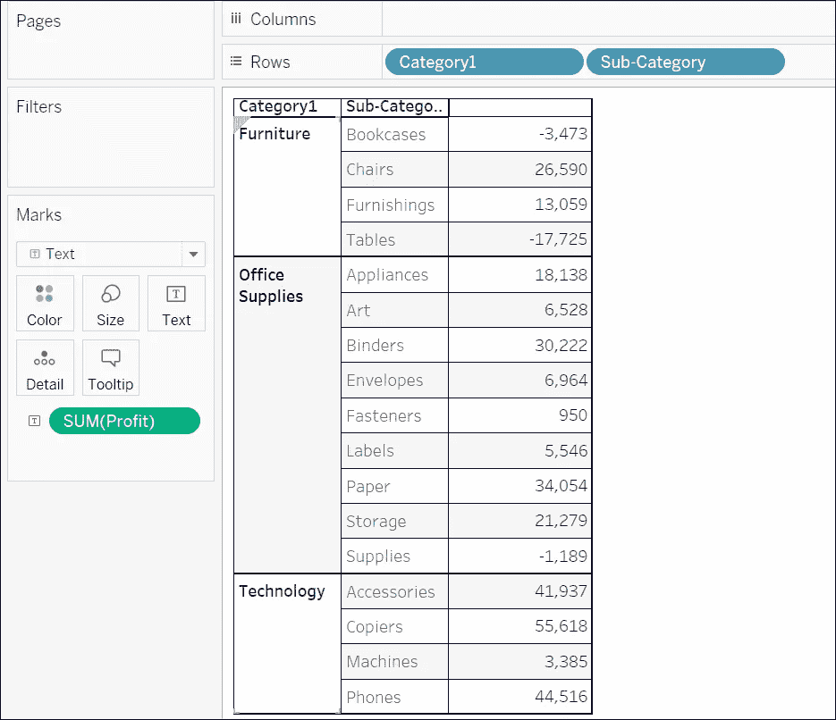

此处视图按类别和子类别细分。但是如果您希望每条记录都有单独的一行，可以使用`index()`函数来完成。

创建计算字段:

```
index()
```

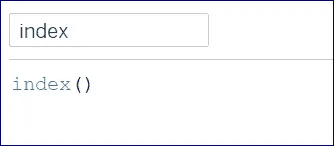

计算字段索引()

现在将此计算字段索引转换为离散。现在把它放在横排架子的第一个位置。

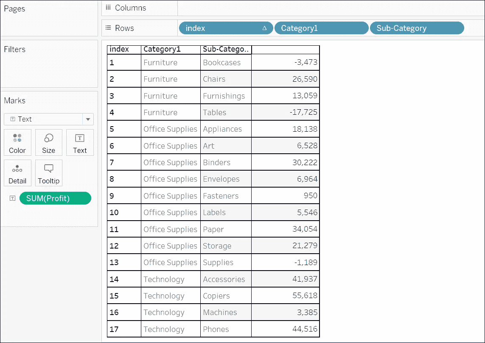

现在我们为每条记录获取一个单独的行。你可以从 [**这里**](https://public.tableau.com/app/profile/indhumathychelliah/viz/TabularviewUsingindex/WithoutUsingindex?publish=yes) 下载我的工作簿。

# 2.如何使用 index()函数取消子类别的识别？

假设我们有一个用例，它必须在视图中隐藏子类别名称。

## **需要做什么？**

1.  如果我们在过滤器中选择了一个子类别，那么视图中应该只显示该子类别的名称。其余的其他子类别应显示为产品 1、产品 2 等。其余的子类别应该被去识别。

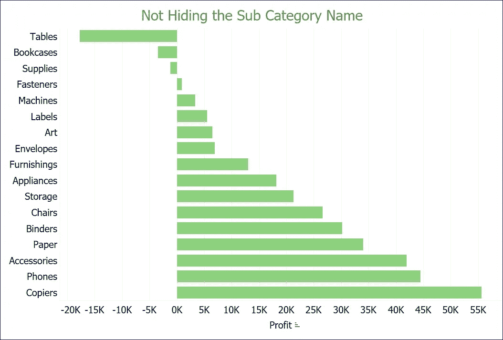

不隐藏子类别名称

现在我们必须确定子类别的名称。

## 如何做到这一点？

1.  创建参数子类别，然后单击从“子类别”变量添加值。创建参数后，右键单击并选择“显示参数”

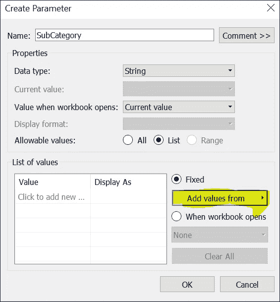

2.创建一个计算字段来显示子类别的名称。

```
If min([Subcategory])=min([Sub-Category])
then min([Sub-Category])
ELSE
“Product “ + str(index())
END
```

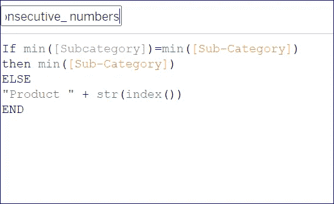

对于选定的子类别，它将显示实际的名称。对于其他产品，它将显示类似“产品 1，产品 2..等等。

3.现在将计算字段`Consecutive_Numbers`拖到行架上。

4.单击行架中的子类别，并取消选择`Show header`

5.现在，如果我们选择一个特定的子类别，如“存储”。它将只显示该子类别的名称。其余的将显示为“产品 1，产品 2..等等。

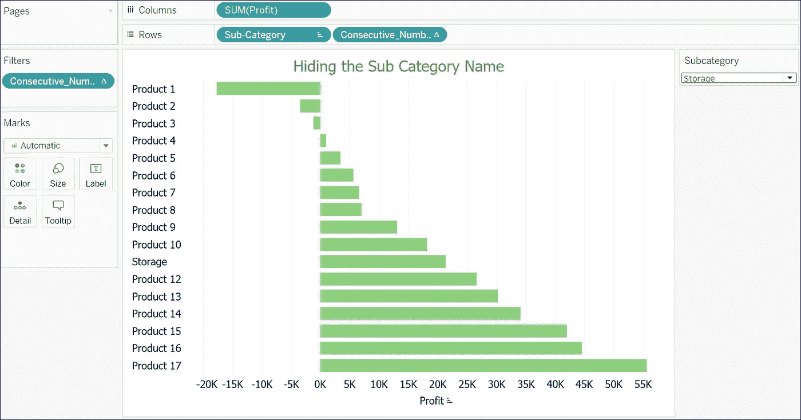

隐藏子类别名称

这是通过使用`index()`功能实现的。我的练习册可以在这里下载[](https://public.tableau.com/app/profile/indhumathychelliah/viz/HidingtheSubCategoryName/HidingtheSubCategoryName?publish=yes)**。**

# **3.如何使用 index()函数创建 Top-N / Bottom N 过滤器？**

**我们可以使用`index()`函数轻松创建顶部 N 个过滤器/底部 N 个过滤器**

****举例:****

**让我们创建一个子成本与利润的条形图。我已经把它们按降序排列了。**

**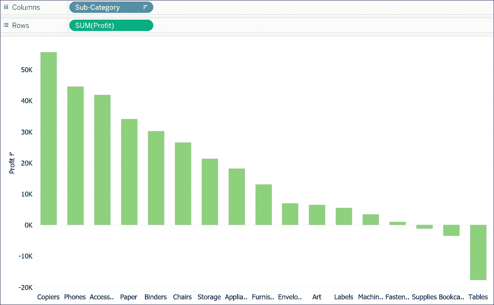**

**我们来加一个索引，作为我们理解的标签。我已经在商标卡的标签上添加了`index()`。**

**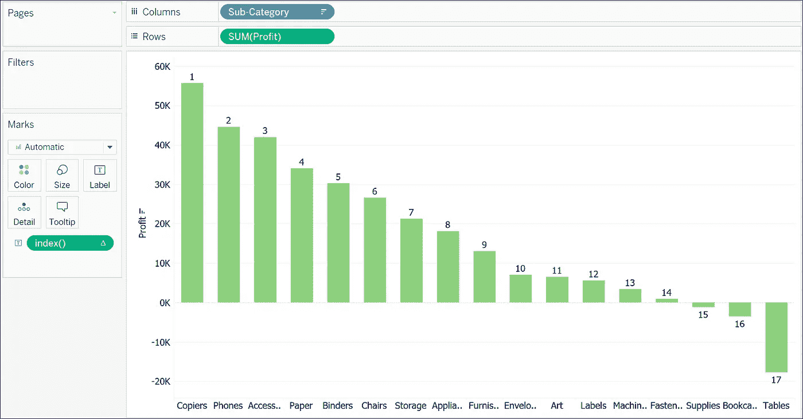**

**现在我们必须创建一个 Top 5 过滤器。**

**创建计算字段—前 5 名筛选器**

**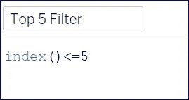**

**现在，将这前 5 个过滤器添加到过滤器架，并单击 True。**

**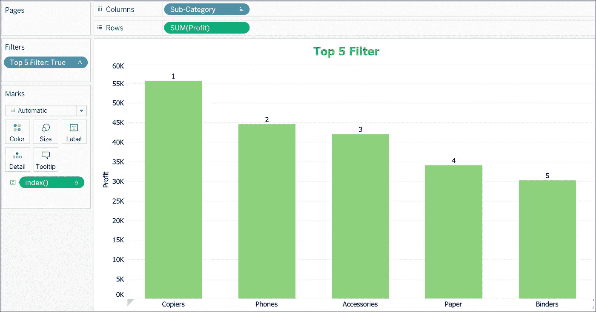**

**确保在应用过滤器之前，我们已经按降序对图表进行了排序。如果我们按升序排列图表，它将作为底部 5 个过滤器。**

**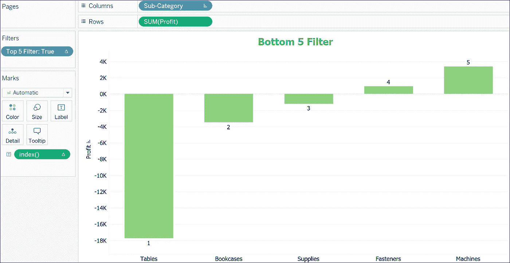**

**我们可以对所有工作表重复使用此过滤器。这是创建顶部 N/底部 N 过滤器的简单方法。**

**你可以从[这里](https://public.tableau.com/app/profile/indhumathychelliah/viz/Bottom5Filter/Bottom5Filter?publish=yes)下载我的练习册。**

**在本文中，我们看到了三种使用`index()`功能的方法。感谢阅读！**

***如果你喜欢阅读我关于 Python、数据科学和 Tableau 的更多教程
请关注我的*[***medium***](https://medium.com/@IndhumathyChelliah)***，***[***Twitter***](https://twitter.com/IndhuChelliah)**

**[https://indhumathychelliah.medium.com/membership](https://indhumathychelliah.medium.com/membership)**