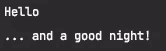
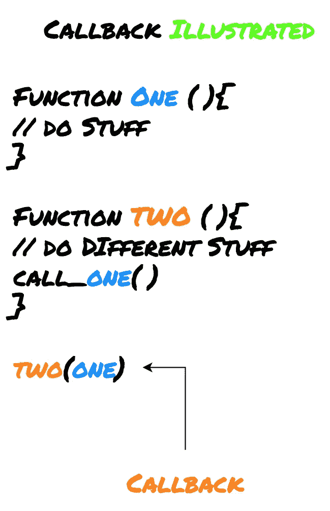
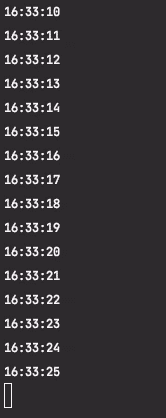
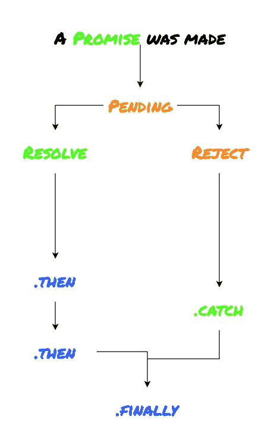

# 用 JavaScript 编写异步代码的 3 种方法

> 原文：<https://betterprogramming.pub/3-ways-to-write-asynchronous-code-in-javascript-b8d17e60df06>

## 学习 JavaScript 中的回调、承诺和异步/等待

[作者制作的图片](http://www.arnoldcode.com)与❤

为什么要用 JavaScript？显然，为了使网站更加灵活。但是，有时，这种形式的灵活性不足以满足您的需求。

在这种情况下，使用异步执行某些功能*的选项*是有意义的。您可能会因程序的给定代码执行而阻塞自己。幸运的是，这种语言提供了三种不同的实现方法。当然，你想了解它们以便专业地使用它们。

了解如何正确使用它们；JavaScript 中的函数是按照被调用的顺序激活的，而不是按照定义的顺序。

# 0.正常流程

考虑以下常规执行顺序的示例:

如果您执行 JavaScript，控制台会打印出短语`Hello`和`… and a good night!`。

这意味着功能`firstFunc()`首先被执行，然后是`secondFunc()`。

normalExecution.js 的 Console.log()语句

> 如果以相反的顺序调用这两个函数，单词 hello 将显示在浏览器中。

但是你在这里影响函数被调用的顺序。第一种方法是使用一个*回调*函数。

# 1.复试

通过使用回调，像砸锤子一样介入控制流。

回调是一个函数，另一个函数可以作为参数传递给它。它允许你用一个函数调用另一个函数。

回调的原理

在下面的清单中，使用计算总和的函数示例(`calcFunc()`)完成了一次:

我做了什么？

1.  将计算的显示与计算本身分开。
2.  实现了一个函数`displayFunc()`，它只输出一个值。
3.  另一方面，实际工作是在函数`calcFunc()`中完成的。它接受计算所需的两个参数并执行加法。
4.  此外，函数`calcFunc()`接受另一个参数，这具有特殊的意义。以便进一步处理。
5.  作为最后一个参数，函数名`calcFunc()`被传递。

一旦计算完成，就调用函数`displacFunc()`打印出计算结果。

> 因此，回调非常适合用于异步编程。通常，回调函数与异步函数一起使用。

下面是超时后使用回调函数的另一个例子:

在这个例子中，函数名`myTimeOut`作为参数传递给`setTimeout`。

相应呼叫的变体:

在`setTimeout`函数调用中调用了`randomFunction()`。

同样，匿名函数在`setTimeout`的函数调用中作为参数传递。因此两者都是异步的。

与前一个示例的主要区别在于，这里传递的不是函数名，而是一个完整的函数。如果这样做，就可以保存单独的函数声明和函数名的赋值。您在`setTimeout`中创建了一个匿名函数。

*这种方法只有在其他地方不需要该功能时才有意义。*

也可以经常调用回调函数。

让我演示一下如何在间隔的上下文中执行代码:

这里，我将函数`cally()`作为参数传递给 setInterval 函数。

cally.js 中的 Console.log()语句

# 2.承诺

对未来的承诺。不像其他的承诺，用代码做的承诺是信守的，哈哈！

你也可以读未来这个词。这只是承诺的同义词。在编程中，两者都指未知结果的占位符(代理)。

> 通常，这种承诺指的是尚未完成处理的任务。

例如，在程序继续执行之前，复杂的计算必须首先被锁定。因此，承诺通常是异步函数调用的结果。与回调函数一样，当函数作为参数调用时，future 作为参数传递。

这是承诺的组成部分:

承诺履行的原则

它由两部分组成:

1.  第一部分包含产生结果的代码。
2.  第二部分根据结果决定如何继续处理。

JavaScript 中 Promise 对象的基本结构如下:

此时创建了 Promise 对象，处理任务的代码放在函数中。此外，成功或失败情况下将执行的函数被传递。

当承诺被执行时，第二部分得到它的实际决定。它根据承诺的结果决定处理如何进行(`success`或`error`)。

如果 promise 返回`error`，错误处理函数将被调用。而不是下一个处理程序。看看`theUsualPromise.js`的评论。

我向你揭示一个实际的例子:

在代码中，在开头创建了一个 Promise promiseObj 类型的新对象。然后它进入处理，在这个例子中包括将值`0`赋给变量`x`。

最后，检查代码执行。

如果`0`分配成功，则调用`resolve`函数。对于这个例子，情况总是如此。在承诺的`then`部分，函数被执行，它应该在成功的情况下被执行。

如果您想要运行失败案例，您需要为`x`分配一个除`0`之外的值。

现在为我们最后的新婚夫妇`async` & `await`扔米。

# 3.异步和等待

2017 年，另一个有用的功能愉快地融入了 ECMAScript 标准的大家庭。关键词`async`和`await`。

> 它就像一个承诺。一旦做出承诺，等待它解决或拒绝。在引擎盖下，这是一个承诺，但是语法更容易设置和理解。

再次使用这些命令使得异步编程变得非常容易。此示例旨在说明这两条指令的用法:

功能`displayFunc()`已被插入。其特点是带有关键字`async`的标记。

使用带有`async`的标记表示该函数将返回一个承诺对象。否则，函数的声明与上一个例子没有什么不同。

`await`关键字用于函数的最后一行。许诺对象`promiseObj`用它做了标记。这确保了只有在前面的代码正确执行的情况下才显示内容。

[*加入 Medium*](https://arnoldcode.medium.com/membership) *获取无穷无尽的 web 开发教程内容。*

# 结论

既然您已经知道了 JavaScript 中的异步编程机制，那么相应应用程序的设计对您来说就不再是一个棘手的问题了。

通过这种方式可以非常灵活地开发网页和 Web 应用程序。

获取 26 份备忘单，只研究你真正需要的东西，以获得你的第一份网络开发工作！

[Arnold Code Academy 26 网站开发者备忘单](https://arnoldcodeacademy.ck.page/26-web-dev-cheat-sheets)