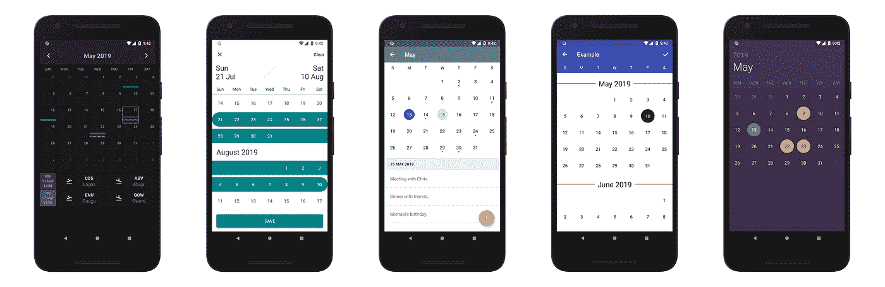
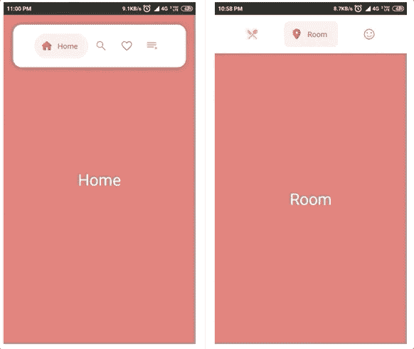
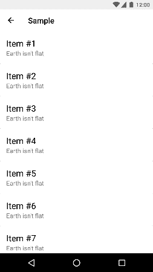
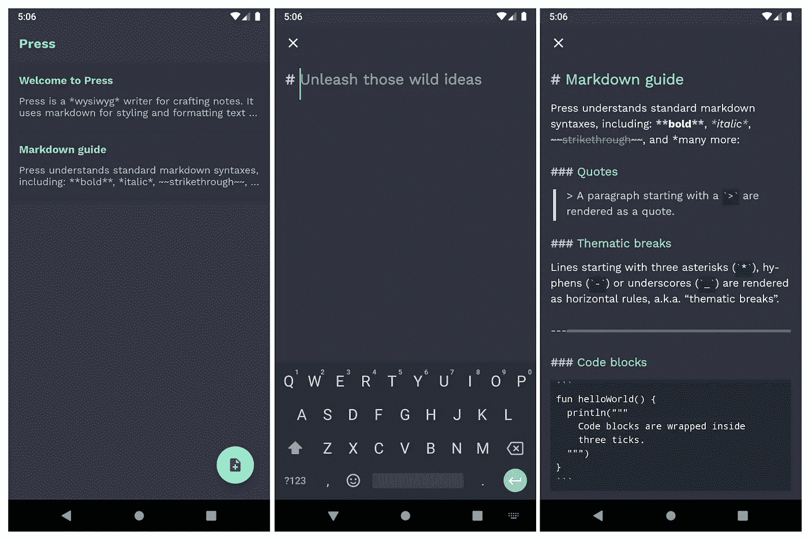
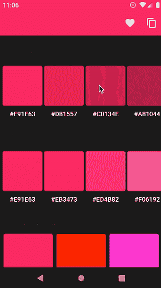
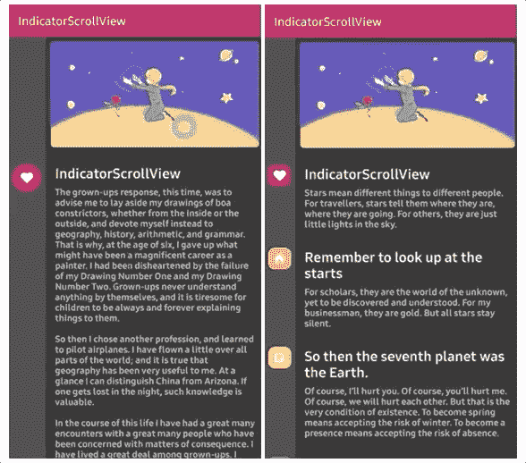
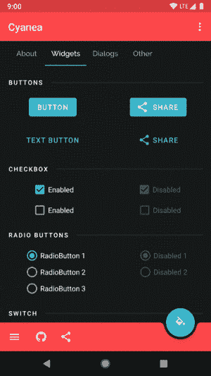
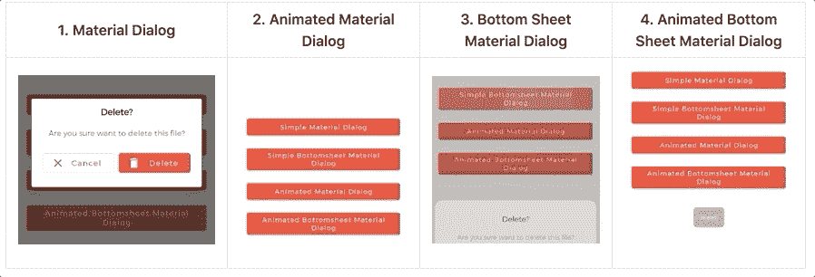
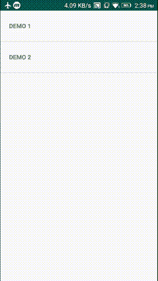

# 2019 年 30 个最佳 Android 库和项目

> 原文：<https://betterprogramming.pub/30-best-android-libraries-and-projects-of-2019-a1e35124f110>

## 有用的库和鼓舞人心的项目，帮助您踏上移动之旅


照片由 Ria Puskas 在 Unsplash 上拍摄

距离我发布上一篇关于 Android 库的文章已经一年多了。现在，我带着 2019 年发布(或大幅刷新)的牛逼库和项目汇总回来了。他们不是按等级顺序排列的。我们开始吧！

# **1。线圈**

[Coil](https://github.com/coil-kt/coil) 是一种在 Android 上加载图像的全新方法。这个库的首字母缩写代表*协程图像加载器*。该库速度快、重量轻(~1500 种方法)、易于使用且现代，尤其是与 Glide、Picasso 或 Fresco 等库相比。它支持 gif 和 SVG，可以进行四种默认变换:[模糊](https://coil-kt.github.io/coil/api/coil-base/coil.transform/-blur-transformation/)、[圆形裁剪](https://coil-kt.github.io/coil/api/coil-base/coil.transform/-circle-crop-transformation/)、[灰度](https://coil-kt.github.io/coil/api/coil-base/coil.transform/-grayscale-transformation/)和[圆角](https://coil-kt.github.io/coil/api/coil-base/coil.transform/-rounded-corners-transformation/)。

下面是代码示例:

```
imageView.load(“https://www.example.com/image.jpg") {
 crossfade(true)
 placeholder(R.drawable.image)
 transformations(CircleCropTransformation())
}
```

[文档](https://coil-kt.github.io/coil/)和代码样本足以让你毫不犹豫地开始使用它。一切都很清楚和容易。目前这个库的版本是 0.9.5。

**有趣的事实:**在过去的三个月里，我面试了 14 位候选人，没有人知道 Coil。保持冷静，通过提及线圈给面试官留下深刻印象。甚至谷歌[在他们的“](https://twitter.com/kaushikgopal/status/1230194401902616576?s=20)[高效加载大位图](https://developer.android.com/topic/performance/graphics/load-bitmap)”文章中写及 Coil 时，也犯了一个关于[作者](https://github.com/colinrtwhite)的错误。不管怎样，现在已经修好了。

[](https://github.com/coil-kt/coil) [## 盘管-kt/盘管

### 由 Kotlin 协程支持的 Android 图像加载库。线圈是:快速:线圈执行一些…

github.com](https://github.com/coil-kt/coil) 

# 2.**多搜索视图**

这个库有一个非常酷的动画搜索视图。


它易于设置和定制——您可以在`styles.xml`下添加您的风格设置。

自述挺短的，但我相信是可以的。这是 0.1 版，所以我不会在生产中使用它。相反，我会把它当作一个游乐场项目的一个很好的 lib 来玩。

它是在 Apache 2.0 许可下发布的。

[](https://github.com/iammert/MultiSearchView) [## iammert/多搜索视图

### 又一个 Android 内置动画搜索视图。所有的设计都归功于 Cuberto，并从这个设计中获得灵感…

github.com](https://github.com/iammert/MultiSearchView) 

## 3. [**日历视图**](https://github.com/kizitonwose/CalendarView)

这个是一个高度可定制的日历库，由`RecyclerView`提供支持。



它有很多特点:

*   单项或多项选择
*   周或月模式
*   边界日期
*   自定义日历视图
*   水平或垂直滚动模式
*   完全可定制的视图
*   还有更多

文档非常全面，并且充满了示例。此外，有一个示例应用程序展示了该库的所有功能。它是 100%用 Kotlin 编写的，并在 MIT 许可下发布。如果您需要在应用程序中使用日历视图，我相信这是一个不错的选择，尽管事实上它仍然在 0.3.2 版本中(在撰写本文时)。

[](https://github.com/kizitonwose/CalendarView) [## kizitonwose/CalendarView

### 一个高度可定制的 Android 日历库，由 RecyclerView 提供支持。有了这个库，您的日历将看起来…

github.com](https://github.com/kizitonwose/CalendarView) 

# 4.气泡导航

[这个](https://github.com/gauravk95/bubble-navigation)是一种全新的导航方式——一个轻量级的库，可以轻松地制作漂亮的导航栏，并提供大量的定制选项。



它有许多很酷的功能:

*   两种类型的`NavigationView`用于不同的用例:`BubbleNavigationConstraintView`(支持`spread`、`inside`和`packed`模式)和`BubbleNavigationLinearView`(允许平均分配、使用重量或打包模式)
*   它是高度可定制的
*   你可以添加徽章，它有`BubbleToggleView`来创建新的 UI 组件，而不仅仅是导航

自述文件非常详细，解释了如何使用所有组件来实现这个看起来很酷的 UI。您可以随时查看示例应用程序。该项目是在 Apache 2.0 许可下发布的。

[](https://github.com/gauravk95/bubble-navigation) [## gaur avk 95/气泡导航

### 🎉一个轻量级的库，可以用大量的🎨定制选项。

github.com](https://github.com/gauravk95/bubble-navigation) 

# 5. **FabFilter**

[这个](https://github.com/nikhilpanju/FabFilter)不是一个库，而是一个展示应用程序，展示使用和不使用`[MotionLayout](https://developer.android.com/reference/android/support/constraint/motion/MotionLayout)`实现的高级 UI 动画。


这是一个非常有趣的项目——有两篇关于媒体的相关文章:

*   [“Android 上复杂的 UI/动画](https://medium.com/@nikhilpanju22/complex-ui-animation-on-android-8f7a46f4aec4?sk=f1fab1861a655b042ff5e9c305a0e012)”
*   [Web 材料组件的顶部应用程序栏。基本上，它使一个普通的工具栏动态化，当一个相关的视图滚动时，增加和减少它的阴影。](https://medium.com/@nikhilpanju22/complex-ui-animations-on-android-featuring-motionlayout-aa82d83b8660#/component/top-app-bar/fixed)

    实际上，这个视图扩展了`CardView`并增加了一个高度。该项目是在麻省理工学院的许可下发布的，并对投稿开放。它有适当的文档和一个示例应用程序。

    [](https://github.com/hugocbpassos/waterfall-toolbar) [## hugocbassos/瀑布-工具栏

    ### 在科特林制造，瀑布工具栏是一个 Android 版本的材料设计的网页组件瀑布工具栏…

    github.com](https://github.com/hugocbpassos/waterfall-toolbar) 

    # 24.压

    [这个](https://github.com/saket/press)不是一个库，而是来自 [Saket Narayan](https://medium.com/u/f9a20410ae8e?source=post_page-----a1e35124f110--------------------------------) 的一个可爱的开源应用程序，根据它的自述文件，它是:

    > “一个所见即所得的作家，从熊[得到灵感](https://bear.app/)。它使用 markdown 对文本进行样式和格式设置，并带有漂亮的内嵌预览。

    

    Press 是为了在 Kotlin 中探索多平台项目而创建的概念验证，因此这是掌握如何同时为 Android、iOS 和 macOS 编写应用程序的好地方。然而，目前只有安卓版本。

    该项目有一个非常好的文档，其中包括对 [UI 架构](https://github.com/saket/press/blob/master/documentation/architecture.md)、[自定义视图](https://github.com/saket/press/blob/master/documentation/screens_as_custom_views.md)、 [DI](https://github.com/saket/press/blob/master/documentation/dependency_injection.md) 和[测试/调试共享代码](https://github.com/saket/press/blob/master/documentation/testing.md)的解释。它是在 Apache 2.0 许可下发布的。

    [](https://github.com/saket/press) [## 市场/新闻

    ### Press 是一个所见即所得的作家，创作灵感来自熊的笔记。它使用 markdown 的样式和格式的文本与…

    github.com](https://github.com/saket/press) 

    # 25.AndroidColorX

    > [“AndroidColorX](https://github.com/JorgeCastilloPrz/AndroidColorX)(即:Android Color Extensions)是一个用 Kotlin 编写的 Android 库，它提供颜色实用程序作为 [Kotlin 扩展函数](https://kotlinlang.org/docs/tutorials/kotlin-for-py/extension-functionsproperties.html)。该图书馆依赖 AndroidX `[ColorUtils](https://developer.android.com/reference/kotlin/androidx/core/graphics/ColorUtils)`进行一些计算。—通过 [AndroidColorX GitHub 页面](https://github.com/JorgeCastilloPrz/AndroidColorX)

    

    该库提供了以下扩展:

    *   在多种颜色类型之间转换(例如，`android.graphics.Color` ( `ColorInt`)、`RGBColor`、`HEXColor`、`CMYKColor`等等)
    *   计算阴影和色调调色板，
    *   计算补色、三色、四色和类似颜色
    *   使颜色变暗或变亮一个数量
    *   更多

    了解这个库的最好方法是查看它真正全面的文档。目前，它的版本是 0.2.0，是在 Apache 2.0 许可下发布的。

    [](https://github.com/JorgeCastilloPrz/AndroidColorX) [## JorgeCastilloPrz/AndroidColorX

    ### AndroidColorX(即:Android Color Extensions)是一个用 Kotlin 编写的 Android 库，它提供颜色工具作为…

    github.com](https://github.com/JorgeCastilloPrz/AndroidColorX) 

    # 26.指示器滚动视图

    [这个库](https://github.com/skydoves/IndicatorScrollView)给一个`NestedScrollView`增加了逻辑，允许它在滚动改变时用一个指示器动态地做出反应。

    

    自述文件包含开始玩这个项目所需的所有信息——比如如何使用`IndicatorScrollView`、`IndicatorView`和`IndicatorItem`。目前，它的版本是 1.0.2，是在 Apache 2.0 许可下发布的。它支持 API 16 及以上版本。

    [](https://github.com/skydoves/IndicatorScrollView) [## sky doves/指示器滚动视图

    ### 当滚动改变时，🧀动态地用一个指示器作出反应。将以下代码添加到您的根 build.gradle 文件中(不是…

    github.com](https://github.com/skydoves/IndicatorScrollView) 

    # 27.霞水母属

    [这个](https://github.com/jaredrummler/Cyanea)是安卓的主题引擎。

    

    它允许你动态地改变主题。还定义了一些核心主题:`Theme.Cyanea.Dark`、`Theme.Cyanea.Dark.LightActionBar`、 `Theme.Cyanea.Dark.NoActionBar`、`Theme.Cyanea.Light`、`Theme.Cyanea.Light.DarkActionBar`、`Theme.Cyanea.Light.NoActionBar`。自述文件确实不错。它充满了例子，项目本身是在 Apache 2.0 许可下发布的。

    [](https://github.com/jaredrummler/Cyanea) [## jaredrumller/霞水母

    ### Android 的主题引擎。主题是永恒的，可能性是美丽的。一个强大的，动态的，有趣的主题…

    github.com](https://github.com/jaredrummler/Cyanea) 

    # 28.Android 的素材对话框

    这是一个库,实现了动画的、漂亮的、时尚的材质对话框。

    

    该库支持两种类型的对话框:

    *   材质对话框
    *   底部-板材对话框

    在底层，它实现了 Airbnb 的 [Lottie](https://github.com/airbnb/lottie-android) 库来将 After Effects 动画渲染到一个应用程序中(在我之前的一篇文章中提到过[)。
    这个项目有很好的文档记录，并且是在 Apache 2.0 许可下发布的。](https://medium.com/free-code-camp/25-new-android-libraries-which-you-definitely-want-to-try-at-the-beginning-of-2017-45878d5408c0)

    [](https://github.com/PatilShreyas/MaterialDialog-Android) [## PatilShreyas/material dialog-Android

    ### 📱Android 库实现动画、😍漂亮，🎨android 应用程序中的时尚材料对话框。1.材料…

    github.com](https://github.com/PatilShreyas/MaterialDialog-Android) 

    # 29.单向流动的

    [这个](https://github.com/uniflow-kt/uniflow-kt)是 Android 和 Kotlin 的简单单向数据流。它使用 Kotlin 协同程序，并对函数式编程开放。在这篇[中的文章](https://medium.com/@giuliani.arnaud/making-android-unidirectional-data-flow-with-kotlin-coroutines-d69966717b6e)中有很好的描述，在这里有记载[。](https://github.com/uniflow-kt/uniflow-kt/blob/master/Documentation.md)

    Uniflow 提供:

    *   用纯 Kotlin 编写 fata 流的聪明方法
    *   Android 扩展让你只关注状态和事件
    *   准备好 Kotlin 协程了吗
    *   易于测试
    *   使用[箭头](https://arrow-kt.io/)打开功能编程

    目前，它的版本是 0.9.5，是在 Apache 2.0 许可下发布的。

    [](https://github.com/uniflow-kt/uniflow-kt) [## 单流 kt/单流 kt

    ### 当前版本是 0.9.5 选择以下依赖项之一:此版本基于 Kotlin 1.3.50 &协同例程…

    github.com](https://github.com/uniflow-kt/uniflow-kt) 

    # 30.Android MotionLayout 旋转木马

    这个是一个示例项目，你可以用它来看看如何用 MotionLayout 构建一个简单的 carousel。

    

    该项目没有任何文档。但是，您仍然可以检查代码，这非常简单，并将其用于学习目的。它是在麻省理工学院许可下发布的。

    [](https://github.com/faob-dev/MotionLayoutCarousel) [## faob-dev/MotionLayoutCarousel

    ### 用 Android MotionLayout 构建的简单旋转木马。为 faob-dev/MotionLayoutCarousel 开发做出贡献，创建一个…

    github.com](https://github.com/faob-dev/MotionLayoutCarousel) 

    # 结论

    就是这样。我希望你喜欢这个列表，并且一些库或项目给了你灵感。下次见！