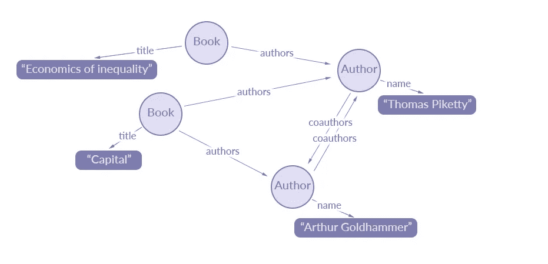

# GraphQL 天

> 原文：<https://betterprogramming.pub/30-days-with-graphql-3df3459b0f0c>

## 这是我在使用 GraphQL 的第一个月中所学到的东西的汇编


埃文·丹尼斯在 [Unsplash](https://unsplash.com/s/photos/question?utm_source=unsplash&utm_medium=referral&utm_content=creditCopyText) 上的照片

在使用[GraphQL](https://graphql.org/)30 天后，如果我必须用简单的语言向某人解释 GraphQL 是什么，那么我会说，“Graph QL 是一种查询语言，它允许你从你的应用程序数据图中导出树。”我在听 Apollo GQL 播客时遇到的另一个非常好的定义是“GraphQL 为您提供了一种查询语言，使用它您可以请求所需数据和服务的任何组合*。*好的，再来一个定义，然后我们可以继续:“GraphQL 将控制权放在它应该在的地方，其中服务器描述功能，客户端描述它需要的数据。它们之间的映射是自动完成的。

我希望我能想出这些定义中的一个。也许我只是开始得有点太晚了(双关语)。但我认为获得新的视角永远不会太晚。让我详细说明这一点。

# 不同角度

GraphQL 提供了一个非常不同的 API 设计视角。在 REST 中，您设计 response，它包含 web 客户机用来构建视图的字段，而在 GraphQL 中，客户机使用您公开的字段来构建它们的响应。也可以说 GraphQL 中存在控制反转。就是这样:*字段—*graph QL 最原子的部分。

实际上，它是原子的类型，但我喜欢这么想。你所需要做的就是根据一个字段而不是完全响应来思考，突然你就可以解决一些最令人生畏的问题，比如欠取、过取和 N + 1 *。对于那些从未听说过这些术语的人，让我快速解释一下。*

## 过量提取

*超取*是指您想要的只是学生选择的名字、姓氏、年龄和科目名称，但是 API 给了您这个:

```
>>curl [http://localhost:8080/students](http://localhost:8080/students)
{
  "data":{
    "id": 34,
    "first":"john",
    "middle": "Abraham",
    "last": "Doe",
    "age": 27,
    "DOB": "8/34/1998 13:12:32",
    "enroll_num": "12POKK89POL",
    "enroll_year": 2019,
    "current_sem": 2,
    "subjects": [
      {
        "id": 2,
        "code": "BE-402",
        "name": "Software Engineering"
      },
      {
        "id": 13,
        "code": "AL-24",
        "name": "Machine Learning"
      }
      ]
  }
}
```

## 提取不足

*欠取*是当你想要多一点，但是 API 给你的少一点，你不得不多做一些请求来满足你的需求。

```
>> curl [http://localhost:8080/students](http://localhost:8080/students)
{
  "data":{
    "id": 34,
    "first":"john",
    "middle": "Abraham",
    "last": "Doe",
    "age": 27,
    "DOB": "8/34/1998 13:12:32",
    "enroll_num": "12POKK89POL",
    "enroll_year": 2019,
    "current_sem": 2,
    "subjects": [2,13]
  }
}
>> curl [http://localhost:8080/subjects/2](http://localhost:8080/subjects/2)
{
  "data":{
    "id": 2,
    "code": "BE-402",
    "name": "Software Engineering"
  }
}
>> curl [http://localhost:8080/subjects/](http://localhost:8080/subjects/2)13
{
  "data":{
    "id": 13,
    "code": "AL-24",
    "name": "Machine Learning"
  }
}
```

## N + 1

您最终设法为给定的需求构建了一个理想的响应，但是突然您注意到了一些您从未有过的东西。您注意到许多查询被触发来获取数据，而您认为只需几个查询就可以轻松获取这些数据。

```
>>curl [http://localhost:8080/students](http://localhost:8080/students)
{
  "data":{
    "first":"john",
    "last": "Doe",
    "age": 27,
    "subjects": [
      {
        "name": "Software Engineering"
      },
      {
        "name": "Machine Learning"
      }
      ]
  }
}
-------
CONSOLE
-------
SELECT * FROM students;
SELECT * FROM subjects where student_id = 1;
SELECT * FROM subjects where student_id = 13;
...(Upto *N*, where N is the number of queries fired to retive subjects enrolled by a student)
```

(如果你在思考 GraphQL 是如何解决 N + 1 问题的，就保持这个想法吧。我很快会处理的。)

## GraphQL 方式

在 GraphQL 中，您只需简单地要求您想要的，您就会得到您所要求的—不多也不少。

```
{
  student{
    first
    last
    age
    subjects{
      name
    }
  }
}{
  "data":{
    "first":"john",
    "last": "Doe",
    "age": 27,
    "subjects": [
      {
        "name": "Software Engineering"
      },
      {
        "name": "Machine Learning"
      }
      ]
  }
}
```

# 关于 GraphQL 模式的简要说明

GraphQL 文档是定义的集合，例如可执行文件定义、类型定义和类型扩展。GraphQL 有三个主要操作，即查询(读操作)、突变(写操作后跟读操作)和订阅。这些操作是可执行定义的一部分。只有当您的 GraphQL 文档包含可执行定义或操作时，它才有资格执行，例如:

让我们稍微讨论一下上面定义的模式。以上定义统称为*模式*。如您所见，一个模式包含多个类型和指令定义。该模式还为它支持的所有三种操作定义了根操作类型。此外，它是为您隐式定义的，因此您不必在您的模式中定义以下内容:

```
**schema** {
    **query**: Query
    **mutation**: Mutation
}
```

但是，如果您需要更改操作的默认名称，您可以显式定义它。假设你想叫它`CustomQuery` 而不是`Query`。

```
**schema** {
    **query**: CustomQuery
    ...
}
```

这些根操作决定了这些操作在类型系统中开始的位置。查询类型中定义的字段成为 GraphQL 查询可用的顶级字段。例如，`**user**(id: **String**): User`是顶级查询字段，而用户类型中的`age(in: DurationKind): String`字段是嵌套查询。

GraphQL 是强类型的，正是这个属性允许 GraphQL 工具在查询执行之前对其进行验证。此外，它有非常丰富的类型系统和语法，允许客户编写各种查询。例如，除了对象类型，它还支持:

*   枚举类型——它们描述了一组可能的值，与 JAVA 或 C#等语言的枚举类型相同。
*   接口类型——graph QL 对象然后可以实现这些接口，这要求对象类型将定义由这些接口定义的所有字段。
*   标量类型—标量类型表示 GraphQL 类型系统中的原始叶值。GraphQL 响应采用分层树的形式；这些树上的叶子是 GraphQL 标量。GraphQL 中预定义的标量有`Int`、`Float`、`String`、`ID`等。您还可以拥有类似于上面 schema 中定义的`LocalDate`标量的自定义标量。
*   输入对象类型—字段可以采用参数来配置行为，例如`age(in: DurationKind): String`。参数可以是枚举、标量，如果需要一些复杂的值，它们可以将输入类型作为输入。提示:让字段只接受单个输入是一个好习惯。如果它需要不止一个，您应该考虑将它组合成一个输入对象类型。

让我也让您注意到上面提到的模式中的一些有趣的东西。

*   `!`表示给定字段不应为空。如果它应用于数组`[String]!`，这意味着字段不应该返回空数组，尽管数组可以有空值。例如，这是一个有效值`[1,2,null]`，但这不是`null`。
*   `directives`提供一种在 GraphQL 文档中描述替代运行时执行和类型验证行为的方式。例如，`@UpperCase`会在将字符串的返回值返回给客户端之前将其转换成大写形式，而`@Length`会在将值传递给实际的执行引擎之前验证字段的长度。我遇到的一个有趣的指令用例是使用它进行授权。假设有一些字段您只想让具有`ADMIN`角色的用户可见和访问。对于这种情况，您可以简单地创建一个`@Admin`指令，并用它来注释感兴趣的字段:

```
**directive** @Admin **on** FIELD_DEFINITION**type** User {
    **id**: ID!
    **name**: String @UpperCase
    **age**(in: DurationKind): String
    **phone**: [String!]!
    **DOB**: LocalDate **@Admin**
}
```

在我的用例中，我总是在单个文件中编写 GraphQL 模式，但是也可以将模式分布在多个`.graphql`文件中。要做到这一点，请确保只有一个文件定义了根查询操作，并且在其他文件中，您可以扩展它。

```
File 1: user.graphql
------------------
type Query{
   user(id: String): User
}File 2: address.graphql
------------------
extend type Query {
   address(id: String): Address
}
```

如您所见，您可以将许多事情卸载到 GraphQL，无论是验证、转换，甚至是 API 文档。GraphQL 有一个叫做*自省查询*的东西，它允许查询模式本身。GraphQL Playground 等工具使用它来生成文档。

GraphQL 模式还有很多，但我认为 [GraphQL 规范文档](https://spec.graphql.org/)在详细解释它方面做得非常好。作为结束语，我想说要永远记住模式是 GraphQL 最重要的部分之一。想花多少时间就花多少时间去创造和完善它。

# **一张图**

我们的 API 一团糟。拥有一个通用的请求和响应负载并不能使我们的 API 变得完美——承认吧！

```
**public class** CommonResponse<T> {
    **private** T **data**;
    **private** String **message**;
    **private int statusCode**;
    **private** List<Error> **errors**;
    ...
}**public class** CommonRequest<T> {
    **private** T **data**;
}
```

我们对设计 API 以满足客户需求的追求将我们带到了这样一个地方:我们所有的 API 都给出完全独特的响应，即使它们显然共享一些共同的结构。例如，看看下面的实体和一些 API 对它们的响应。

你们中的一些人可能认为上面的 API 响应没有问题，而你们中的一些人可能会感到愤怒，并且一定会想，“这显然是夸大其词了。”因此，对于那些认为这没有错的人，我只想说一个词:重新考虑。对于那些被激怒的人，我要说的是冷静下来。是的，有更好的方法来设计上面的 API，是的，有指导方针可以让你做出像样的 REST APIs。

但关键是，即使你正在设计糟糕的 API，也没有什么能阻止你。在 GraphQL 中并不是没有办法搞砸。只是误差幅度比较小。原因是在 GraphQL 中，你实际上并没有设计响应。相反，你在定义可能性。

在 GraphQL 中，使用 schema 定义可能性。在定义模式时，我们应该记住什么？以下是我在设计模式时谨记的一些事情:

*   用与建模实体相似的方式来建模您的模式。这不是必需的，但这是一个很好的起点。通常情况下，您会在服务层之上实现 GraphQL，而服务层并不知道您的底层数据库结构。
*   将您的模式描绘成一个图形，其中类型是节点，它们之间的关系是边。想想你是想要他们之间的单向关系还是双向关系。在单向类型中，只有父类型才会有子类型的引用，而在双向类型中，您可能已经猜到了，甚至子类型也会有父类型的引用。这样做的好处是，您的客户端可以轻松地在实体之间移动，并可以获得各种各样的响应。



来源:[https://blog . apollographql . com/the-concepts-of-graph QL-BC 68 BD 819 be 3](https://blog.apollographql.com/the-concepts-of-graphql-bc68bd819be3)

*   开始时，只添加客户绝对需要的类型中的那些字段，然后根据需要不断添加更多的字段。
*   尝试编写返回被查询改变的类型对象的变异，例如`addUser(input: UserInput): **User**`。

真正拓宽我对 GraphQL 理解的一篇文章是 [Principled GraphQL](https://principledgraphql.com/) 。它由 Apollo GraphQL 团队编写，定义了在使用数据图时应该牢记的十条原则。数据图是一个层，它将所有应用程序数据和服务汇集在一起，并通过一个一致的界面进行访问。这意味着在你的应用中有一个单一的模式。

一个让我印象深刻的原则是*一图原则。**一图原则说，“你的公司应该有一个统一的图，而不是每个团队创建多个图。”好处是每个人都有一个单一的真实来源，而且，因为它是由所有团队共同构建的，所以不会有类型重复。因此，更多的工作将是可重用的，尽管实际的实现可以由单个团队来完成。这起初看起来似乎微不足道，但将有助于充分利用 GraphQL 的潜力。*

# ***数据加载器***

*Data Loader 让我注意到一个对我来说并不是真正问题的问题。它叫做*’*N+1’。当您的 ORM 在单个查询中获取一个对象列表时，就会发生这种情况。*

```
*SELECT * FROM users*
```

*但是随后它又发出 N 个查询来获取其子节点。*

```
*SELECT * from address where user_id = 1
SELECT * from address where user_id = 2
...*
```

*N + 1，也称为‘N+1 选择问题*’*，早于 GraphQL。在这一节中，我们将看到如何解决这个问题，以及 GraphQL 提供了哪些工具来轻松解决这个问题。通常，这个问题可以通过在单个批处理操作中获取所有父代的子代来解决。*

```
*SELECT * from address where user_id in (1,2)*
```

*GraphQL 提供了一个名为 Data Loader 的工具来帮助您实现这种优化。为了理解如何优化查询，我们首先需要理解 GraphQL 实际上是如何解析查询的。*

```
*{
    users{
        first
        last
        age
        address{
            line1
            city
        }
    }
}*
```

*一旦验证了上面的查询，它就开始逐个解析字段的值。这些字段中的每一个都由服务器中称为解析器的功能支持。每个解析器返回一个需要进一步解析的类型。这种情况会一直发生，直到遇到标量。结果值存储在键值映射中。这种解析以自下而上的方式进行，从叶子到根。让我们假设在后端有一个名为`address`的函数，它负责返回地址值。让我们修改它以支持数据加载器。*

```
***function** address(User user, Context context) {
 **return** context.dataloader('address').*load*(user.id)}*
```

*这个函数是用一种假设的语言编写的，所以不要过多地研究它的语法。这个函数不是返回给定用户的地址，而是返回地址的一个承诺或未来*T3。这将延迟地址解析，直到所有用户都被解析。到那时，数据加载器也将收集到所有用户的 id*，这是通过`load()`方法完成的。最后，我们还有`AddressDataLoader`，它将实际加载数据。***

```
****class** AddressDatalLoader**{
  function** load(int [] ids){
    return loadAddressForAllUsers(ids);
 }
**}****
```

**load 函数返回一个地址列表。但是我们的 address 方法需要一个对象，而不是一个列表，并且也对应于给定的用户 ID。数据加载器提供一致的 API 实现批量加载，但是业务逻辑需要我们提供。我们需要编写一个逻辑，从数据库中批量获取所有需要的数据，并将这些数据返回给加载器。反过来，它会用相应的 ID 为我们映射一个对象。你只需要遵循一些规则来正确地构建你的结果。**

*   **值列表的大小必须与键列表的大小相同。如果不是，它将抛出一个异常。**
*   **值列表中的每个索引必须对应于关键字列表中的相同索引。我们需要通过我们的逻辑来确保这一点。**

# **用什么库？**

**如果 JavaScript 是你从客户端到服务器的所有语言的选择，那么我认为没有比 Apollo GraphQL 更好的库了。这是 GraphQL 领先的产品级实现之一。但是如果这不是你的情况，那么我认为你将不得不像我一样在某个地方寻找庇护。**

****免责声明:**本节将严格谈论 GraphQL Java 实现。如果 Java 不是您的首选语言，您可以转到下一个主题。**

**我将从解决房间里的大象开始: [GraphQL Java](https://github.com/graphql-java/graphql-java) 实现。**

## **GraphQL Java 实现**

****

**来源:[https://www.graphql-java.com/](https://www.graphql-java.com/)**

**顾名思义，它是 GraphQL 在 Java 中的一个实现，是所有用 Java 编写的 GraphQL 库的核心。它得到了很好的支持，并更新了 GraphQL 规范中的所有特性。如果您刚刚开始学习 GraphQL，这个库应该是您的首选。虽然它对学习有好处，但有些人可能会发现在他们的 web 应用程序中实现它令人望而生畏，因为需要大量的工作。另一方面，它为您提供了比其他库更多的控制。**

**我喜欢 GraphQL Java 的其他方面:**

*   **一个巨大而活跃的社区支持它**
*   **包含代码示例的优秀文档**
*   **简单易学**

**让我担心 GraphQL Java 的事情是…没有！即使有，我们也没有真正的选择，不是吗？将它与 web 应用程序框架如 [Spring](https://spring.io/) 集成需要一些努力，但为此，我们有其他可用的库。它只做一项工作，即实现 GraphQL 规范，而且做得很好。您可能会发现缺少一些有用的标量和模式验证指令，但不用担心:它们正在构建有助于解决这个问题的扩展库。有些可能已经有了，所以检查他们的回购。**

## **GraphQL SPQR**

****

**来源:[https://github.com/leangen/graphql-spqr](https://github.com/leangen/graphql-spqr)**

**[graph QL SPQR](https://github.com/leangen/graphql-spqr)(*speaker*)为您提供了一种构建 GraphQL APIs 的代码优先方法。它承诺大大减少构建 GraphQL APIs 的开发时间，我认为它信守了承诺。有了 SPQR，您只需使用几个注释就可以开始构建 API。它使用方法和类型推理从您的类中导出模式。这也意味着，每当您在类中进行更改时，您的模式都会自动更新。老实说，这是一个非常强大的特性，相比之下，有些库必须同时管理模式和类，还要努力使它们保持同步。**

**我喜欢 GraphQL SPQR 的其他方面:**

*   **它有自己的弹簧启动装置，可以帮你加快一切。**
*   **它附带了为 map、java.time、* classes、object type 等类型预先配置的自定义标量。这可能不是 SPQR 的卖点，但我个人很喜欢这种触感。当您刚刚开始时，您可能会发现很难找到注册自定义标量的方法。**
*   **它的 starter pack 还为您配置了 WebSocket，以防您打算使用订阅。**
*   **它还有一个名为`@GraphQLComplexity` 的注释，限制了查询的深度。这当然很重要，因为客户机可能会给服务器增加查询负担，从而导致大量的数据库查询。这可能会对服务器造成损害。**

**总的来说，SPQR 是一个非常可靠的库。它也是经过深思熟虑的，并且在需要时可以扩展。我对 SPQR 唯一担心的是以下几点:**

*   **一个非常小的社区支持它，所以有时可能需要一段时间来解决问题。**
*   **稀疏的文档。对于不是很主流的图书馆来说，这是一个很普遍的问题。也就是说，我已经找到了使用它时遇到的所有问题的解决方案，无论是堆栈溢出、频谱还是问题部分。**

**荣誉奖:**

*   **[graph QL-Java-kickstarter](https://github.com/graphql-java-kickstart/graphql-spring-boot)*:*这也是一个很好的探索选项。它为构建 GraphQL APIs 提供了一种模式优先的方法。SPQR 已经存在一段时间了。它有一个活跃的社区和良好的春季支持。**
*   **[Hasura](https://hasura.io/) *:* Hasura 不是一个库，而是一个为你自动生成高性能 GraphQL APIs 的开源平台。你需要做的就是把它连接到你的数据库。它还可以连接到多个源，并可以公开一个统一的模式。这真是一个有趣的项目，一定要去看看。**

# **结束注释**

**GraphQL 不再是一个新手了。Apollo 等库和 Hasura 等平台真正展示了 GraphQL 的潜力。让脸书和 GitHub 这样的大玩家在产品中使用它有助于为它建立一个强大的案例。考虑到所有这些因素，您可能仍然不会选择切换到 GraphQL。如果您的 REST APIs 已经构建得很好，这是公平的。不过话说回来，GraphQL 到底是什么？只是更好的休息。**

**感谢阅读！**

# **参考**

*   **[https://graphql.org/learn/](https://graphql.org/learn/)**
*   **[https://spec.graphql.org/draft/](https://spec.graphql.org/draft/)**
*   **[https://principledgraphql.com/](https://principledgraphql.com/)**