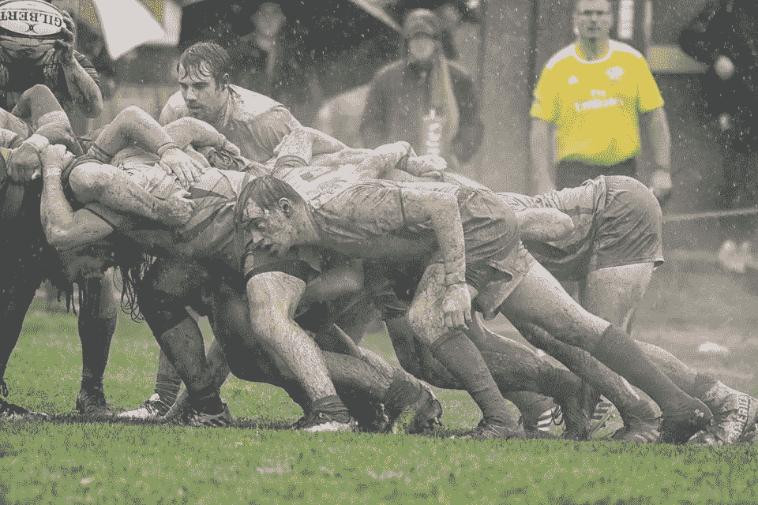

# 由认证的 Scrum 大师解释的 4 个敏捷 Scrum 仪式

> 原文：<https://betterprogramming.pub/4-agile-scrum-ceremonies-explained-by-a-certified-scrum-master-9ffdc292d5ca>

## 让敏捷开发变得容易的强大支柱

图片由 [Pixabay](https://pixabay.com/photos/rugby-mud-college-scrum-3697512/) 上的 [pvcurcio](https://pixabay.com/users/pvcurcio-9898909/) 提供。

不，不是那种混乱。今天我们谈论的是敏捷开发！

1.  规划
2.  站立
3.  回顾
4.  回顾的

这四次会议，或者说“scrum 仪式”，构成了敏捷开发的强大支柱。每一个都是 Scrum 框架的关键部分，绝对不能偏离。在下面的文章中，我将对每一个进行概述，并解释通过将它应用到您的软件开发节奏中，您将看到的直接好处。

在我们深入探讨这四个仪式之前，让我们先来看看本文中用到的一些常用术语:

*   **产品**是当所有工作完成时，你的软件解决方案看起来的愿景。
*   **产品待办事项** (PBIs)是组成产品待办事项的单个工作片段。几种类型的 pbi 包括特性、缺陷、技术工作和知识收集(也称为尖峰)。
*   **验收标准**是一个预定义的要求列表，在认为单个 PBI 完成之前，必须完成这些要求。
*   **完成的定义**是在 PBI 被认为完成之前必须满足的一系列标准。与验收标准不同，完成的定义适用于开发团队完成的所有 PBI。虽然验收标准确保 PBI 是“正确的事情”，但完成的定义确保 PBI 是以“正确的方式”完成的
*   功能的**垂直部分**是整个产品的一部分，它已经满足了完成的定义，并且有可能被发布给客户，客户会从中发现价值。
*   一个**潜在的可交付产品增量**是所有 PBI 的组合，在 Sprint 开始时也被称为“Sprint Backlog Items”(SBI)，它构成了每个 Sprint 的输出。每一个被标记为完成的 PBI/SBI 都应该具有如此高的质量，以至于一个发布经理可以在任何时候从稳定的分支中删除一个发布。

现在，让我们进入仪式！

# 冲刺规划

(每次冲刺一次，冲刺正式开始前)

第一个 Scrum 仪式是冲刺计划。在这个会议上，产品负责人、Scrum Master 和开发团队聚集在一起，对 Sprint 将接受的“Sprint Ready”PBI 做出坚定的承诺。为了实现这一点，团队将采用每个 Sprint Ready PBI，并将其分解为实现 Done 定义所需的任务。

强烈建议任务要有意义，而不仅仅是任务类别的列表。虽然 PBI 可能需要设计、测试和编码，但是简单地写下这些话并不能为开发团队的其他成员提供上下文。如果你在不知道任务内容的情况下接了一个任务，你有信心完成它吗？当你和你的团队在 PBI 工作时，你遇到一个只有“编码”或“测试”两个字的任务怎么办？你将如何自信地继续下去？答案可能不是很容易。所以，不要去创造那些情景，而是在创造任务时尽可能彻底。

一旦制定了任务，就以小时的形式进行新的时间估算。然后，您需要估计这些时间，并将其与您在 Sprint 中的实际能力进行比较，将所有团队成员的假期和其他已经为 Sprint 做出的承诺考虑在内。

知道了任务、完成的时间和可用的能力之后，团队将坚定地承诺完成 Sprint Backlog 中接受的每个 PBI。

# 每日混战

(冲刺阶段每天一次)

第二个 Scrum 仪式是每日 Scrum，也称为每日站立。这是一个快速(大约 15 分钟长)的会议，开发团队的成员在会上提供他们工作的状态更新，以及他们是否在工作中遇到任何障碍。这些信息通常以回答以下问题的形式共享:

*   你昨天做了什么？
*   你今天要做什么？
*   你有阻滞药吗？

这些日常会议起着重要的沟通作用，你永远不应该迟到。您还应该遵守您和您的团队为他们制定的规则。这样做显示了对他人时间和 scrum 过程本身的尊重。作为一个 scrum 大师，如果你发现谈话拖拖拉拉，你不应该害怕把话题推到 Scrum 后的讨论中。每个团队成员的更新都应力求快速、切中要点，指出任何阻碍因素，以便团队可以尽快讨论并解决它们。

# 冲刺回顾

(每次冲刺快结束时一次)

第三个 Scrum 仪式是冲刺回顾。这是一个持续约 1 到 1.5 小时的会议，开发团队成员将有机会进行现场演示和/或谈论他们在当前 Sprint 中所取得的成就。

围绕 Scrum 的一个常见主题是，如果你要失败，最好尽早失败。提出这个问题的原因是，Sprint 审查是你失败的机会。当然，失败不是你应该努力争取的，也许这个词用得不对。然而，正如我们所知道的，如果我们要离开某个东西或者引发一个变化，我们希望现在就做，而不是在开发过程中走很长的路。这就是 Sprint 回顾的全部内容。

作为常规开发节奏的一部分，需要与利益相关者进行 Sprint 评审，这为您提供了在软件交付之前进行更改所需的紧密反馈循环。你应该试着邀请尽可能多的意见有分量的人，这样如果有人反对或改变主意，这些人会在会议上表达他们的观点。

应该说，相反的情况可能会发生——利益相关者会看到你的工作，并决定他们非常喜欢它，所以他们有另一个想法，他们希望看到增加。当这种情况发生时，应该为潜在变更的每个垂直部分向产品待办事项列表添加一个新的 PBI。然而，如果在 Sprint Review 中决定不再需要现有的功能，那么 PBI 应该从产品 Backlog 中删除。

每个 Sprint 都应该进行一次 Sprint 评审，参与者包括**内部**利益相关者，如企业所有者、高管、经理和主题专家。与**外部**利益相关者，如外部客户、有影响力的用户和合作伙伴的冲刺评审应该每两次冲刺进行一次。如果您在一个组织下有许多 Sprint 团队，强烈建议您将 Sprint 评审会议合并起来，以包括所有的团队，并减少对涉众的多次会议邀请。

# 冲刺回顾

(每次冲刺快结束时一次)

第四个 Scrum 仪式是 Sprint 回顾会。在 Sprint 结束时，这是一个持续约 1 小时的会议，开发团队成员将有机会讨论他们对 Sprint 进展的感觉。

敏捷和 Scrum 的目的不仅仅是构建，而是不断学习和改进过程本身。这就是 Sprint 回顾的全部内容。此时，你们作为一个团队，可以分享一下在冲刺阶段哪些事情做得很好，哪些事情可以做得更好。

Sprint 团队应该维护您的团队将用来增强您的开发实践的改进行动的清单。

这应该是一次会议，每个人都感到可以安全地表达自己，而不用担心愤怒或指责，我想我们都可以承认说起来容易做起来难。这就是 Scrum Master 能够并且应该设定基调的地方，并且清楚地表明每个人的声音都是平等的，最重要的是每个人都努力让事情变得更好。

此外，应该指出的是，这些回顾是每个人的工作变得更加充实和有益的方式，我想我们都同意这是我们都想要的。

# 结束语和一个问题

在阅读了四个 Scrum 仪式之后，应该非常清楚它们是什么，以及它们如何在构建产品和组织团队中发挥关键作用。

然而，如果他们不清楚，我想请你在这篇文章上留下你可能有其他问题的回复。另外，请让我知道你是如何在你的组织中成功实施 Scrum 框架的。

让我们开始对话，帮助传播 Scrum 的快乐！